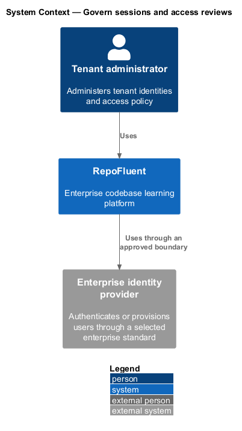
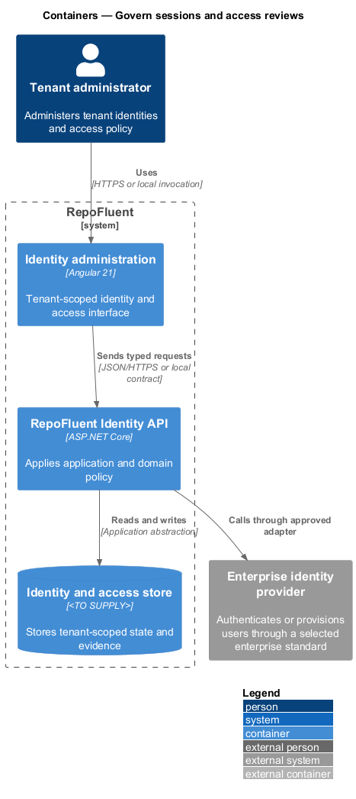
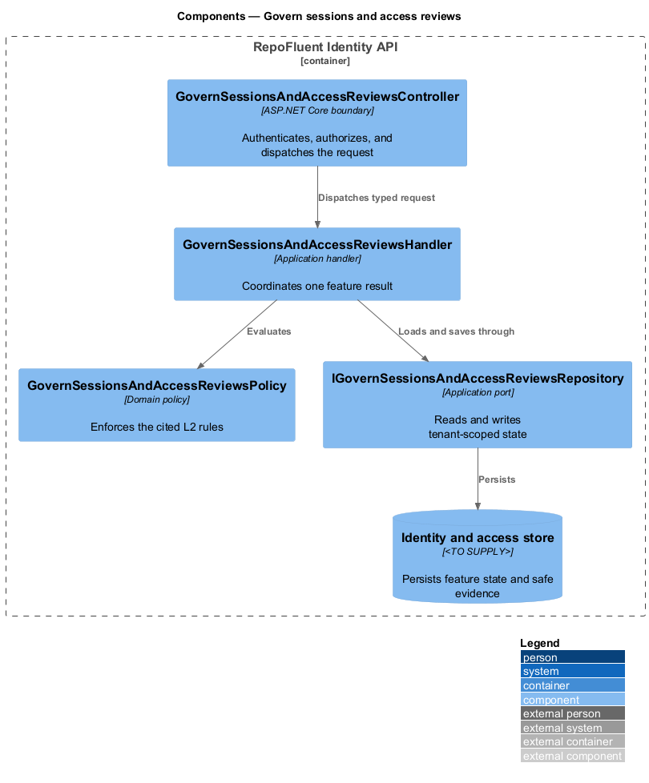
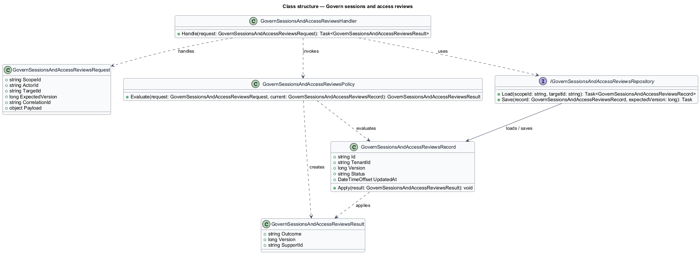
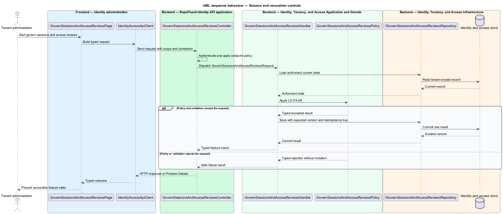
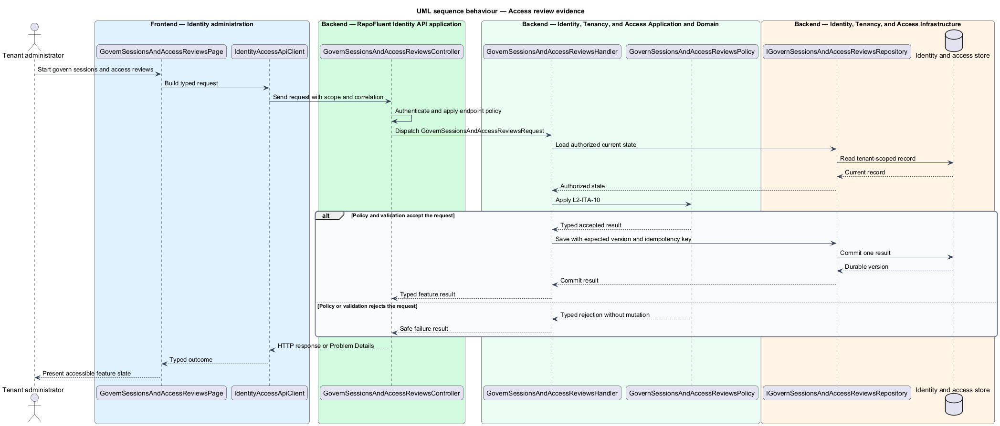

# Govern sessions and access reviews

## Overview

RepoFluent's Identity, Tenancy, and Access subsystem establishes tenant identity, authentication, authorization, groups, sessions, and access evidence. This feature
brings *session and revocation controls*, *access review evidence* into one vertical slice. The slice preserves tenant,
actor, version, authorization, and correlation context wherever the cited
requirements apply.

The tenant administrator starts the outcome through Identity administration.
RepoFluent Identity API applies server-side policy before state is read or changed.
The external dependency and persistent technology remain `<TO SUPPLY>` where
the requirements baseline does not select them.

## Description

The greenfield slice introduces the following building blocks. The endpoint
route, deployment topology, and unresolved provider choices remain `<TO SUPPLY>`.

- **`GovernSessionsAndAccessReviewsPage`** — Angular 21 entry component that presents
  the feature state and submits a typed intent.
- **`IdentityAccessApiClient`** — typed client that carries tenant, actor, version,
  idempotency, and correlation context required by the operation.
- **`GovernSessionsAndAccessReviewsController`** — ASP.NET Core boundary that authenticates
  the caller, applies endpoint policy, and dispatches `GovernSessionsAndAccessReviewsRequest`.
- **`GovernSessionsAndAccessReviewsRequest`** — application request containing scope, actor, target,
  expected version, correlation identifier, and feature payload.
- **`GovernSessionsAndAccessReviewsHandler`** — application handler that loads authorized state,
  invokes `GovernSessionsAndAccessReviewsPolicy`, and commits one result.
- **`GovernSessionsAndAccessReviewsPolicy`** — domain policy that evaluates the cited L2 rules without
  relying on client presentation state.
- **`IGovernSessionsAndAccessReviewsRepository`** — application abstraction for tenant-scoped reads,
  writes, optimistic concurrency, and idempotency lookup.
- **`GovernSessionsAndAccessReviewsRecord`** — persisted feature record containing identity, tenant,
  version, status, timestamps, and safe evidence references.

## Requirements

The feature realizes the following level-2 (L2) requirements. Each row cites
the first L1 identifier named by the source requirement as its primary parent.

| L2 ID | Refines (L1) | Requirement |
|-------|--------------|-------------|
| `L2-ITA-09` | `L1-ITA-07` | Supported tenant policies should configure session idle timeout, absolute lifetime, reauthentication for sensitive operations, and administrative session revocation within platform safety limits. Revoked or expired sessions shall fail on the next protected request and shall not be refreshable. |
| `L2-ITA-10` | `L1-ITA-07` | The subsystem should provide an authorized, tenant-scoped view or export of users, status, roles, group memberships, direct grants, constrained scopes, last access, and review state. Export shall follow report-export authorization and audit controls. |

## Diagrams

### System context

The tenant administrator uses RepoFluent to complete the feature outcome.
RepoFluent interacts with Enterprise identity provider only through the boundary
described by the requirements and approved configuration.

### Containers

Identity administration sends typed requests to RepoFluent Identity API. The API applies
server-owned rules and records the accepted outcome in Identity and access store.

### Components

`GovernSessionsAndAccessReviewsController` dispatches `GovernSessionsAndAccessReviewsRequest` to `GovernSessionsAndAccessReviewsHandler`. The handler
uses `GovernSessionsAndAccessReviewsPolicy` and `IGovernSessionsAndAccessReviewsRepository` before it commits a state change.

### Class structure

`GovernSessionsAndAccessReviewsHandler` depends on the request, policy, and repository abstractions.
`IGovernSessionsAndAccessReviewsRepository` stores `GovernSessionsAndAccessReviewsRecord` under tenant and version context.

### Behaviour — session and revocation controls

The sequence applies `L2-ITA-09` before the handler persists an accepted result. A rejected policy or validation result returns without a state change.

### Behaviour — access review evidence

The sequence applies `L2-ITA-10` before the handler persists an accepted result. A rejected policy or validation result returns without a state change.

