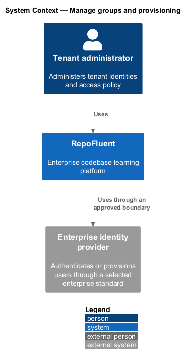
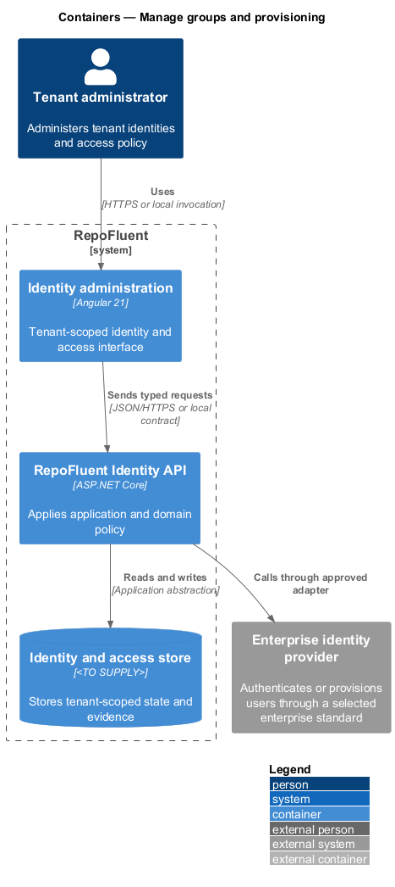
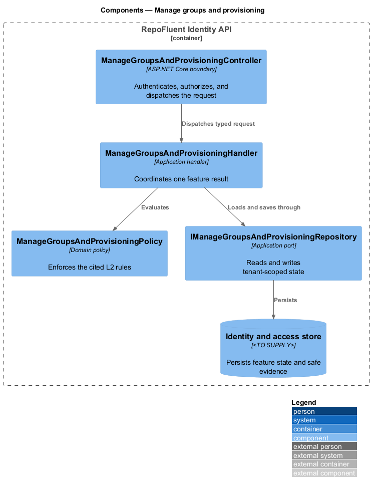
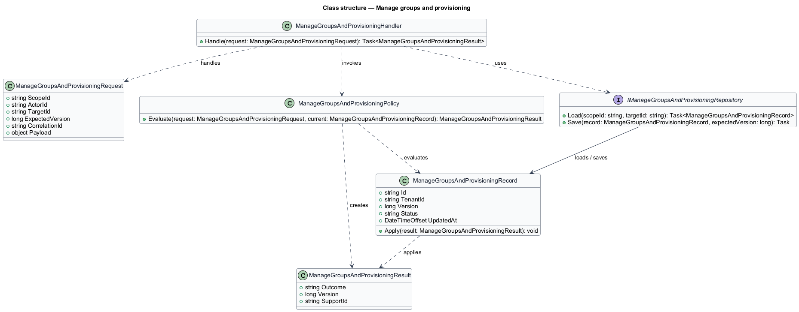
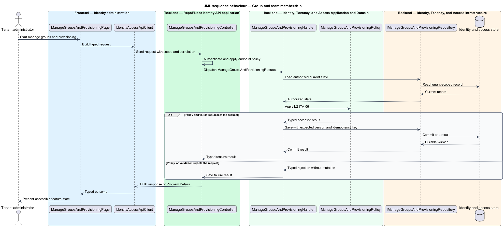
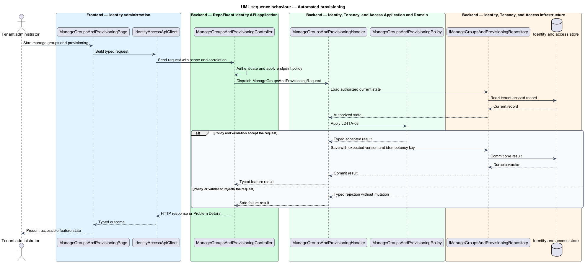

# Manage groups and provisioning

## Overview

RepoFluent's Identity, Tenancy, and Access subsystem establishes tenant identity, authentication, authorization, groups, sessions, and access evidence. This feature
brings *group and team membership*, *automated provisioning* into one vertical slice. The slice preserves tenant,
actor, version, authorization, and correlation context wherever the cited
requirements apply.

The tenant administrator starts the outcome through Identity administration.
RepoFluent Identity API applies server-side policy before state is read or changed.
The external dependency and persistent technology remain `<TO SUPPLY>` where
the requirements baseline does not select them.

## Description

The greenfield slice introduces the following building blocks. The endpoint
route, deployment topology, and unresolved provider choices remain `<TO SUPPLY>`.

- **`ManageGroupsAndProvisioningPage`** — Angular 21 entry component that presents
  the feature state and submits a typed intent.
- **`IdentityAccessApiClient`** — typed client that carries tenant, actor, version,
  idempotency, and correlation context required by the operation.
- **`ManageGroupsAndProvisioningController`** — ASP.NET Core boundary that authenticates
  the caller, applies endpoint policy, and dispatches `ManageGroupsAndProvisioningRequest`.
- **`ManageGroupsAndProvisioningRequest`** — application request containing scope, actor, target,
  expected version, correlation identifier, and feature payload.
- **`ManageGroupsAndProvisioningHandler`** — application handler that loads authorized state,
  invokes `ManageGroupsAndProvisioningPolicy`, and commits one result.
- **`ManageGroupsAndProvisioningPolicy`** — domain policy that evaluates the cited L2 rules without
  relying on client presentation state.
- **`IManageGroupsAndProvisioningRepository`** — application abstraction for tenant-scoped reads,
  writes, optimistic concurrency, and idempotency lookup.
- **`ManageGroupsAndProvisioningRecord`** — persisted feature record containing identity, tenant,
  version, status, timestamps, and safe evidence references.

## Requirements

The feature realizes the following level-2 (L2) requirements. Each row cites
the first L1 identifier named by the source requirement as its primary parent.

| L2 ID | Refines (L1) | Requirement |
|-------|--------------|-------------|
| `L2-ITA-06` | `L1-ITA-04` | Authorized administrators shall create, rename, deactivate, and manage tenant-local groups and teams. Membership changes shall be effective for new authorization and assignment operations within the documented propagation target. Deactivation shall preserve historical assignment and audit references. |
| `L2-ITA-08` | `L1-ITA-06` | The provisioning interface should support idempotent creation, update, activation, deactivation, and group membership synchronization using a selected enterprise provisioning standard. External identifiers shall be tenant-scoped. Replayed requests shall converge on the same state without duplicate users or memberships. |

## Diagrams

### System context

The tenant administrator uses RepoFluent to complete the feature outcome.
RepoFluent interacts with Enterprise identity provider only through the boundary
described by the requirements and approved configuration.

### Containers

Identity administration sends typed requests to RepoFluent Identity API. The API applies
server-owned rules and records the accepted outcome in Identity and access store.

### Components

`ManageGroupsAndProvisioningController` dispatches `ManageGroupsAndProvisioningRequest` to `ManageGroupsAndProvisioningHandler`. The handler
uses `ManageGroupsAndProvisioningPolicy` and `IManageGroupsAndProvisioningRepository` before it commits a state change.

### Class structure

`ManageGroupsAndProvisioningHandler` depends on the request, policy, and repository abstractions.
`IManageGroupsAndProvisioningRepository` stores `ManageGroupsAndProvisioningRecord` under tenant and version context.

### Behaviour — group and team membership

The sequence applies `L2-ITA-06` before the handler persists an accepted result. A rejected policy or validation result returns without a state change.

### Behaviour — automated provisioning

The sequence applies `L2-ITA-08` before the handler persists an accepted result. A rejected policy or validation result returns without a state change.

