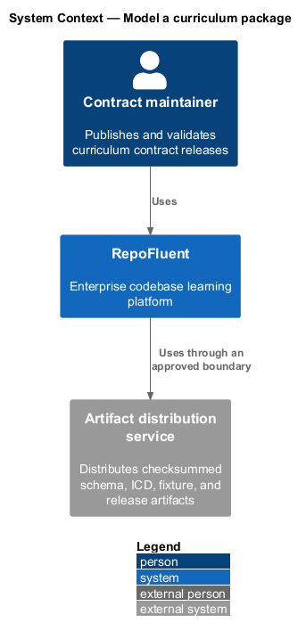
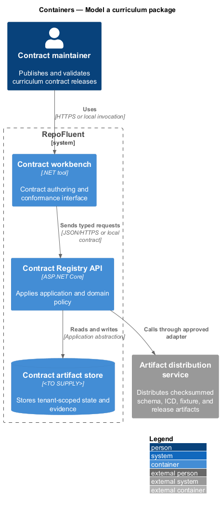
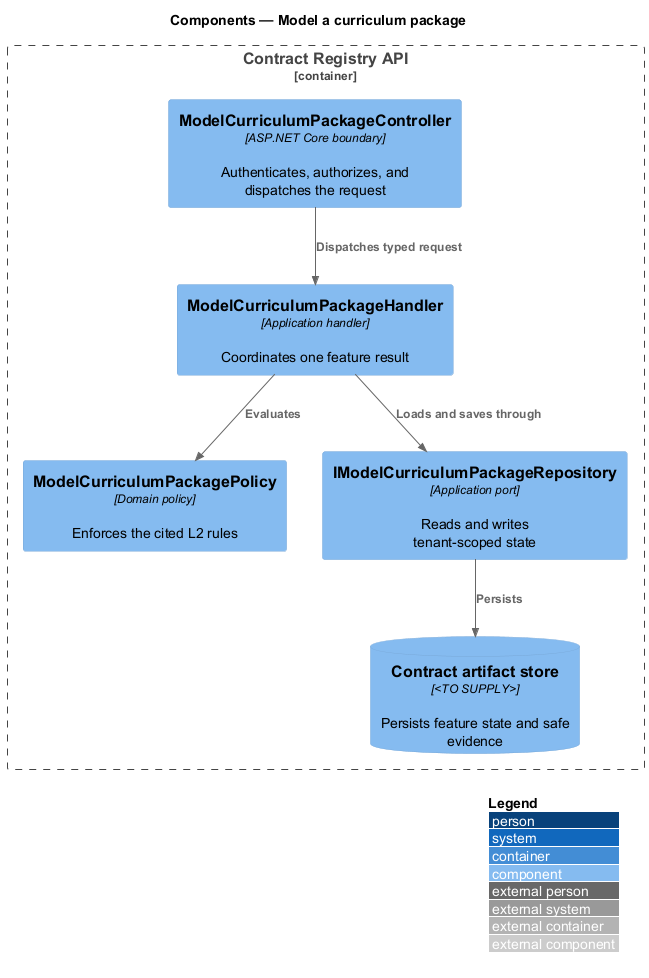
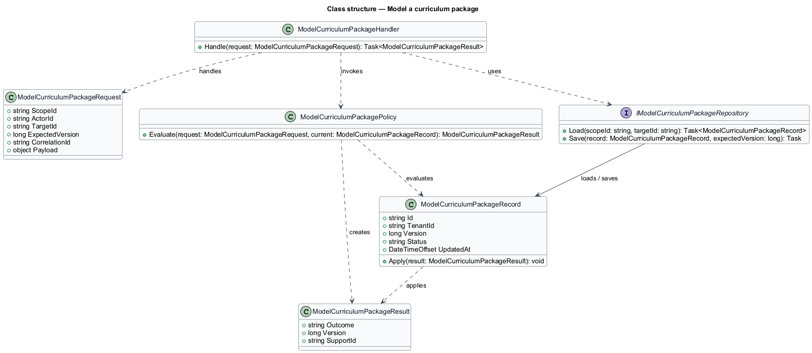
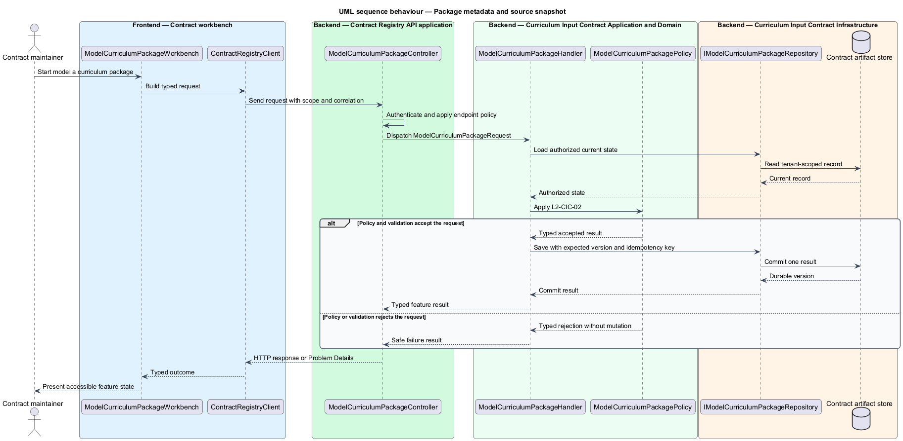
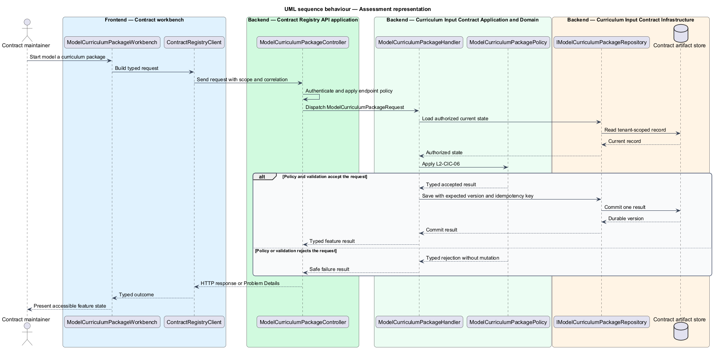

# Model a curriculum package

## Overview

RepoFluent's Curriculum Input Contract subsystem defines the portable curriculum package, its compatibility rules, and its conformance artifacts. This feature
brings *package metadata and source snapshot*, *architecture and learning model*, *assessment representation* into one vertical slice. The slice preserves tenant,
actor, version, authorization, and correlation context wherever the cited
requirements apply.

The contract maintainer starts the outcome through the Curriculum imports
contract workbench. The ASP.NET Core curriculum API applies server-side schema
and semantic policy before an accepted package becomes a draft. SQLite stores
the tenant-scoped raw package and lifecycle evidence for the current vertical
slice.

## Description

The vertical slice uses the following checked-in implementation boundaries.

- **`curriculum.schema.json`** — JSON Schema 2020-12 authoring contract for
  package identity and creation metadata, reproducible source snapshots,
  architecture terminology and relationships, ordered learning, and governed
  assessments.
- **`order-processing.json`** — conformance fixture spanning repositories,
  systems and subsystems, typed relationships, courses, modules, lessons,
  question pools, mappings, grading definitions, and protected answers.
- **`Package` and its adjacent records** — one-type-per-file .NET model used at
  the application boundary rather than an untyped document bag.
- **`PackageValidator`** — server-owned semantic policy for required metadata,
  stable identity, repository-relative paths, architecture references, ordered
  learning rules, assessment limits, supported item types, and protected answer
  visibility.
- **`PackagePresenter`** — response policy that preserves assessment shape while
  replacing protected answer values with `null` before a preview leaves the API.
- **`CurriculumWorkflow` and `/api/curriculum-*` endpoints** — authenticated,
  tenant-scoped intake, asynchronous validation, and draft preview boundaries.
- **`ContractModelWorkbenchComponent`** — read-only Angular inspection surface
  built from the versioned RepoFluent tokens and components. It presents
  metadata, source provenance, architecture, learning, and safe assessment
  evidence without rendering protected values.
- **`CurriculumContractPage` and `curriculum-package-contract.spec.ts`** — Page
  Object Model acceptance coverage for the complete live-stack contract and its
  visual baseline.

## Requirements

The feature realizes the following level-2 (L2) requirements. Each row cites
the first L1 identifier named by the source requirement as its primary parent.

| L2 ID | Refines (L1) | Requirement |
|-------|--------------|-------------|
| `L2-CIC-02` | `L1-CIC-02` | The schema shall represent package stable identifier, contract version, title, description, ownership, locale, creation metadata, and source snapshot. A source snapshot shall support repositories, repository-relative identity, branches or commits, document identifiers, and source timestamps where available. |
| `L2-CIC-03` | `L1-CIC-02` | The schema shall model systems, subsystems, responsibilities, boundaries, dependencies, terminology, and typed relationships, together with courses, modules, lessons, learning objectives, prerequisites, estimated duration, difficulty, audience, tags, required/optional status, ordering, and completion rules. |
| `L2-CIC-06` | `L1-CIC-02` | The schema shall represent formative and summative assessments, supported item types, answer and grading definitions, question pools, selection behavior, thresholds, attempts, time limits, feedback release, rationales, and mappings to learning objectives/systems/subsystems. Protected answer data shall be distinguishable from learner-visible data. |

## Diagrams

### System context

The contract maintainer uses RepoFluent to complete the feature outcome.
RepoFluent interacts with Artifact distribution service only through the boundary
described by the requirements and approved configuration.

### Containers

The Curriculum imports workbench sends a JSON package to the curriculum API.
The API applies server-owned rules and records the accepted raw package and
lifecycle evidence in the tenant-scoped curriculum store.

### Components

`CurriculumEndpoints` dispatches authenticated upload and preview requests to
`CurriculumWorkflow`. The workflow invokes `PackageValidator`, uses
`ICurriculumStore`, and applies `PackagePresenter` before a safe preview is
returned.

### Class structure

`CurriculumWorkflow` depends on the typed package policy and tenant-scoped store.
The individual package records preserve one named type per source file, and
`PackagePresenter` separates stored protected answers from review-safe output.

### Behaviour — package metadata and source snapshot

The sequence applies `L2-CIC-02` before the handler persists an accepted result. A rejected policy or validation result returns without a state change.

### Behaviour — architecture and learning model

The sequence applies `L2-CIC-03` before the handler persists an accepted result. A rejected policy or validation result returns without a state change.

### Behaviour — assessment representation

The sequence applies `L2-CIC-06` before the handler persists an accepted result. A rejected policy or validation result returns without a state change.

### Implementation evidence

Status: **Implemented**

- The checked-in `0.1.0` schema and representative fixture model stable package
  identity, ownership, locale, creation evidence, repository-relative roots,
  branches or commits, document identities, and source timestamps.
- Systems, subsystems, responsibilities, boundaries, terminology, and typed
  relationships are validated for stable and non-dangling identifiers.
- Courses and lessons carry audience, difficulty, duration, tags, required or
  optional state, ordering, prerequisites, stable objective identifiers and
  statements, and completion rules.
- Formative and summative assessment shapes include pools, fixed or random
  selection, supported item types, thresholds, attempts, time limits, feedback
  release, rationales, grading definitions, and validated architecture or
  objective mappings.
- Answer definitions are required to be marked `protected`. Preview
  serialization retains that classification but replaces the stored value with
  `null`.
- The live-stack Page Object Model acceptance uploads a complete package,
  inspects every model facet, verifies answer non-disclosure in the rendered
  workbench, and records a design-system visual baseline.
- API integration tests cover typed model preservation, protected-value
  redaction, source-path policy, and stable dangling-relationship evidence.
