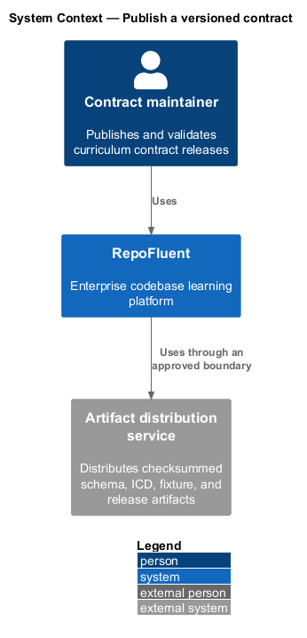
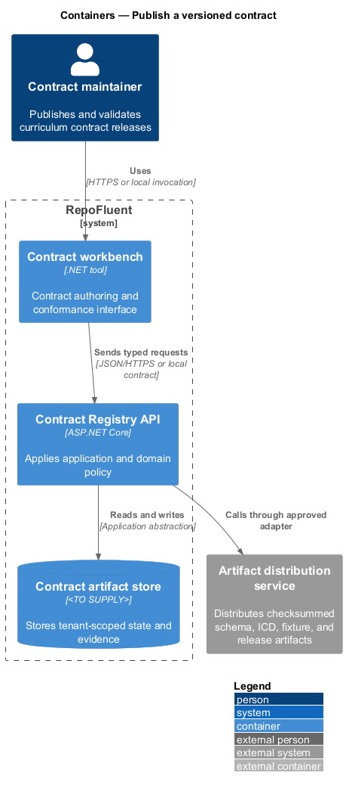
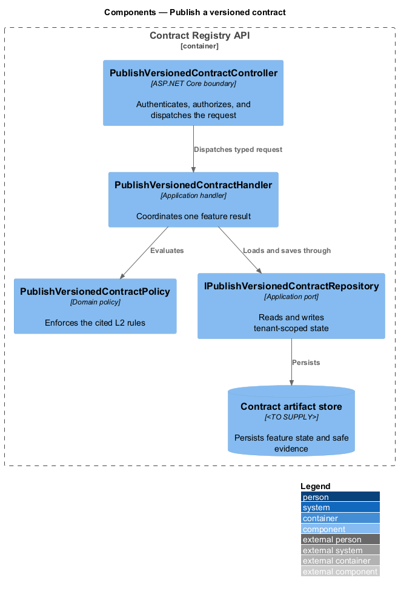
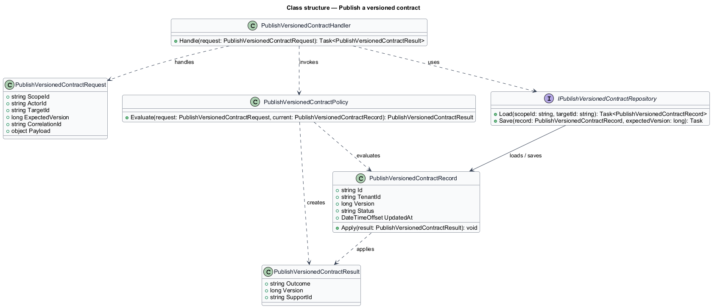
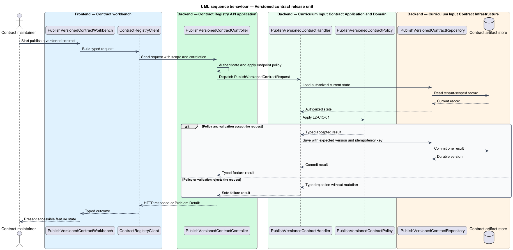
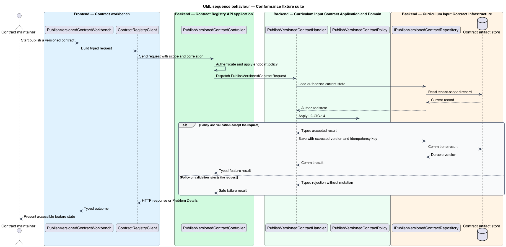

# Publish a versioned contract

## Overview

RepoFluent's Curriculum Input Contract subsystem defines the portable curriculum package, its compatibility rules, and its conformance artifacts. This feature
brings *versioned contract release unit*, *version compatibility and migration*, *conformance fixture suite* into one vertical slice. The slice preserves tenant,
actor, version, authorization, and correlation context wherever the cited
requirements apply.

The contract maintainer starts the outcome through Contract workbench.
Contract Registry API applies server-side policy before state is read or changed.
The external dependency and persistent technology remain `<TO SUPPLY>` where
the requirements baseline does not select them.

## Description

The greenfield slice introduces the following building blocks. The endpoint
route, deployment topology, and unresolved provider choices remain `<TO SUPPLY>`.

- **`PublishVersionedContractWorkbench`** — .NET tool entry component that presents
  the feature state and submits a typed intent.
- **`ContractRegistryClient`** — typed client that carries tenant, actor, version,
  idempotency, and correlation context required by the operation.
- **`PublishVersionedContractController`** — ASP.NET Core boundary that authenticates
  the caller, applies endpoint policy, and dispatches `PublishVersionedContractRequest`.
- **`PublishVersionedContractRequest`** — application request containing scope, actor, target,
  expected version, correlation identifier, and feature payload.
- **`PublishVersionedContractHandler`** — application handler that loads authorized state,
  invokes `PublishVersionedContractPolicy`, and commits one result.
- **`PublishVersionedContractPolicy`** — domain policy that evaluates the cited L2 rules without
  relying on client presentation state.
- **`IPublishVersionedContractRepository`** — application abstraction for tenant-scoped reads,
  writes, optimistic concurrency, and idempotency lookup.
- **`PublishVersionedContractRecord`** — persisted feature record containing identity, tenant,
  version, status, timestamps, and safe evidence references.

## Requirements

The feature realizes the following level-2 (L2) requirements. Each row cites
the first L1 identifier named by the source requirement as its primary parent.

| L2 ID | Refines (L1) | Requirement |
|-------|--------------|-------------|
| `L2-CIC-01` | `L1-CIC-01` | Each contract release shall be an immutable, checksummed unit containing the JSON Schema, ICD, compatibility declaration, validation-code catalog, fixtures, and release notes. Each artifact shall identify the exact contract version and shall be retrievable without depending on a particular model or agent product. |
| `L2-CIC-12` | `L1-CIC-05` | The ICD shall define semantic-version meaning, supported-version window, forward/backward compatibility, deprecation notice period, migration responsibility, and behavior for unsupported major/minor versions. A migration shall preserve stable identifiers and protected semantics or report any unavoidable loss. |
| `L2-CIC-14` | `L1-CIC-08` | Every contract release shall include a minimal valid fixture, a representative C#/Angular curriculum, and invalid fixtures covering required fields, types, identifiers, references, ordering, security, assessment rules, and limits. Fixtures shall declare their expected issue codes or successful outcome. |

## Diagrams

### System context

The contract maintainer uses RepoFluent to complete the feature outcome.
RepoFluent interacts with Artifact distribution service only through the boundary
described by the requirements and approved configuration.

### Containers

Contract workbench sends typed requests to Contract Registry API. The API applies
server-owned rules and records the accepted outcome in Contract artifact store.

### Components

`PublishVersionedContractController` dispatches `PublishVersionedContractRequest` to `PublishVersionedContractHandler`. The handler
uses `PublishVersionedContractPolicy` and `IPublishVersionedContractRepository` before it commits a state change.

### Class structure

`PublishVersionedContractHandler` depends on the request, policy, and repository abstractions.
`IPublishVersionedContractRepository` stores `PublishVersionedContractRecord` under tenant and version context.

### Behaviour — versioned contract release unit

The sequence applies `L2-CIC-01` before the handler persists an accepted result. A rejected policy or validation result returns without a state change.

### Behaviour — version compatibility and migration

The sequence applies `L2-CIC-12` before the handler persists an accepted result. A rejected policy or validation result returns without a state change.

### Behaviour — conformance fixture suite

The sequence applies `L2-CIC-14` before the handler persists an accepted result. A rejected policy or validation result returns without a state change.

