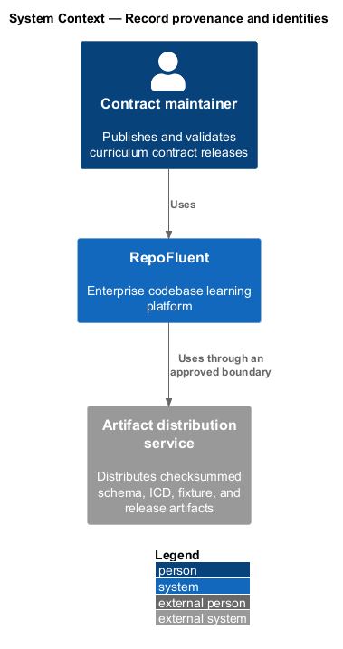
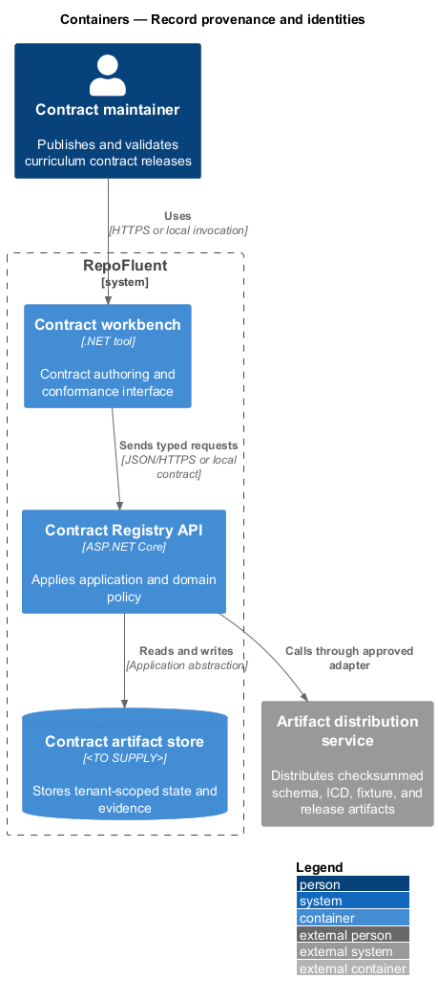
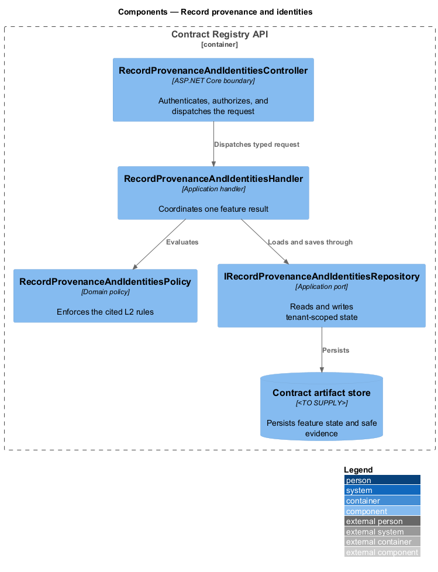
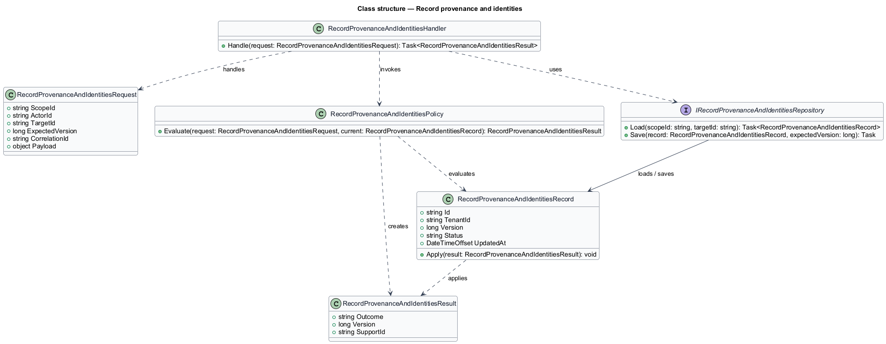
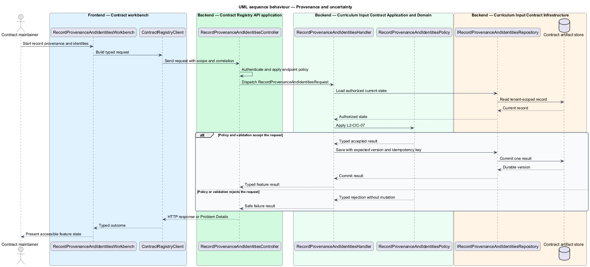

# Record provenance and identities

## Overview

RepoFluent's Curriculum Input Contract subsystem defines the portable curriculum package, its compatibility rules, and its conformance artifacts. This feature
brings *provenance and uncertainty*, *stable identifiers and references*, *canonical primitive formats* into one vertical slice. The slice preserves tenant,
actor, version, authorization, and correlation context wherever the cited
requirements apply.

The contract maintainer starts the outcome through Contract workbench.
Contract Registry API applies server-side policy before state is read or changed.
The external dependency and persistent technology remain `<TO SUPPLY>` where
the requirements baseline does not select them.

## Description

The greenfield slice introduces the following building blocks. The endpoint
route, deployment topology, and unresolved provider choices remain `<TO SUPPLY>`.

- **`RecordProvenanceAndIdentitiesWorkbench`** — .NET tool entry component that presents
  the feature state and submits a typed intent.
- **`ContractRegistryClient`** — typed client that carries tenant, actor, version,
  idempotency, and correlation context required by the operation.
- **`RecordProvenanceAndIdentitiesController`** — ASP.NET Core boundary that authenticates
  the caller, applies endpoint policy, and dispatches `RecordProvenanceAndIdentitiesRequest`.
- **`RecordProvenanceAndIdentitiesRequest`** — application request containing scope, actor, target,
  expected version, correlation identifier, and feature payload.
- **`RecordProvenanceAndIdentitiesHandler`** — application handler that loads authorized state,
  invokes `RecordProvenanceAndIdentitiesPolicy`, and commits one result.
- **`RecordProvenanceAndIdentitiesPolicy`** — domain policy that evaluates the cited L2 rules without
  relying on client presentation state.
- **`IRecordProvenanceAndIdentitiesRepository`** — application abstraction for tenant-scoped reads,
  writes, optimistic concurrency, and idempotency lookup.
- **`RecordProvenanceAndIdentitiesRecord`** — persisted feature record containing identity, tenant,
  version, status, timestamps, and safe evidence references.

## Requirements

The feature realizes the following level-2 (L2) requirements. Each row cites
the first L1 identifier named by the source requirement as its primary parent.

| L2 ID | Refines (L1) | Requirement |
|-------|--------------|-------------|
| `L2-CIC-07` | `L1-CIC-02` | Generated claims, explanations, objectives, and assessment rationales shall support source citations where direct sources exist. Package-level and element-level metadata shall represent confidence, assumptions, omissions, conflicting sources, and unresolved questions without presenting them as verified facts. |
| `L2-CIC-08` | `L1-CIC-04` | All reusable entities shall have stable package-local identifiers following the documented character, length, uniqueness, and normalization rules. References shall target declared identifiers of compatible types. Identifier generation guidance shall allow regeneration from equivalent source scope to retain identities where semantic entities are unchanged. |
| `L2-CIC-09` | `L1-CIC-04` | The ICD shall define UTF-8 encoding, JSON media type, canonical date/time and timezone representation, duration format, checksum representation, identifier normalization, supported locales, enumerations, null semantics, and default behavior. Defaults shall be applied only where the ICD explicitly permits them. |

## Diagrams

### System context

The contract maintainer uses RepoFluent to complete the feature outcome.
RepoFluent interacts with Artifact distribution service only through the boundary
described by the requirements and approved configuration.

### Containers

Contract workbench sends typed requests to Contract Registry API. The API applies
server-owned rules and records the accepted outcome in Contract artifact store.

### Components

`RecordProvenanceAndIdentitiesController` dispatches `RecordProvenanceAndIdentitiesRequest` to `RecordProvenanceAndIdentitiesHandler`. The handler
uses `RecordProvenanceAndIdentitiesPolicy` and `IRecordProvenanceAndIdentitiesRepository` before it commits a state change.

### Class structure

`RecordProvenanceAndIdentitiesHandler` depends on the request, policy, and repository abstractions.
`IRecordProvenanceAndIdentitiesRepository` stores `RecordProvenanceAndIdentitiesRecord` under tenant and version context.

### Behaviour — provenance and uncertainty

The sequence applies `L2-CIC-07` before the handler persists an accepted result. A rejected policy or validation result returns without a state change.

### Behaviour — stable identifiers and references

The sequence applies `L2-CIC-08` before the handler persists an accepted result. A rejected policy or validation result returns without a state change.

### Behaviour — canonical primitive formats

The sequence applies `L2-CIC-09` before the handler persists an accepted result. A rejected policy or validation result returns without a state change.

