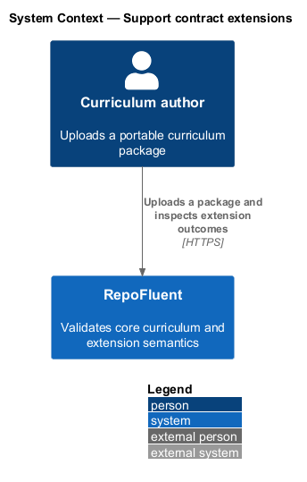
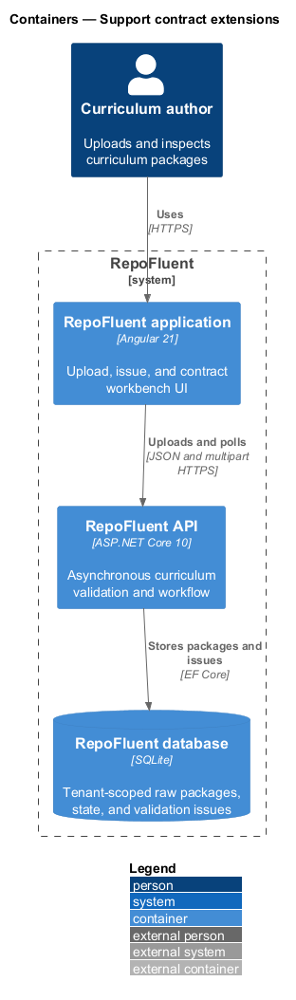
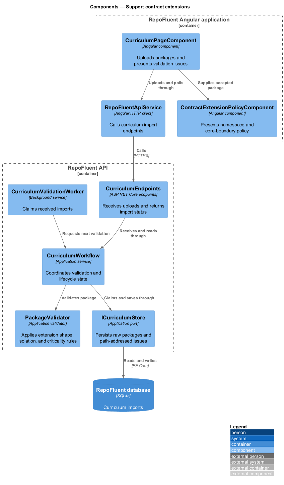
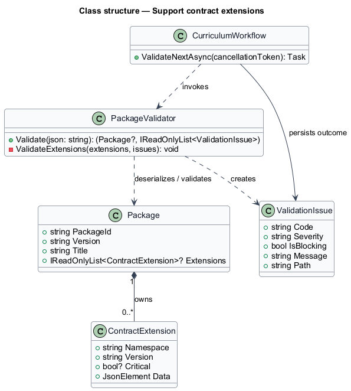
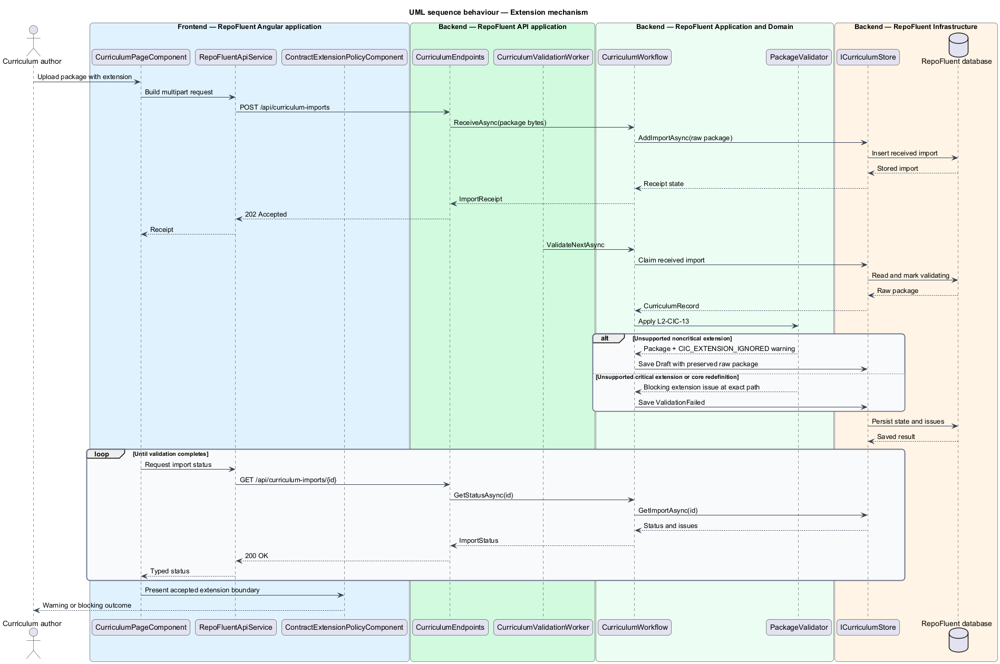

# Support contract extensions

## Overview

RepoFluent's Curriculum Input Contract provides a bounded extension mechanism
for producer-specific metadata that does not belong in the core curriculum
model. An *extension envelope* is a package-level record that declares its
owner through a reverse-domain namespace, identifies its semantic version,
states whether its semantics are critical, and isolates its payload in `data`.

The `0.1.0` consumer recognizes no extension namespaces. It preserves an
unsupported noncritical envelope, emits a warning, and interprets the core
package exactly as if the extension were absent. It blocks an unsupported
critical envelope because ignoring required producer semantics could change the
intended curriculum. An extension payload cannot redefine a core package field.

Authors upload the package through the governed curriculum workflow and inspect
the result in the Angular contract workbench. The workbench distinguishes a
warning from a blocking issue and shows the namespace boundary without treating
extension payload values as core content.

## Description

The implemented vertical slice uses the existing upload and validation boundary:

- **`ContractExtension`** — typed application record containing `Namespace`,
  `Version`, optional `Critical`, and JSON-object `Data`.
- **`Package`** — preserves the optional ordered extension collection alongside
  core package content.
- **`PackageValidator`** — validates reverse-domain namespaces, canonical
  semantic versions, object payloads, criticality, and core-field isolation. It
  reports stable issue codes at exact JSON Pointer paths.
- **`curriculum.schema.json`** — exposes the closed extension envelope to
  offline producers and rejects structural core-field redefinitions.
- **`CurriculumWorkflow`** — stores accepted noncritical envelopes in the
  tenant-scoped raw package while blocking imports that contain extension
  errors.
- **`ContractExtensionPolicyComponent`** — renders namespace, version,
  criticality, payload keys, and core-boundary outcome with design-system
  tokens.
- **`ContractExtensionsPage`** — Playwright Page Object that drives upload,
  warning, blocking, workbench, and visual acceptance behavior.

The validation vocabulary separates `CIC_EXTENSION_IGNORED`,
`CIC_UNSUPPORTED_CRITICAL_EXTENSION`, and
`CIC_EXTENSION_REDEFINES_CORE`. Namespace, version, and data-shape failures have
their own stable codes.

## Requirements

The feature realizes the following level-2 (L2) requirement. The row cites the
L1 parent named by the source requirement.

| L2 ID | Refines (L1) | Requirement |
|-------|--------------|-------------|
| `L2-CIC-13` | `L1-CIC-06` | Extensions shall use a documented namespace mechanism, shall not redefine core fields, and shall be ignorable or rejectable according to declared criticality. Unsupported critical extensions shall block import; unsupported noncritical extensions may produce a warning without changing core interpretation. |

### Implementation evidence

- `contract-extensions.spec.ts` starts the slice with Page Object acceptance
  coverage for noncritical preservation, warning presentation, critical
  rejection, exact paths, and the extension-policy visual.
- `ContractExtensionTests` exercises the application validator and verifies that
  the core title and extension envelope survive nonblocking validation.
- The representative release fixture includes a noncritical namespaced
  extension and validates against JSON Schema 2020-12.
- Windows and Linux Chromium baselines capture the token-conformant workbench at
  the design-system desktop profile.

## Diagrams

### System context

A curriculum producer supplies a package to RepoFluent. RepoFluent validates the
core contract and applies the declared extension criticality policy.

### Containers

The Angular application uploads JSON to the RepoFluent API. The API validates
the package and records accepted raw content and path-addressed issues in
SQLite.

### Components

`CurriculumPageComponent` calls `RepoFluentApiService`; `CurriculumEndpoints`
dispatches to `CurriculumWorkflow`, which uses `PackageValidator` before the
store records the result. `ContractExtensionPolicyComponent` presents the
accepted extension boundary.

### Class structure

`Package` owns zero or more `ContractExtension` records. `PackageValidator`
creates `ValidationIssue` results that drive `CurriculumWorkflow` blocking
behavior.

### Behaviour — extension mechanism

The validation sequence applies `L2-CIC-13`. A noncritical unknown namespace
returns a warning and preserves core interpretation; a critical namespace or
core-field redefinition returns a blocking issue.

