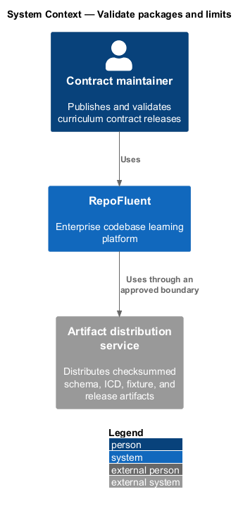
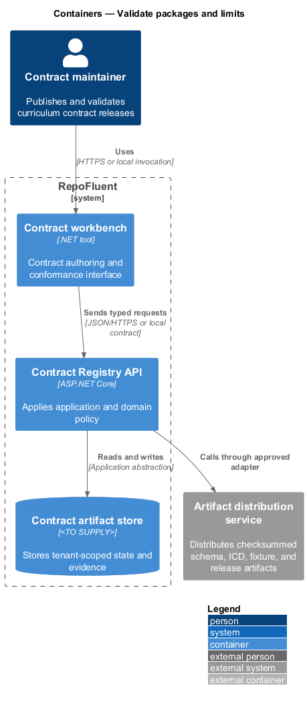
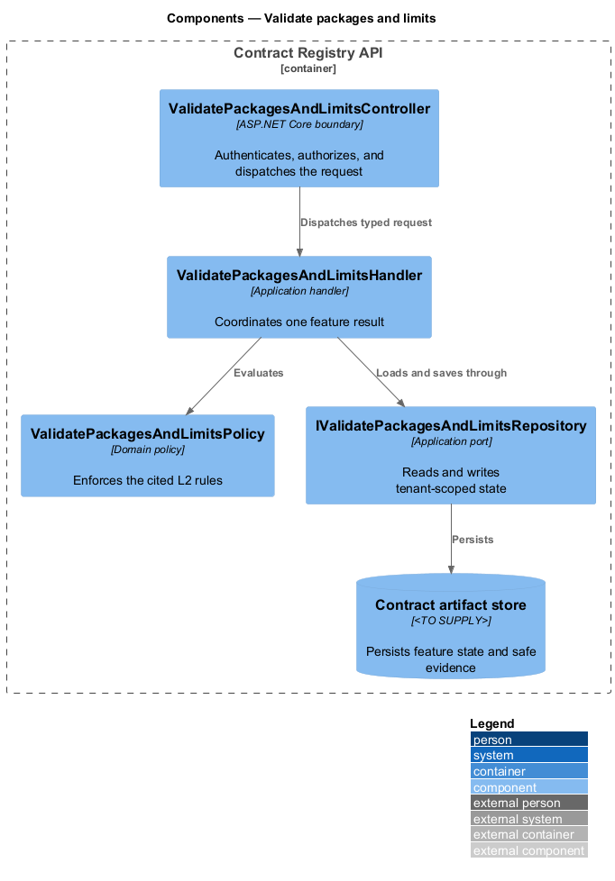
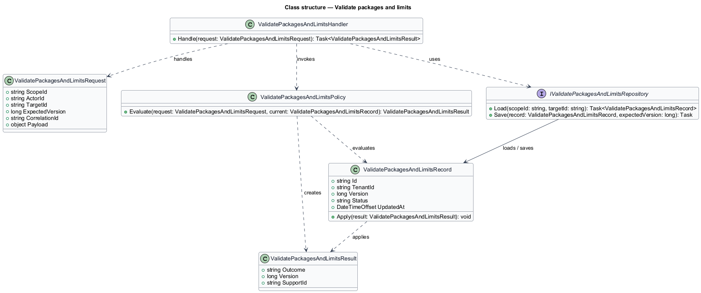
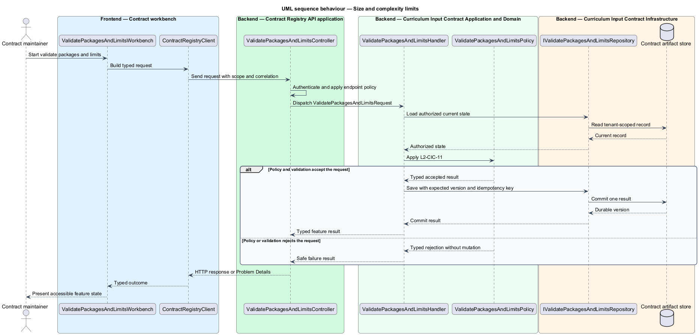

# Validate packages and limits

## Overview

RepoFluent's Curriculum Input Contract subsystem defines the portable curriculum package, its compatibility rules, and its conformance artifacts. This feature
brings *validation issue contract*, *size and complexity limits* into one vertical slice. The slice preserves tenant,
actor, version, authorization, and correlation context wherever the cited
requirements apply.

The contract maintainer starts the outcome through Contract workbench.
Contract Registry API applies server-side policy before state is read or changed.
The external dependency and persistent technology remain `<TO SUPPLY>` where
the requirements baseline does not select them.

## Description

The greenfield slice introduces the following building blocks. The endpoint
route, deployment topology, and unresolved provider choices remain `<TO SUPPLY>`.

- **`ValidatePackagesAndLimitsWorkbench`** — .NET tool entry component that presents
  the feature state and submits a typed intent.
- **`ContractRegistryClient`** — typed client that carries tenant, actor, version,
  idempotency, and correlation context required by the operation.
- **`ValidatePackagesAndLimitsController`** — ASP.NET Core boundary that authenticates
  the caller, applies endpoint policy, and dispatches `ValidatePackagesAndLimitsRequest`.
- **`ValidatePackagesAndLimitsRequest`** — application request containing scope, actor, target,
  expected version, correlation identifier, and feature payload.
- **`ValidatePackagesAndLimitsHandler`** — application handler that loads authorized state,
  invokes `ValidatePackagesAndLimitsPolicy`, and commits one result.
- **`ValidatePackagesAndLimitsPolicy`** — domain policy that evaluates the cited L2 rules without
  relying on client presentation state.
- **`IValidatePackagesAndLimitsRepository`** — application abstraction for tenant-scoped reads,
  writes, optimistic concurrency, and idempotency lookup.
- **`ValidatePackagesAndLimitsRecord`** — persisted feature record containing identity, tenant,
  version, status, timestamps, and safe evidence references.

## Requirements

The feature realizes the following level-2 (L2) requirements. Each row cites
the first L1 identifier named by the source requirement as its primary parent.

| L2 ID | Refines (L1) | Requirement |
|-------|--------------|-------------|
| `L2-CIC-10` | `L1-CIC-03` | Each validation issue shall include a stable code, severity, publication-blocking classification, human-readable explanation, precise JSON Pointer or equivalent path, and optional safe remediation guidance. Error order shall be deterministic. Values that may contain source, answer, secret, or personal data shall not be copied into issue messages by default. |
| `L2-CIC-11` | `L1-CIC-04` | The contract and validator shall define enforceable limits for package bytes, entity counts, string/excerpt length, assessment items, reference counts, and nesting depth. Limit failures shall occur before unsafe resource consumption and shall distinguish unsupported pilot scale from malformed content. |

## Diagrams

### System context

The contract maintainer uses RepoFluent to complete the feature outcome.
RepoFluent interacts with Artifact distribution service only through the boundary
described by the requirements and approved configuration.

### Containers

Contract workbench sends typed requests to Contract Registry API. The API applies
server-owned rules and records the accepted outcome in Contract artifact store.

### Components

`ValidatePackagesAndLimitsController` dispatches `ValidatePackagesAndLimitsRequest` to `ValidatePackagesAndLimitsHandler`. The handler
uses `ValidatePackagesAndLimitsPolicy` and `IValidatePackagesAndLimitsRepository` before it commits a state change.

### Class structure

`ValidatePackagesAndLimitsHandler` depends on the request, policy, and repository abstractions.
`IValidatePackagesAndLimitsRepository` stores `ValidatePackagesAndLimitsRecord` under tenant and version context.

### Behaviour — validation issue contract

The sequence applies `L2-CIC-10` before the handler persists an accepted result. A rejected policy or validation result returns without a state change.

### Behaviour — size and complexity limits

The sequence applies `L2-CIC-11` before the handler persists an accepted result. A rejected policy or validation result returns without a state change.

