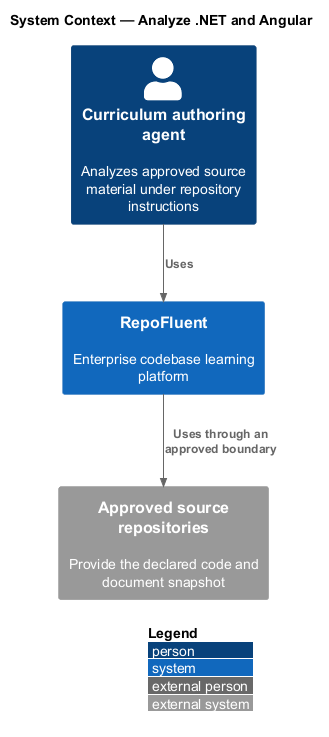
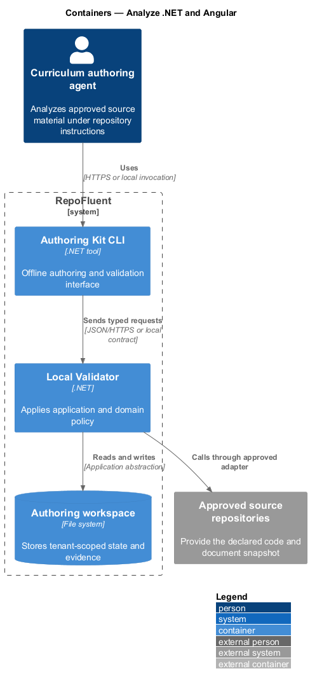
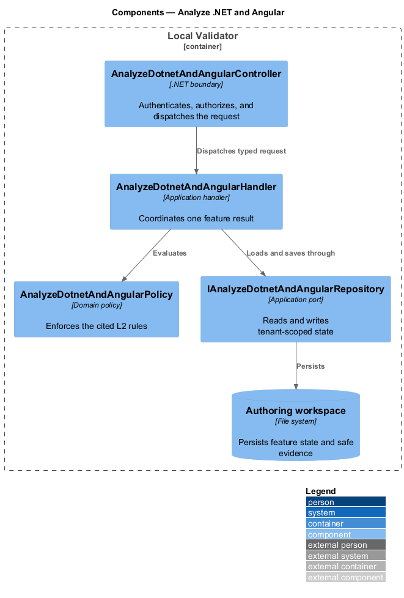
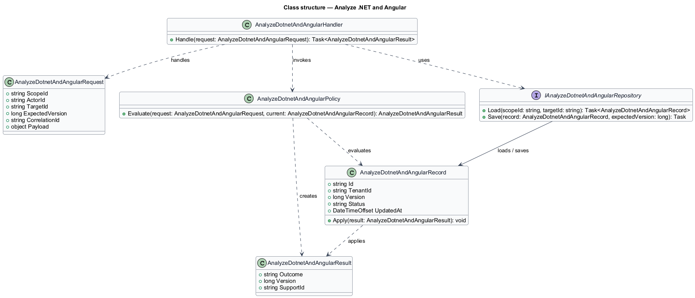
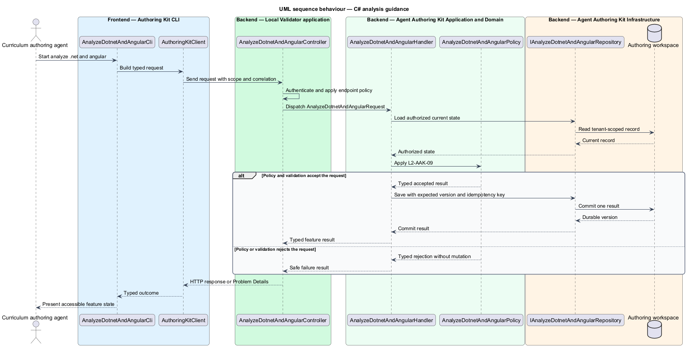

# Analyze .NET and Angular

## Overview

RepoFluent's Agent Authoring Kit subsystem guides approved agents from declared source scope to a locally validated curriculum package. This feature
brings *c# analysis guidance*, *angular analysis guidance* into one vertical slice. The slice preserves tenant,
actor, version, authorization, and correlation context wherever the cited
requirements apply.

The curriculum authoring agent starts the outcome through Authoring Kit CLI.
Local Validator applies server-side policy before state is read or changed.
The external dependency and persistent technology remain `<TO SUPPLY>` where
the requirements baseline does not select them.

## Description

The greenfield slice introduces the following building blocks. The endpoint
route, deployment topology, and unresolved provider choices remain `<TO SUPPLY>`.

- **`AnalyzeDotnetAndAngularCli`** — .NET tool entry component that presents
  the feature state and submits a typed intent.
- **`AuthoringKitClient`** — typed client that carries tenant, actor, version,
  idempotency, and correlation context required by the operation.
- **`AnalyzeDotnetAndAngularController`** — .NET boundary that authenticates
  the caller, applies endpoint policy, and dispatches `AnalyzeDotnetAndAngularRequest`.
- **`AnalyzeDotnetAndAngularRequest`** — application request containing scope, actor, target,
  expected version, correlation identifier, and feature payload.
- **`AnalyzeDotnetAndAngularHandler`** — application handler that loads authorized state,
  invokes `AnalyzeDotnetAndAngularPolicy`, and commits one result.
- **`AnalyzeDotnetAndAngularPolicy`** — domain policy that evaluates the cited L2 rules without
  relying on client presentation state.
- **`IAnalyzeDotnetAndAngularRepository`** — application abstraction for tenant-scoped reads,
  writes, optimistic concurrency, and idempotency lookup.
- **`AnalyzeDotnetAndAngularRecord`** — persisted feature record containing identity, tenant,
  version, status, timestamps, and safe evidence references.

## Requirements

The feature realizes the following level-2 (L2) requirements. Each row cites
the first L1 identifier named by the source requirement as its primary parent.

| L2 ID | Refines (L1) | Requirement |
|-------|--------------|-------------|
| `L2-AAK-09` | `L1-AAK-07` | C# guidance should cover solution/project structure, application boundaries, dependency injection, controllers/endpoints, domain services, persistence, messaging, configuration, background workers, external clients, and tests. It shall tell the agent to report dynamic or unresolved behavior rather than infer it as fact. |
| `L2-AAK-10` | `L1-AAK-07` | Angular guidance should cover application bootstrap, route boundaries, standalone components or modules, services, dependency injection, state flow, HTTP integration, guards/interceptors, templates, configuration, and tests. |

## Diagrams

### System context

The curriculum authoring agent uses RepoFluent to complete the feature outcome.
RepoFluent interacts with Approved source repositories only through the boundary
described by the requirements and approved configuration.

### Containers

Authoring Kit CLI sends typed requests to Local Validator. The API applies
server-owned rules and records the accepted outcome in Authoring workspace.

### Components

`AnalyzeDotnetAndAngularController` dispatches `AnalyzeDotnetAndAngularRequest` to `AnalyzeDotnetAndAngularHandler`. The handler
uses `AnalyzeDotnetAndAngularPolicy` and `IAnalyzeDotnetAndAngularRepository` before it commits a state change.

### Class structure

`AnalyzeDotnetAndAngularHandler` depends on the request, policy, and repository abstractions.
`IAnalyzeDotnetAndAngularRepository` stores `AnalyzeDotnetAndAngularRecord` under tenant and version context.

### Behaviour — c# analysis guidance

The sequence applies `L2-AAK-09` before the handler persists an accepted result. A rejected policy or validation result returns without a state change.

### Behaviour — angular analysis guidance

The sequence applies `L2-AAK-10` before the handler persists an accepted result. A rejected policy or validation result returns without a state change.

