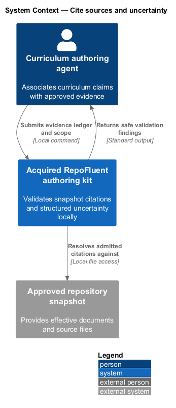
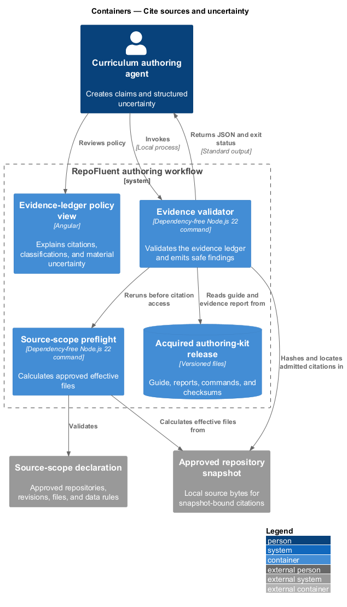
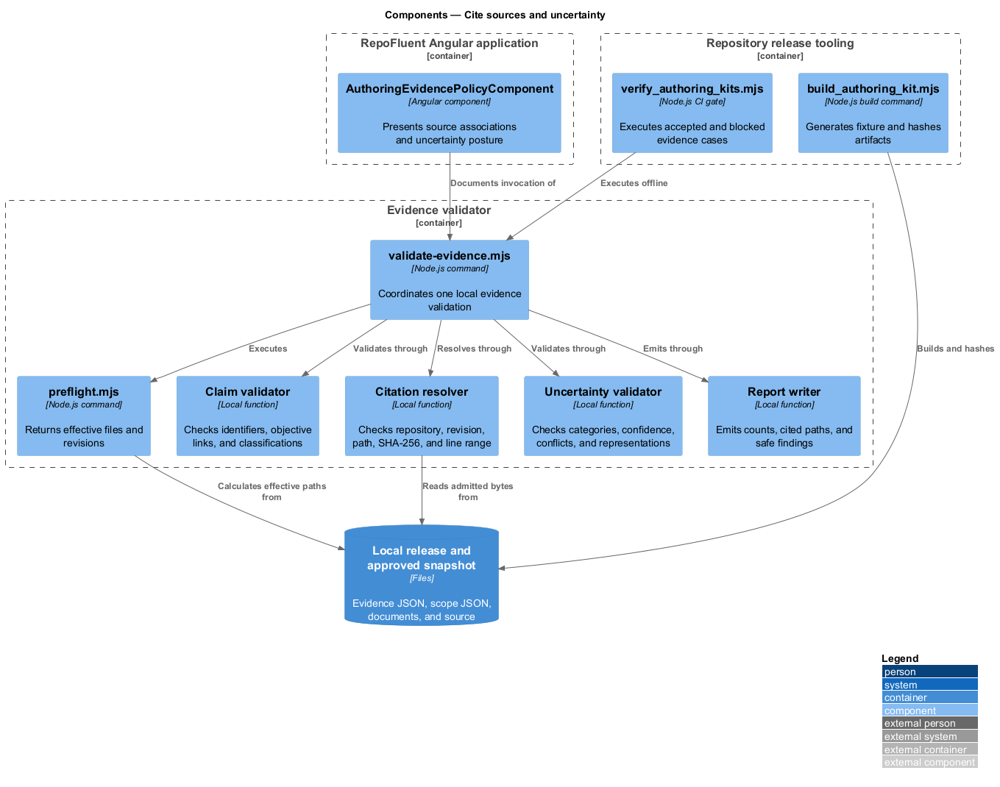
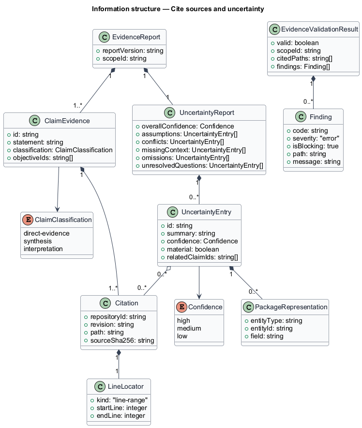
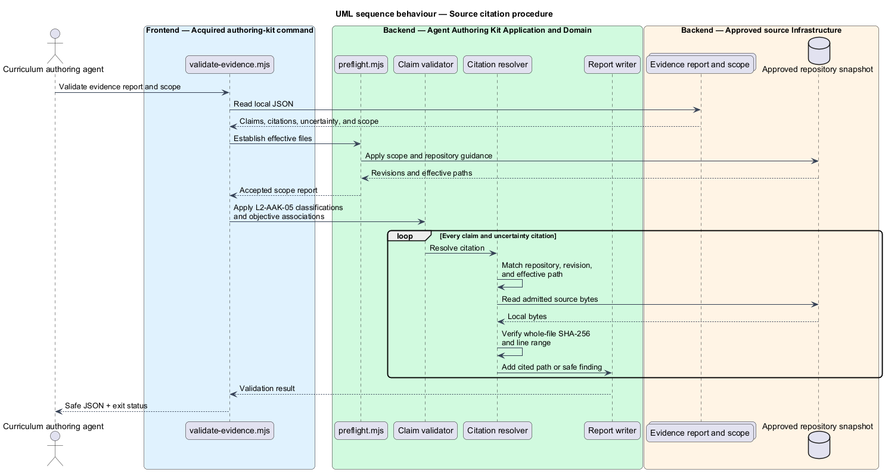
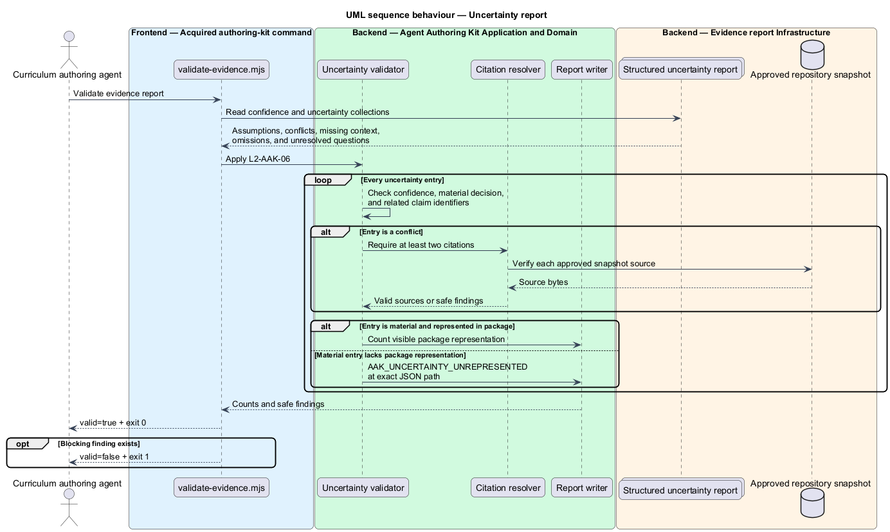

# Cite sources and uncertainty

## Overview

RepoFluent's acquired authoring kit validates an evidence ledger before package
validation. The ledger associates claims and objectives with approved source
bytes. It also preserves assumptions, confidence, conflicts, missing context,
omissions, and unresolved questions as structured records.

A citation names the repository, revision, repository-relative path, whole-file
SHA-256, and one-based line range. A claim is classified as direct evidence,
synthesis, or interpretation. Material uncertainty names the package entity and
field where a learner or reviewer can see it.

Evidence validation is local and dependency-free. It reruns source-scope
preflight, reads only effective files, emits no source excerpts, and stores
nothing in RepoFluent.

## Description

The implemented vertical slice contains the following building blocks.

- **Citation and uncertainty guide** — defines snapshot associations, claim
  classifications, objective links, uncertainty categories, confidence, and
  package representation.
- **Valid and invalid evidence reports** — exercise two direct claims, one
  synthesis, a two-source conflict, every uncertainty category, and a missing
  package representation.
- **Conflicting operations fixture** — disagrees with the approved architecture
  fixture about the active payment dependency.
- **`validate-evidence.mjs`** — reruns preflight, resolves citations against
  effective files, verifies revision, file hash, and line range, then checks the
  structured uncertainty ledger.
- **`build_authoring_kit.mjs` and `verify_authoring_kits.mjs`** — generate the
  invalid conflict fixture, hash every artifact, reject network imports, and
  execute accepted and blocked evidence cases.
- **`AuthoringEvidencePolicyComponent`** — presents citations, classification,
  and uncertainty with the versioned RepoFluent design tokens.
- **`AuthoringEvidencePage`** — Playwright Page Object for visible policy,
  offline command output, exact blocking path, and cross-platform visuals.

The command returns claim counts, uncertainty counts, unique cited paths, and
safe findings. It never returns claim statements, source excerpts, or matched
content. Exit status `0` accepts the ledger; status `1` blocks package
validation.

## Requirements

The feature realizes the following level-2 (L2) requirements. Each row cites
the L1 parent named by the source requirement.

| L2 ID | Refines (L1) | Requirement |
|-------|--------------|-------------|
| `L2-AAK-05` | `L1-AAK-03` | The kit shall define how to create repository-relative and document citations, bind them to the source snapshot, associate them with claims/objectives, and distinguish direct evidence from synthesis or interpretation. |
| `L2-AAK-06` | `L1-AAK-04` | The authoring workflow shall produce a structured report of assumptions, confidence, conflicting evidence, missing context, omissions, and unresolved questions. Material uncertainty shall also be represented in the package where the learner/reviewer needs it. |

### Implementation evidence

- `cite-sources-and-uncertainty.spec.ts` starts the slice with Page Object
  acceptance for the evidence policy, three claim classifications, cited paths,
  structured conflict, package representation, and exact blocking finding.
- The valid fixture binds architecture, operations, and payment-handler
  citations to the approved revision, file SHA-256, and line ranges.
- The invalid fixture removes one material conflict representation and returns
  `AAK_UNCERTAINTY_UNREPRESENTED` at its exact JSON path.
- Windows and Linux Chromium baselines capture the same 500-pixel policy panel
  using design-system primitives and tokens.

## Diagrams

### System context

The curriculum-authoring agent validates an evidence ledger with the acquired
RepoFluent kit. Citations resolve only to the approved local repository
snapshot.

### Containers

The Angular application communicates policy. The acquired command reruns local
scope preflight, reads evidence and effective source files, then emits a safe
validation report.

### Components

`validate-evidence.mjs` coordinates preflight, claim validation, citation
resolution, uncertainty validation, and safe report output. Repository tooling
packages and executes the same command offline.

### Class structure

The evidence report owns claims and one uncertainty report. Citations bind
claims and uncertainty entries to snapshot files. Material entries own package
representations.

### Behaviour — source citation procedure

For `L2-AAK-05`, preflight establishes effective files before the citation
resolver compares repository, revision, path, file hash, and line range.

### Behaviour — uncertainty report

For `L2-AAK-06`, every uncertainty collection and confidence value is checked.
Conflicts retain two citations, while material entries require a visible package
representation.

