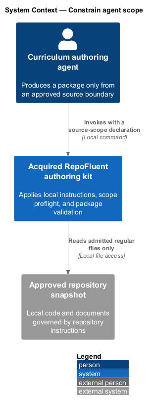
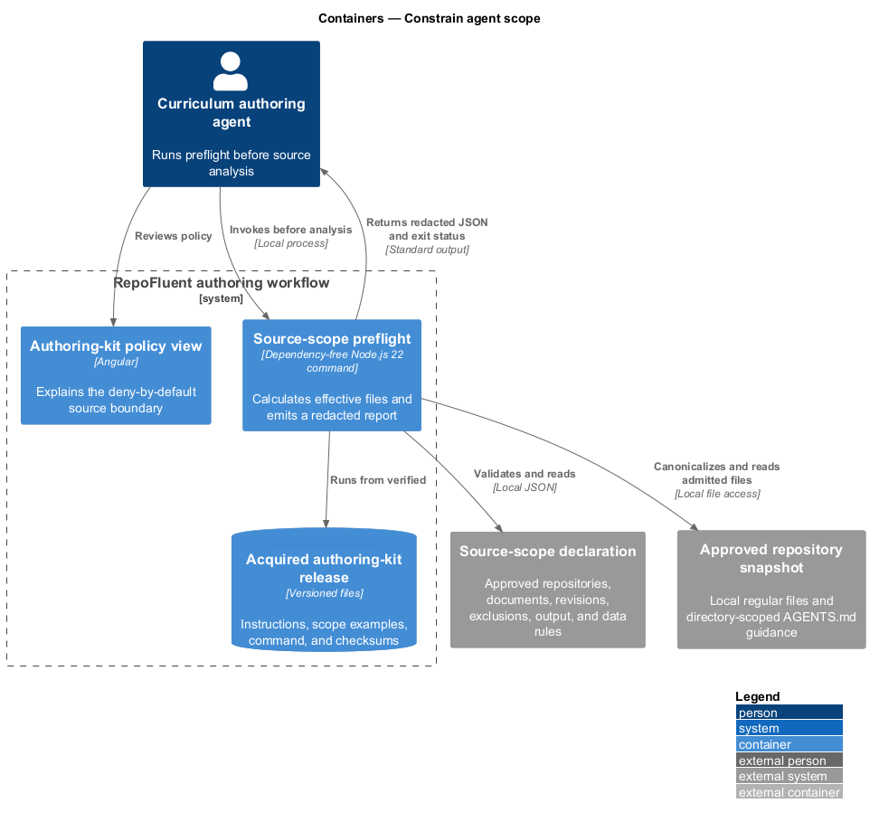
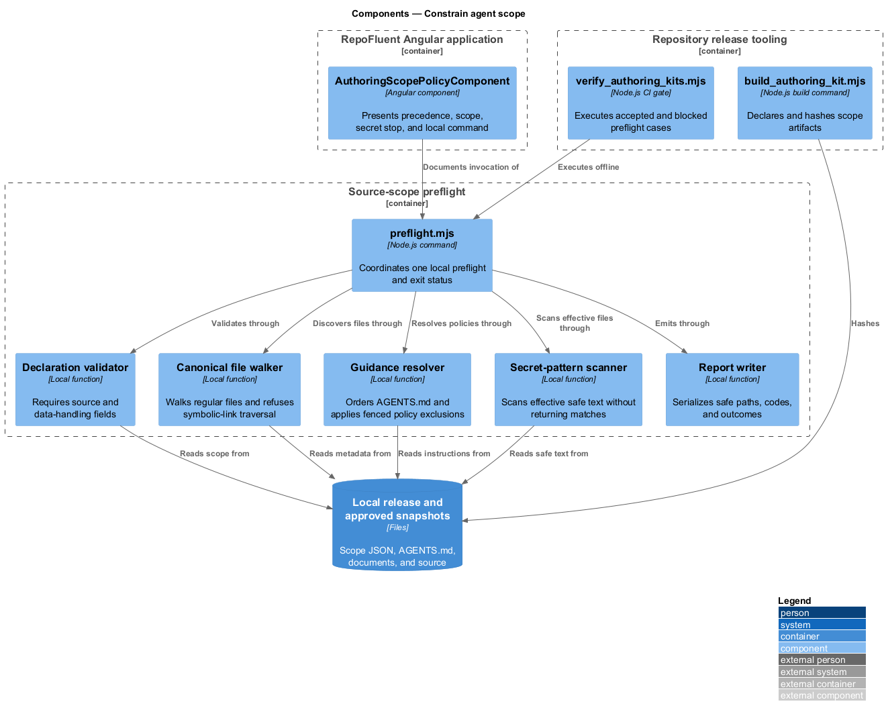
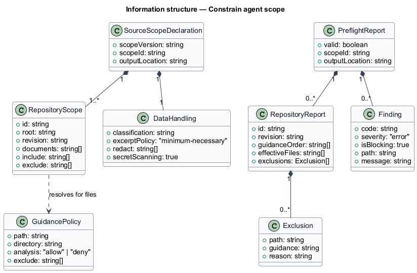
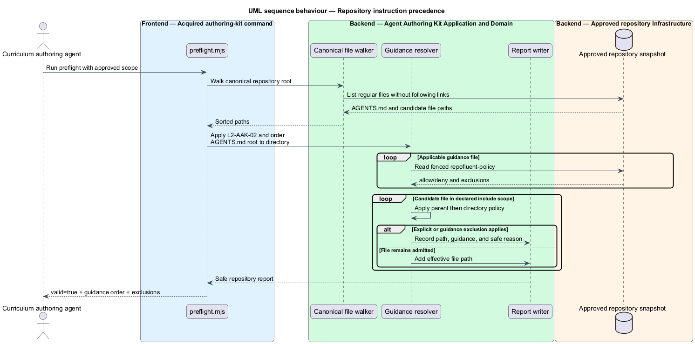
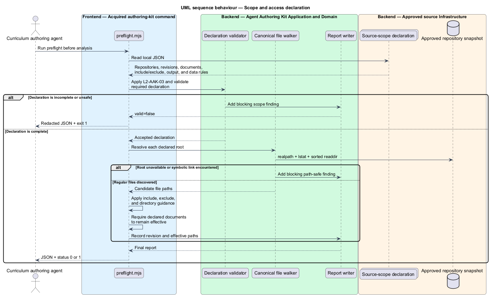
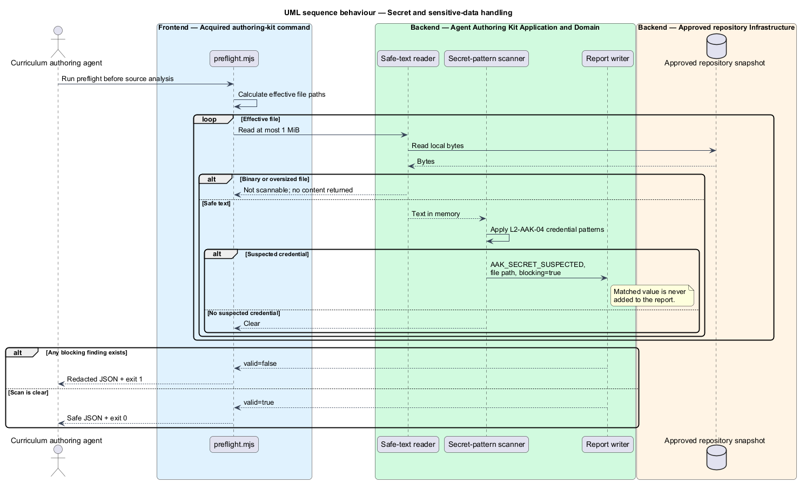

# Constrain agent scope

## Overview

RepoFluent's acquired authoring kit performs a local scope preflight before an
agent reads customer source. A *source-scope declaration* names the approved
repositories, documents, revisions, inclusions, exclusions, output location,
and data-handling rules for one generation run. The command resolves applicable
repository guidance from root to directory, calculates the effective file set,
and stops on unsafe input.

Release `0.1.0` ships the dependency-free command, representative safe and
secret-exposure scopes, and fixture repositories. Preflight reads only the
declared local snapshots, follows no symbolic links, makes no network request,
and emits one redacted JSON report to standard output. It does not upload source
or persist customer content in RepoFluent.

The Angular authoring-kit view explains this deny-by-default posture. The local
command remains the enforcement boundary.

## Description

The implemented vertical slice contains the following building blocks.

- **`AGENTS.md`, generation prompt, and authoring skill** — require
  root-to-directory instruction discovery, explicit source scope, minimum
  excerpts, no access elevation, and a stop on suspected secret exposure.
- **`approved-scope.json` and `secret-exposure-scope.json`** — executable scope
  declarations covering an accepted repository boundary and a blocking
  sensitive-data path.
- **Fixture repository guidance** — embeds a fenced `repofluent-policy` JSON
  block. Root guidance applies first; deeper guidance may narrow but cannot
  loosen a parent prohibition.
- **`preflight.mjs`** — validates the declaration, canonicalizes each local
  repository root, walks regular files without following symbolic links,
  and orders applicable guidance. It applies declared and directory exclusions,
  verifies declared documents, scans safe text, and prints a redacted report.
- **`build_authoring_kit.mjs` and `verify_authoring_kits.mjs`** — include every
  scope artifact in the release checksums and execute accepted and blocked
  preflight cases with the offline flag enabled.
- **`AuthoringScopePolicyComponent`** — presents instruction precedence,
  declared scope, sensitive-data stop, and the local command using the
  RepoFluent design tokens.
- **`AuthoringScopePage`** — Playwright Page Object for the visible policy,
  effective-file result, directory exclusion, redacted failure, and Windows and
  Linux visual contracts.

The report contains `scopeId`, declared output location, repository revision,
guidance order, effective files, exclusions, and blocking findings. It contains
paths and stable codes, never the matching credential value. Exit status `0`
means preflight accepted the boundary; status `1` prevents source analysis.

## Requirements

The feature realizes the following level-2 (L2) requirements. Each row cites
the L1 parent named by the source requirement.

| L2 ID | Refines (L1) | Requirement |
|-------|--------------|-------------|
| `L2-AAK-02` | `L1-AAK-02` | `AGENTS.md` shall instruct the agent to discover and obey applicable repository guidance, resolve scope by directory, preserve explicit exclusions, and stop or report conflict rather than silently overriding higher-priority customer instructions. |
| `L2-AAK-03` | `L1-AAK-02` | The workflow shall require an explicit source scope, approved repositories/documents, revision or snapshot, exclusions, output location, and data-handling constraints before analysis. The kit shall not instruct an agent to elevate access, bypass controls, or retrieve undeclared sources. |
| `L2-AAK-04` | `L1-AAK-02` | Instructions shall require agents to avoid collecting secrets, minimize source excerpts, honor content classification/redaction metadata, and stop/report suspected secret exposure. The validation workflow shall support secret-pattern scanning before package release. |

### Implementation evidence

- `constrain-agent-scope.spec.ts` starts the slice with Page Object acceptance
  for the policy panel, root-to-directory guidance order, exact effective files,
  preserved exclusions, redacted secret finding, and process exit status.
- `verify_authoring_kits.mjs` reruns both scope cases, verifies every new
  artifact checksum, and rejects network imports in the preflight runtime.
- `preflight.mjs` returns `AAK_SECRET_SUSPECTED` with only the affected path and
  safe message; the seeded fixture value is absent from command output.
- Windows and Linux Chromium baselines capture the same 500-pixel policy panel
  using versioned design-system tokens.

## Diagrams

### System context

The curriculum-authoring agent invokes an acquired RepoFluent authoring kit
against an approved local repository snapshot. Only files admitted by the
declaration and applicable repository guidance become effective.

### Containers

The Angular application communicates the policy. The acquired Node.js command
reads the local declaration and approved repository snapshot, then returns a
redacted report without a server or network dependency.

### Components

`preflight.mjs` coordinates declaration validation, canonical file walking,
guidance resolution, effective-scope filtering, secret scanning, and report
output. Repository build tooling verifies the same packaged behavior.

### Class structure

The declaration owns repository and data-handling values. The preflight report
records repository outcomes and stable findings without source contents.

### Behaviour — repository instruction precedence

For `L2-AAK-02`, preflight discovers guidance in root-to-directory order and
applies the first parent or directory prohibition that excludes a file.

### Behaviour — scope and access declaration

For `L2-AAK-03`, declaration validation completes before repository inspection.
Missing scope fields, unavailable roots, symbolic links, or unavailable
documents produce blocking findings.

### Behaviour — secret and sensitive-data handling

For `L2-AAK-04`, preflight scans only effective safe-text files. A suspected
credential yields a path-addressed blocking finding without reproducing the
matched value, and the command exits with status `1`.

