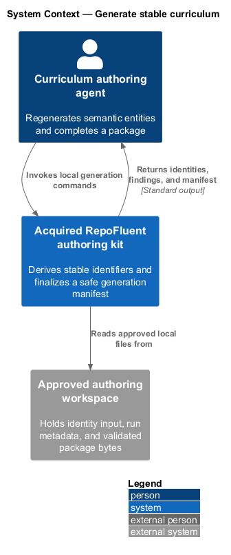
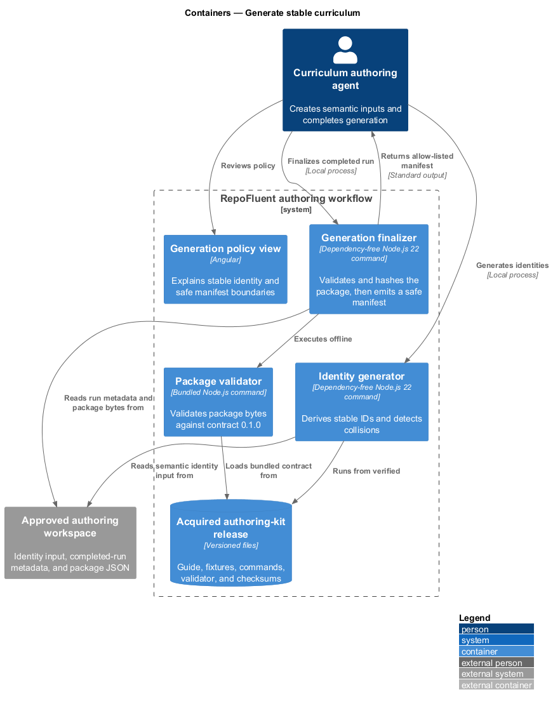
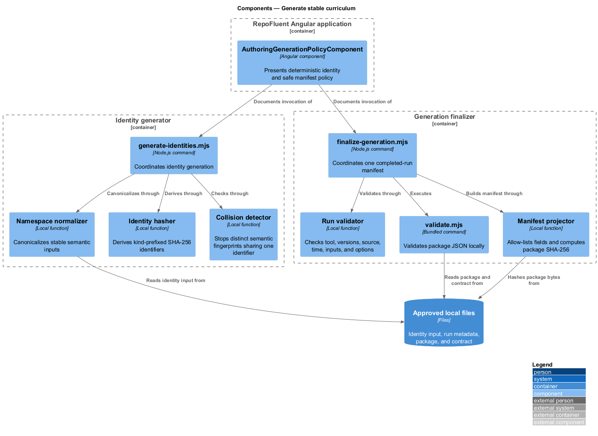
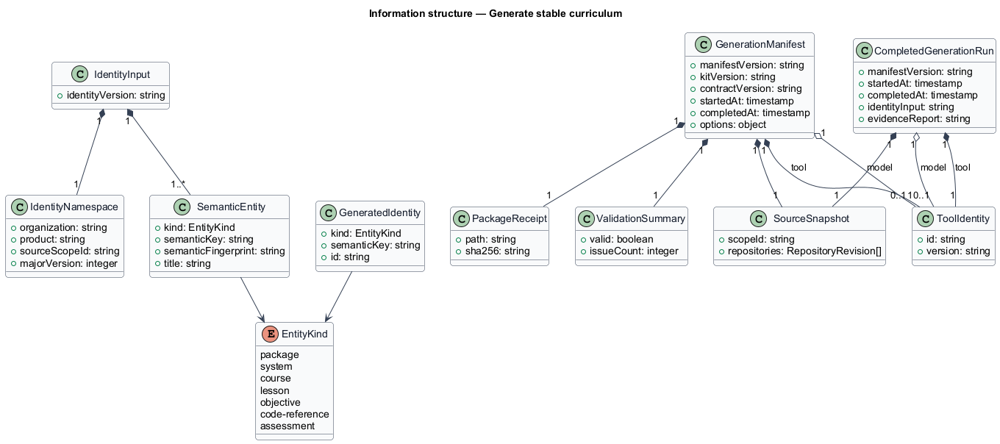
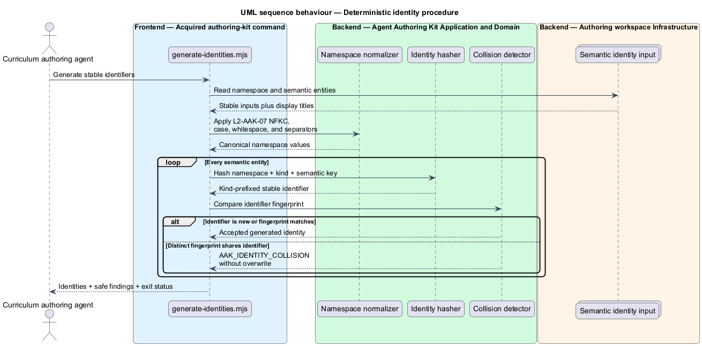
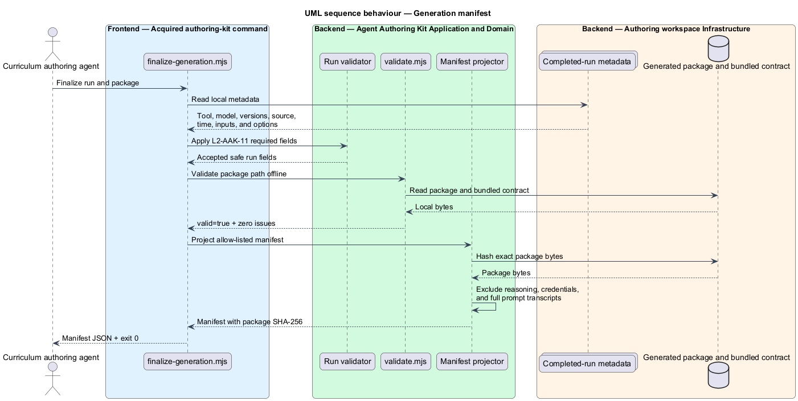

# Generate stable curriculum

## Overview

RepoFluent's acquired authoring kit creates stable curriculum identifiers from
semantic inputs and finalizes a safe receipt for each completed generation run.
Display wording does not participate in identity. Package, system, course,
lesson, objective, code-reference, and assessment identifiers therefore remain
stable when only prose changes.

The identity namespace combines organization, product, approved source scope,
curriculum major version, entity kind, and semantic key. A semantic fingerprint
records what each key represents. Distinct fingerprints that produce the same
identity stop the run instead of overwriting an entity.

The generation manifest allow-lists tool, model, versions, source revisions,
timestamps, package checksum, input references, declared options, and local
validation result. It contains no hidden reasoning, credentials, or full prompt
transcript.

## Description

The implemented vertical slice contains the following building blocks.

- **Stable-generation guide** — defines namespace inputs, Unicode
  normalization, kind prefixes, SHA-256 derivation, regeneration, collision
  handling, and safe manifest fields.
- **Identity fixtures** — model two runs with the same semantics and different
  titles, plus a colliding semantic key with distinct fingerprints.
- **`generate-identities.mjs`** — normalizes semantic inputs, derives
  kind-prefixed identifiers, omits titles from output, and returns exact
  collision findings.
- **Completed-run fixture** — declares tool and model versions, source snapshot,
  times, options, and identity and evidence input references.
- **`finalize-generation.mjs`** — validates the package locally, hashes exact
  bytes, constructs an allow-listed manifest, and returns the validator outcome.
- **`build_authoring_kit.mjs` and `verify_authoring_kits.mjs`** — package both
  commands and fixtures, reject network imports, compare regeneration results,
  exercise collision behavior, and inspect the final manifest.
- **`AuthoringGenerationPolicyComponent`** — presents namespace, stable
  regeneration, collision, and private-manifest boundaries with design tokens.
- **`AuthoringGenerationPage`** — Playwright Page Object for command behavior,
  manifest fields, private-data absence, and cross-platform visual evidence.

Both commands are dependency-free Node.js 22 processes. They read local files,
emit one JSON value, and perform no network operation.

## Requirements

The feature realizes the following level-2 (L2) requirements. Each row cites
the L1 parent named by the source requirement.

| L2 ID | Refines (L1) | Requirement |
|-------|--------------|-------------|
| `L2-AAK-07` | `L1-AAK-05` | The kit shall prescribe stable namespace inputs, normalization, collision handling, and regeneration behavior for package, system, course, lesson, objective, code-reference, and assessment identifiers. Human-readable titles shall not be the only identity source. |
| `L2-AAK-11` | `L1-AAK-08` | The workflow should produce a manifest containing tool and model identifiers/versions where available, kit and contract version, source snapshot, generation start/end timestamps, package checksum, declared options, and validation result. It shall exclude hidden chain-of-thought, credentials, and full prompt transcripts unless separately approved. |

### Implementation evidence

- `generate-stable-curriculum.spec.ts` starts the slice with Page Object
  acceptance for stable regeneration, seven entity kinds, collision stop, safe
  manifest fields, package checksum, and private-data absence.
- The two regeneration fixtures vary every title while producing byte-equal
  ordered identity results.
- The collision fixture returns `AAK_IDENTITY_COLLISION` at
  `/entities/1/semanticKey` and does not emit a replacement entity.
- The finalizer runs the bundled package validator and emits a SHA-256 over the
  exact package bytes.
- Windows and Linux Chromium baselines capture the complete 560-pixel generation
  policy panel.

## Diagrams

### System context

The curriculum-authoring agent uses the acquired kit to derive stable
identifiers and seal a locally validated package with a safe generation
manifest.

### Containers

The Angular application communicates the generation policy. Two local commands
read semantic identity input and completed-run metadata, while the bundled
validator verifies the package before manifest output.

### Components

The identity command coordinates normalization, namespace hashing, and collision
detection. The finalizer coordinates run validation, package validation,
checksum calculation, and allow-listed manifest projection.

### Class structure

Identity input owns a namespace and semantic entities. A completed generation
run becomes a manifest with source snapshot, package receipt, declared options,
and validation summary.

### Behaviour — deterministic identity procedure

For `L2-AAK-07`, normalized semantic tuples produce stable kind-prefixed hashes.
A distinct fingerprint for an existing identifier returns a blocking collision.

### Behaviour — generation manifest

For `L2-AAK-11`, the finalizer validates and hashes local package bytes before it
projects approved run fields. Private or undeclared fields never enter the
manifest.

