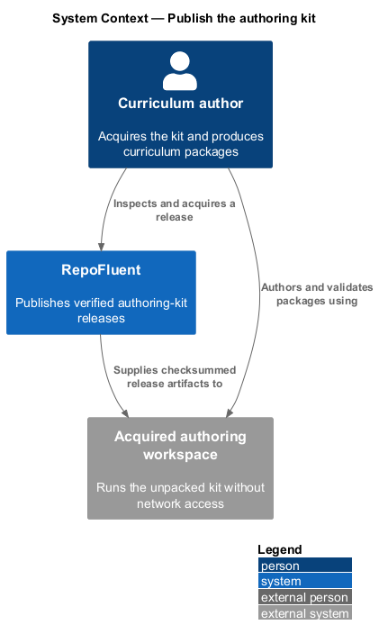
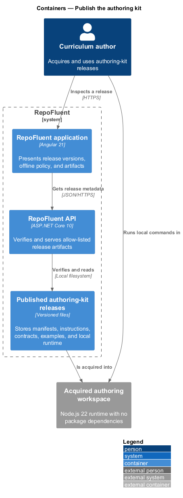
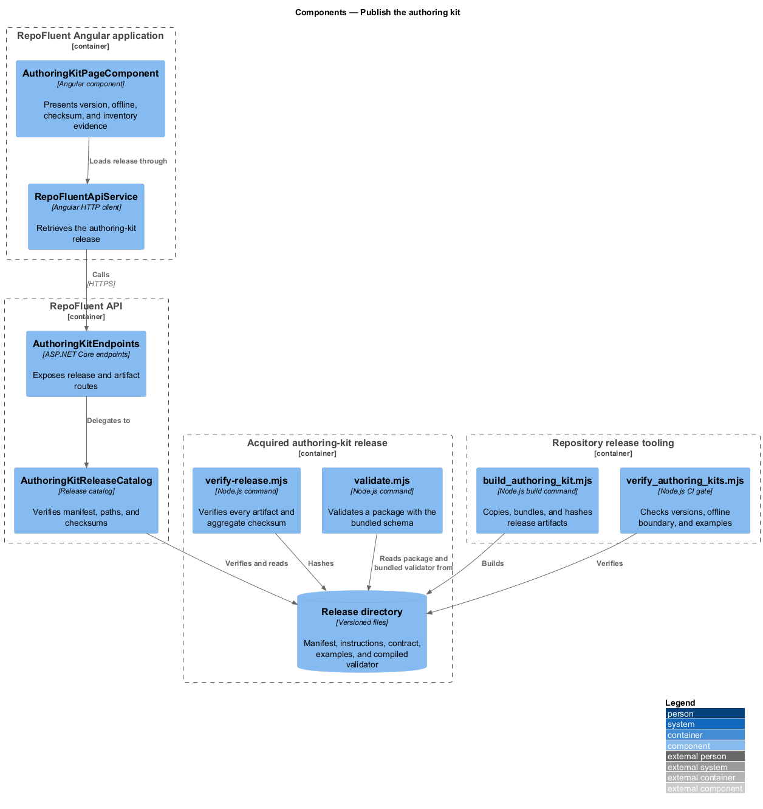
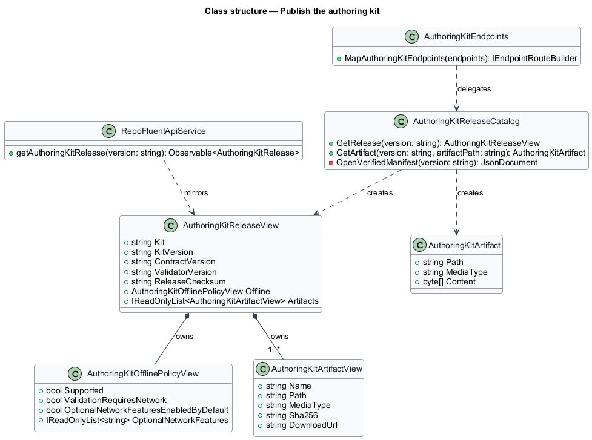
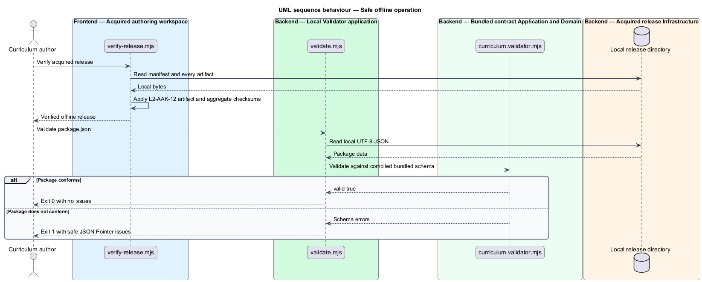

# Publish the authoring kit

## Overview

RepoFluent publishes a versioned authoring kit that guides an approved
curriculum-authoring agent from declared source material to a locally validated
Curriculum Input Contract package. An *authoring-kit release* is a checksummed
directory containing the instructions, prompts, skill, contract, examples, and
runtime needed for one compatible toolchain.

Release `0.1.0` binds kit, contract, and validator version `0.1.0`. The release
contains no package dependencies. Once acquired, it verifies every declared
artifact and validates packages with Node.js 22 without schema downloads,
package installation, or another network operation. Optional source-provider
acquisition remains disabled by default and is outside local validation.

Authors inspect the published inventory through the Angular release view or
retrieve each verified artifact through the public API. The acquired directory
remains the authoritative offline boundary.

## Description

The implemented vertical slice contains the following building blocks.

- **`authoring-kit/releases/0.1.0`** — portable release directory containing
  `AGENTS.md`, a reusable prompt, `SKILL.md`, quick start, release notes,
  contract artifacts, valid and invalid examples, validator commands, and
  checksums.
- **`build_authoring_kit.mjs`** — copies the compatible schema, ICD, and
  representative fixture; produces the invalid fixture; bundles a standalone
  Ajv validator; and writes deterministic artifact and aggregate checksums.
- **`validate.mjs` and `curriculum.validator.mjs`** — dependency-free local
  validation command and compiled JSON Schema validator.
- **`verify-release.mjs` and `verify_authoring_kits.mjs`** — acquired-release
  and repository gates for artifact integrity, version alignment, source
  synchronization, offline imports, and valid/invalid behavior.
- **`AuthoringKitReleaseCatalog` and `AuthoringKitEndpoints`** — verify the
  release before returning its manifest or an allow-listed artifact.
- **`AuthoringKitPageComponent`** — presents version alignment, offline policy,
  aggregate integrity, and the artifact inventory with design-system tokens.
- **`AuthoringKitPage`** — Playwright Page Object for release discovery,
  manifest behavior, offline command execution, and visual acceptance.

The CI workflow runs the authoring-kit verifier after the contract verifier.
This order detects a bundled schema or ICD that no longer matches its declared
contract release.

## Requirements

The feature realizes the following level-2 (L2) requirements. Each row cites
the L1 parent named by the source requirement.

| L2 ID | Refines (L1) | Requirement |
|-------|--------------|-------------|
| `L2-AAK-01` | `L1-AAK-01` | Each kit release shall contain `AGENTS.md`, reusable prompts, applicable `SKILL.md` instructions, the compatible JSON Schema and ICD, valid and invalid examples, a local validation command, release notes, artifact checksums, and a manifest declaring kit, contract, and validator versions. |
| `L2-AAK-12` | `L1-AAK-09` | Schema resolution, fixtures, documentation, and local validation shall function without network access after kit acquisition. Any optional network-dependent feature shall be identified, disabled by default for offline validation, and unnecessary for producing a conformant package. |

### Implementation evidence

- `publish-authoring-kit.spec.ts` starts the slice with Page Object acceptance
  for the public release, complete inventory, version alignment, offline policy,
  local valid/invalid commands, and the release visual.
- `AuthoringKitReleaseApiTests` verifies the public manifest, required artifacts,
  offline defaults, artifact download, and SHA-256 integrity.
- `verify_authoring_kits.mjs` executes both local commands with
  `REPOFLUENT_OFFLINE=true` and rejects network imports in the validation
  runtime.
- Windows and Linux Chromium baselines capture the release manifest at the
  design-system desktop profile.

## Diagrams

### System context

The curriculum author acquires a verified kit from RepoFluent and uses the
unpacked directory to produce and validate a contract-compatible package.

### Containers

The Angular application reads release metadata from the RepoFluent API. The API
verifies the published release directory, while the acquired authoring workspace
runs the same artifacts without a network dependency.

### Components

`AuthoringKitPageComponent` calls `RepoFluentApiService`;
`AuthoringKitEndpoints` delegates to `AuthoringKitReleaseCatalog`, which verifies
the manifest and release files. The local commands read only the acquired
directory.

### Class structure

`AuthoringKitReleaseCatalog` creates `AuthoringKitReleaseView` and
`AuthoringKitArtifactView` records from a verified manifest.
`RepoFluentApiService` returns the matching frontend release contract.

### Behaviour — kit contents and release manifest

The repository builder assembles and hashes `L2-AAK-01` artifacts. The public
API recalculates each checksum and the ordinal aggregate before presenting the
release.

### Behaviour — safe offline operation

The acquired verification command checks local artifacts before
`validate.mjs` applies the bundled schema for `L2-AAK-12`. The sequence has no
network participant.

