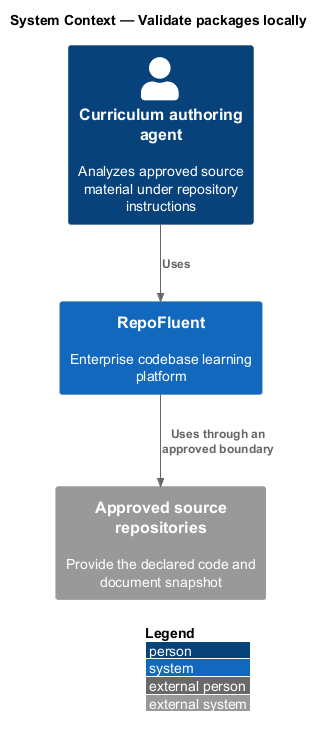
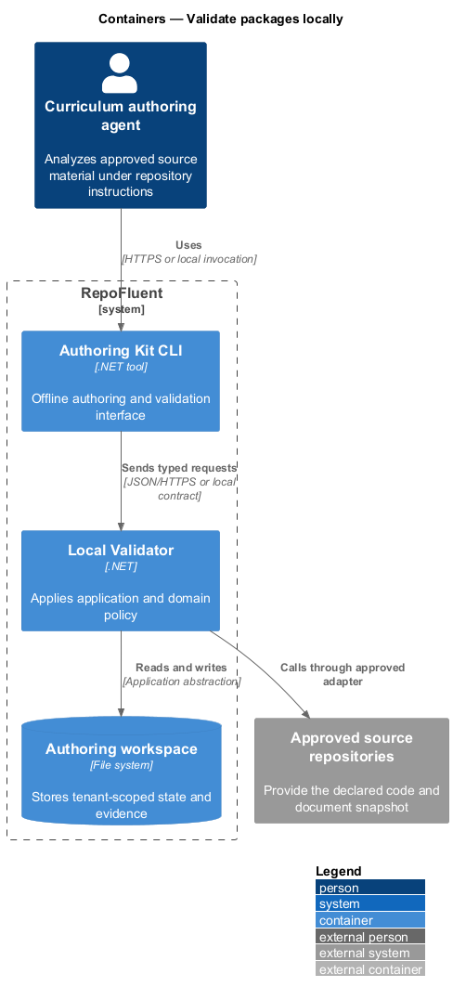
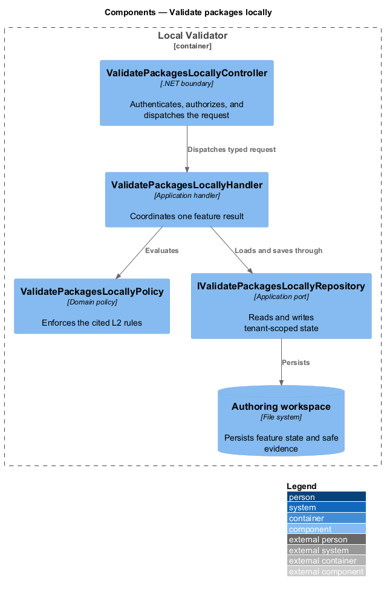
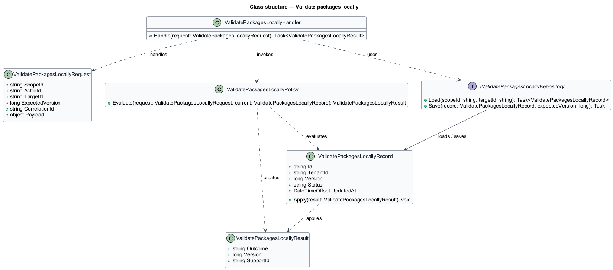
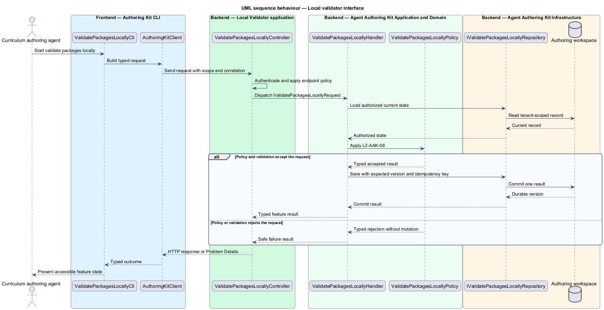

# Validate packages locally

## Overview

RepoFluent's Agent Authoring Kit subsystem guides approved agents from declared source scope to a locally validated curriculum package. This feature
brings *local validator interface* into one vertical slice. The slice preserves tenant,
actor, version, authorization, and correlation context wherever the cited
requirements apply.

The curriculum authoring agent starts the outcome through Authoring Kit CLI.
Local Validator applies server-side policy before state is read or changed.
The external dependency and persistent technology remain `<TO SUPPLY>` where
the requirements baseline does not select them.

## Description

The greenfield slice introduces the following building blocks. The endpoint
route, deployment topology, and unresolved provider choices remain `<TO SUPPLY>`.

- **`ValidatePackagesLocallyCli`** — .NET tool entry component that presents
  the feature state and submits a typed intent.
- **`AuthoringKitClient`** — typed client that carries tenant, actor, version,
  idempotency, and correlation context required by the operation.
- **`ValidatePackagesLocallyController`** — .NET boundary that authenticates
  the caller, applies endpoint policy, and dispatches `ValidatePackagesLocallyRequest`.
- **`ValidatePackagesLocallyRequest`** — application request containing scope, actor, target,
  expected version, correlation identifier, and feature payload.
- **`ValidatePackagesLocallyHandler`** — application handler that loads authorized state,
  invokes `ValidatePackagesLocallyPolicy`, and commits one result.
- **`ValidatePackagesLocallyPolicy`** — domain policy that evaluates the cited L2 rules without
  relying on client presentation state.
- **`IValidatePackagesLocallyRepository`** — application abstraction for tenant-scoped reads,
  writes, optimistic concurrency, and idempotency lookup.
- **`ValidatePackagesLocallyRecord`** — persisted feature record containing identity, tenant,
  version, status, timestamps, and safe evidence references.

## Requirements

The feature realizes the following level-2 (L2) requirements. Each row cites
the first L1 identifier named by the source requirement as its primary parent.

| L2 ID | Refines (L1) | Requirement |
|-------|--------------|-------------|
| `L2-AAK-08` | `L1-AAK-06` | The kit shall document a noninteractive local command that accepts package path, contract version or auto-detection, output format, and severity threshold. Exit status shall distinguish success, warnings-only, validation failure, invalid invocation, and internal validator failure. JSON output shall implement the validation issue contract. |

## Diagrams

### System context

The curriculum authoring agent uses RepoFluent to complete the feature outcome.
RepoFluent interacts with Approved source repositories only through the boundary
described by the requirements and approved configuration.

### Containers

Authoring Kit CLI sends typed requests to Local Validator. The API applies
server-owned rules and records the accepted outcome in Authoring workspace.

### Components

`ValidatePackagesLocallyController` dispatches `ValidatePackagesLocallyRequest` to `ValidatePackagesLocallyHandler`. The handler
uses `ValidatePackagesLocallyPolicy` and `IValidatePackagesLocallyRepository` before it commits a state change.

### Class structure

`ValidatePackagesLocallyHandler` depends on the request, policy, and repository abstractions.
`IValidatePackagesLocallyRepository` stores `ValidatePackagesLocallyRecord` under tenant and version context.

### Behaviour — local validator interface

The sequence applies `L2-AAK-08` before the handler persists an accepted result. A rejected policy or validation result returns without a state change.

