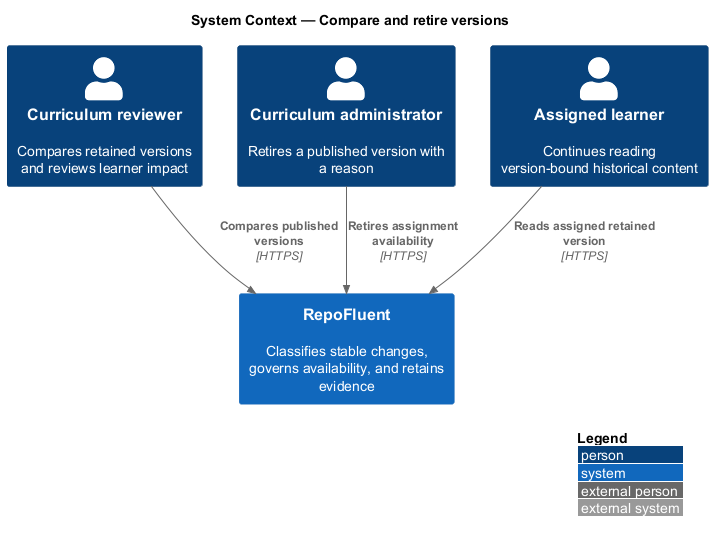
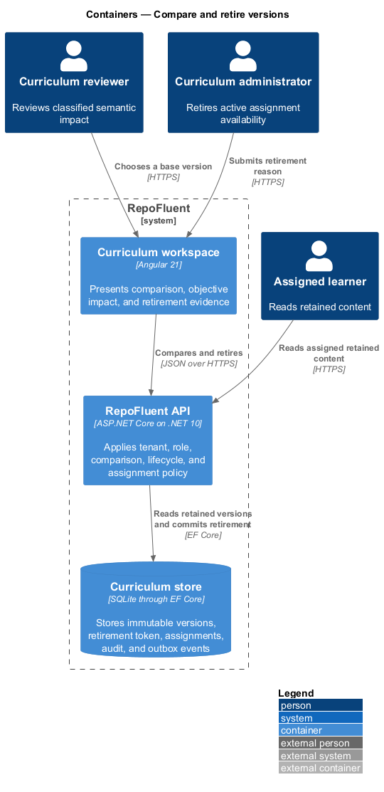
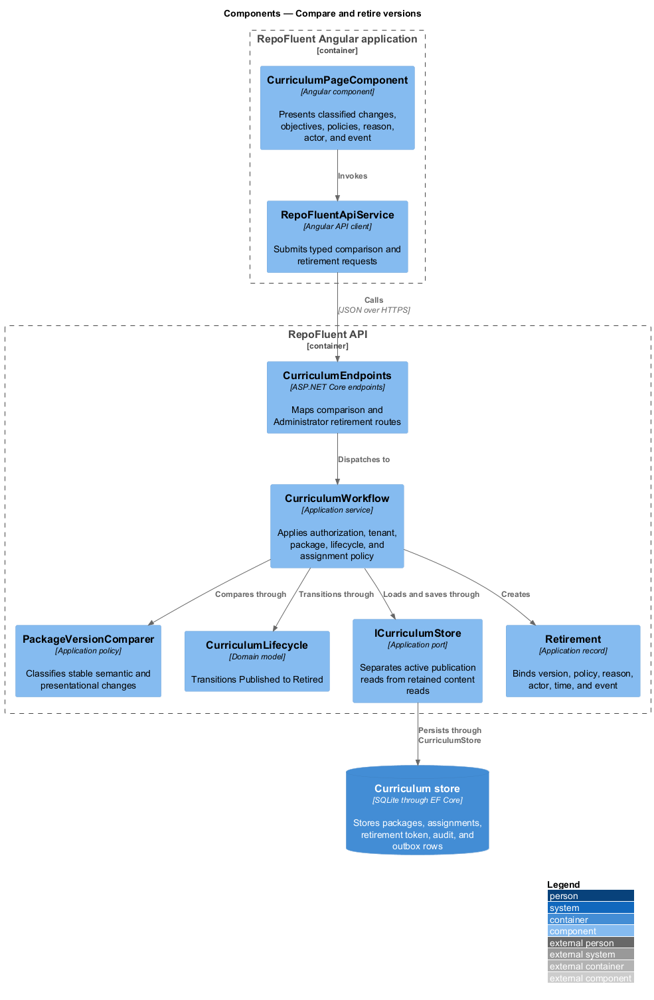
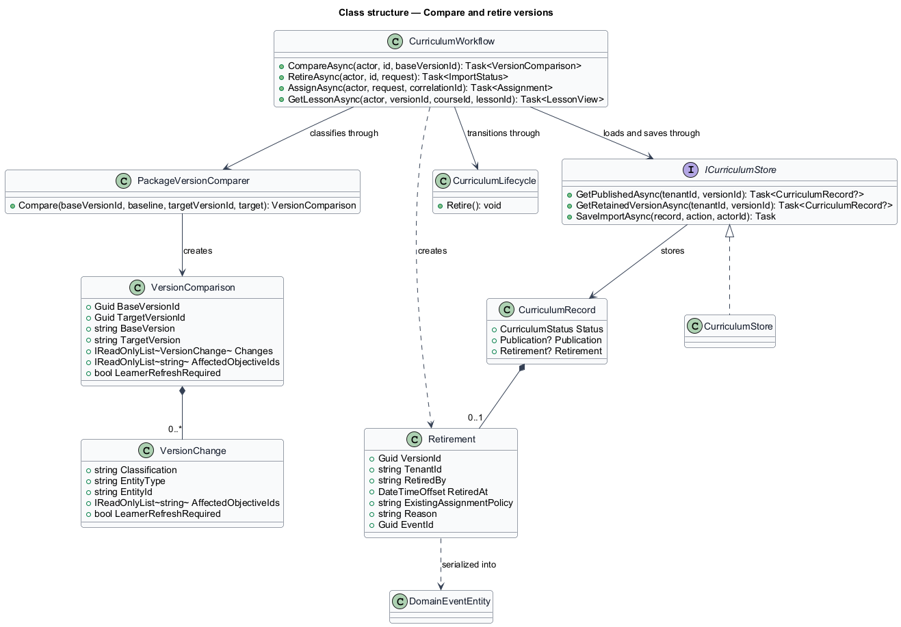
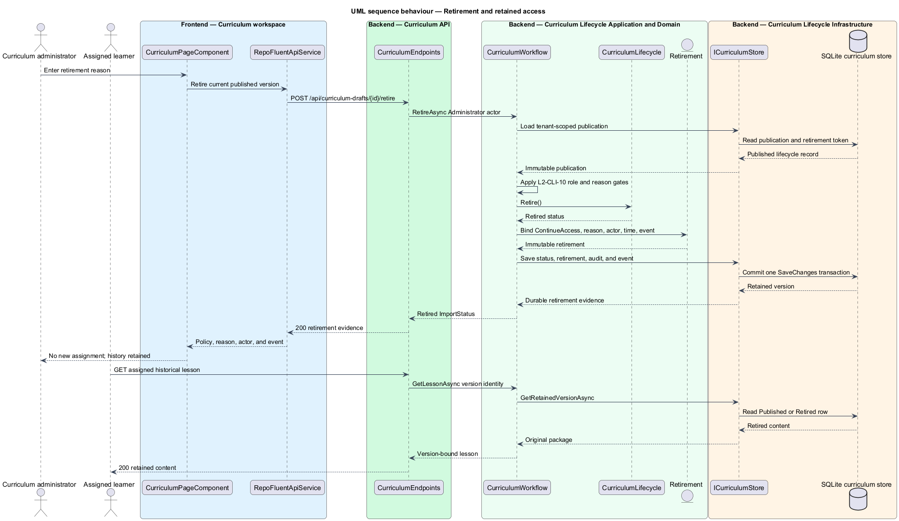
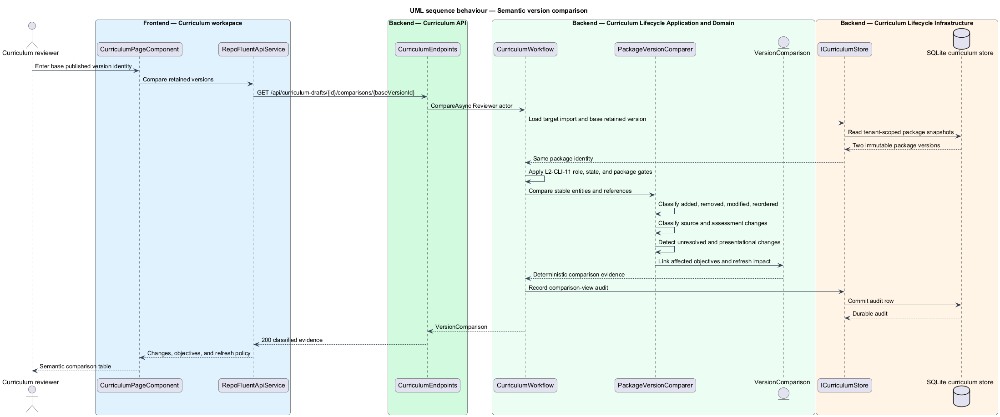

# Compare and retire versions

## Overview

RepoFluent lets Reviewers compare two retained versions of the same curriculum
package by stable entity identity. The comparison classifies source,
assessment, ordering, removal, addition, modification, unresolved-reference,
and presentational changes, links changes to affected objectives, and states
whether learners require refreshed guidance.

An Administrator can retire a published version with a required reason.
Retirement prevents new assignments without deleting the package, source
snapshot, assessments, audit evidence, or immutable publication. Existing
assignments follow the declared `ContinueAccess` policy and continue resolving
their original content.

Retirement JSON is an EF concurrency token. The lifecycle change, audit row,
and `curriculum.version-retired` outbox event commit together.

## Description

The implemented vertical slice contains the following building blocks.

- **`CurriculumVersionGovernancePage`** — provides Page Object Model methods
  for publishing comparable fixtures, reviewing semantic evidence, retiring a
  version, proving retained learner access, and checking visual baselines.
- **`CurriculumPageComponent`** — presents comparison input, classified
  changes, affected objectives, learner-refresh impact, retirement policy,
  reason, actor, version, and event evidence.
- **`PackageVersionComparer`** — compares stable repositories, courses,
  modules, lessons, objectives, assessments, pools, and items without treating
  punctuation-only title edits as semantic changes.
- **`CurriculumWorkflow.CompareAsync`** — requires Reviewer or Administrator
  permission, loads tenant-scoped retained versions of the same package, and
  records a comparison-view audit.
- **`VersionComparison`** and **`VersionChange`** — expose deterministic,
  objective-linked comparison evidence.
- **`CurriculumWorkflow.RetireAsync`** — requires Administrator permission and
  a reason, transitions Published to Retired, and converges concurrent commands
  on the stored result.
- **`Retirement`** — binds version, tenant, actor, time, existing-assignment
  policy, reason, and event identity.
- **`CurriculumStore`** — distinguishes assignment-active published reads from
  retained learning reads and commits retirement, audit, and outbox evidence.
- **`CurriculumVersionGovernanceTests`** — proves semantic classification,
  presentational restraint, assignment blocking, retained learning, and durable
  audit and event rows.

SQLite through EF Core is the current persistence provider. No reversal route
is exposed; a future reversal is a separate authorized and audited
transition rather than mutation of the retirement record.

## Requirements

The feature realizes the following level-2 requirements. Each row cites the L1
parent named by the source requirement.

| L2 ID | Refines (L1) | Requirement |
|-------|--------------|-------------|
| `L2-CLI-10` | `L1-CLI-07` | Retirement shall prevent new discovery or assignment and shall follow configured behavior for existing assignments while preserving content required to interpret historical records. It shall not hard-delete evidence. Reversal, if supported by policy, shall be an explicit audited transition. |
| `L2-CLI-11` | `L1-CLI-08` | The subsystem should compare stable entities across versions and classify added, removed, modified, reordered, source-changed, assessment-changed, and unresolved-reference changes. It should identify affected objectives and distinguish presentational edits from changes that may require learner refresh. |

### Implementation evidence

- `compare-and-retire-versions.spec.ts` starts the slice with a dedicated Page
  Object and drives two versions through intake, validation, approval,
  publication, assignment, comparison, and retirement.
- Source snapshot changes are classified as `Source changed`; module order
  changes are `Reordered`; removed questions produce `Removed` and
  `Assessment changed`; punctuation-only package title changes remain
  `Presentational` with `No learner refresh`.
- Comparison evidence identifies mapped objectives including `trace-order` and
  records `curriculum.version-comparison-viewed`.
- `GetPublishedAsync` accepts only assignment-active versions.
  `GetRetainedVersionAsync` accepts Published or Retired versions for existing
  assignment and historical content reads.
- Retirement requires an Administrator and non-empty reason, persists
  `ContinueAccess`, and records one `curriculum.retired` audit and one
  `curriculum.version-retired` domain event.
- Retired content remains stored and assigned learners can continue opening
  their original lessons; a new assignment request receives `404`.
- Windows and Linux Chromium baselines capture comparison and retirement
  evidence using existing design-system panels, status tokens, tables, fields,
  and typography.

## Diagrams

### System context

A Reviewer compares retained curriculum versions. An Administrator retires a
version, while an assigned Learner continues reading the bound historical
content.

### Containers

The Angular workspace presents typed semantic and retirement evidence. The API
applies role, tenant, lifecycle, and assignment policy before the SQLite store
commits or returns state.

### Components

The workflow delegates stable-entity comparison to
`PackageVersionComparer`, transitions retirement through the domain lifecycle,
and persists immutable evidence through `ICurriculumStore`.

### Class structure

`VersionComparison` owns classified changes and affected objective IDs.
`Retirement` binds the retained publication to its policy, reason, and event.

### Behaviour — retirement and unpublication

For `L2-CLI-10`, retirement removes assignment availability but retains the
version for an already assigned learner.

### Behaviour — semantic version comparison

For `L2-CLI-11`, the comparison resolves both retained versions, classifies
stable changes, links affected objectives, and returns refresh evidence.

