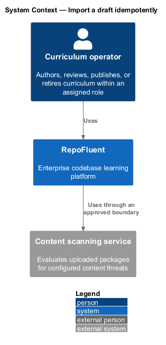
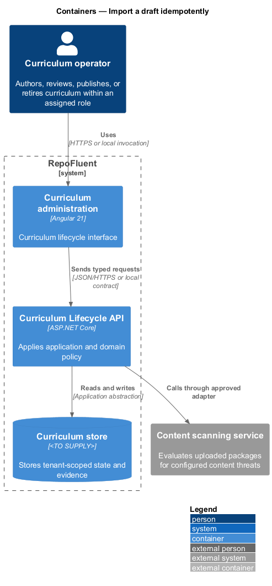
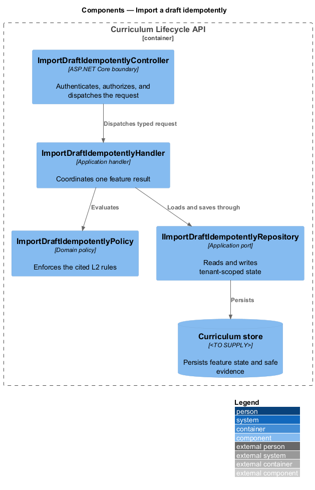
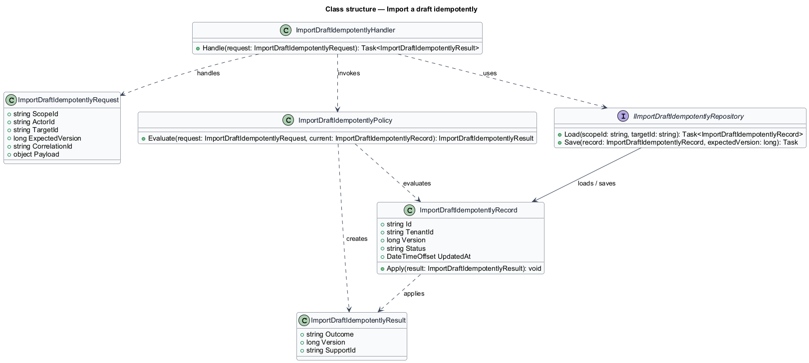
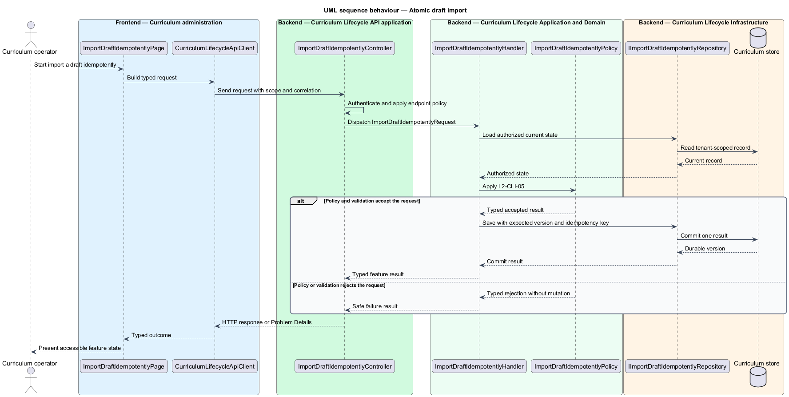
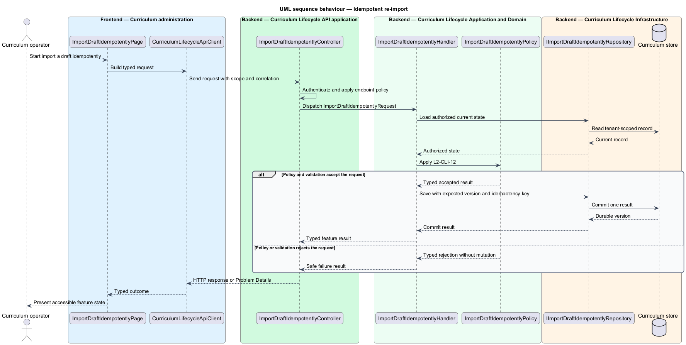

# Import a draft idempotently

## Overview

RepoFluent's Curriculum Lifecycle subsystem moves curriculum packages through intake, validation, draft, review, publication, comparison, and retirement. This feature
brings *atomic draft import*, *idempotent re-import* into one vertical slice. The slice preserves tenant,
actor, version, authorization, and correlation context wherever the cited
requirements apply.

The curriculum operator starts the outcome through Curriculum administration.
Curriculum Lifecycle API applies server-side policy before state is read or changed.
The external dependency and persistent technology remain `<TO SUPPLY>` where
the requirements baseline does not select them.

## Description

The greenfield slice introduces the following building blocks. The endpoint
route, deployment topology, and unresolved provider choices remain `<TO SUPPLY>`.

- **`ImportDraftIdempotentlyPage`** — Angular 21 entry component that presents
  the feature state and submits a typed intent.
- **`CurriculumLifecycleApiClient`** — typed client that carries tenant, actor, version,
  idempotency, and correlation context required by the operation.
- **`ImportDraftIdempotentlyController`** — ASP.NET Core boundary that authenticates
  the caller, applies endpoint policy, and dispatches `ImportDraftIdempotentlyRequest`.
- **`ImportDraftIdempotentlyRequest`** — application request containing scope, actor, target,
  expected version, correlation identifier, and feature payload.
- **`ImportDraftIdempotentlyHandler`** — application handler that loads authorized state,
  invokes `ImportDraftIdempotentlyPolicy`, and commits one result.
- **`ImportDraftIdempotentlyPolicy`** — domain policy that evaluates the cited L2 rules without
  relying on client presentation state.
- **`IImportDraftIdempotentlyRepository`** — application abstraction for tenant-scoped reads,
  writes, optimistic concurrency, and idempotency lookup.
- **`ImportDraftIdempotentlyRecord`** — persisted feature record containing identity, tenant,
  version, status, timestamps, and safe evidence references.

## Requirements

The feature realizes the following level-2 (L2) requirements. Each row cites
the first L1 identifier named by the source requirement as its primary parent.

| L2 ID | Refines (L1) | Requirement |
|-------|--------------|-------------|
| `L2-CLI-05` | `L1-CLI-01` | A package that passes import-blocking checks shall be converted into a draft transactionally. Stable package identifiers shall remain separate from platform tenant identifiers. Failed conversion shall not leave a resolvable partial draft and shall be safe to retry. |
| `L2-CLI-12` | `L1-CLI-09` | Re-upload of identical package identity, version, and checksum should return the existing receipt/draft result within the idempotency window. A reused identity/version with different bytes shall be treated as a conflict requiring a new version or explicit replacement workflow. |

## Diagrams

### System context

The curriculum operator uses RepoFluent to complete the feature outcome.
RepoFluent interacts with Content scanning service only through the boundary
described by the requirements and approved configuration.

### Containers

Curriculum administration sends typed requests to Curriculum Lifecycle API. The API applies
server-owned rules and records the accepted outcome in Curriculum store.

### Components

`ImportDraftIdempotentlyController` dispatches `ImportDraftIdempotentlyRequest` to `ImportDraftIdempotentlyHandler`. The handler
uses `ImportDraftIdempotentlyPolicy` and `IImportDraftIdempotentlyRepository` before it commits a state change.

### Class structure

`ImportDraftIdempotentlyHandler` depends on the request, policy, and repository abstractions.
`IImportDraftIdempotentlyRepository` stores `ImportDraftIdempotentlyRecord` under tenant and version context.

### Behaviour — atomic draft import

The sequence applies `L2-CLI-05` before the handler persists an accepted result. A rejected policy or validation result returns without a state change.

### Behaviour — idempotent re-import

The sequence applies `L2-CLI-12` before the handler persists an accepted result. A rejected policy or validation result returns without a state change.

