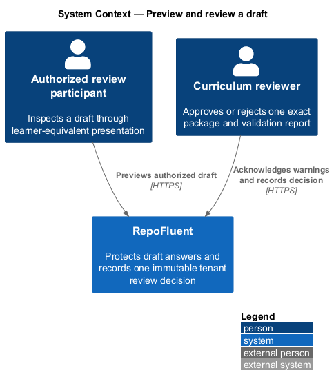
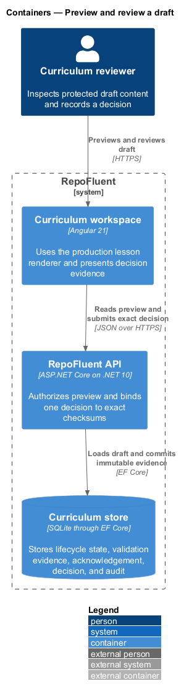
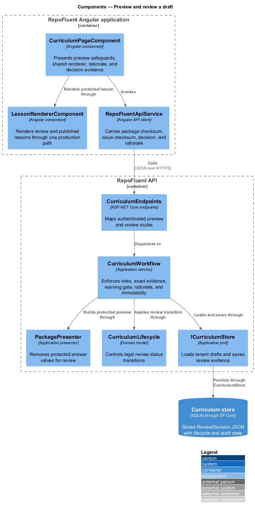
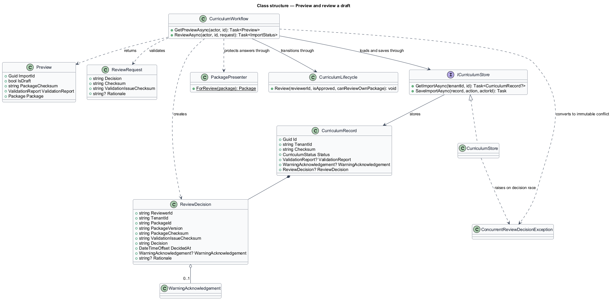
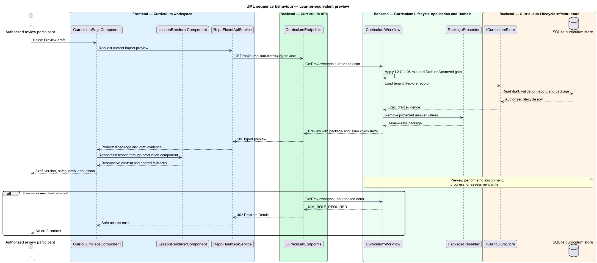

# Preview and review a draft

## Overview

RepoFluent gives authorized authors, reviewers, and administrators a
learner-equivalent draft preview. The preview uses the production lesson
renderer with the same sanitized package presentation used by publication.

The preview identifies the draft version and binds visible evidence to its
package checksum and validation report. Reading a preview performs no
assignment, learner-progress, or assessment-evidence write.

A Reviewer approves or rejects one exact package checksum and validation issue
checksum. The immutable decision stores reviewer, tenant, package identity,
version candidate, decision, time, warning acknowledgement, and rationale.

## Description

The implemented vertical slice contains the following building blocks.

- **`CurriculumDraftReviewPage`** — provides Page Object Model methods for
  preview safeguards, exact approval, immutable evidence, and visual checks.
- **`CurriculumPageComponent`** — presents draft context, the production lesson
  renderer, preview safeguards, rationale input, and stored decision evidence.
- **`RepoFluentApiService`** — sends typed preview, approval, rejection,
  checksum, validation report, and rationale values.
- **`CurriculumEndpoints`** — maps authenticated preview and review-decision
  routes into the lifecycle workflow.
- **`CurriculumWorkflow.GetPreviewAsync`** — authorizes review participants and
  returns the protected package with exact checksum and validation report.
- **`PackagePresenter.ForReview`** — removes protected answer values before the
  shared renderer receives the draft package.
- **`CurriculumWorkflow.ReviewAsync`** — requires Reviewer permission, exact
  checksums, warning acknowledgement, and rejection rationale.
- **`ReviewDecision`** — records the immutable reviewer, tenant, package,
  version, checksums, decision, time, acknowledgement, and rationale.
- **`CurriculumLifecycle.Review`** — permits self-review only when the
  application confirms a separate Reviewer grant.
- **`CurriculumStore`** — stores the decision as JSON with the lifecycle row and
  appends the approval or rejection audit event.
- **`ConcurrentReviewDecisionException`** — converts a decision concurrency
  conflict into the same stable immutable-decision response.
- **`CurriculumPreviewAndReviewTests`** — proves authorization, answer
  protection, no learner assignment, exact binding, rationale, and immutability.

SQLite is the current foundation persistence provider. The production
relational provider remains a deployment decision in the subsystem design.

## Requirements

The feature realizes the following level-2 requirements. Each row cites the L1
parent named by the source requirement.

| L2 ID | Refines (L1) | Requirement |
|-------|--------------|-------------|
| `L2-CLI-06` | `L1-CLI-04` | Preview shall use the same renderer, sanitization, access policy, answer protection, responsive behavior, and fallback behavior as publication, while clearly marking draft/version context. Preview access shall be restricted to authorized review participants and shall not create learner progress or assessment evidence. |
| `L2-CLI-07` | `L1-CLI-05` | An authorized Reviewer shall approve or reject a specific content checksum and validation report. The decision shall capture reviewer, tenant, version candidate, decision, time, warning acknowledgement, and comment/rationale where required. An author shall not self-approve unless separately granted Reviewer permission by policy. |

### Implementation evidence

- `preview-and-review-draft.spec.ts` starts the slice through one Playwright
  acceptance scenario and a dedicated Page Object.
- The draft preview uses `LessonRendererComponent`, labels version `1.0.0`, and
  displays production-renderer, write-suppression, and answer-protection facts.
- `Preview` binds the package checksum and versioned validation report returned
  beside the protected curriculum package.
- Learner access receives `403`, while authorized Author, Reviewer, and
  Administrator contexts can read a valid draft or approved preview.
- Protected answer values serialize as `null`, and preview leaves the learner's
  assignment collection unchanged.
- Approval or rejection requires matching package and issue-set checksums.
  Rejection additionally requires a rationale.
- A warning-bearing package cannot be approved until the exact warning set is
  acknowledged.
- The first accepted decision persists one `ReviewDecision`. A later decision
  returns `CLI_REVIEW_DECISION_IMMUTABLE`.
- The decision JSON column is an EF concurrency token, so simultaneous
  reviewers cannot replace the winning decision.
- Windows and Linux Chromium baselines capture the token-conformant immutable
  decision evidence card.

## Diagrams

### System context

An authorized review participant previews curriculum through RepoFluent. A
Reviewer records one exact decision for the tenant version candidate.

### Containers

The Angular workspace uses the production renderer. The ASP.NET Core API
authorizes access and stores immutable evidence in the SQLite curriculum store.

### Components

The curriculum page calls typed preview and decision methods. The workflow uses
package presentation, lifecycle policy, and the store before returning evidence.

### Class structure

`Preview` carries protected content and exact validation evidence.
`ReviewDecision` captures the immutable decision bound to the lifecycle record.

### Behaviour — learner-equivalent preview

For `L2-CLI-06`, the workflow authorizes the actor, loads a valid draft, removes
protected answers, and returns content without learner-state writes.

### Behaviour — review decision

For `L2-CLI-07`, the workflow checks role, package checksum, validation report,
warning gate, and rationale before storing one decision.

