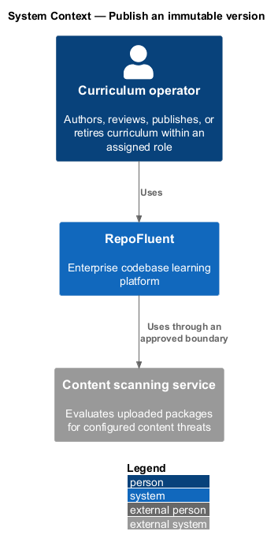
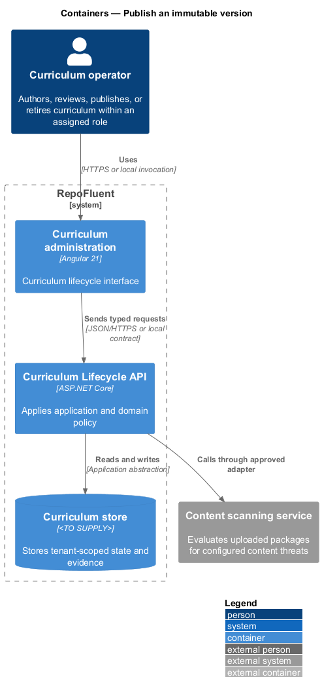
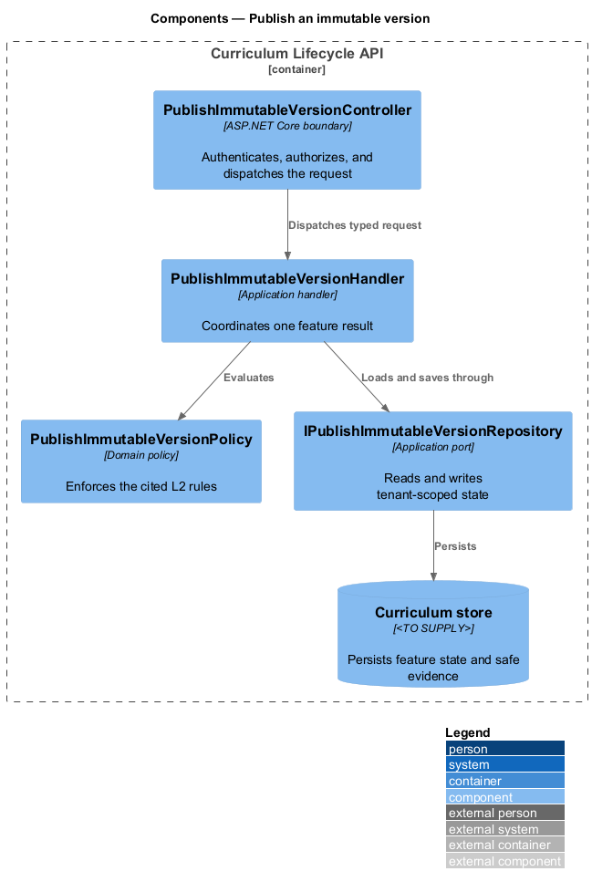
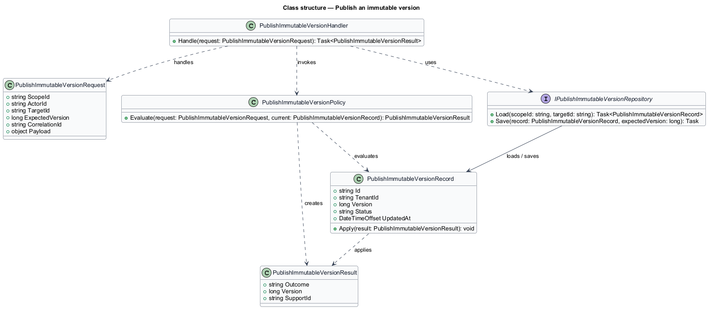
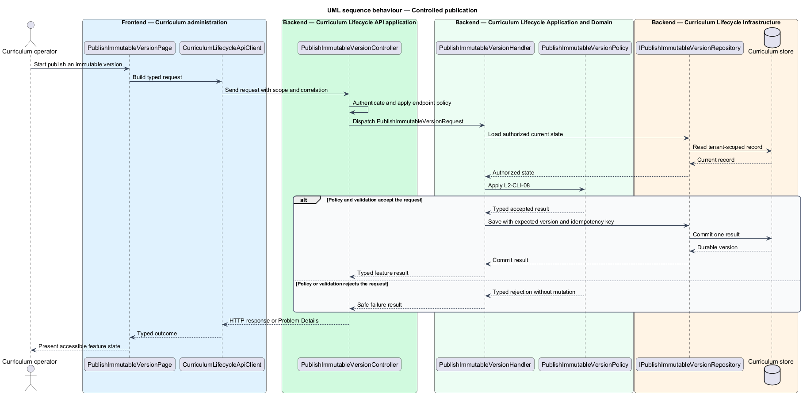
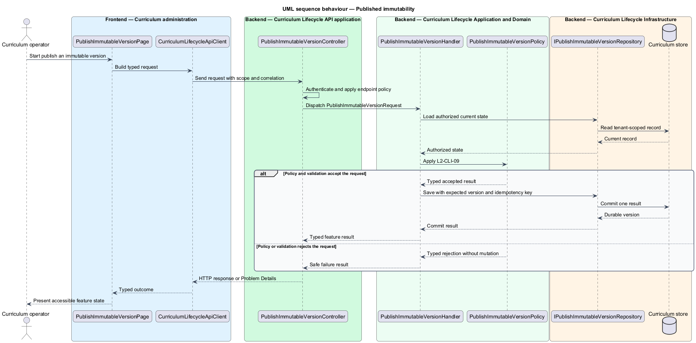

# Publish an immutable version

## Overview

RepoFluent's Curriculum Lifecycle subsystem moves curriculum packages through intake, validation, draft, review, publication, comparison, and retirement. This feature
brings *controlled publication*, *published immutability* into one vertical slice. The slice preserves tenant,
actor, version, authorization, and correlation context wherever the cited
requirements apply.

The curriculum operator starts the outcome through Curriculum administration.
Curriculum Lifecycle API applies server-side policy before state is read or changed.
The external dependency and persistent technology remain `<TO SUPPLY>` where
the requirements baseline does not select them.

## Description

The greenfield slice introduces the following building blocks. The endpoint
route, deployment topology, and unresolved provider choices remain `<TO SUPPLY>`.

- **`PublishImmutableVersionPage`** — Angular 21 entry component that presents
  the feature state and submits a typed intent.
- **`CurriculumLifecycleApiClient`** — typed client that carries tenant, actor, version,
  idempotency, and correlation context required by the operation.
- **`PublishImmutableVersionController`** — ASP.NET Core boundary that authenticates
  the caller, applies endpoint policy, and dispatches `PublishImmutableVersionRequest`.
- **`PublishImmutableVersionRequest`** — application request containing scope, actor, target,
  expected version, correlation identifier, and feature payload.
- **`PublishImmutableVersionHandler`** — application handler that loads authorized state,
  invokes `PublishImmutableVersionPolicy`, and commits one result.
- **`PublishImmutableVersionPolicy`** — domain policy that evaluates the cited L2 rules without
  relying on client presentation state.
- **`IPublishImmutableVersionRepository`** — application abstraction for tenant-scoped reads,
  writes, optimistic concurrency, and idempotency lookup.
- **`PublishImmutableVersionRecord`** — persisted feature record containing identity, tenant,
  version, status, timestamps, and safe evidence references.

## Requirements

The feature realizes the following level-2 (L2) requirements. Each row cites
the first L1 identifier named by the source requirement as its primary parent.

| L2 ID | Refines (L1) | Requirement |
|-------|--------------|-------------|
| `L2-CLI-08` | `L1-CLI-05` | Only an authorized Administrator shall publish an approved, unchanged version. Publication shall atomically assign the immutable published version identity, activate its availability policy, and emit audit and domain events. Duplicate or concurrent publication commands shall converge on one result. |
| `L2-CLI-09` | `L1-CLI-06` | Published content, source snapshot, assessment definitions, and protected answer policies shall be read-only. Corrections shall produce a new draft and published version. Learning progress, attempts, mastery evidence, and audit records shall retain the originating version identifiers. |

## Diagrams

### System context

The curriculum operator uses RepoFluent to complete the feature outcome.
RepoFluent interacts with Content scanning service only through the boundary
described by the requirements and approved configuration.

### Containers

Curriculum administration sends typed requests to Curriculum Lifecycle API. The API applies
server-owned rules and records the accepted outcome in Curriculum store.

### Components

`PublishImmutableVersionController` dispatches `PublishImmutableVersionRequest` to `PublishImmutableVersionHandler`. The handler
uses `PublishImmutableVersionPolicy` and `IPublishImmutableVersionRepository` before it commits a state change.

### Class structure

`PublishImmutableVersionHandler` depends on the request, policy, and repository abstractions.
`IPublishImmutableVersionRepository` stores `PublishImmutableVersionRecord` under tenant and version context.

### Behaviour — controlled publication

The sequence applies `L2-CLI-08` before the handler persists an accepted result. A rejected policy or validation result returns without a state change.

### Behaviour — published immutability

The sequence applies `L2-CLI-09` before the handler persists an accepted result. A rejected policy or validation result returns without a state change.

