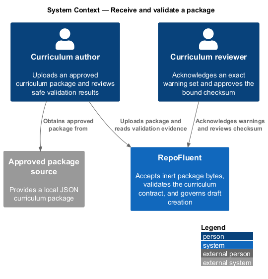
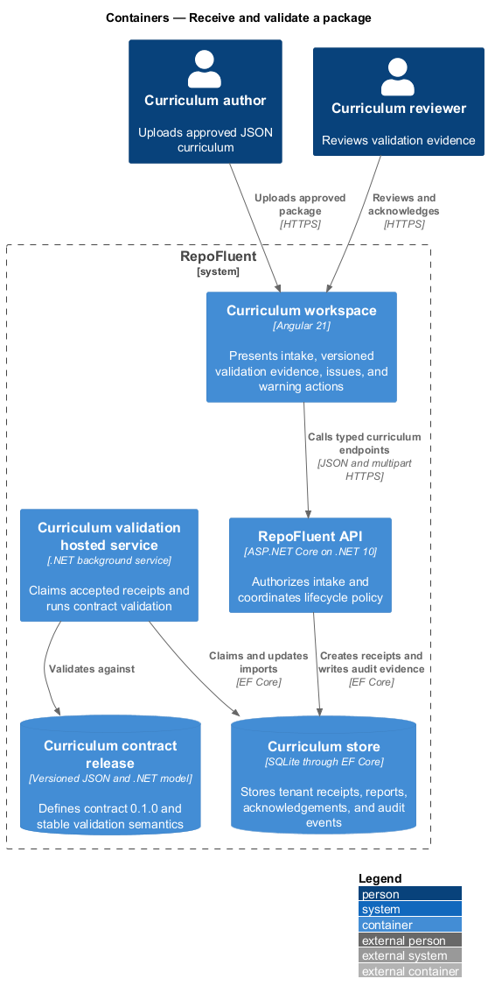
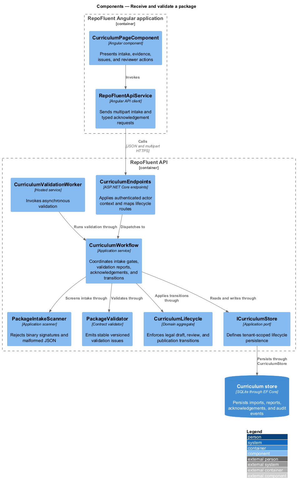
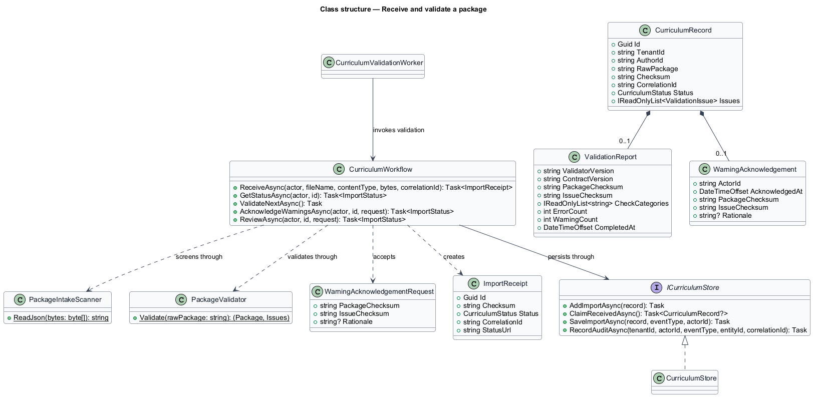
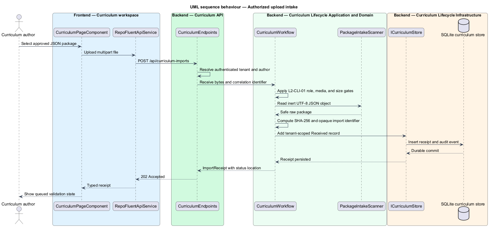
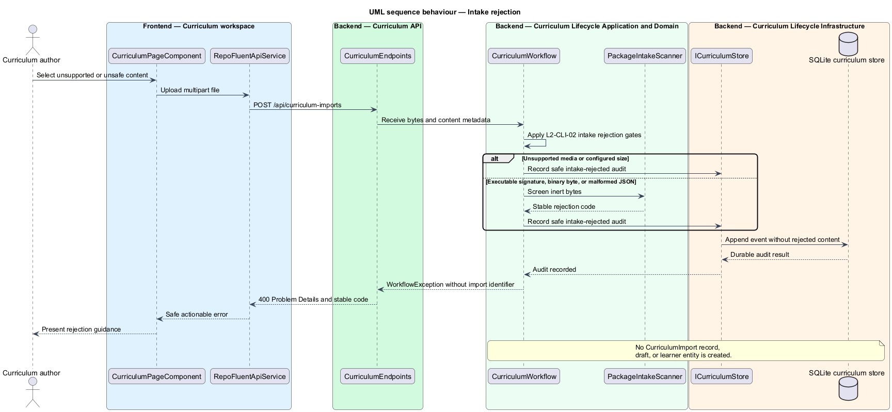
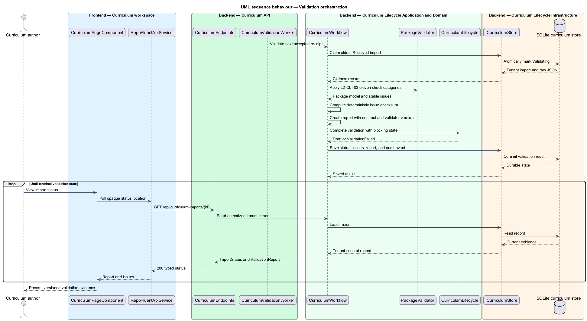
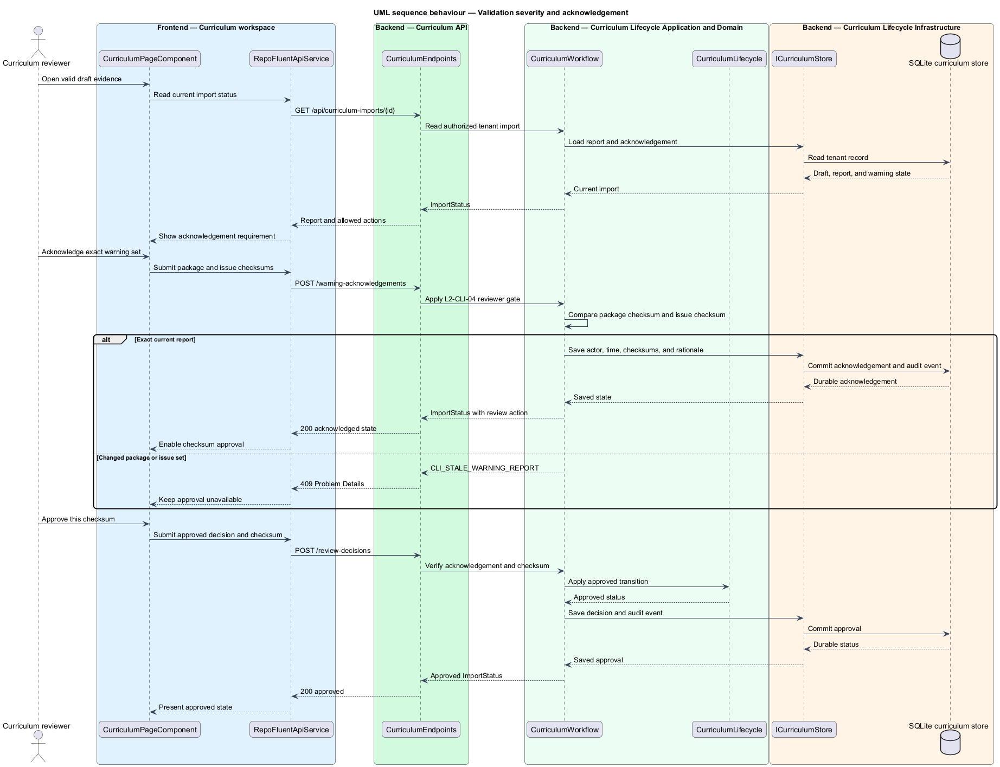

# Receive and validate a package

## Overview

RepoFluent accepts an authorized JSON curriculum package as inert bytes and
returns a tenant-scoped receipt before asynchronous validation. Intake binds an
opaque import identifier, SHA-256 package checksum, actor, correlation
identifier, and initial status.

Unsafe signatures, malformed UTF-8 JSON, unsupported media, empty uploads, and
oversized uploads stop before an import record exists. Each stopped attempt
records safe audit evidence without retaining rejected content.

Validation evaluates eleven contract categories and records contract version,
validator version, package checksum, issue checksum, counts, and completion
time. Blocking issues prevent draft creation. Exact warning sets require
reviewer acknowledgement before approval.

## Description

The implemented vertical slice contains the following building blocks.

- **`CurriculumPageComponent`** — presents upload state, validation evidence,
  issues, warning acknowledgement, and checksum-bound approval actions.
- **`RepoFluentApiService`** — sends multipart uploads, polls import status, and
  submits typed warning acknowledgements.
- **`CurriculumEndpoints`** — exposes authorized intake, status, acknowledgement,
  preview, review, publication, and assignment routes.
- **`CurriculumWorkflow`** — enforces role, media, size, status, checksum, issue
  checksum, and approval gates.
- **`PackageIntakeScanner`** — rejects known binary signatures, null bytes,
  malformed UTF-8, non-object JSON, comments, trailing commas, and excessive
  depth.
- **`PackageValidator`** — applies the versioned curriculum contract and emits
  stable issues with paths, severities, and blocking state.
- **`ValidationReport`** — binds eleven validation categories to contract
  `0.1.0`, validator `0.1.0`, both checksums, issue counts, and completion time.
- **`WarningAcknowledgement`** — records reviewer, time, package checksum, issue
  checksum, and optional rationale.
- **`CurriculumValidationWorker`** — claims received imports and invokes
  asynchronous validation inside the current API host.
- **`CurriculumStore`** — persists receipts, reports, acknowledgements, status
  transitions, and audit events in tenant-scoped SQLite records.
- **`CurriculumValidationPage`** — provides Page Object Model acceptance methods
  for upload, report evidence, acknowledgement, and visual conformance.

The current in-process scanner provides deterministic safety screening. The
high-level design retains a production content-scanning provider as an open
deployment selection.

## Requirements

The feature realizes the following level-2 requirements. Each row cites the L1
parent named by the source requirement.

| L2 ID | Refines (L1) | Requirement |
|-------|--------------|-------------|
| `L2-CLI-01` | `L1-CLI-01` | Only an authorized Author or stronger explicit grant shall initiate upload for a tenant. Intake shall enforce media type and configured byte limits, compute a checksum, scan for malformed/unsafe content, assign an opaque platform identifier, and persist a tenant-scoped receipt before asynchronous processing. |
| `L2-CLI-02` | `L1-CLI-01` | Unsupported types, limit violations, malformed archives, executable payloads, and failed security scans shall be rejected before import. Rejection shall not create learner-visible or partially imported entities and shall provide a safe actionable result to the author. |
| `L2-CLI-03` | `L1-CLI-02` | Validation shall execute the supported contract checks for version, schema, identifiers, references, ordering, content types, source references, provenance, assessment integrity, security restrictions, and configured limits. The validation result shall identify validator and contract versions and package checksum. |
| `L2-CLI-04` | `L1-CLI-03` | Errors shall block draft preview or publication according to the validation stage. Warnings shall require an authorized acknowledgement with actor, time, issue set/checksum, and optional rationale before approval. A changed issue set shall invalidate prior warning acknowledgement. |

### Implementation evidence

- `receive-and-validate-package.spec.ts` starts the slice with Page Object Model
  acceptance for versioned evidence and exact warning acknowledgement.
- The API acceptance test rejects executable-shaped bytes with
  `CLI_UNSAFE_CONTENT` before receipt creation.
- The validation report identifies eleven categories, contract `0.1.0`,
  validator `0.1.0`, package checksum, and issue checksum.
- Approval returns `CLI_WARNING_ACKNOWLEDGEMENT_REQUIRED` until a reviewer
  acknowledges the matching package and issue checksums.
- A stale issue checksum returns `CLI_STALE_WARNING_REPORT`.
- Windows and Linux Chromium baselines capture the complete 400-pixel evidence
  panel with RepoFluent design tokens.

## Diagrams

### System context

Authors upload approved curriculum bytes. Reviewers inspect the versioned
validation evidence and acknowledge an exact warning set before approval.

### Containers

The Angular workspace calls the ASP.NET Core API. The API validates local
contract artifacts and stores receipts, reports, acknowledgements, and audit
events in SQLite.

### Components

The workflow coordinates the intake scanner, contract validator, lifecycle
policy, and tenant-scoped store. The hosted worker processes accepted receipts
asynchronously.

### Class structure

An import record owns its package checksum, issues, validation report, and
optional warning acknowledgement. Both evidence records bind immutable
checksums.

### Behaviour — authorized upload intake

For `L2-CLI-01`, authorized intake persists a tenant receipt before returning
the asynchronous status location.

### Behaviour — intake rejection

For `L2-CLI-02`, unsupported or unsafe content records a safe audit event and
returns Problem Details without creating an import.

### Behaviour — validation orchestration

For `L2-CLI-03`, the hosted worker claims a receipt, executes eleven validation
categories, and persists a versioned report.

### Behaviour — validation severity and acknowledgement

For `L2-CLI-04`, a reviewer acknowledges the exact package and issue checksums
before the approval action becomes available.

