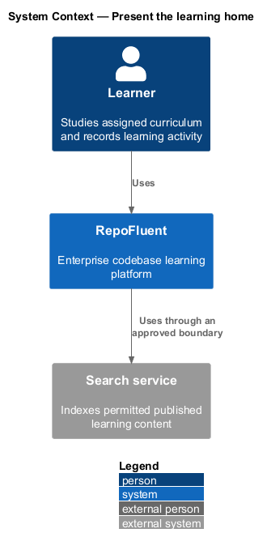
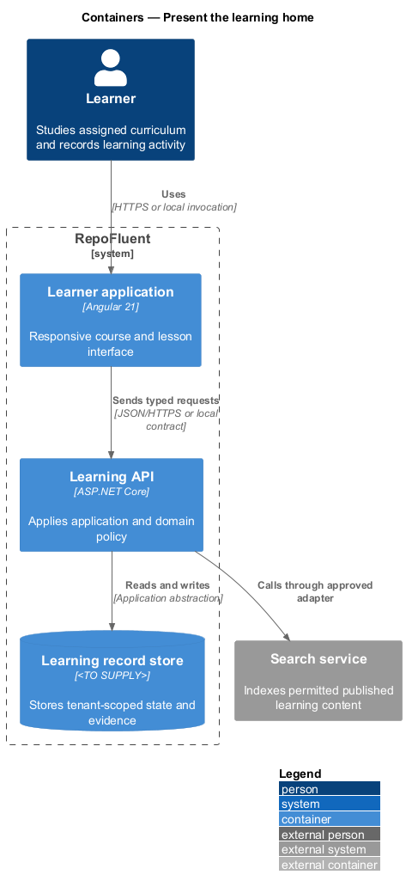
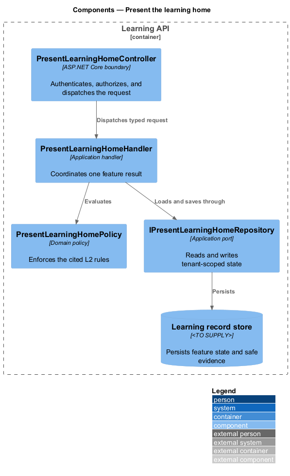
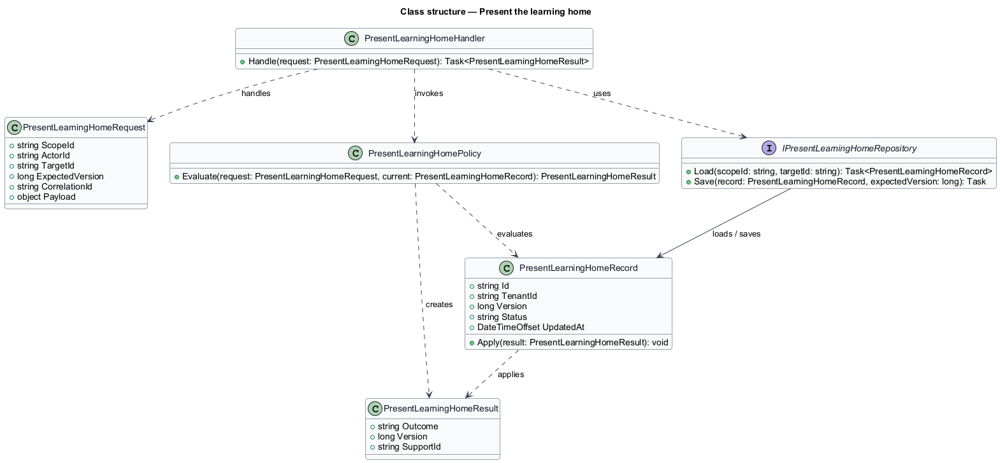
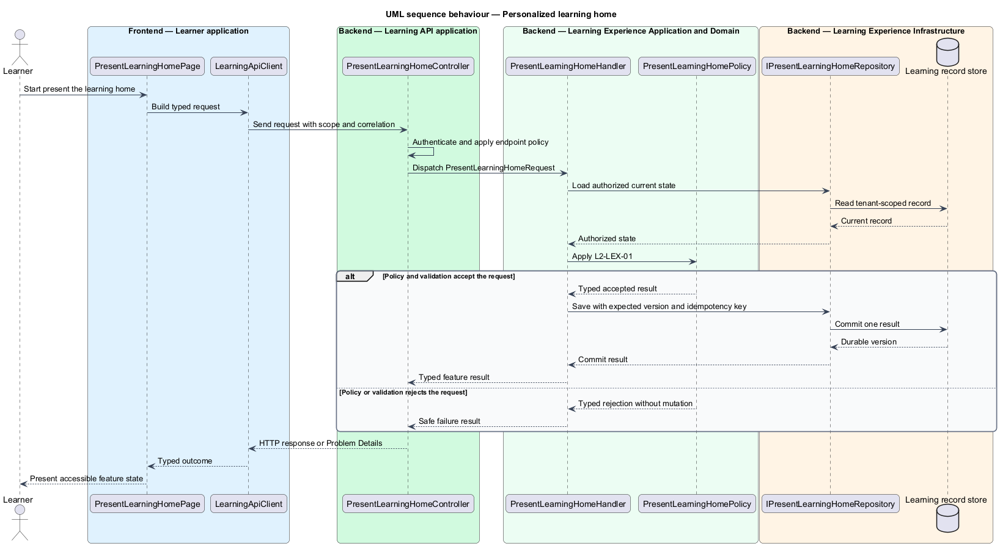
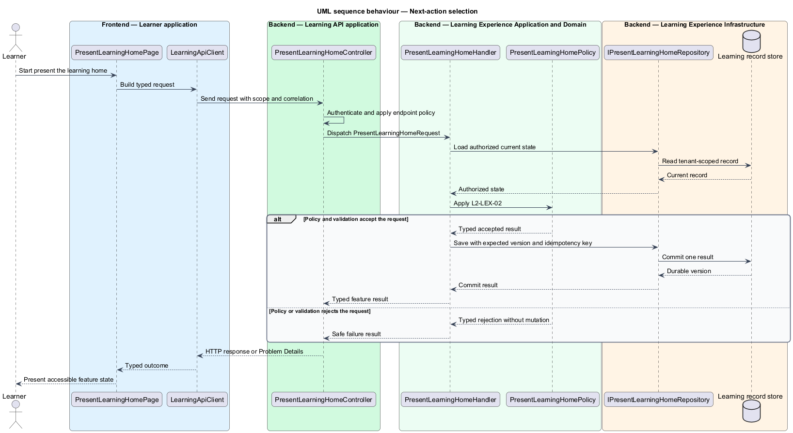

# Present the learning home

## Overview

RepoFluent's Learning Experience subsystem presents assigned curriculum, records durable progress, and preserves learning context. This feature
brings *personalized learning home*, *next-action selection*, *learning-state distinctions* into one vertical slice. The slice preserves tenant,
actor, version, authorization, and correlation context wherever the cited
requirements apply.

The learner starts the outcome through Learner application.
Learning API applies server-side policy before state is read or changed.
The external dependency and persistent technology remain `<TO SUPPLY>` where
the requirements baseline does not select them.

## Description

The greenfield slice introduces the following building blocks. The endpoint
route, deployment topology, and unresolved provider choices remain `<TO SUPPLY>`.

- **`PresentLearningHomePage`** — Angular 21 entry component that presents
  the feature state and submits a typed intent.
- **`LearningApiClient`** — typed client that carries tenant, actor, version,
  idempotency, and correlation context required by the operation.
- **`PresentLearningHomeController`** — ASP.NET Core boundary that authenticates
  the caller, applies endpoint policy, and dispatches `PresentLearningHomeRequest`.
- **`PresentLearningHomeRequest`** — application request containing scope, actor, target,
  expected version, correlation identifier, and feature payload.
- **`PresentLearningHomeHandler`** — application handler that loads authorized state,
  invokes `PresentLearningHomePolicy`, and commits one result.
- **`PresentLearningHomePolicy`** — domain policy that evaluates the cited L2 rules without
  relying on client presentation state.
- **`IPresentLearningHomeRepository`** — application abstraction for tenant-scoped reads,
  writes, optimistic concurrency, and idempotency lookup.
- **`PresentLearningHomeRecord`** — persisted feature record containing identity, tenant,
  version, status, timestamps, and safe evidence references.

## Requirements

The feature realizes the following level-2 (L2) requirements. Each row cites
the first L1 identifier named by the source requirement as its primary parent.

| L2 ID | Refines (L1) | Requirement |
|-------|--------------|-------------|
| `L2-LEX-01` | `L1-LEX-01` | The home view shall show current assignments, required/optional state, not-started/in-progress/completed status, due/overdue state, recent durable activity, and one recommended next action. Data shall be tenant- and learner-scoped and shall exclude drafts or inaccessible versions. |
| `L2-LEX-02` | `L1-LEX-01` | The next-action service shall use documented inputs such as requirement, due date, prerequisite state, progress, assessment outcome, and mastery/recency. The UI shall state why the action is recommended. Missing data shall produce a safe deterministic fallback, not an invented urgency. |
| `L2-LEX-11` | `L1-LEX-08` | Required/optional, completion, pass/fail, numerical result, objective coverage, demonstrated mastery, and stale knowledge shall have separate labels, semantics, and accessible non-color indicators. Completion shall not be presented as mastery, and best score shall not silently replace latest score. |

## Diagrams

### System context

The learner uses RepoFluent to complete the feature outcome.
RepoFluent interacts with Search service only through the boundary
described by the requirements and approved configuration.

### Containers

Learner application sends typed requests to Learning API. The API applies
server-owned rules and records the accepted outcome in Learning record store.

### Components

`PresentLearningHomeController` dispatches `PresentLearningHomeRequest` to `PresentLearningHomeHandler`. The handler
uses `PresentLearningHomePolicy` and `IPresentLearningHomeRepository` before it commits a state change.

### Class structure

`PresentLearningHomeHandler` depends on the request, policy, and repository abstractions.
`IPresentLearningHomeRepository` stores `PresentLearningHomeRecord` under tenant and version context.

### Behaviour — personalized learning home

The sequence applies `L2-LEX-01` before the handler persists an accepted result. A rejected policy or validation result returns without a state change.

### Behaviour — next-action selection

The sequence applies `L2-LEX-02` before the handler persists an accepted result. A rejected policy or validation result returns without a state change.

### Behaviour — learning-state distinctions

The sequence applies `L2-LEX-11` before the handler persists an accepted result. A rejected policy or validation result returns without a state change.

