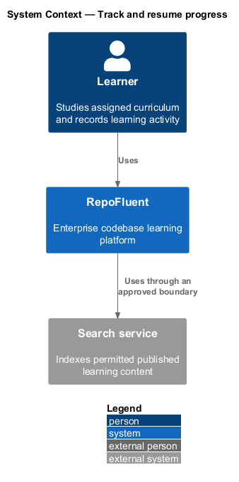
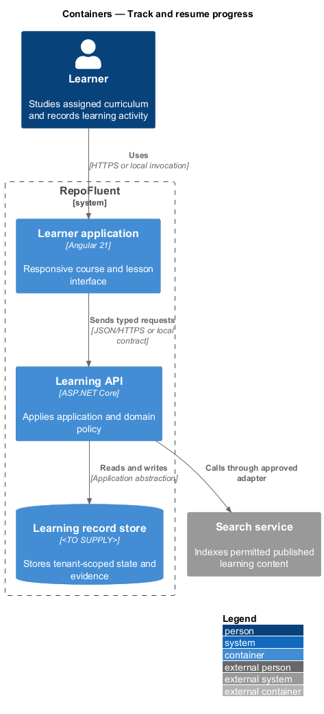
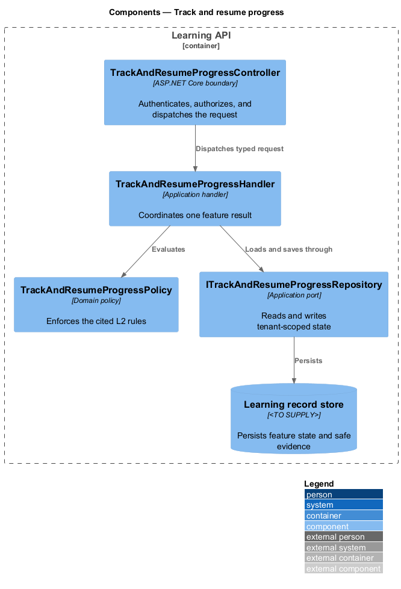
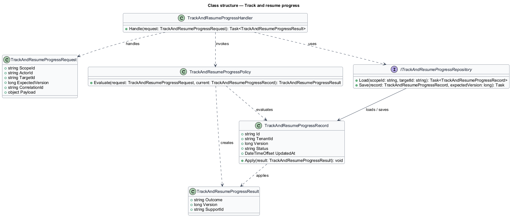
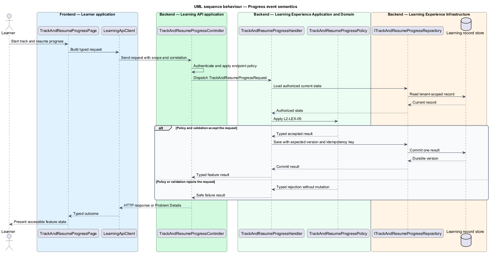
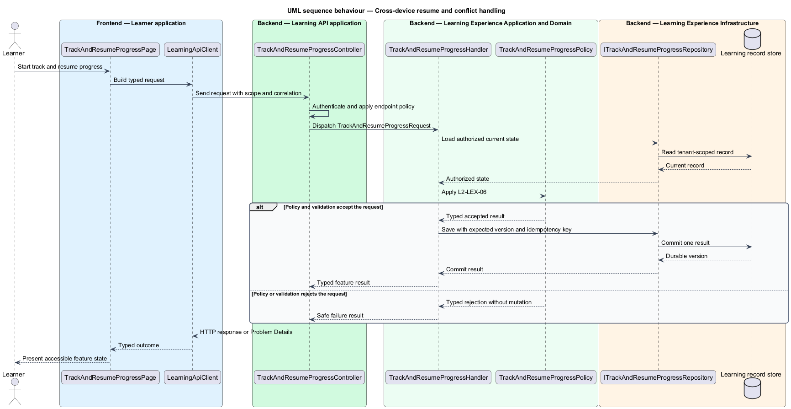

# Track and resume progress

## Overview

RepoFluent's Learning Experience subsystem presents assigned curriculum, records durable progress, and preserves learning context. This feature
brings *progress event semantics*, *cross-device resume and conflict handling* into one vertical slice. The slice preserves tenant,
actor, version, authorization, and correlation context wherever the cited
requirements apply.

The learner starts the outcome through Learner application.
Learning API applies server-side policy before state is read or changed.
The external dependency and persistent technology remain `<TO SUPPLY>` where
the requirements baseline does not select them.

## Description

The greenfield slice introduces the following building blocks. The endpoint
route, deployment topology, and unresolved provider choices remain `<TO SUPPLY>`.

- **`TrackAndResumeProgressPage`** — Angular 21 entry component that presents
  the feature state and submits a typed intent.
- **`LearningApiClient`** — typed client that carries tenant, actor, version,
  idempotency, and correlation context required by the operation.
- **`TrackAndResumeProgressController`** — ASP.NET Core boundary that authenticates
  the caller, applies endpoint policy, and dispatches `TrackAndResumeProgressRequest`.
- **`TrackAndResumeProgressRequest`** — application request containing scope, actor, target,
  expected version, correlation identifier, and feature payload.
- **`TrackAndResumeProgressHandler`** — application handler that loads authorized state,
  invokes `TrackAndResumeProgressPolicy`, and commits one result.
- **`TrackAndResumeProgressPolicy`** — domain policy that evaluates the cited L2 rules without
  relying on client presentation state.
- **`ITrackAndResumeProgressRepository`** — application abstraction for tenant-scoped reads,
  writes, optimistic concurrency, and idempotency lookup.
- **`TrackAndResumeProgressRecord`** — persisted feature record containing identity, tenant,
  version, status, timestamps, and safe evidence references.

## Requirements

The feature realizes the following level-2 (L2) requirements. Each row cites
the first L1 identifier named by the source requirement as its primary parent.

| L2 ID | Refines (L1) | Requirement |
|-------|--------------|-------------|
| `L2-LEX-05` | `L1-LEX-03` | The subsystem shall record meaningful progress events including version, learner, lesson/block position, completion evidence, timestamps, client event identity, and relevant completion-rule inputs. Mere page load or scroll shall not automatically satisfy demonstrated completion unless the published rule explicitly permits it. |
| `L2-LEX-06` | `L1-LEX-03` | Progress writes shall be idempotent and ordered using event identity/version semantics. Resume shall select the latest valid meaningful position without allowing a stale device to erase a newer completed state. A learner shall be able to continue on another supported device after successful synchronization. |

## Diagrams

### System context

The learner uses RepoFluent to complete the feature outcome.
RepoFluent interacts with Search service only through the boundary
described by the requirements and approved configuration.

### Containers

Learner application sends typed requests to Learning API. The API applies
server-owned rules and records the accepted outcome in Learning record store.

### Components

`TrackAndResumeProgressController` dispatches `TrackAndResumeProgressRequest` to `TrackAndResumeProgressHandler`. The handler
uses `TrackAndResumeProgressPolicy` and `ITrackAndResumeProgressRepository` before it commits a state change.

### Class structure

`TrackAndResumeProgressHandler` depends on the request, policy, and repository abstractions.
`ITrackAndResumeProgressRepository` stores `TrackAndResumeProgressRecord` under tenant and version context.

### Behaviour — progress event semantics

The sequence applies `L2-LEX-05` before the handler persists an accepted result. A rejected policy or validation result returns without a state change.

### Behaviour — cross-device resume and conflict handling

The sequence applies `L2-LEX-06` before the handler persists an accepted result. A rejected policy or validation result returns without a state change.

