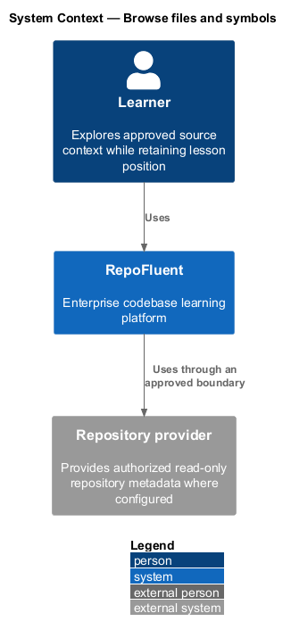
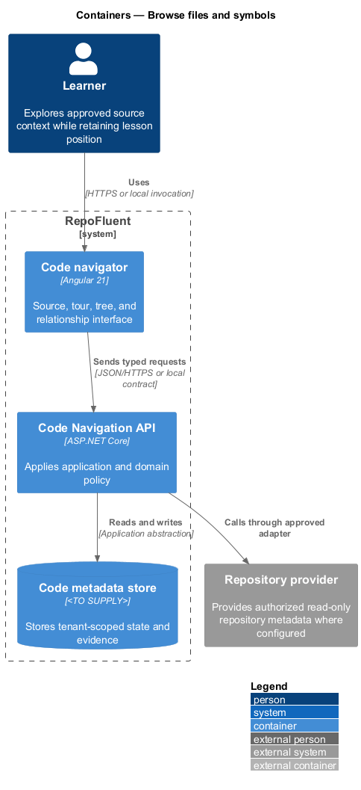
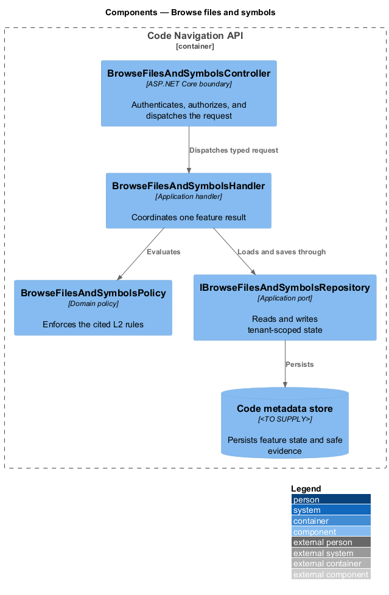
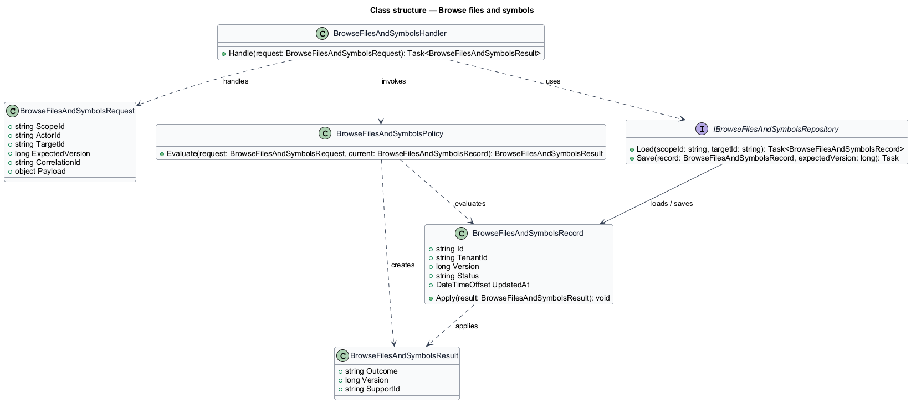
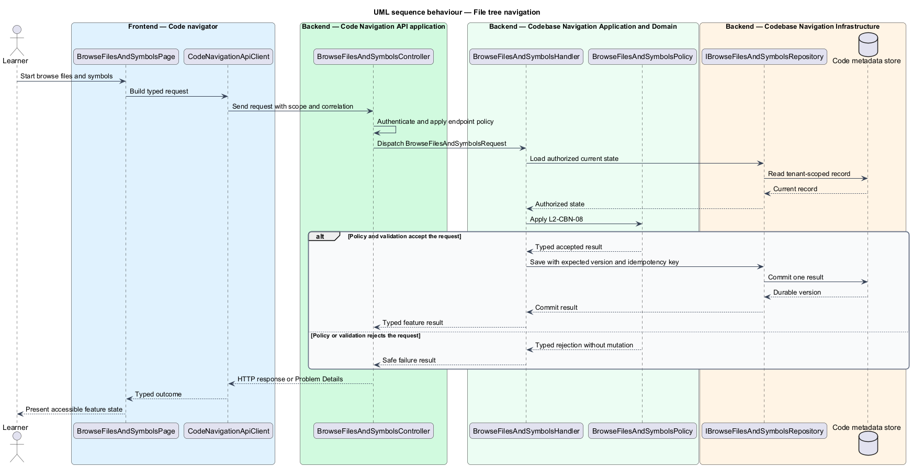
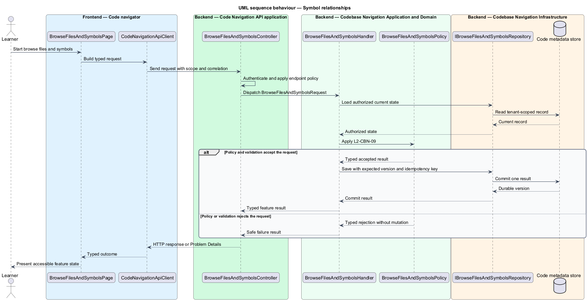

# Browse files and symbols

## Overview

RepoFluent's Codebase Navigation subsystem connects lessons to inert source excerpts, tours, repository metadata, and architecture relationships. This feature
brings *file tree navigation*, *symbol relationships* into one vertical slice. The slice preserves tenant,
actor, version, authorization, and correlation context wherever the cited
requirements apply.

The learner starts the outcome through Code navigator.
Code Navigation API applies server-side policy before state is read or changed.
The external dependency and persistent technology remain `<TO SUPPLY>` where
the requirements baseline does not select them.

## Description

The greenfield slice introduces the following building blocks. The endpoint
route, deployment topology, and unresolved provider choices remain `<TO SUPPLY>`.

- **`BrowseFilesAndSymbolsPage`** — Angular 21 entry component that presents
  the feature state and submits a typed intent.
- **`CodeNavigationApiClient`** — typed client that carries tenant, actor, version,
  idempotency, and correlation context required by the operation.
- **`BrowseFilesAndSymbolsController`** — ASP.NET Core boundary that authenticates
  the caller, applies endpoint policy, and dispatches `BrowseFilesAndSymbolsRequest`.
- **`BrowseFilesAndSymbolsRequest`** — application request containing scope, actor, target,
  expected version, correlation identifier, and feature payload.
- **`BrowseFilesAndSymbolsHandler`** — application handler that loads authorized state,
  invokes `BrowseFilesAndSymbolsPolicy`, and commits one result.
- **`BrowseFilesAndSymbolsPolicy`** — domain policy that evaluates the cited L2 rules without
  relying on client presentation state.
- **`IBrowseFilesAndSymbolsRepository`** — application abstraction for tenant-scoped reads,
  writes, optimistic concurrency, and idempotency lookup.
- **`BrowseFilesAndSymbolsRecord`** — persisted feature record containing identity, tenant,
  version, status, timestamps, and safe evidence references.

## Requirements

The feature realizes the following level-2 (L2) requirements. Each row cites
the first L1 identifier named by the source requirement as its primary parent.

| L2 ID | Refines (L1) | Requirement |
|-------|--------------|-------------|
| `L2-CBN-08` | `L1-CBN-06` | Where imported metadata is present, a file tree should expose permitted repository-relative hierarchy with expandable nodes, file type, and links to known references. It shall progressively load or virtualize large structures and shall exclude undeclared/unclassified paths. |
| `L2-CBN-09` | `L1-CBN-06` | Supplied symbol metadata should support declared symbols, containing file/range, kind, and typed relationships. The interface shall label relationships as supplied snapshot metadata and shall not claim complete static-analysis coverage. |

## Diagrams

### System context

The learner uses RepoFluent to complete the feature outcome.
RepoFluent interacts with Repository provider only through the boundary
described by the requirements and approved configuration.

### Containers

Code navigator sends typed requests to Code Navigation API. The API applies
server-owned rules and records the accepted outcome in Code metadata store.

### Components

`BrowseFilesAndSymbolsController` dispatches `BrowseFilesAndSymbolsRequest` to `BrowseFilesAndSymbolsHandler`. The handler
uses `BrowseFilesAndSymbolsPolicy` and `IBrowseFilesAndSymbolsRepository` before it commits a state change.

### Class structure

`BrowseFilesAndSymbolsHandler` depends on the request, policy, and repository abstractions.
`IBrowseFilesAndSymbolsRepository` stores `BrowseFilesAndSymbolsRecord` under tenant and version context.

### Behaviour — file tree navigation

The sequence applies `L2-CBN-08` before the handler persists an accepted result. A rejected policy or validation result returns without a state change.

### Behaviour — symbol relationships

The sequence applies `L2-CBN-09` before the handler persists an accepted result. A rejected policy or validation result returns without a state change.

