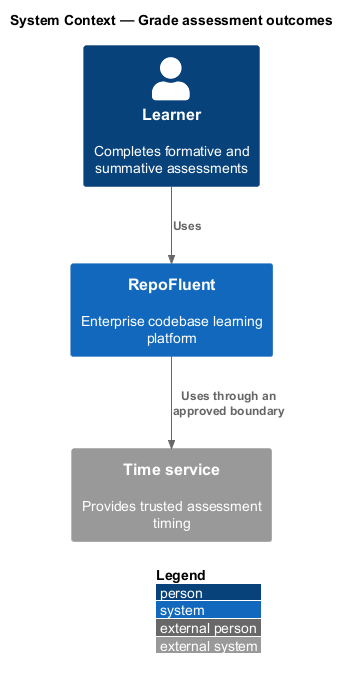
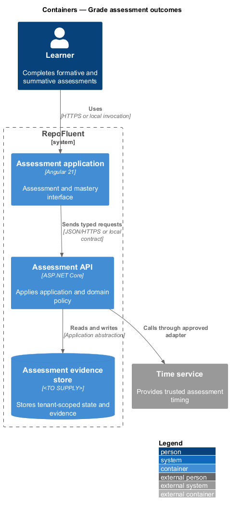
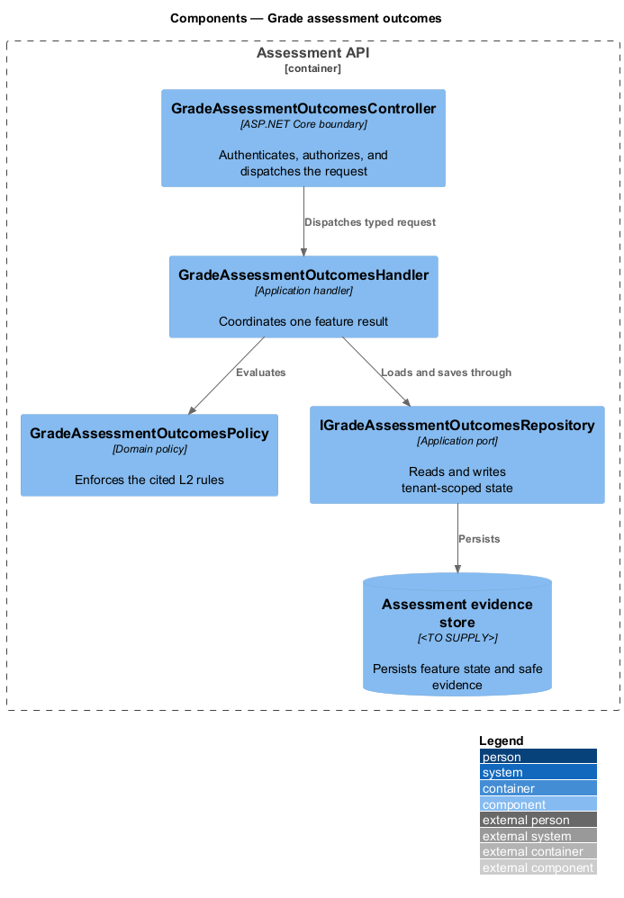
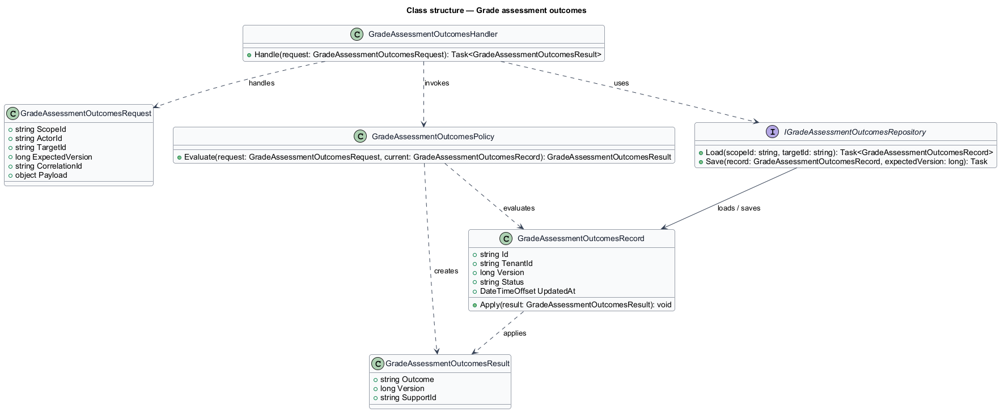
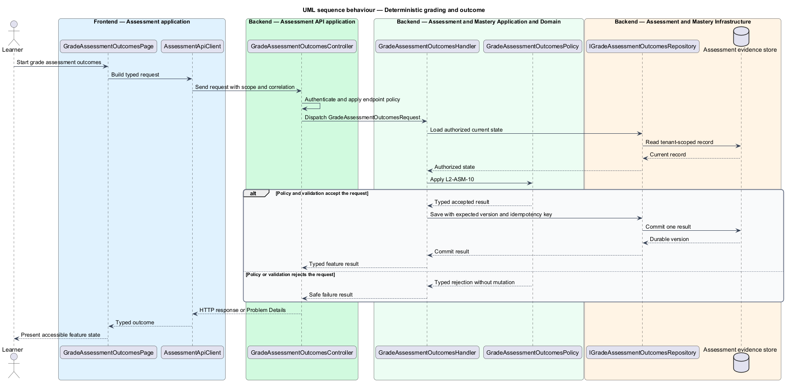
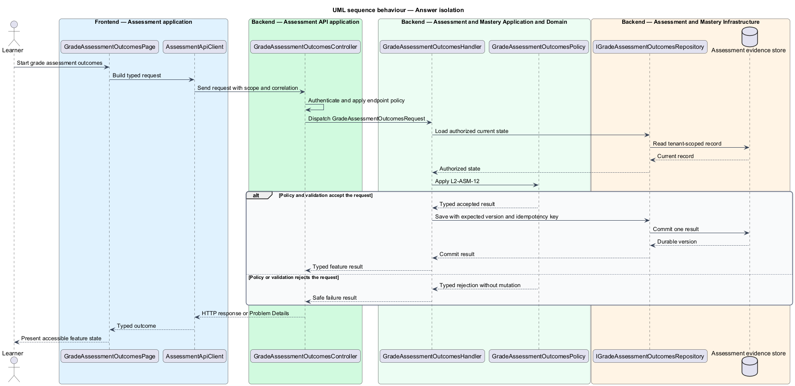

# Grade assessment outcomes

## Overview

RepoFluent's Assessment and Mastery subsystem runs governed assessments, protects answer data, retains attempt evidence, and calculates mastery. This feature
brings *deterministic grading and outcome*, *answer isolation* into one vertical slice. The slice preserves tenant,
actor, version, authorization, and correlation context wherever the cited
requirements apply.

The learner starts the outcome through Assessment application.
Assessment API applies server-side policy before state is read or changed.
The external dependency and persistent technology remain `<TO SUPPLY>` where
the requirements baseline does not select them.

## Description

The greenfield slice introduces the following building blocks. The endpoint
route, deployment topology, and unresolved provider choices remain `<TO SUPPLY>`.

- **`GradeAssessmentOutcomesPage`** — Angular 21 entry component that presents
  the feature state and submits a typed intent.
- **`AssessmentApiClient`** — typed client that carries tenant, actor, version,
  idempotency, and correlation context required by the operation.
- **`GradeAssessmentOutcomesController`** — ASP.NET Core boundary that authenticates
  the caller, applies endpoint policy, and dispatches `GradeAssessmentOutcomesRequest`.
- **`GradeAssessmentOutcomesRequest`** — application request containing scope, actor, target,
  expected version, correlation identifier, and feature payload.
- **`GradeAssessmentOutcomesHandler`** — application handler that loads authorized state,
  invokes `GradeAssessmentOutcomesPolicy`, and commits one result.
- **`GradeAssessmentOutcomesPolicy`** — domain policy that evaluates the cited L2 rules without
  relying on client presentation state.
- **`IGradeAssessmentOutcomesRepository`** — application abstraction for tenant-scoped reads,
  writes, optimistic concurrency, and idempotency lookup.
- **`GradeAssessmentOutcomesRecord`** — persisted feature record containing identity, tenant,
  version, status, timestamps, and safe evidence references.

## Requirements

The feature realizes the following level-2 (L2) requirements. Each row cites
the first L1 identifier named by the source requirement as its primary parent.

| L2 ID | Refines (L1) | Requirement |
|-------|--------------|-------------|
| `L2-ASM-10` | `L1-ASM-01` | Grading shall use stored item versions, points/partial-credit definitions, threshold and grading-policy version. The attempt result shall record raw/possible points, percentage or declared scale, pass/fail if applicable, per-objective contribution, grading time, and algorithm/policy version. |
| `L2-ASM-12` | `L1-ASM-06` | Protected answer keys, scoring matchers, unreleased rationales, and protected pool content shall be logically separated from learner delivery models, caches, client bundles, search indexes, logs, and pre-release APIs. Reviewer access shall be explicit and audited. |

## Diagrams

### System context

The learner uses RepoFluent to complete the feature outcome.
RepoFluent interacts with Time service only through the boundary
described by the requirements and approved configuration.

### Containers

Assessment application sends typed requests to Assessment API. The API applies
server-owned rules and records the accepted outcome in Assessment evidence store.

### Components

`GradeAssessmentOutcomesController` dispatches `GradeAssessmentOutcomesRequest` to `GradeAssessmentOutcomesHandler`. The handler
uses `GradeAssessmentOutcomesPolicy` and `IGradeAssessmentOutcomesRepository` before it commits a state change.

### Class structure

`GradeAssessmentOutcomesHandler` depends on the request, policy, and repository abstractions.
`IGradeAssessmentOutcomesRepository` stores `GradeAssessmentOutcomesRecord` under tenant and version context.

### Behaviour — deterministic grading and outcome

The sequence applies `L2-ASM-10` before the handler persists an accepted result. A rejected policy or validation result returns without a state change.

### Behaviour — answer isolation

The sequence applies `L2-ASM-12` before the handler persists an accepted result. A rejected policy or validation result returns without a state change.

