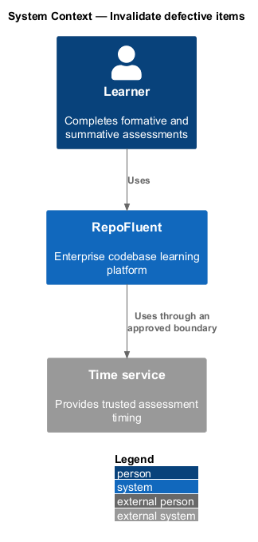
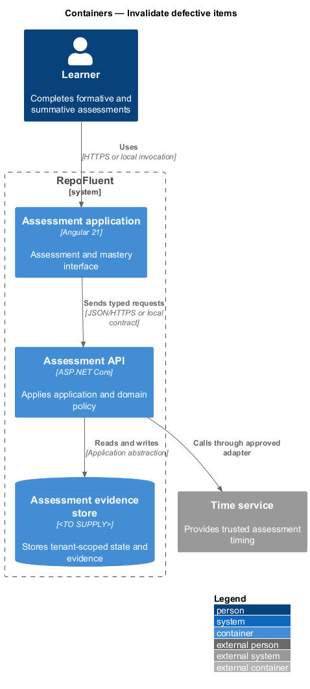
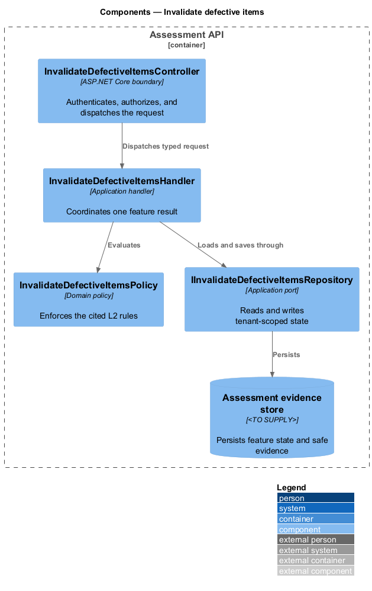
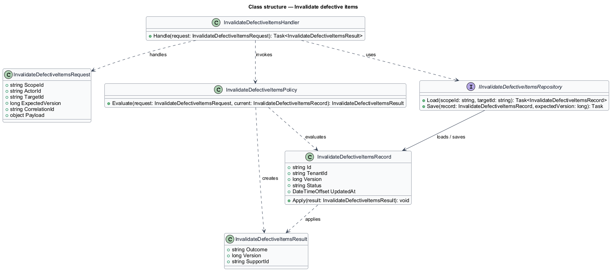
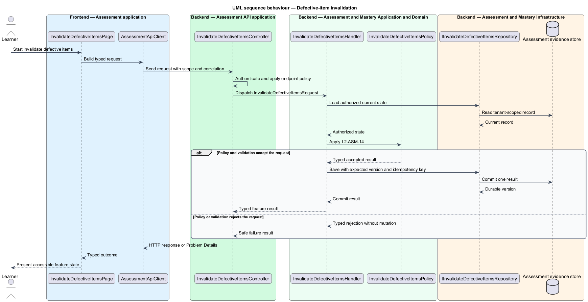

# Invalidate defective items

## Overview

RepoFluent's Assessment and Mastery subsystem runs governed assessments, protects answer data, retains attempt evidence, and calculates mastery. This feature
brings *defective-item invalidation* into one vertical slice. The slice preserves tenant,
actor, version, authorization, and correlation context wherever the cited
requirements apply.

The learner starts the outcome through Assessment application.
Assessment API applies server-side policy before state is read or changed.
The external dependency and persistent technology remain `<TO SUPPLY>` where
the requirements baseline does not select them.

## Description

The greenfield slice introduces the following building blocks. The endpoint
route, deployment topology, and unresolved provider choices remain `<TO SUPPLY>`.

- **`InvalidateDefectiveItemsPage`** — Angular 21 entry component that presents
  the feature state and submits a typed intent.
- **`AssessmentApiClient`** — typed client that carries tenant, actor, version,
  idempotency, and correlation context required by the operation.
- **`InvalidateDefectiveItemsController`** — ASP.NET Core boundary that authenticates
  the caller, applies endpoint policy, and dispatches `InvalidateDefectiveItemsRequest`.
- **`InvalidateDefectiveItemsRequest`** — application request containing scope, actor, target,
  expected version, correlation identifier, and feature payload.
- **`InvalidateDefectiveItemsHandler`** — application handler that loads authorized state,
  invokes `InvalidateDefectiveItemsPolicy`, and commits one result.
- **`InvalidateDefectiveItemsPolicy`** — domain policy that evaluates the cited L2 rules without
  relying on client presentation state.
- **`IInvalidateDefectiveItemsRepository`** — application abstraction for tenant-scoped reads,
  writes, optimistic concurrency, and idempotency lookup.
- **`InvalidateDefectiveItemsRecord`** — persisted feature record containing identity, tenant,
  version, status, timestamps, and safe evidence references.

## Requirements

The feature realizes the following level-2 (L2) requirements. Each row cites
the first L1 identifier named by the source requirement as its primary parent.

| L2 ID | Refines (L1) | Requirement |
|-------|--------------|-------------|
| `L2-ASM-14` | `L1-ASM-08` | An authorized Reviewer should invalidate a specific item version with reason and effective scope. Recalculation shall exclude or reweight it under a documented policy, create new result/mastery versions, notify affected consumers as configured, and preserve original evidence. |

## Diagrams

### System context

The learner uses RepoFluent to complete the feature outcome.
RepoFluent interacts with Time service only through the boundary
described by the requirements and approved configuration.

### Containers

Assessment application sends typed requests to Assessment API. The API applies
server-owned rules and records the accepted outcome in Assessment evidence store.

### Components

`InvalidateDefectiveItemsController` dispatches `InvalidateDefectiveItemsRequest` to `InvalidateDefectiveItemsHandler`. The handler
uses `InvalidateDefectiveItemsPolicy` and `IInvalidateDefectiveItemsRepository` before it commits a state change.

### Class structure

`InvalidateDefectiveItemsHandler` depends on the request, policy, and repository abstractions.
`IInvalidateDefectiveItemsRepository` stores `InvalidateDefectiveItemsRecord` under tenant and version context.

### Behaviour — defective-item invalidation

The sequence applies `L2-ASM-14` before the handler persists an accepted result. A rejected policy or validation result returns without a state change.

