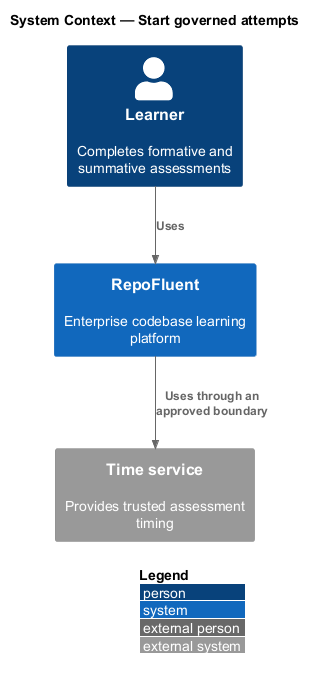
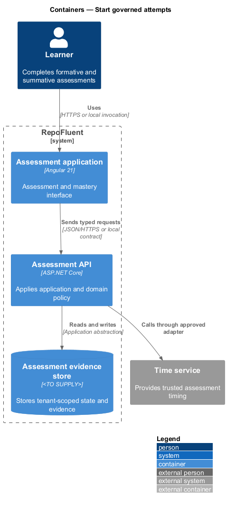
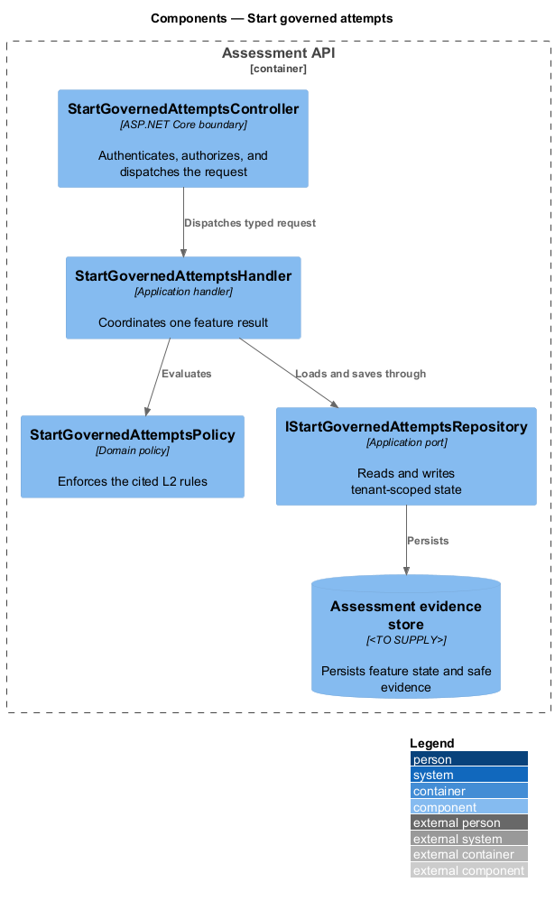
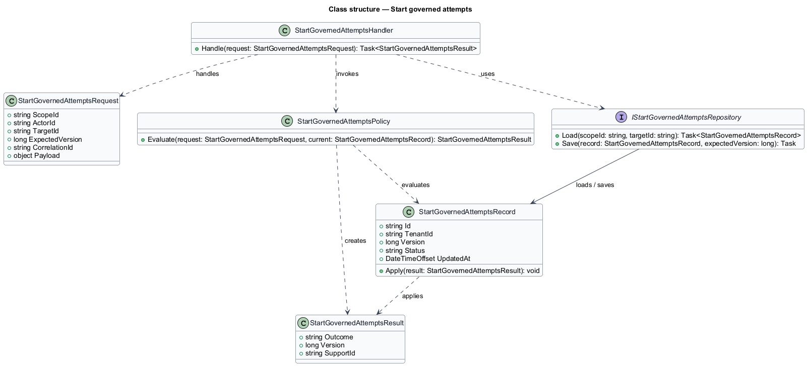
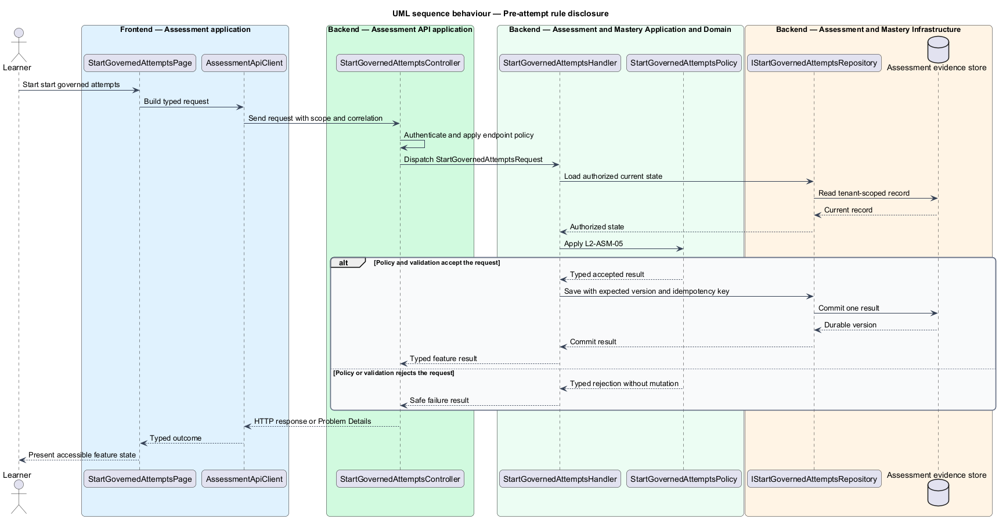

# Start governed attempts

## Overview

RepoFluent's Assessment and Mastery subsystem runs governed assessments, protects answer data, retains attempt evidence, and calculates mastery. This feature
brings *pre-attempt rule disclosure*, *eligibility and attempt start*, *question-pool selection*, *time-limit enforcement* into one vertical slice. The slice preserves tenant,
actor, version, authorization, and correlation context wherever the cited
requirements apply.

The learner starts the outcome through Assessment application.
Assessment API applies server-side policy before state is read or changed.
The external dependency and persistent technology remain `<TO SUPPLY>` where
the requirements baseline does not select them.

## Description

The greenfield slice introduces the following building blocks. The endpoint
route, deployment topology, and unresolved provider choices remain `<TO SUPPLY>`.

- **`StartGovernedAttemptsPage`** — Angular 21 entry component that presents
  the feature state and submits a typed intent.
- **`AssessmentApiClient`** — typed client that carries tenant, actor, version,
  idempotency, and correlation context required by the operation.
- **`StartGovernedAttemptsController`** — ASP.NET Core boundary that authenticates
  the caller, applies endpoint policy, and dispatches `StartGovernedAttemptsRequest`.
- **`StartGovernedAttemptsRequest`** — application request containing scope, actor, target,
  expected version, correlation identifier, and feature payload.
- **`StartGovernedAttemptsHandler`** — application handler that loads authorized state,
  invokes `StartGovernedAttemptsPolicy`, and commits one result.
- **`StartGovernedAttemptsPolicy`** — domain policy that evaluates the cited L2 rules without
  relying on client presentation state.
- **`IStartGovernedAttemptsRepository`** — application abstraction for tenant-scoped reads,
  writes, optimistic concurrency, and idempotency lookup.
- **`StartGovernedAttemptsRecord`** — persisted feature record containing identity, tenant,
  version, status, timestamps, and safe evidence references.

## Requirements

The feature realizes the following level-2 (L2) requirements. Each row cites
the first L1 identifier named by the source requirement as its primary parent.

| L2 ID | Refines (L1) | Requirement |
|-------|--------------|-------------|
| `L2-ASM-05` | `L1-ASM-07` | Before starting, the learner shall see assessment purpose, formative/summative type, item or pool count, selection behavior disclosure where appropriate, passing/completion rule, total points, attempt limit/remaining attempts, time limit, save/submission behavior, and feedback-release policy. |
| `L2-ASM-06` | `L1-ASM-03` | The server shall verify assignment/access, curriculum version, prerequisite/completion eligibility, attempt availability, and active-attempt state before atomically creating an attempt. Repeat start requests with the same idempotency key shall return the same attempt. |
| `L2-ASM-07` | `L1-ASM-03` | Selection shall honor pool filters, requested counts, objective/coverage constraints, exclusions, and configured deterministic seed or approved randomization. The selected immutable item versions and their order shall be stored at attempt start so retries cannot change an active test. |
| `L2-ASM-08` | `L1-ASM-03` | The server shall establish authoritative start/deadline times, account for documented accommodations, display remaining time accessibly, warn at configured thresholds, and accept/reject/auto-submit at expiry according to policy. Client clock manipulation shall not extend an attempt. |

## Diagrams

### System context

The learner uses RepoFluent to complete the feature outcome.
RepoFluent interacts with Time service only through the boundary
described by the requirements and approved configuration.

### Containers

Assessment application sends typed requests to Assessment API. The API applies
server-owned rules and records the accepted outcome in Assessment evidence store.

### Components

`StartGovernedAttemptsController` dispatches `StartGovernedAttemptsRequest` to `StartGovernedAttemptsHandler`. The handler
uses `StartGovernedAttemptsPolicy` and `IStartGovernedAttemptsRepository` before it commits a state change.

### Class structure

`StartGovernedAttemptsHandler` depends on the request, policy, and repository abstractions.
`IStartGovernedAttemptsRepository` stores `StartGovernedAttemptsRecord` under tenant and version context.

### Behaviour — pre-attempt rule disclosure

The sequence applies `L2-ASM-05` before the handler persists an accepted result. A rejected policy or validation result returns without a state change.

### Behaviour — eligibility and attempt start

The sequence applies `L2-ASM-06` before the handler persists an accepted result. A rejected policy or validation result returns without a state change.

### Behaviour — question-pool selection

The sequence applies `L2-ASM-07` before the handler persists an accepted result. A rejected policy or validation result returns without a state change.

### Behaviour — time-limit enforcement

The sequence applies `L2-ASM-08` before the handler persists an accepted result. A rejected policy or validation result returns without a state change.

