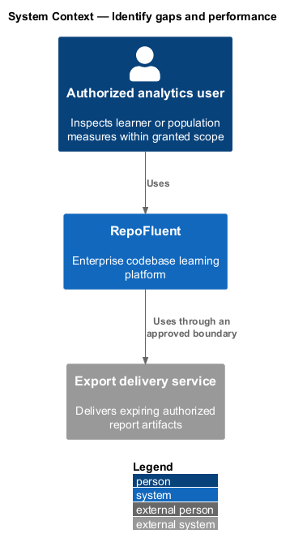
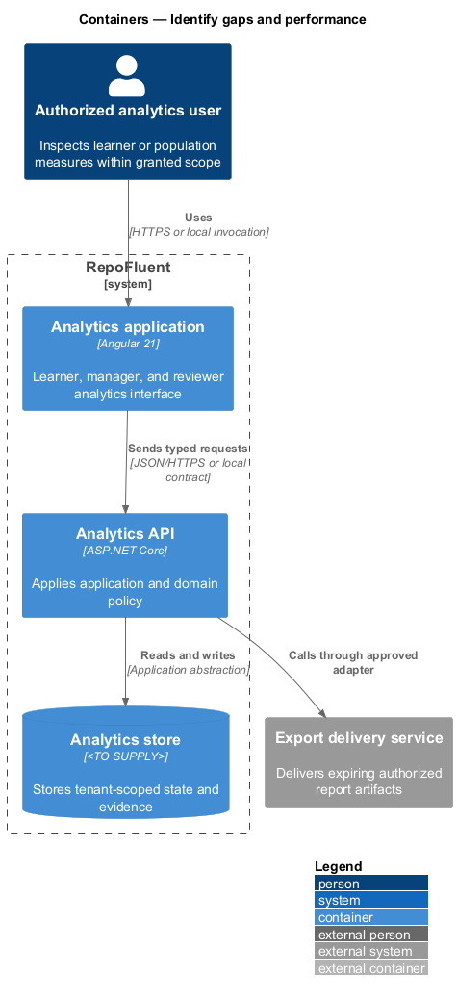
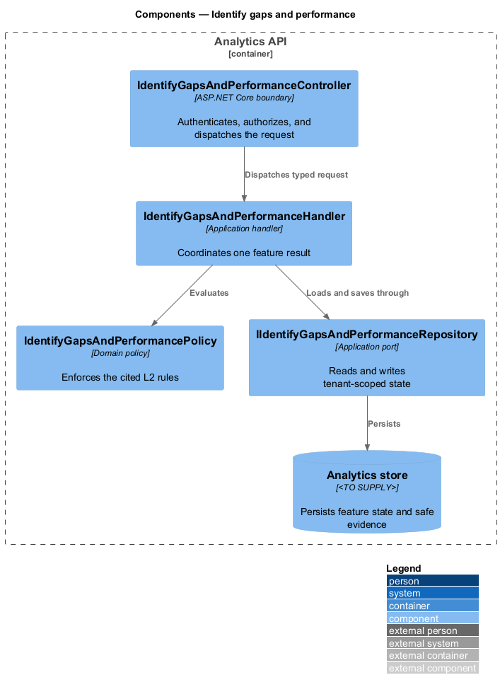
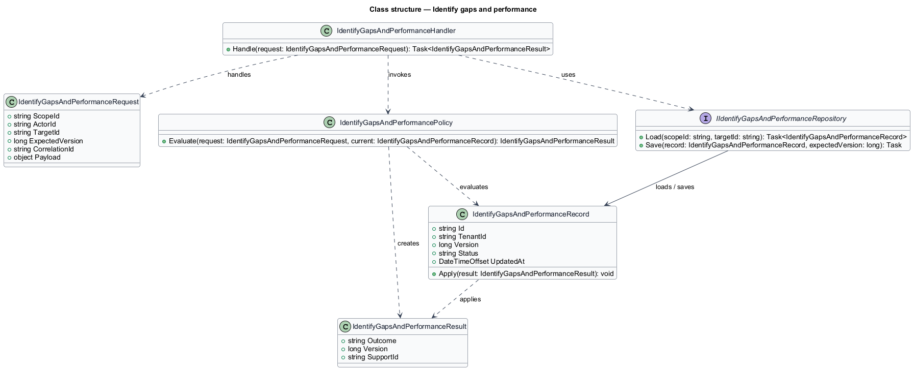
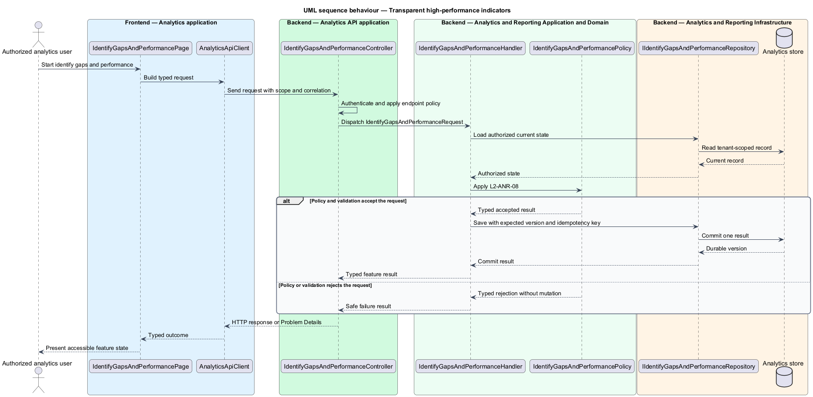

# Identify gaps and performance

## Overview

RepoFluent's Analytics and Reporting subsystem turns versioned learning evidence into authorized, privacy-safe measures and reports. This feature
brings *knowledge-gap identification*, *transparent high-performance indicators* into one vertical slice. The slice preserves tenant,
actor, version, authorization, and correlation context wherever the cited
requirements apply.

The authorized analytics user starts the outcome through Analytics application.
Analytics API applies server-side policy before state is read or changed.
The external dependency and persistent technology remain `<TO SUPPLY>` where
the requirements baseline does not select them.

## Description

The greenfield slice introduces the following building blocks. The endpoint
route, deployment topology, and unresolved provider choices remain `<TO SUPPLY>`.

- **`IdentifyGapsAndPerformancePage`** — Angular 21 entry component that presents
  the feature state and submits a typed intent.
- **`AnalyticsApiClient`** — typed client that carries tenant, actor, version,
  idempotency, and correlation context required by the operation.
- **`IdentifyGapsAndPerformanceController`** — ASP.NET Core boundary that authenticates
  the caller, applies endpoint policy, and dispatches `IdentifyGapsAndPerformanceRequest`.
- **`IdentifyGapsAndPerformanceRequest`** — application request containing scope, actor, target,
  expected version, correlation identifier, and feature payload.
- **`IdentifyGapsAndPerformanceHandler`** — application handler that loads authorized state,
  invokes `IdentifyGapsAndPerformancePolicy`, and commits one result.
- **`IdentifyGapsAndPerformancePolicy`** — domain policy that evaluates the cited L2 rules without
  relying on client presentation state.
- **`IIdentifyGapsAndPerformanceRepository`** — application abstraction for tenant-scoped reads,
  writes, optimistic concurrency, and idempotency lookup.
- **`IdentifyGapsAndPerformanceRecord`** — persisted feature record containing identity, tenant,
  version, status, timestamps, and safe evidence references.

## Requirements

The feature realizes the following level-2 (L2) requirements. Each row cites
the first L1 identifier named by the source requirement as its primary parent.

| L2 ID | Refines (L1) | Requirement |
|-------|--------------|-------------|
| `L2-ANR-07` | `L1-ANR-02` | Knowledge gaps shall be derived from documented evidence such as low/insufficient objective mastery, repeated errors, low coverage, and staleness. A gap shall name the objective/system, population, evidence count, time window, and confidence/limitations and shall link to permitted remediation. |
| `L2-ANR-08` | `L1-ANR-05` | If enabled by tenant policy, authorized users may identify learners who meet explicitly selected indicators such as required completion, objective coverage, assessment thresholds, mastery recency, or improvement. The interface shall show criteria, time window, evidence, and limitations and shall avoid a hidden ordinal leaderboard. |

## Diagrams

### System context

The authorized analytics user uses RepoFluent to complete the feature outcome.
RepoFluent interacts with Export delivery service only through the boundary
described by the requirements and approved configuration.

### Containers

Analytics application sends typed requests to Analytics API. The API applies
server-owned rules and records the accepted outcome in Analytics store.

### Components

`IdentifyGapsAndPerformanceController` dispatches `IdentifyGapsAndPerformanceRequest` to `IdentifyGapsAndPerformanceHandler`. The handler
uses `IdentifyGapsAndPerformancePolicy` and `IIdentifyGapsAndPerformanceRepository` before it commits a state change.

### Class structure

`IdentifyGapsAndPerformanceHandler` depends on the request, policy, and repository abstractions.
`IIdentifyGapsAndPerformanceRepository` stores `IdentifyGapsAndPerformanceRecord` under tenant and version context.

### Behaviour — knowledge-gap identification

The sequence applies `L2-ANR-07` before the handler persists an accepted result. A rejected policy or validation result returns without a state change.

### Behaviour — transparent high-performance indicators

The sequence applies `L2-ANR-08` before the handler persists an accepted result. A rejected policy or validation result returns without a state change.

