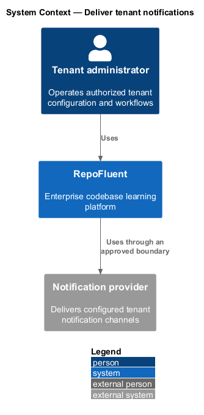
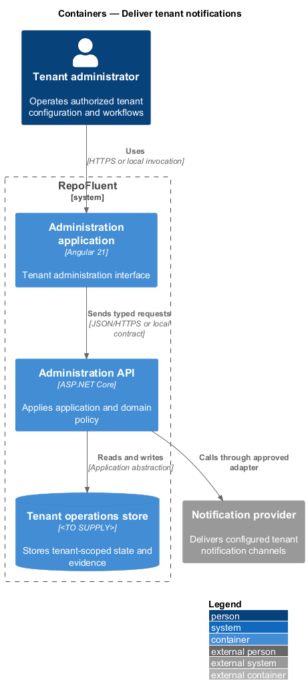
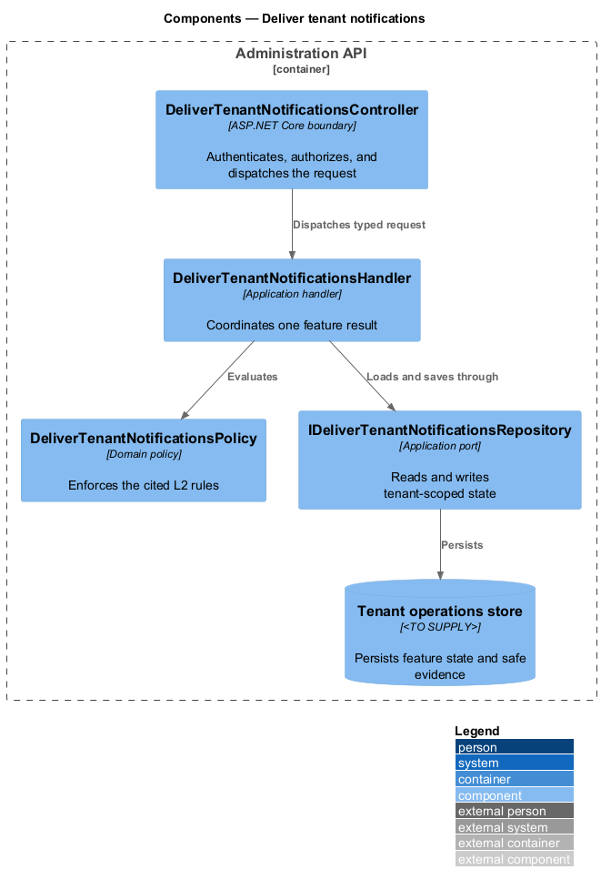
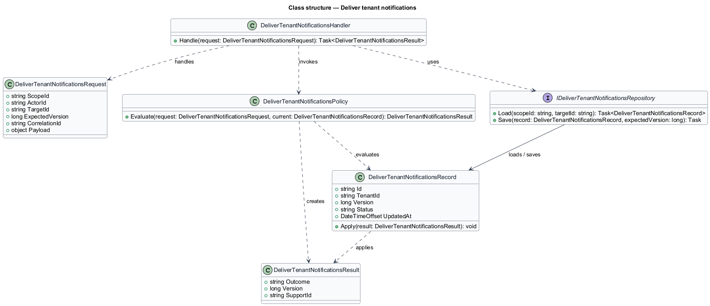
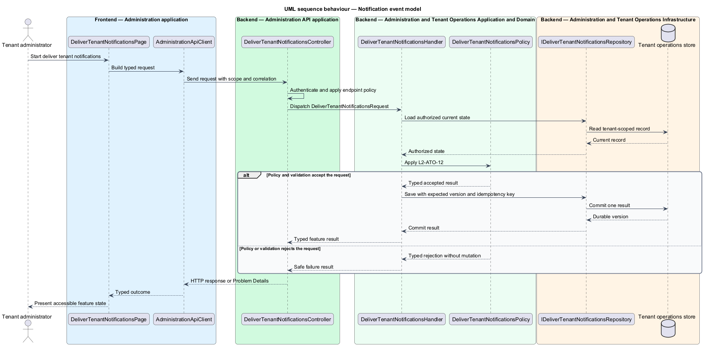

# Deliver tenant notifications

## Overview

RepoFluent's Administration and Tenant Operations subsystem coordinates tenant users, curricula, assignments, policies, diagnostics, branding, and notifications. This feature
brings *notification event model*, *notification preferences* into one vertical slice. The slice preserves tenant,
actor, version, authorization, and correlation context wherever the cited
requirements apply.

The tenant administrator starts the outcome through Administration application.
Administration API applies server-side policy before state is read or changed.
The external dependency and persistent technology remain `<TO SUPPLY>` where
the requirements baseline does not select them.

## Description

The greenfield slice introduces the following building blocks. The endpoint
route, deployment topology, and unresolved provider choices remain `<TO SUPPLY>`.

- **`DeliverTenantNotificationsPage`** — Angular 21 entry component that presents
  the feature state and submits a typed intent.
- **`AdministrationApiClient`** — typed client that carries tenant, actor, version,
  idempotency, and correlation context required by the operation.
- **`DeliverTenantNotificationsController`** — ASP.NET Core boundary that authenticates
  the caller, applies endpoint policy, and dispatches `DeliverTenantNotificationsRequest`.
- **`DeliverTenantNotificationsRequest`** — application request containing scope, actor, target,
  expected version, correlation identifier, and feature payload.
- **`DeliverTenantNotificationsHandler`** — application handler that loads authorized state,
  invokes `DeliverTenantNotificationsPolicy`, and commits one result.
- **`DeliverTenantNotificationsPolicy`** — domain policy that evaluates the cited L2 rules without
  relying on client presentation state.
- **`IDeliverTenantNotificationsRepository`** — application abstraction for tenant-scoped reads,
  writes, optimistic concurrency, and idempotency lookup.
- **`DeliverTenantNotificationsRecord`** — persisted feature record containing identity, tenant,
  version, status, timestamps, and safe evidence references.

## Requirements

The feature realizes the following level-2 (L2) requirements. Each row cites
the first L1 identifier named by the source requirement as its primary parent.

| L2 ID | Refines (L1) | Requirement |
|-------|--------------|-------------|
| `L2-ATO-12` | `L1-ATO-06` | Notification generation should support assignment created/changed, due-soon/overdue, curriculum publication, and validation failure events. Messages shall be tenant-branded within safety limits, contain minimal data, use authorized deep links, deduplicate retries, and respect channel availability. |
| `L2-ATO-13` | `L1-ATO-06` | Users should configure enabled optional channels and frequencies by notification category. Mandatory security or material administrative notices may be non-disableable and shall be identified. Preferences shall be tenant/user scoped and shall not suppress in-product assignment truth. |

## Diagrams

### System context

The tenant administrator uses RepoFluent to complete the feature outcome.
RepoFluent interacts with Notification provider only through the boundary
described by the requirements and approved configuration.

### Containers

Administration application sends typed requests to Administration API. The API applies
server-owned rules and records the accepted outcome in Tenant operations store.

### Components

`DeliverTenantNotificationsController` dispatches `DeliverTenantNotificationsRequest` to `DeliverTenantNotificationsHandler`. The handler
uses `DeliverTenantNotificationsPolicy` and `IDeliverTenantNotificationsRepository` before it commits a state change.

### Class structure

`DeliverTenantNotificationsHandler` depends on the request, policy, and repository abstractions.
`IDeliverTenantNotificationsRepository` stores `DeliverTenantNotificationsRecord` under tenant and version context.

### Behaviour — notification event model

The sequence applies `L2-ATO-12` before the handler persists an accepted result. A rejected policy or validation result returns without a state change.

### Behaviour — notification preferences

The sequence applies `L2-ATO-13` before the handler persists an accepted result. A rejected policy or validation result returns without a state change.

