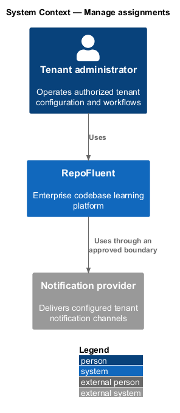
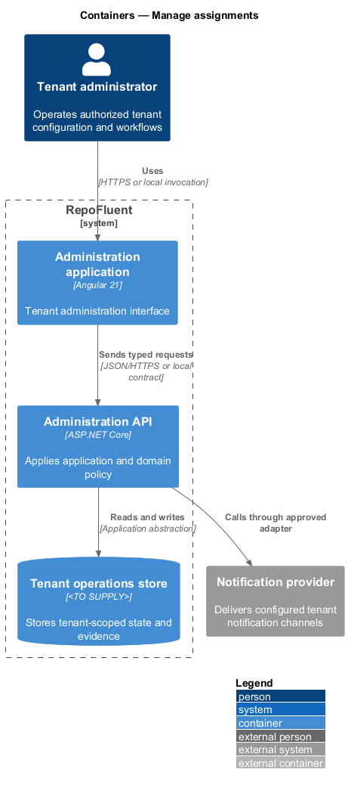
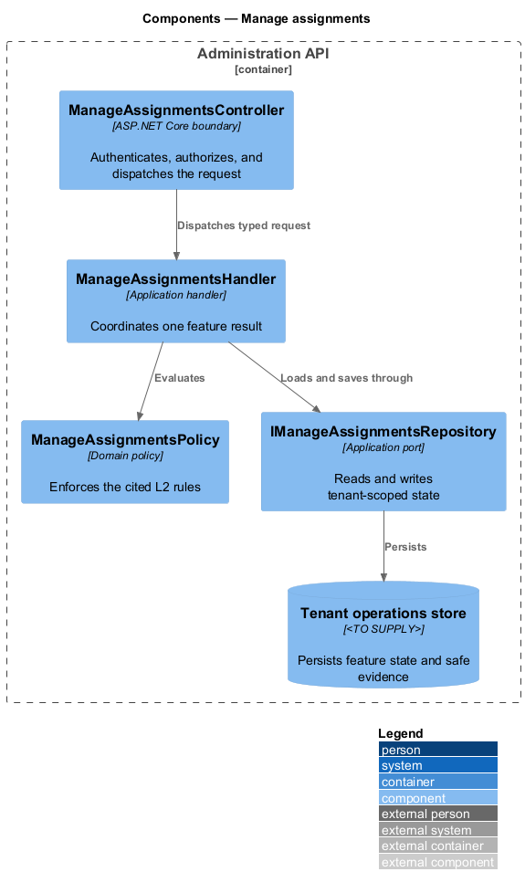
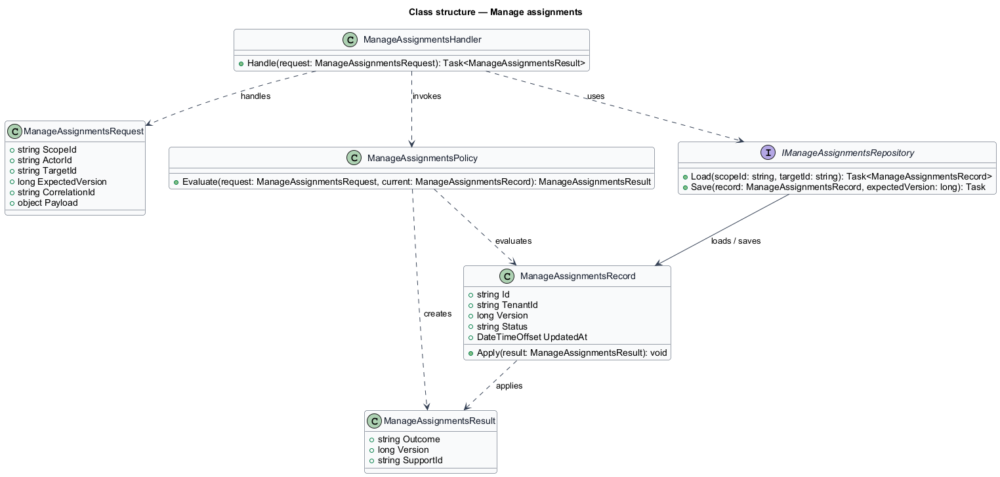
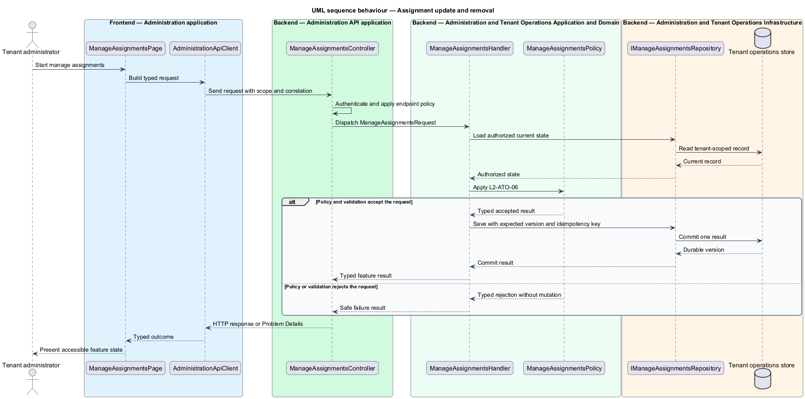

# Manage assignments

## Overview

RepoFluent's Administration and Tenant Operations subsystem coordinates tenant users, curricula, assignments, policies, diagnostics, branding, and notifications. This feature
brings *direct and group assignments*, *assignment update and removal* into one vertical slice. The slice preserves tenant,
actor, version, authorization, and correlation context wherever the cited
requirements apply.

The tenant administrator starts the outcome through Administration application.
Administration API applies server-side policy before state is read or changed.
The external dependency and persistent technology remain `<TO SUPPLY>` where
the requirements baseline does not select them.

## Description

The greenfield slice introduces the following building blocks. The endpoint
route, deployment topology, and unresolved provider choices remain `<TO SUPPLY>`.

- **`ManageAssignmentsPage`** — Angular 21 entry component that presents
  the feature state and submits a typed intent.
- **`AdministrationApiClient`** — typed client that carries tenant, actor, version,
  idempotency, and correlation context required by the operation.
- **`ManageAssignmentsController`** — ASP.NET Core boundary that authenticates
  the caller, applies endpoint policy, and dispatches `ManageAssignmentsRequest`.
- **`ManageAssignmentsRequest`** — application request containing scope, actor, target,
  expected version, correlation identifier, and feature payload.
- **`ManageAssignmentsHandler`** — application handler that loads authorized state,
  invokes `ManageAssignmentsPolicy`, and commits one result.
- **`ManageAssignmentsPolicy`** — domain policy that evaluates the cited L2 rules without
  relying on client presentation state.
- **`IManageAssignmentsRepository`** — application abstraction for tenant-scoped reads,
  writes, optimistic concurrency, and idempotency lookup.
- **`ManageAssignmentsRecord`** — persisted feature record containing identity, tenant,
  version, status, timestamps, and safe evidence references.

## Requirements

The feature realizes the following level-2 (L2) requirements. Each row cites
the first L1 identifier named by the source requirement as its primary parent.

| L2 ID | Refines (L1) | Requirement |
|-------|--------------|-------------|
| `L2-ATO-05` | `L1-ATO-08` | An authorized administrator shall assign a published curriculum/version to users or groups with required/optional state, availability/due dates, and completion policy reference. Derived group assignments shall retain provenance and shall not duplicate an equivalent direct/effective assignment. |
| `L2-ATO-06` | `L1-ATO-08` | Changes to due date, requirement, or audience shall be versioned/audited and shall define impact on started/completed learners. Removing a source group membership or assignment shall not delete learning evidence. The UI shall preview affected population and completed/in-progress counts before broad changes. |

## Diagrams

### System context

The tenant administrator uses RepoFluent to complete the feature outcome.
RepoFluent interacts with Notification provider only through the boundary
described by the requirements and approved configuration.

### Containers

Administration application sends typed requests to Administration API. The API applies
server-owned rules and records the accepted outcome in Tenant operations store.

### Components

`ManageAssignmentsController` dispatches `ManageAssignmentsRequest` to `ManageAssignmentsHandler`. The handler
uses `ManageAssignmentsPolicy` and `IManageAssignmentsRepository` before it commits a state change.

### Class structure

`ManageAssignmentsHandler` depends on the request, policy, and repository abstractions.
`IManageAssignmentsRepository` stores `ManageAssignmentsRecord` under tenant and version context.

### Behaviour — direct and group assignments

The sequence applies `L2-ATO-05` before the handler persists an accepted result. A rejected policy or validation result returns without a state change.

### Behaviour — assignment update and removal

The sequence applies `L2-ATO-06` before the handler persists an accepted result. A rejected policy or validation result returns without a state change.

