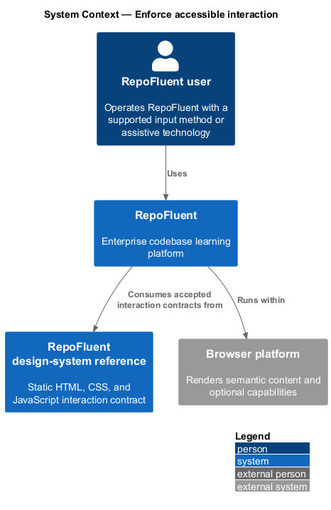
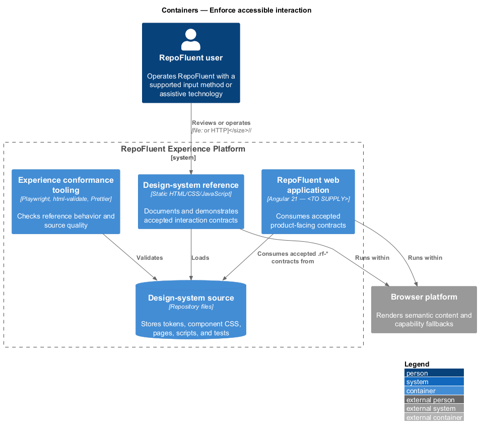
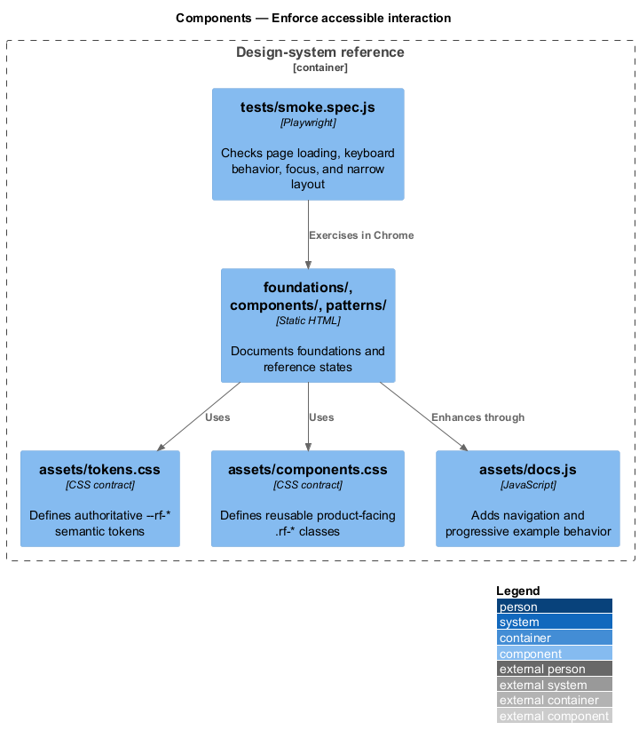
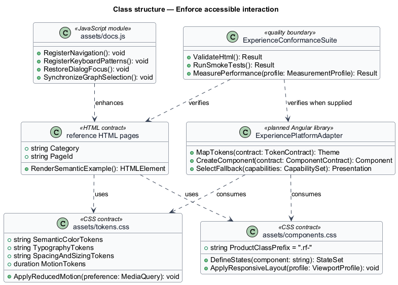
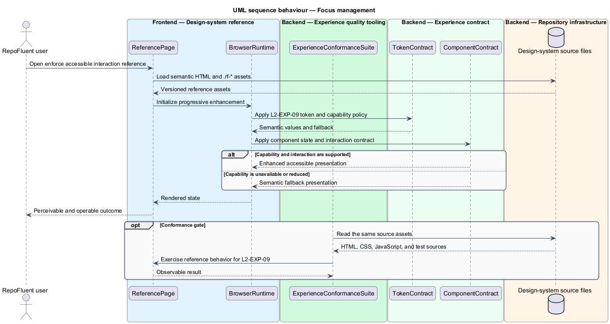
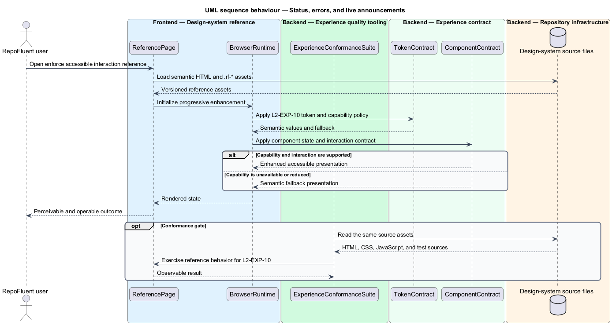

# Enforce accessible interaction

## Overview

RepoFluent's Experience Platform subsystem provides design-system,
accessibility, responsive, capability, and performance foundations. This
feature provides semantic structure, deterministic focus, and perceivable asynchronous status. It covers _semantic structure and accessible names_, _focus management_, _status, errors, and live announcements_.

The checked-in reference implementation is the static `desigh-system/` site.
Its HTML, CSS, and JavaScript work from `file://` without a runtime dependency.
The production Angular consumer now applies the same semantics, modal focus,
route focus, described-error, and live-status contracts. Telemetry,
supported-browser policy, and production measurement are implemented by their
dedicated detailed-design features.

## Description

The feature uses the following checked-in assets and planned integration seam.

- **`desigh-system/foundations/accessibility.html`** — keyboard, focus, naming, contrast, and reduced-motion guidance.
- **`desigh-system/components/form-controls.html`** — label, instruction, validation, and error-state contracts.
- **`desigh-system/components/overlays-feedback.html`** — dialog, callout, toast, and focus-restoration examples.
- **`desigh-system/components/toolbars-tabs.html`** — keyboard tab-selection and toolbar interaction examples.
- **`desigh-system/assets/docs.js`** — focus trapping, focus restoration, tab, tree, and announcement behaviors.
- **`ExperiencePlatformAdapter`** — Angular library boundary that applies
  route-heading focus and announces the new primary heading while product
  components consume the accepted `.rf-*` interaction contracts.
- **`ExperienceConformanceSuite`** — quality boundary composed from Playwright,
  axe-core, `html-validate`, Prettier, accessibility checks, visual regression,
  and production performance gates. Production performance and browser-matrix
  checks remain owned by their dedicated experience-platform features.

The structural diagram models source artifacts as typed contracts. It does not
claim that the current static JavaScript defines application classes.

## Requirements

The feature realizes the following level-2 (L2) requirements. Each row cites
the first L1 identifier named by the source requirement as its primary parent.

| L2 ID | Refines (L1) | Requirement |
|-------|--------------|-------------|
| `L2-EXP-08` | `L1-EXP-06` | Pages shall use meaningful landmarks/headings, native semantics where possible, unique accessible names, labels/instructions, described errors, table headers, and relationship semantics. Custom widgets shall implement required keyboard patterns and state properties. |
| `L2-EXP-09` | `L1-EXP-06` | Focus order shall follow visual/logical reading order. Dialogs/drawers shall move, contain where modal, and restore focus. Route changes shall announce or focus the new primary heading per pattern. Busy updates shall not steal focus. Sticky UI shall not obscure the focused element. |
| `L2-EXP-10` | `L1-EXP-06` | Async save, validation, grading submission, processing, success, warning, and error states shall use persistent visible status appropriate to severity and programmatic live announcements without excessive repetition. Errors shall identify the affected control/entity and recovery action. |

## Diagrams

### System context

The repofluent user uses RepoFluent through the browser platform. The
design-system reference defines the interaction contract consumed by the
planned Angular application.

### Containers

The static reference site reads the checked-in contract source directly. The
quality tooling validates the same pages and assets before product integration.

### Components

`assets/tokens.css`, `assets/components.css`, the reference pages, and
`assets/docs.js` form the current contract. `tests/smoke.spec.js` exercises the
rendered reference behavior.

### Class structure

The model represents CSS, HTML, JavaScript, and conformance assets as typed
contracts. `ExperiencePlatformAdapter` is the planned production consumer.

### Behaviour — semantic structure and accessible names

The reference assets apply `L2-EXP-08` through a semantic contract and an accessible fallback. The conformance suite checks the available reference behavior before the contract is consumed by the production application.

### Behaviour — focus management

The reference assets apply `L2-EXP-09` through a semantic contract and an accessible fallback. The conformance suite checks the available reference behavior before the contract is consumed by the production application.

### Behaviour — status, errors, and live announcements

The reference assets apply `L2-EXP-10` through a semantic contract and an accessible fallback. The conformance suite checks the available reference behavior before the contract is consumed by the production application.

### Implementation evidence

Status: **Implemented**

- `accessible-interaction.spec.ts` starts from a Page Object and runs automated
  WCAG 2.2 AA analysis against the live Angular shell with no serious or
  critical violations.
- The command search uses the native modal contract, contains keyboard focus,
  closes with Escape, and restores focus to its invoker.
- `ExperiencePlatformAdapter` focuses and announces the primary heading after
  route navigation without moving focus during busy updates.
- Curriculum validation associates its persistent recovery text with the file
  control and exposes atomic visible live states from upload through validation.
- Desktop modal and narrow validation-error snapshots verify the production
  consumer against the shared design-system tokens and component patterns.
