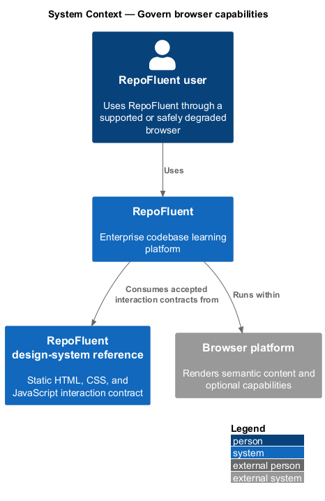
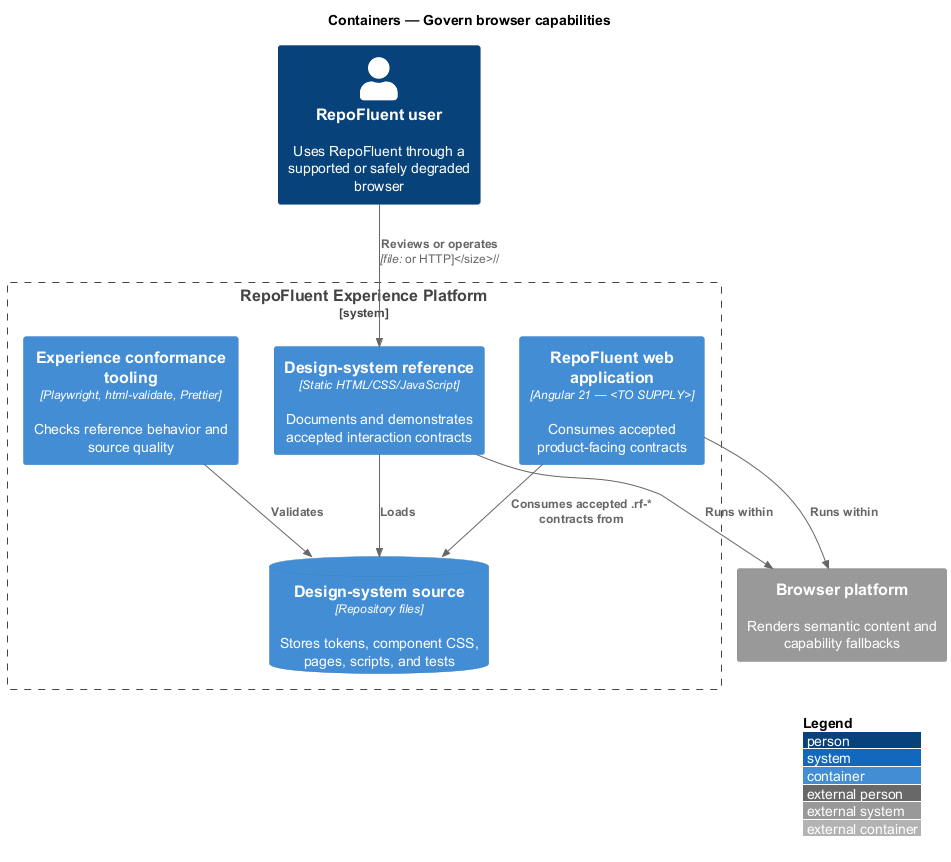
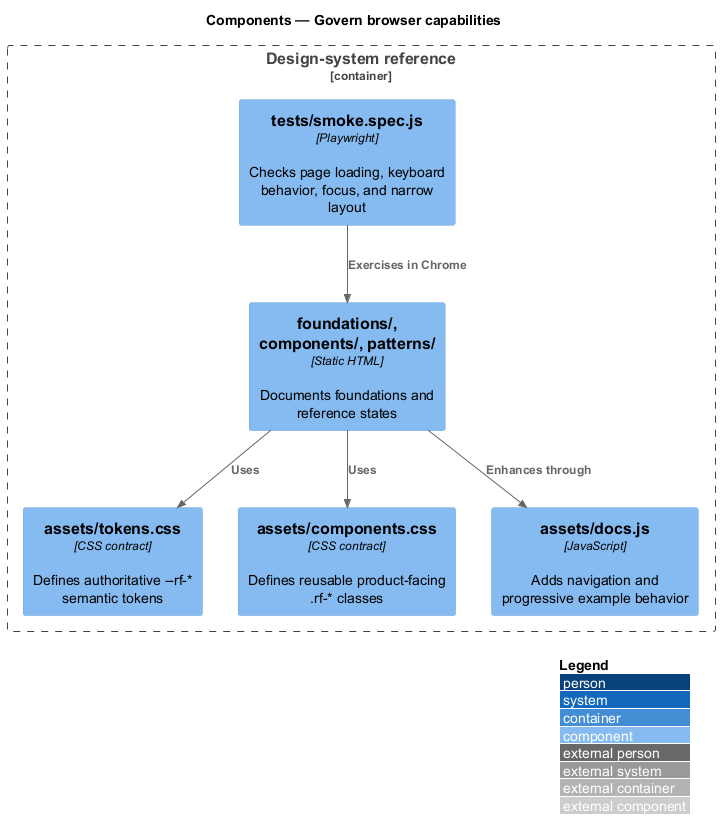
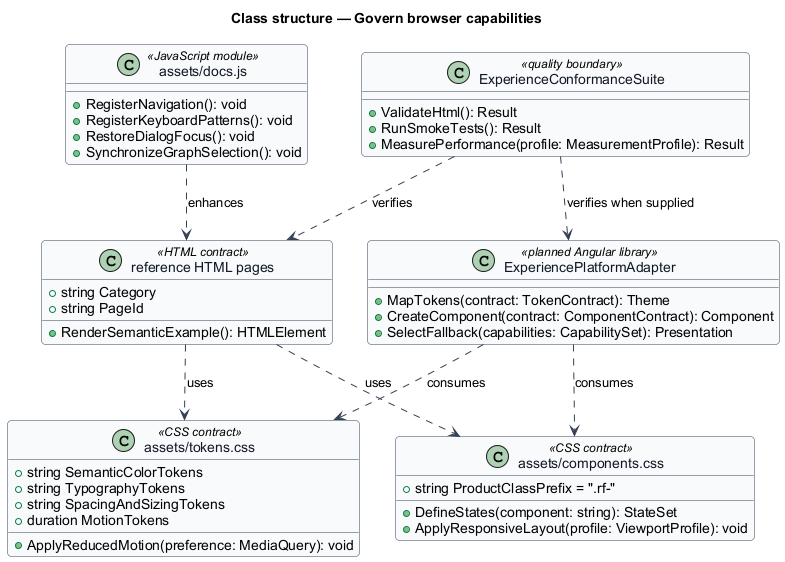
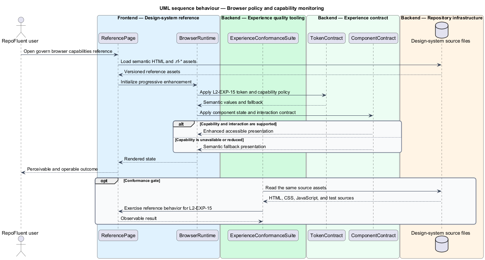

# Govern browser capabilities

## Overview

RepoFluent's Experience Platform subsystem provides design-system,
accessibility, responsive, capability, and performance foundations. This
feature selects supported browser behavior and records safe capability fallback outcomes. It covers *browser policy and capability monitoring*.

The checked-in reference implementation is the static `desigh-system/` site.
Its HTML, CSS, and JavaScript work from `file://` without a runtime dependency.
The production Angular consumer, telemetry integration, supported-browser
matrix, and production measurement profile remain `<TO SUPPLY>`.

## Description

The feature uses the following checked-in assets and planned integration seam.

- **`desigh-system/assets/tokens.css`** — current `prefers-reduced-motion` fallback contract.
- **`desigh-system/assets/docs.js`** — progressive enhancement that leaves static content available.
- **`desigh-system/foundations/motion.html`** — motion and reduced-motion reference behavior.
- **`desigh-system/foundations/accessibility.html`** — browser-independent keyboard and semantic guidance.
- **`desigh-system/tests/smoke.spec.js`** — Chrome reference checks without a production support matrix.
- **`ExperiencePlatformAdapter`** — planned Angular library boundary that maps
  the accepted `.rf-*` contracts into product components; implementation remains
  `<TO SUPPLY>` because `frontend/angular.json` contains no application project.
- **`ExperienceConformanceSuite`** — quality boundary composed from Playwright,
  `html-validate`, Prettier, accessibility checks, and production performance
  gates. Production performance and browser-matrix checks remain `<TO SUPPLY>`.

The structural diagram models source artifacts as typed contracts. It does not
claim that the current static JavaScript defines application classes.

## Requirements

The feature realizes the following level-2 (L2) requirements. Each row cites
the first L1 identifier named by the source requirement as its primary parent.

| L2 ID | Refines (L1) | Requirement |
|-------|--------------|-------------|
| `L2-EXP-15` | `L1-EXP-10` | Before launch, the product shall publish supported browser/version/capability profiles and test them in CI/release gates. Production telemetry shall measure capability/fallback use and critical performance/error outcomes without fingerprinting beyond approved need. Unsupported browsers shall receive accurate guidance while preserving safe access where feasible. |

## Diagrams

### System context

The repofluent user uses RepoFluent through the browser platform. The
design-system reference defines the interaction contract consumed by the
planned Angular application.

### Containers

The static reference site reads the checked-in contract source directly. The
quality tooling validates the same pages and assets before product integration.

### Components

`assets/tokens.css`, `assets/components.css`, the reference pages, and
`assets/docs.js` form the current contract. `tests/smoke.spec.js` exercises the
rendered reference behavior.

### Class structure

The model represents CSS, HTML, JavaScript, and conformance assets as typed
contracts. `ExperiencePlatformAdapter` is the planned production consumer.

### Behaviour — browser policy and capability monitoring

The reference assets apply `L2-EXP-15` through a semantic contract and an accessible fallback. The conformance suite checks the available reference behavior before the contract is consumed by the production application.

