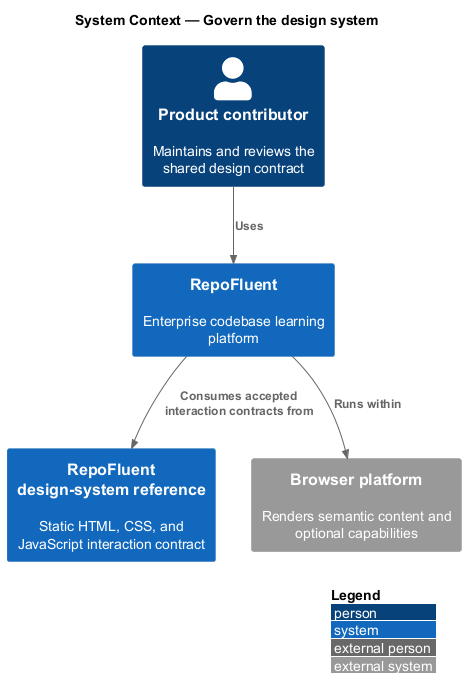
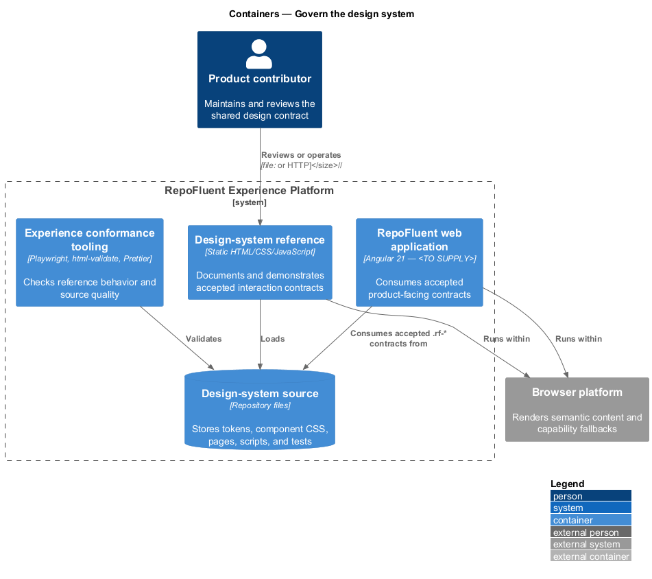
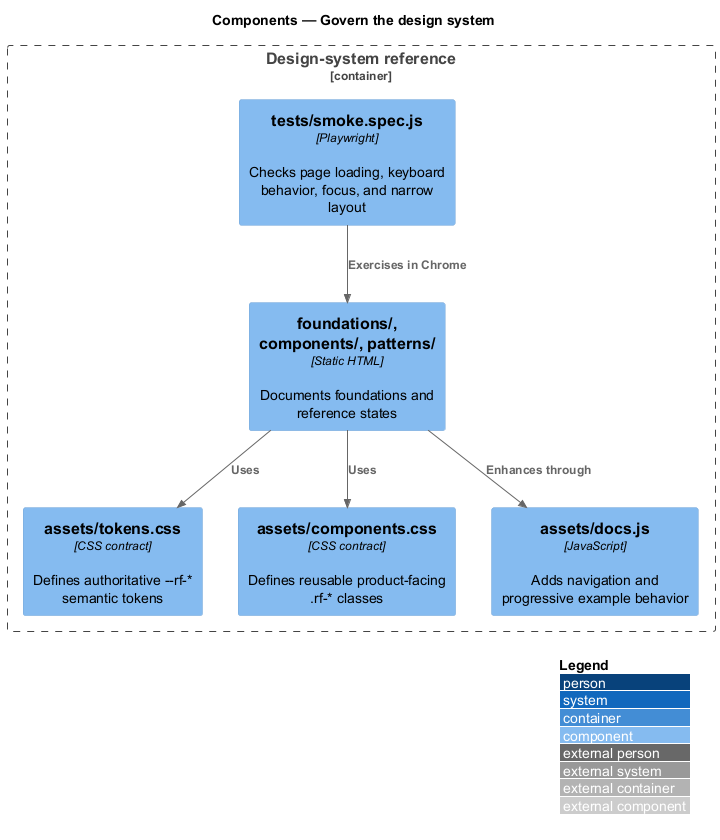
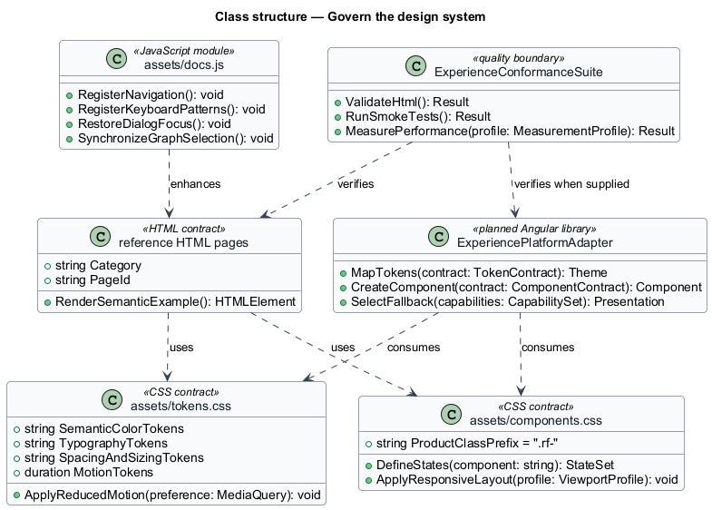
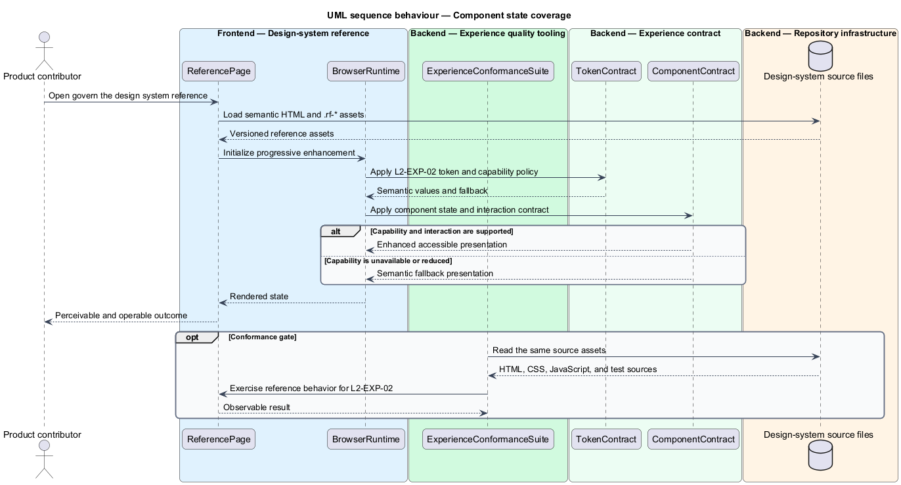

# Govern the design system

## Overview

RepoFluent's Experience Platform subsystem provides design-system,
accessibility, responsive, capability, and performance foundations. This
feature maintains semantic tokens, reusable component states, and reduced-motion behavior as one versioned interface contract. It covers _design-token contract_, _component state coverage_, _motion and reduced motion_.

The checked-in reference implementation is the static `desigh-system/` site.
Its HTML, CSS, and JavaScript work from `file://` without a runtime dependency.
The production Angular consumer now imports the same contract through
`ExperiencePlatformAdapter`. Telemetry, supported-browser policy, and
production measurement are implemented by their dedicated detailed-design
features.

## Description

The feature uses the following checked-in assets and planned integration seam.

- **`desigh-system/assets/tokens.css`** — authoritative `--rf-*` semantic token and reduced-motion contract.
- **`desigh-system/assets/components.css`** — reusable product-facing `.rf-*` component contracts.
- **`desigh-system/assets/docs.js`** — documentation navigation and progressively enhanced component examples.
- **`desigh-system/foundations/`** — reference pages for color, type, spacing, motion, and accessibility.
- **`desigh-system/tests/smoke.spec.js`** — Playwright checks for loading, keyboard behavior, focus restoration, and narrow layouts.
- **`ExperiencePlatformAdapter`** — Angular library boundary that publishes the
  contract version, selects an approved theme, reflects reduced-motion
  preference, and maps the accepted `.rf-*` contracts into product components.
- **`ExperienceConformanceSuite`** — quality boundary composed from Playwright,
  `html-validate`, Prettier, semantic-token enforcement, visual regression,
  accessibility checks, and production performance gates. Production
  performance and browser-matrix checks remain owned by their dedicated
  experience-platform features.

The structural diagram models source artifacts as typed contracts. It does not
claim that the current static JavaScript defines application classes.

## Requirements

The feature realizes the following level-2 (L2) requirements. Each row cites
the first L1 identifier named by the source requirement as its primary parent.

| L2 ID | Refines (L1) | Requirement |
|-------|--------------|-------------|
| `L2-EXP-01` | `L1-EXP-01` | The design system shall define named semantic tokens for surfaces, text, borders, focus, status, charts, typography, spacing, sizing, radius, elevation, motion duration/easing, and layering. Components shall consume semantic tokens rather than tenant-specific raw values. Token versions and breaking-change policy shall be documented. |
| `L2-EXP-02` | `L1-EXP-01` | Interactive primitives shall define default, hover, focus-visible, active, selected, disabled, busy, success, warning, error, and read-only states as applicable. State shall be conveyed through text/semantics or shape/iconography in addition to color. |
| `L2-EXP-03` | `L1-EXP-02` | Motion shall be short, interruptible, nonblocking, and used only to explain transitions/state/relationships. The platform shall honor `prefers-reduced-motion` and any supported user setting by removing nonessential movement and replacing spatial animation with immediate or low-motion state change. |

## Diagrams

### System context

The product contributor uses RepoFluent through the browser platform. The
design-system reference defines the interaction contract consumed by the
planned Angular application.

### Containers

The static reference site reads the checked-in contract source directly. The
quality tooling validates the same pages and assets before product integration.

### Components

`assets/tokens.css`, `assets/components.css`, the reference pages, and
`assets/docs.js` form the current contract. `tests/smoke.spec.js` exercises the
rendered reference behavior.

### Class structure

The model represents CSS, HTML, JavaScript, and conformance assets as typed
contracts. `ExperiencePlatformAdapter` is the planned production consumer.

### Behaviour — design-token contract

The reference assets apply `L2-EXP-01` through a semantic contract and an accessible fallback. The conformance suite checks the available reference behavior before the contract is consumed by the production application.

### Behaviour — component state coverage

The reference assets apply `L2-EXP-02` through a semantic contract and an accessible fallback. The conformance suite checks the available reference behavior before the contract is consumed by the production application.

### Behaviour — motion and reduced motion

The reference assets apply `L2-EXP-03` through a semantic contract and an accessible fallback. The conformance suite checks the available reference behavior before the contract is consumed by the production application.

### Implementation evidence

Status: **Implemented**

- `ExperiencePlatformAdapter` publishes design-system version `0.1.0`, selects
  the approved default or tenant theme, and reflects reduced-motion preference.
- The Angular application consumes the authoritative token and component assets
  directly; `npm run design:check` rejects product raw colors, `.ds-*` usage,
  missing contract imports, and missing token categories.
- `design-system-conformance.spec.ts` and its Page Object verify both themes,
  high-zoom keyboard focus, reduced motion, and desktop visual baselines.
- The static design-system suite verifies state semantics and WCAG contrast for
  default and tenant themes.
