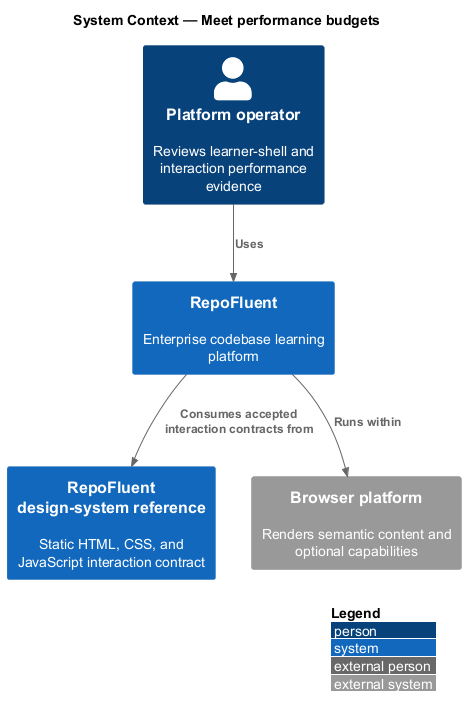
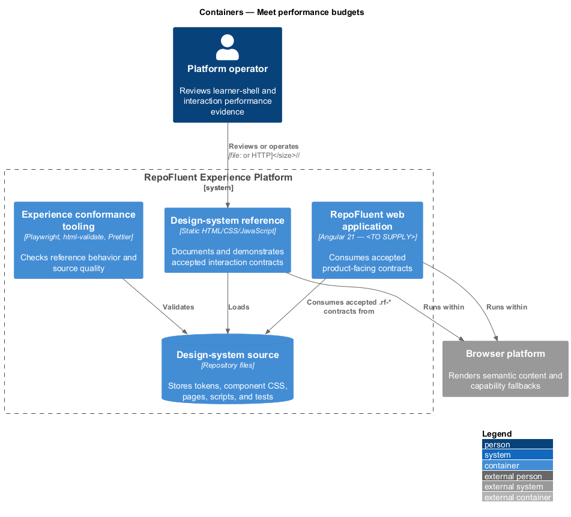
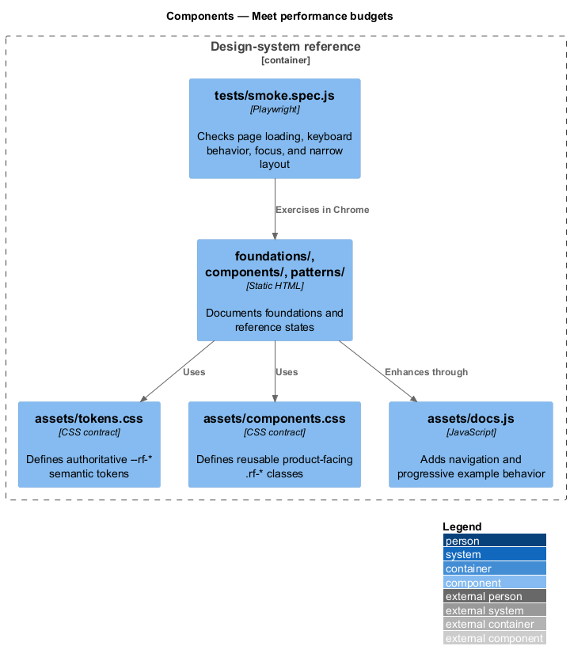
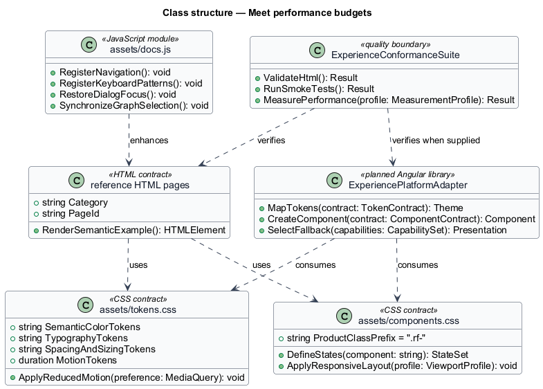
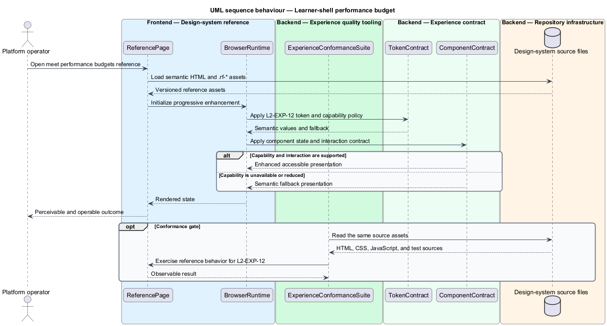

# Meet performance budgets

## Overview

RepoFluent's Experience Platform subsystem provides design-system,
accessibility, responsive, capability, and performance foundations. This
feature measures learner-shell and interaction budgets under an approved production profile. It covers *learner-shell performance budget*, *interaction and animation budgets*.

The checked-in reference implementation is the static `desigh-system/` site.
Its HTML, CSS, and JavaScript work from `file://` without a runtime dependency.
The production Angular consumer, telemetry integration, supported-browser
matrix, and production measurement profile remain `<TO SUPPLY>`.

## Description

The feature uses the following checked-in assets and planned integration seam.

- **`desigh-system/tests/smoke.spec.js`** — current reference-page load and narrow-viewport smoke coverage.
- **`desigh-system/package.json`** — pinned Playwright, validation, formatting, and test commands.
- **`desigh-system/assets/tokens.css`** — bounded motion durations and reduced-motion replacements.
- **`frontend/package.json`** — Angular 21 and TypeScript dependency baseline for the future application.
- **`frontend/angular.json`** — empty Angular workspace awaiting the production application project.
- **`ExperiencePlatformAdapter`** — planned Angular library boundary that maps
  the accepted `.rf-*` contracts into product components; implementation remains
  `<TO SUPPLY>` because `frontend/angular.json` contains no application project.
- **`ExperienceConformanceSuite`** — quality boundary composed from Playwright,
  `html-validate`, Prettier, accessibility checks, and production performance
  gates. Production performance and browser-matrix checks remain `<TO SUPPLY>`.

The structural diagram models source artifacts as typed contracts. It does not
claim that the current static JavaScript defines application classes.

## Requirements

The feature realizes the following level-2 (L2) requirements. Each row cites
the first L1 identifier named by the source requirement as its primary parent.

| L2 ID | Refines (L1) | Requirement |
|-------|--------------|-------------|
| `L2-EXP-12` | `L1-EXP-07` | The production measurement profile shall define device, browser, connection, cache, tenant content envelope, and usability milestone. At p75, the learner shell shall meet 2.5 seconds excluding explicitly governed unusually large optional assets. Measurement shall use real-user monitoring plus repeatable lab gates. |
| `L2-EXP-13` | `L1-EXP-08` | Typical interactions shall meet the p75 200 ms target from user input to visible response under the defined profile. Animations shall target 60 fps, avoid long main-thread tasks, and degrade effects before blocking input or semantic updates. |

## Diagrams

### System context

The platform operator uses RepoFluent through the browser platform. The
design-system reference defines the interaction contract consumed by the
planned Angular application.

### Containers

The static reference site reads the checked-in contract source directly. The
quality tooling validates the same pages and assets before product integration.

### Components

`assets/tokens.css`, `assets/components.css`, the reference pages, and
`assets/docs.js` form the current contract. `tests/smoke.spec.js` exercises the
rendered reference behavior.

### Class structure

The model represents CSS, HTML, JavaScript, and conformance assets as typed
contracts. `ExperiencePlatformAdapter` is the planned production consumer.

### Behaviour — learner-shell performance budget

The reference assets apply `L2-EXP-12` through a semantic contract and an accessible fallback. The conformance suite checks the available reference behavior before the contract is consumed by the production application.

### Behaviour — interaction and animation budgets

The reference assets apply `L2-EXP-13` through a semantic contract and an accessible fallback. The conformance suite checks the available reference behavior before the contract is consumed by the production application.

