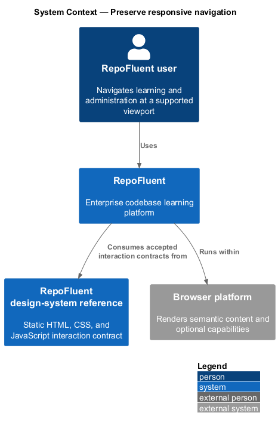
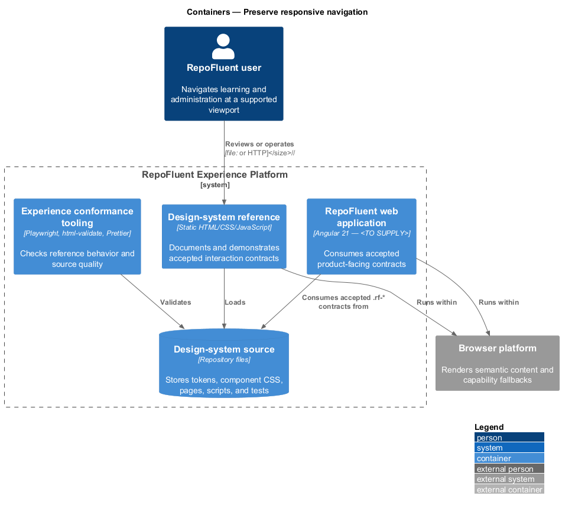
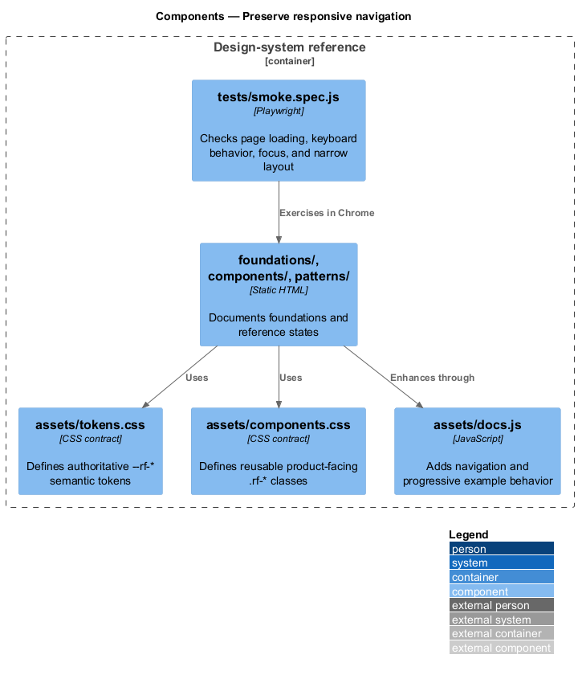
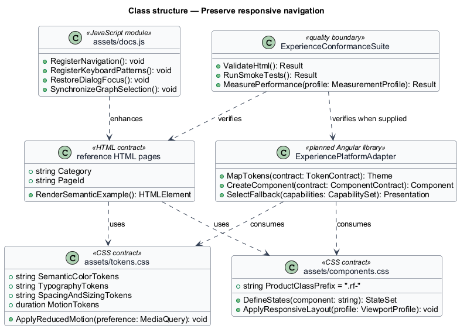
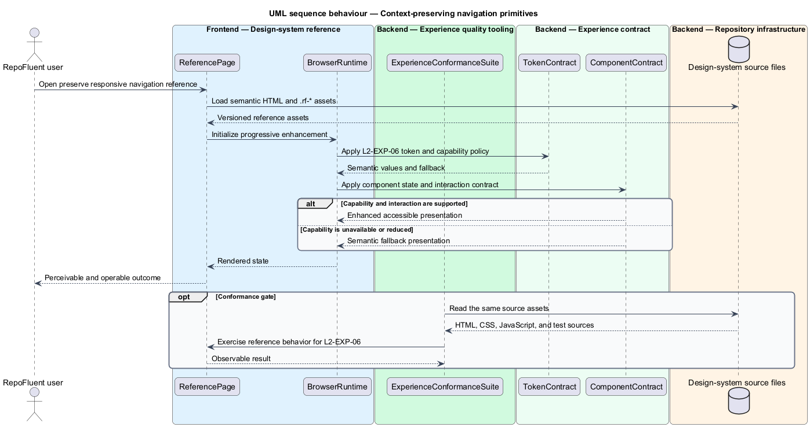
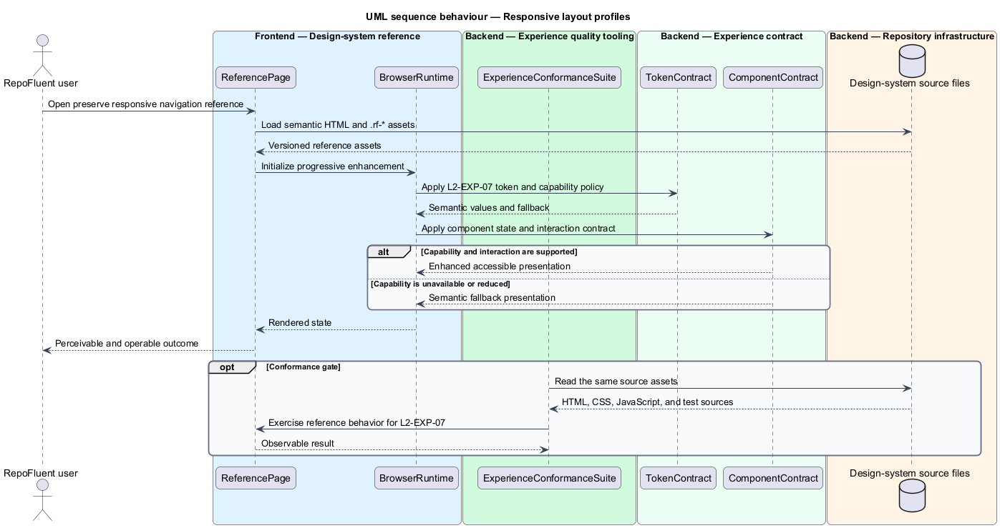

# Preserve responsive navigation

## Overview

RepoFluent's Experience Platform subsystem provides design-system,
accessibility, responsive, capability, and performance foundations. This
feature preserves route, focus, and domain context across responsive layouts and large content. It covers *context-preserving navigation primitives*, *responsive layout profiles*, *large-content rendering*.

The checked-in reference implementation is the static `desigh-system/` site.
Its HTML, CSS, and JavaScript work from `file://` without a runtime dependency.
The production Angular consumer, telemetry integration, supported-browser
matrix, and production measurement profile remain `<TO SUPPLY>`.

## Description

The feature uses the following checked-in assets and planned integration seam.

- **`desigh-system/patterns/application-shell.html`** — wide, compact, and phone shell composition reference.
- **`desigh-system/components/navigation.html`** — breadcrumbs and application navigation contracts.
- **`desigh-system/components/tree.html`** — keyboard-operable hierarchical navigation reference.
- **`desigh-system/assets/components.css`** — responsive `.rf-*` layout and scrolling contracts.
- **`desigh-system/tests/smoke.spec.js`** — 390 px viewport overflow and page-load checks.
- **`ExperiencePlatformAdapter`** — planned Angular library boundary that maps
  the accepted `.rf-*` contracts into product components; implementation remains
  `<TO SUPPLY>` because `frontend/angular.json` contains no application project.
- **`ExperienceConformanceSuite`** — quality boundary composed from Playwright,
  `html-validate`, Prettier, accessibility checks, and production performance
  gates. Production performance and browser-matrix checks remain `<TO SUPPLY>`.

The structural diagram models source artifacts as typed contracts. It does not
claim that the current static JavaScript defines application classes.

## Requirements

The feature realizes the following level-2 (L2) requirements. Each row cites
the first L1 identifier named by the source requirement as its primary parent.

| L2 ID | Refines (L1) | Requirement |
|-------|--------------|-------------|
| `L2-EXP-06` | `L1-EXP-04` | The platform shall provide route, breadcrumb, tab, drawer, split-pane, focus-return, and back-navigation patterns that retain domain context in URL/state where safe. Opening contextual code, glossary, or map detail shall not discard unsaved/progress state. |
| `L2-EXP-07` | `L1-EXP-05` | Supported profiles shall define minimum viewport, zoom, pointer, and orientation expectations for desktop, tablet, and narrow use. Navigation, assessment, lesson, import/review, administration, and analytics shall reflow without two-dimensional page scrolling, clipped controls, or inaccessible offscreen actions except intentional code/table regions with their own scrolling. |
| `L2-EXP-14` | `L1-EXP-09` | Long lessons, file trees, tables, result lists, and analytics datasets shall use an appropriate paging/virtualization/progressive strategy that preserves semantic order, focus, screen-reader access, find/filter behavior, and stable scroll position. |

## Diagrams

### System context

The repofluent user uses RepoFluent through the browser platform. The
design-system reference defines the interaction contract consumed by the
planned Angular application.

### Containers

The static reference site reads the checked-in contract source directly. The
quality tooling validates the same pages and assets before product integration.

### Components

`assets/tokens.css`, `assets/components.css`, the reference pages, and
`assets/docs.js` form the current contract. `tests/smoke.spec.js` exercises the
rendered reference behavior.

### Class structure

The model represents CSS, HTML, JavaScript, and conformance assets as typed
contracts. `ExperiencePlatformAdapter` is the planned production consumer.

### Behaviour — context-preserving navigation primitives

The reference assets apply `L2-EXP-06` through a semantic contract and an accessible fallback. The conformance suite checks the available reference behavior before the contract is consumed by the production application.

### Behaviour — responsive layout profiles

The reference assets apply `L2-EXP-07` through a semantic contract and an accessible fallback. The conformance suite checks the available reference behavior before the contract is consumed by the production application.

### Behaviour — large-content rendering

The reference assets apply `L2-EXP-14` through a semantic contract and an accessible fallback. The conformance suite checks the available reference behavior before the contract is consumed by the production application.

