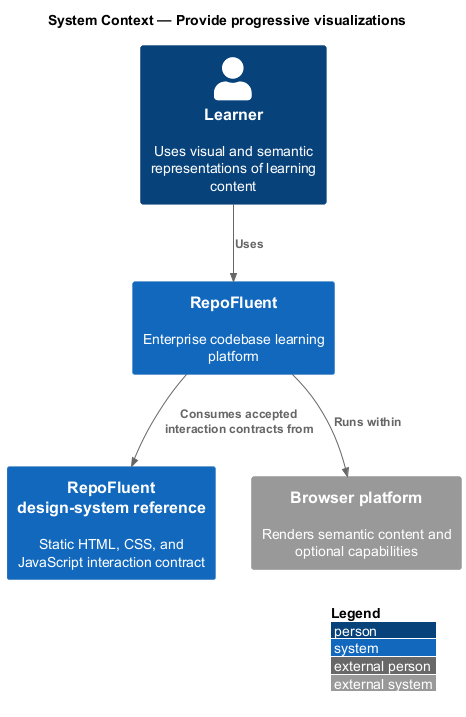
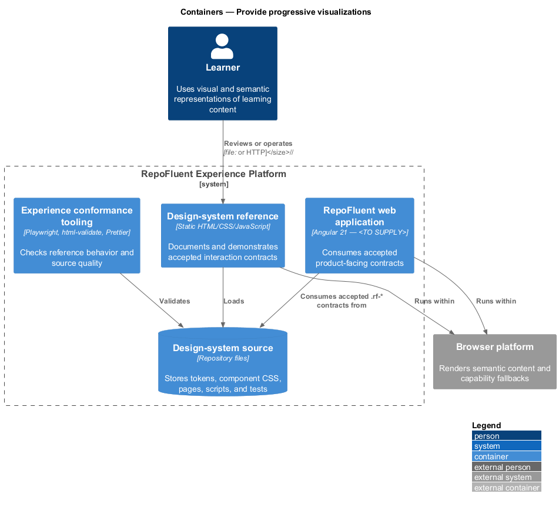
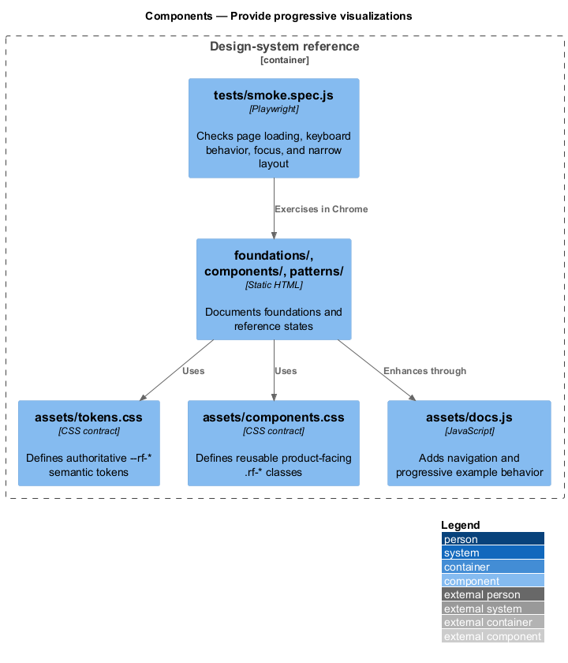
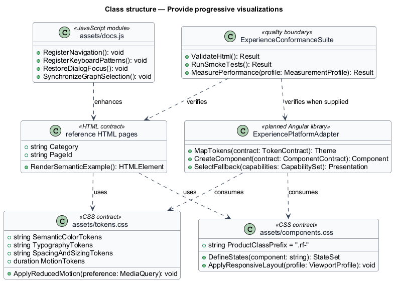
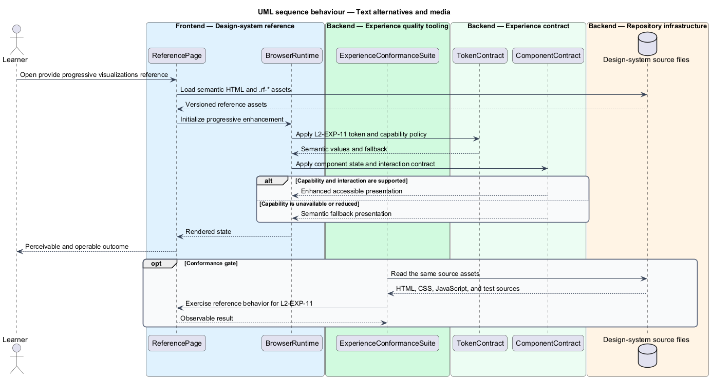

# Provide progressive visualizations

## Overview

RepoFluent's Experience Platform subsystem provides design-system,
accessibility, responsive, capability, and performance foundations. This
feature keeps visualization content operable when GPU or visual presentation is unavailable. It covers *progressive gpu capability*, *accessible visualization companion*, *text alternatives and media*.

The checked-in reference implementation is the static `desigh-system/` site.
Its HTML, CSS, and JavaScript work from `file://` without a runtime dependency.
The production Angular consumer, telemetry integration, supported-browser
matrix, and production measurement profile remain `<TO SUPPLY>`.

## Description

The feature uses the following checked-in assets and planned integration seam.

- **`desigh-system/components/data-visualization.html`** — chart, legend, status, and semantic data-reference examples.
- **`desigh-system/patterns/system-map.html`** — architecture-map reference with a non-canvas learning path.
- **`desigh-system/assets/components.css`** — shared visual and accessible companion presentation contracts.
- **`desigh-system/assets/docs.js`** — keyboard graph selection and synchronized inspector examples.
- **`desigh-system/foundations/accessibility.html`** — text-alternative and equivalent-interaction guidance.
- **`ExperiencePlatformAdapter`** — planned Angular library boundary that maps
  the accepted `.rf-*` contracts into product components; implementation remains
  `<TO SUPPLY>` because `frontend/angular.json` contains no application project.
- **`ExperienceConformanceSuite`** — quality boundary composed from Playwright,
  `html-validate`, Prettier, accessibility checks, and production performance
  gates. Production performance and browser-matrix checks remain `<TO SUPPLY>`.

The structural diagram models source artifacts as typed contracts. It does not
claim that the current static JavaScript defines application classes.

## Requirements

The feature realizes the following level-2 (L2) requirements. Each row cites
the first L1 identifier named by the source requirement as its primary parent.

| L2 ID | Refines (L1) | Requirement |
|-------|--------------|-------------|
| `L2-EXP-04` | `L1-EXP-03` | GPU initialization shall be capability-detected, time-bounded, and isolated from core rendering. Failure, device loss, unsupported browser, or policy disablement shall select an equivalent non-GPU visualization/transition without blocking page content or controls. |
| `L2-EXP-05` | `L1-EXP-03` | Every interactive canvas/GPU/SVG graph shall have a semantic companion list/table/tree that exposes equivalent nodes, relationships, directions, status, selection, details, and actions. Selection and filter state shall remain synchronized where both presentations coexist. |
| `L2-EXP-11` | `L1-EXP-06` | Meaningful diagrams/images shall provide concise alternatives and extended descriptions where needed. Decorative visuals shall be hidden from assistive technology. If future audio/video is supported, captions/transcripts and player accessibility shall be required before launch. |

## Diagrams

### System context

The learner uses RepoFluent through the browser platform. The
design-system reference defines the interaction contract consumed by the
planned Angular application.

### Containers

The static reference site reads the checked-in contract source directly. The
quality tooling validates the same pages and assets before product integration.

### Components

`assets/tokens.css`, `assets/components.css`, the reference pages, and
`assets/docs.js` form the current contract. `tests/smoke.spec.js` exercises the
rendered reference behavior.

### Class structure

The model represents CSS, HTML, JavaScript, and conformance assets as typed
contracts. `ExperiencePlatformAdapter` is the planned production consumer.

### Behaviour — progressive gpu capability

The reference assets apply `L2-EXP-04` through a semantic contract and an accessible fallback. The conformance suite checks the available reference behavior before the contract is consumed by the production application.

### Behaviour — accessible visualization companion

The reference assets apply `L2-EXP-05` through a semantic contract and an accessible fallback. The conformance suite checks the available reference behavior before the contract is consumed by the production application.

### Behaviour — text alternatives and media

The reference assets apply `L2-EXP-11` through a semantic contract and an accessible fallback. The conformance suite checks the available reference behavior before the contract is consumed by the production application.

