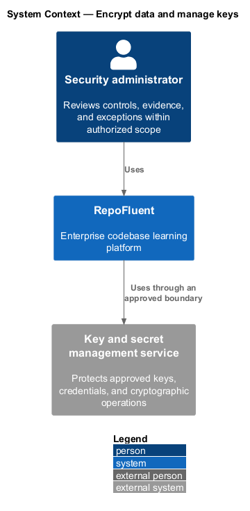
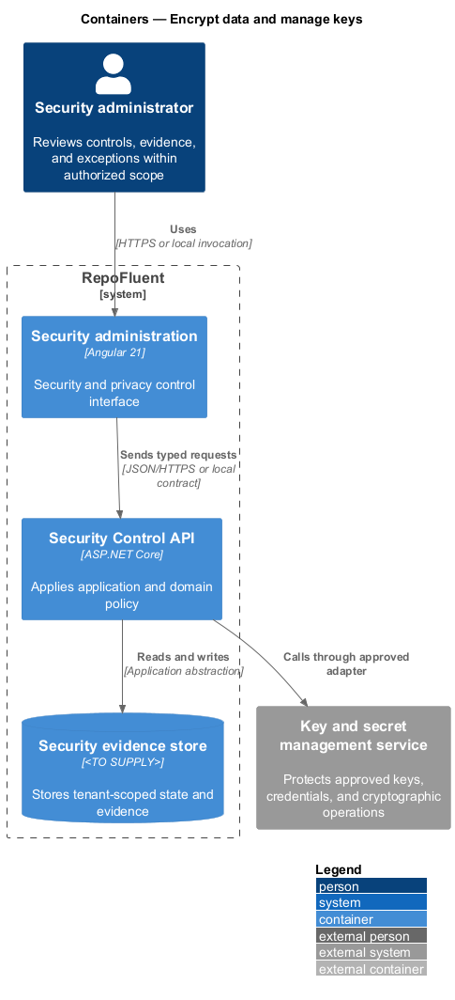
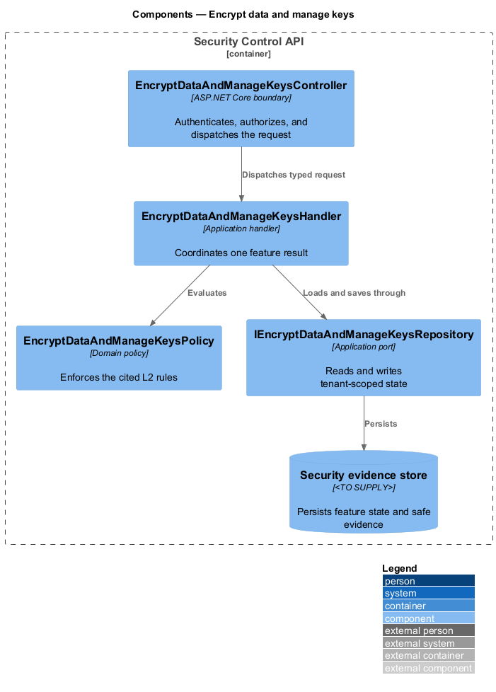
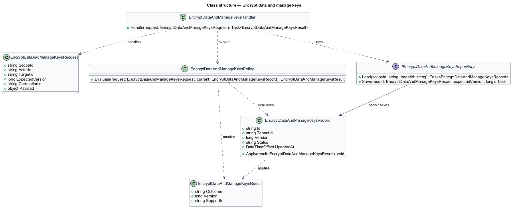
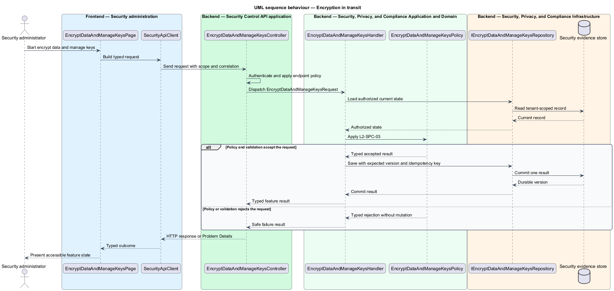
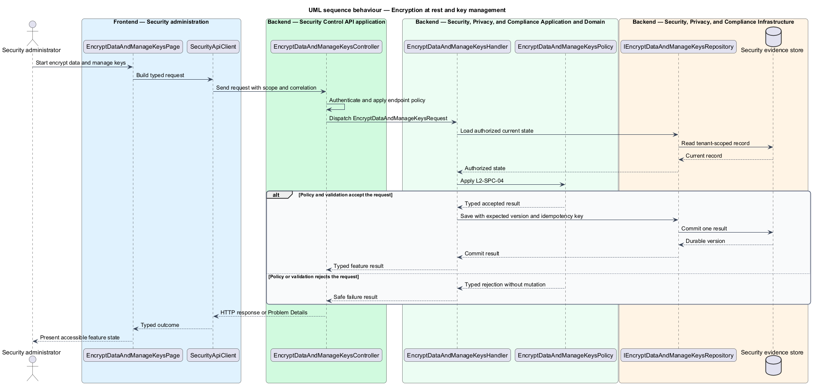

# Encrypt data and manage keys

## Overview

RepoFluent's Security, Privacy, and Compliance subsystem protects customer data and establishes security, privacy, retention, and release controls. This feature
brings *encryption in transit*, *encryption at rest and key management* into one vertical slice. The slice preserves tenant,
actor, version, authorization, and correlation context wherever the cited
requirements apply.

The security administrator starts the outcome through Security administration.
Security Control API applies server-side policy before state is read or changed.
The external dependency and persistent technology remain `<TO SUPPLY>` where
the requirements baseline does not select them.

## Description

The greenfield slice introduces the following building blocks. The endpoint
route, deployment topology, and unresolved provider choices remain `<TO SUPPLY>`.

- **`EncryptDataAndManageKeysPage`** — Angular 21 entry component that presents
  the feature state and submits a typed intent.
- **`SecurityApiClient`** — typed client that carries tenant, actor, version,
  idempotency, and correlation context required by the operation.
- **`EncryptDataAndManageKeysController`** — ASP.NET Core boundary that authenticates
  the caller, applies endpoint policy, and dispatches `EncryptDataAndManageKeysRequest`.
- **`EncryptDataAndManageKeysRequest`** — application request containing scope, actor, target,
  expected version, correlation identifier, and feature payload.
- **`EncryptDataAndManageKeysHandler`** — application handler that loads authorized state,
  invokes `EncryptDataAndManageKeysPolicy`, and commits one result.
- **`EncryptDataAndManageKeysPolicy`** — domain policy that evaluates the cited L2 rules without
  relying on client presentation state.
- **`IEncryptDataAndManageKeysRepository`** — application abstraction for tenant-scoped reads,
  writes, optimistic concurrency, and idempotency lookup.
- **`EncryptDataAndManageKeysRecord`** — persisted feature record containing identity, tenant,
  version, status, timestamps, and safe evidence references.

## Requirements

The feature realizes the following level-2 (L2) requirements. Each row cites
the first L1 identifier named by the source requirement as its primary parent.

| L2 ID | Refines (L1) | Requirement |
|-------|--------------|-------------|
| `L2-SPC-03` | `L1-SPC-02` | All customer/admin/service data shall use organization-approved encrypted transport with certificate/peer validation. Insecure protocols and downgrade paths shall be disabled. Internal exceptions require documented equivalent protection and security approval. |
| `L2-SPC-04` | `L1-SPC-02` | Persistent databases, object stores, queues where applicable, backups, indexes, and exports shall use approved at-rest encryption. Key access, rotation, revocation, separation, backup, and failure behavior shall follow organizational policy and shall not embed keys in code/config/logs. |

## Diagrams

### System context

The security administrator uses RepoFluent to complete the feature outcome.
RepoFluent interacts with Key and secret management service only through the boundary
described by the requirements and approved configuration.

### Containers

Security administration sends typed requests to Security Control API. The API applies
server-owned rules and records the accepted outcome in Security evidence store.

### Components

`EncryptDataAndManageKeysController` dispatches `EncryptDataAndManageKeysRequest` to `EncryptDataAndManageKeysHandler`. The handler
uses `EncryptDataAndManageKeysPolicy` and `IEncryptDataAndManageKeysRepository` before it commits a state change.

### Class structure

`EncryptDataAndManageKeysHandler` depends on the request, policy, and repository abstractions.
`IEncryptDataAndManageKeysRepository` stores `EncryptDataAndManageKeysRecord` under tenant and version context.

### Behaviour — encryption in transit

The sequence applies `L2-SPC-03` before the handler persists an accepted result. A rejected policy or validation result returns without a state change.

### Behaviour — encryption at rest and key management

The sequence applies `L2-SPC-04` before the handler persists an accepted result. A rejected policy or validation result returns without a state change.

