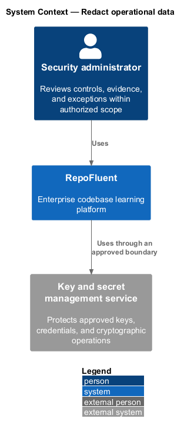
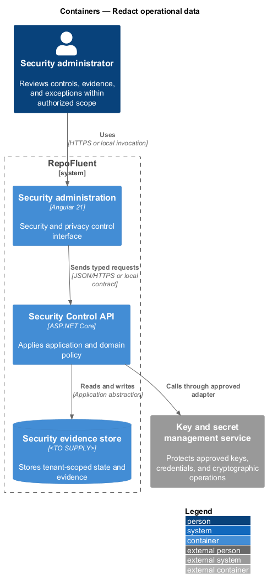
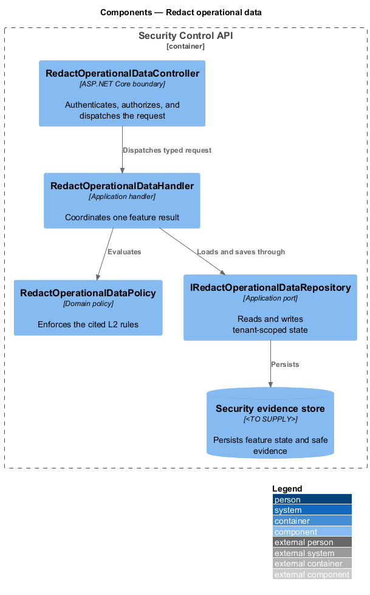
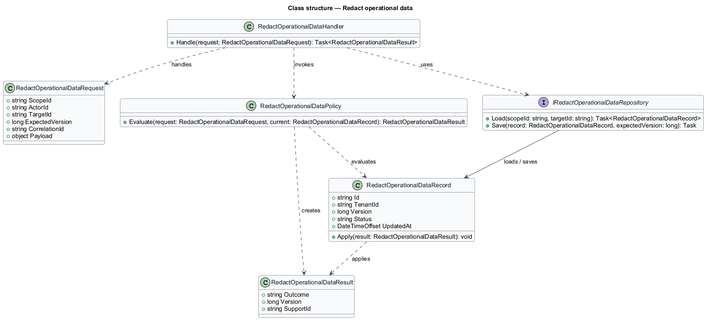
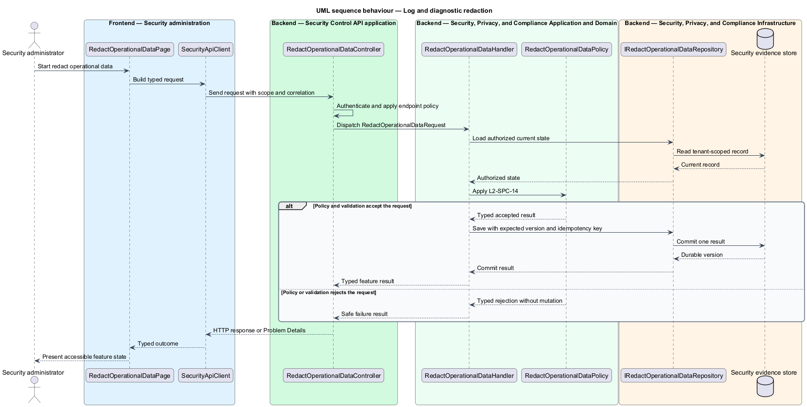

# Redact operational data

## Overview

RepoFluent's Security, Privacy, and Compliance subsystem protects customer data and establishes security, privacy, retention, and release controls. This feature
brings *log and diagnostic redaction* into one vertical slice. The slice preserves tenant,
actor, version, authorization, and correlation context wherever the cited
requirements apply.

The security administrator starts the outcome through Security administration.
Security Control API applies server-side policy before state is read or changed.
The external dependency and persistent technology remain `<TO SUPPLY>` where
the requirements baseline does not select them.

## Description

The greenfield slice introduces the following building blocks. The endpoint
route, deployment topology, and unresolved provider choices remain `<TO SUPPLY>`.

- **`RedactOperationalDataPage`** — Angular 21 entry component that presents
  the feature state and submits a typed intent.
- **`SecurityApiClient`** — typed client that carries tenant, actor, version,
  idempotency, and correlation context required by the operation.
- **`RedactOperationalDataController`** — ASP.NET Core boundary that authenticates
  the caller, applies endpoint policy, and dispatches `RedactOperationalDataRequest`.
- **`RedactOperationalDataRequest`** — application request containing scope, actor, target,
  expected version, correlation identifier, and feature payload.
- **`RedactOperationalDataHandler`** — application handler that loads authorized state,
  invokes `RedactOperationalDataPolicy`, and commits one result.
- **`RedactOperationalDataPolicy`** — domain policy that evaluates the cited L2 rules without
  relying on client presentation state.
- **`IRedactOperationalDataRepository`** — application abstraction for tenant-scoped reads,
  writes, optimistic concurrency, and idempotency lookup.
- **`RedactOperationalDataRecord`** — persisted feature record containing identity, tenant,
  version, status, timestamps, and safe evidence references.

## Requirements

The feature realizes the following level-2 (L2) requirements. Each row cites
the first L1 identifier named by the source requirement as its primary parent.

| L2 ID | Refines (L1) | Requirement |
|-------|--------------|-------------|
| `L2-SPC-14` | `L1-SPC-09` | Structured logging and diagnostics shall use allow-listed fields or centralized redaction to exclude source excerpts, secrets, protected answers, access/refresh tokens, assertion bodies, sensitive free text, and unnecessary personal data. Error values from untrusted content shall be bounded/encoded. |

## Diagrams

### System context

The security administrator uses RepoFluent to complete the feature outcome.
RepoFluent interacts with Key and secret management service only through the boundary
described by the requirements and approved configuration.

### Containers

Security administration sends typed requests to Security Control API. The API applies
server-owned rules and records the accepted outcome in Security evidence store.

### Components

`RedactOperationalDataController` dispatches `RedactOperationalDataRequest` to `RedactOperationalDataHandler`. The handler
uses `RedactOperationalDataPolicy` and `IRedactOperationalDataRepository` before it commits a state change.

### Class structure

`RedactOperationalDataHandler` depends on the request, policy, and repository abstractions.
`IRedactOperationalDataRepository` stores `RedactOperationalDataRecord` under tenant and version context.

### Behaviour — log and diagnostic redaction

The sequence applies `L2-SPC-14` before the handler persists an accepted result. A rejected policy or validation result returns without a state change.

