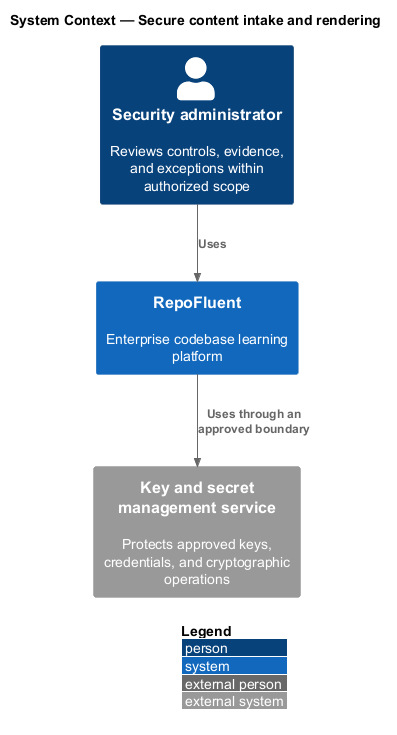
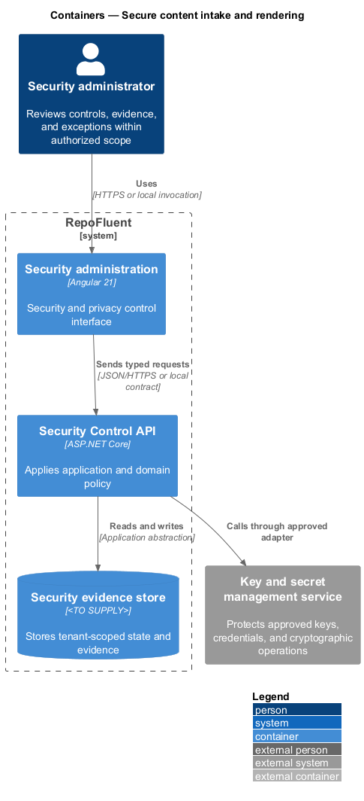
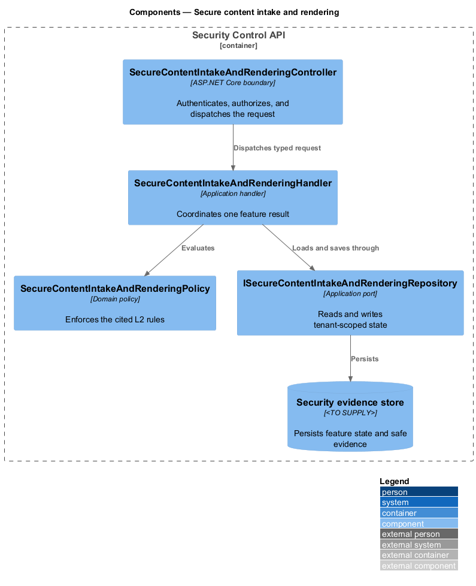
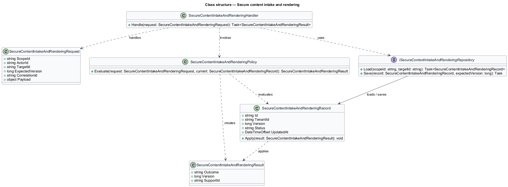
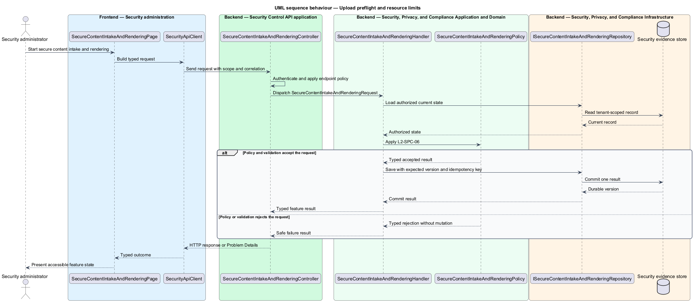
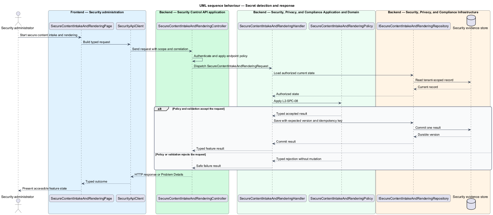

# Secure content intake and rendering

## Overview

RepoFluent's Security, Privacy, and Compliance subsystem protects customer data and establishes security, privacy, retention, and release controls. This feature
brings *upload preflight and resource limits*, *active-content sanitization*, *secret detection and response* into one vertical slice. The slice preserves tenant,
actor, version, authorization, and correlation context wherever the cited
requirements apply.

The security administrator starts the outcome through Security administration.
Security Control API applies server-side policy before state is read or changed.
The external dependency and persistent technology remain `<TO SUPPLY>` where
the requirements baseline does not select them.

## Description

The greenfield slice introduces the following building blocks. The endpoint
route, deployment topology, and unresolved provider choices remain `<TO SUPPLY>`.

- **`SecureContentIntakeAndRenderingPage`** — Angular 21 entry component that presents
  the feature state and submits a typed intent.
- **`SecurityApiClient`** — typed client that carries tenant, actor, version,
  idempotency, and correlation context required by the operation.
- **`SecureContentIntakeAndRenderingController`** — ASP.NET Core boundary that authenticates
  the caller, applies endpoint policy, and dispatches `SecureContentIntakeAndRenderingRequest`.
- **`SecureContentIntakeAndRenderingRequest`** — application request containing scope, actor, target,
  expected version, correlation identifier, and feature payload.
- **`SecureContentIntakeAndRenderingHandler`** — application handler that loads authorized state,
  invokes `SecureContentIntakeAndRenderingPolicy`, and commits one result.
- **`SecureContentIntakeAndRenderingPolicy`** — domain policy that evaluates the cited L2 rules without
  relying on client presentation state.
- **`ISecureContentIntakeAndRenderingRepository`** — application abstraction for tenant-scoped reads,
  writes, optimistic concurrency, and idempotency lookup.
- **`SecureContentIntakeAndRenderingRecord`** — persisted feature record containing identity, tenant,
  version, status, timestamps, and safe evidence references.

## Requirements

The feature realizes the following level-2 (L2) requirements. Each row cites
the first L1 identifier named by the source requirement as its primary parent.

| L2 ID | Refines (L1) | Requirement |
|-------|--------------|-------------|
| `L2-SPC-06` | `L1-SPC-04` | Before parsing/import, uploads shall enforce authentication, authorization, content length, type/magic checks, archive traversal/bomb protection, entity/nesting/string limits, malware/secret rules as approved, and rate/concurrency limits. Failures shall not create partial domain data. |
| `L2-SPC-07` | `L1-SPC-04` | Renderable curriculum and user-generated content shall use allow-listed structured rendering and context-appropriate output encoding/sanitization. Arbitrary HTML, scripts, event handlers, dangerous URLs, macros, embedded executables, and undeclared remote resources shall not execute or load. |
| `L2-SPC-08` | `L1-SPC-04` | Preflight validation shall scan package content and excerpts for configured high-confidence secret patterns and forbidden credential material. A suspected secret shall block publication/intake according to policy, prevent value echoing, and provide secure remediation/incident guidance. |

## Diagrams

### System context

The security administrator uses RepoFluent to complete the feature outcome.
RepoFluent interacts with Key and secret management service only through the boundary
described by the requirements and approved configuration.

### Containers

Security administration sends typed requests to Security Control API. The API applies
server-owned rules and records the accepted outcome in Security evidence store.

### Components

`SecureContentIntakeAndRenderingController` dispatches `SecureContentIntakeAndRenderingRequest` to `SecureContentIntakeAndRenderingHandler`. The handler
uses `SecureContentIntakeAndRenderingPolicy` and `ISecureContentIntakeAndRenderingRepository` before it commits a state change.

### Class structure

`SecureContentIntakeAndRenderingHandler` depends on the request, policy, and repository abstractions.
`ISecureContentIntakeAndRenderingRepository` stores `SecureContentIntakeAndRenderingRecord` under tenant and version context.

### Behaviour — upload preflight and resource limits

The sequence applies `L2-SPC-06` before the handler persists an accepted result. A rejected policy or validation result returns without a state change.

### Behaviour — active-content sanitization

The sequence applies `L2-SPC-07` before the handler persists an accepted result. A rejected policy or validation result returns without a state change.

### Behaviour — secret detection and response

The sequence applies `L2-SPC-08` before the handler persists an accepted result. A rejected policy or validation result returns without a state change.

