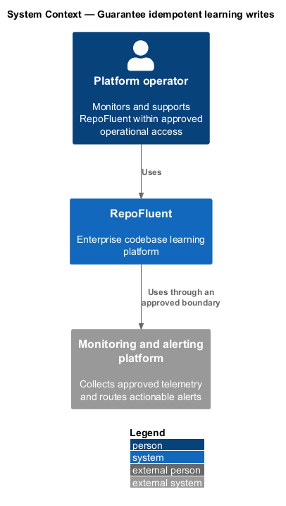
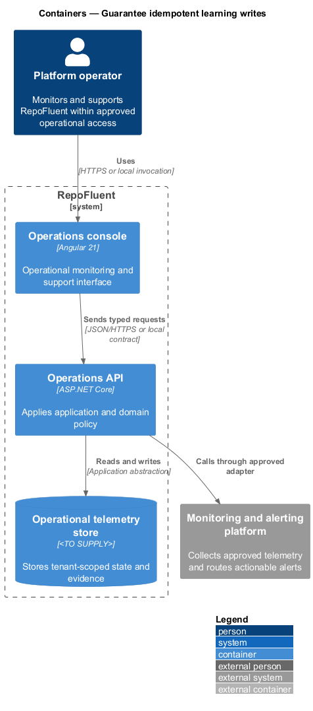
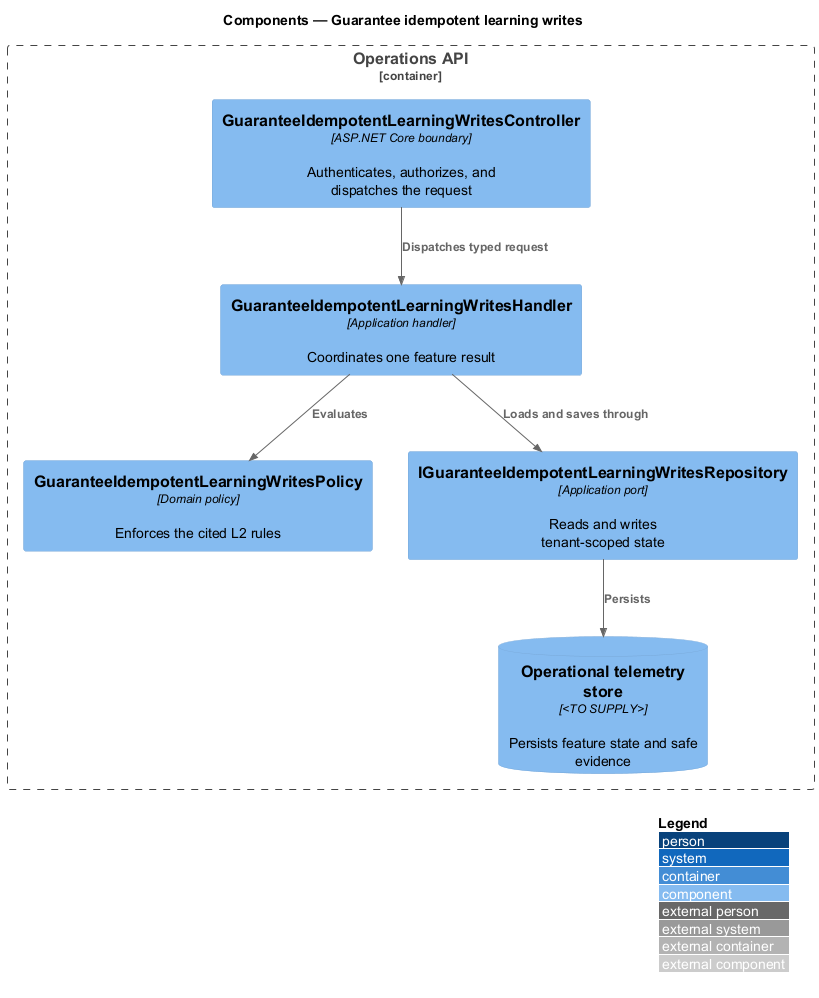
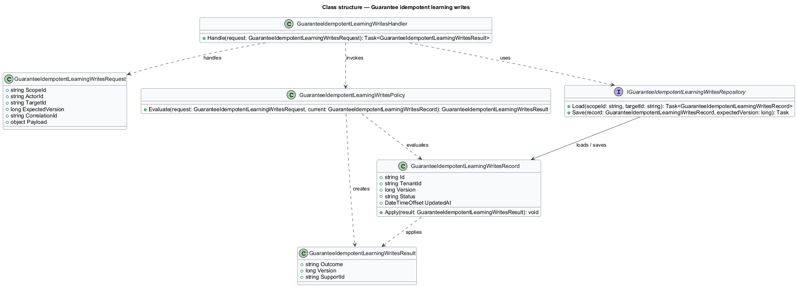
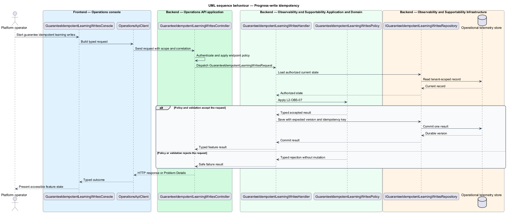

# Guarantee idempotent learning writes

## Overview

RepoFluent's Observability and Supportability subsystem provides telemetry, diagnosis, reliability controls, recovery evidence, and operational release gates. This feature
brings *progress-write idempotency*, *assessment-submission idempotency* into one vertical slice. The slice preserves tenant,
actor, version, authorization, and correlation context wherever the cited
requirements apply.

The platform operator starts the outcome through Operations console.
Operations API applies server-side policy before state is read or changed.
The external dependency and persistent technology remain `<TO SUPPLY>` where
the requirements baseline does not select them.

## Description

The greenfield slice introduces the following building blocks. The endpoint
route, deployment topology, and unresolved provider choices remain `<TO SUPPLY>`.

- **`GuaranteeIdempotentLearningWritesConsole`** — Angular 21 entry component that presents
  the feature state and submits a typed intent.
- **`OperationsApiClient`** — typed client that carries tenant, actor, version,
  idempotency, and correlation context required by the operation.
- **`GuaranteeIdempotentLearningWritesController`** — ASP.NET Core boundary that authenticates
  the caller, applies endpoint policy, and dispatches `GuaranteeIdempotentLearningWritesRequest`.
- **`GuaranteeIdempotentLearningWritesRequest`** — application request containing scope, actor, target,
  expected version, correlation identifier, and feature payload.
- **`GuaranteeIdempotentLearningWritesHandler`** — application handler that loads authorized state,
  invokes `GuaranteeIdempotentLearningWritesPolicy`, and commits one result.
- **`GuaranteeIdempotentLearningWritesPolicy`** — domain policy that evaluates the cited L2 rules without
  relying on client presentation state.
- **`IGuaranteeIdempotentLearningWritesRepository`** — application abstraction for tenant-scoped reads,
  writes, optimistic concurrency, and idempotency lookup.
- **`GuaranteeIdempotentLearningWritesRecord`** — persisted feature record containing identity, tenant,
  version, status, timestamps, and safe evidence references.

## Requirements

The feature realizes the following level-2 (L2) requirements. Each row cites
the first L1 identifier named by the source requirement as its primary parent.

| L2 ID | Refines (L1) | Requirement |
|-------|--------------|-------------|
| `L2-OBS-07` | `L1-OBS-06` | Progress commands shall carry a client event/idempotency identifier and version context, persist atomically, deduplicate replay, and resolve out-of-order updates without regressing durable completion. The service shall return a durable acknowledgement or a retry-safe failure. |
| `L2-OBS-08` | `L1-OBS-06` | Final submission shall be atomic and keyed to attempt plus idempotency identity. Retry shall return the existing submission/result or current processing state. A failure between persistence and response shall not create a second result or consume another attempt. |

## Diagrams

### System context

The platform operator uses RepoFluent to complete the feature outcome.
RepoFluent interacts with Monitoring and alerting platform only through the boundary
described by the requirements and approved configuration.

### Containers

Operations console sends typed requests to Operations API. The API applies
server-owned rules and records the accepted outcome in Operational telemetry store.

### Components

`GuaranteeIdempotentLearningWritesController` dispatches `GuaranteeIdempotentLearningWritesRequest` to `GuaranteeIdempotentLearningWritesHandler`. The handler
uses `GuaranteeIdempotentLearningWritesPolicy` and `IGuaranteeIdempotentLearningWritesRepository` before it commits a state change.

### Class structure

`GuaranteeIdempotentLearningWritesHandler` depends on the request, policy, and repository abstractions.
`IGuaranteeIdempotentLearningWritesRepository` stores `GuaranteeIdempotentLearningWritesRecord` under tenant and version context.

### Behaviour — progress-write idempotency

The sequence applies `L2-OBS-07` before the handler persists an accepted result. A rejected policy or validation result returns without a state change.

### Behaviour — assessment-submission idempotency

The sequence applies `L2-OBS-08` before the handler persists an accepted result. A rejected policy or validation result returns without a state change.

