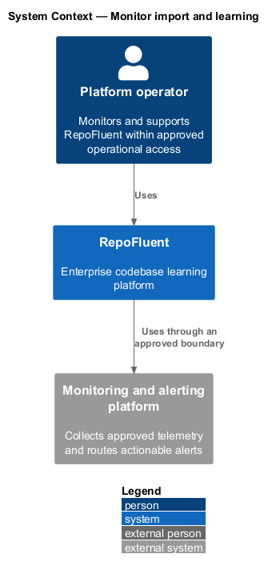
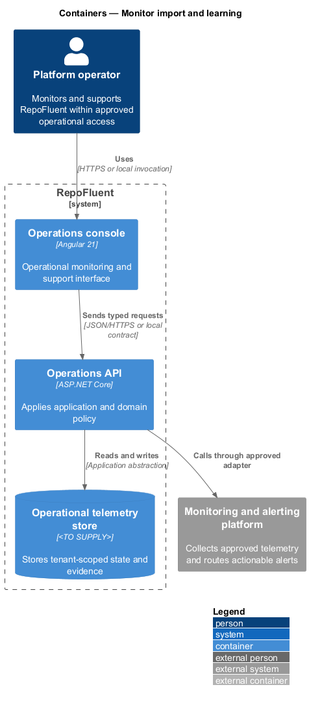
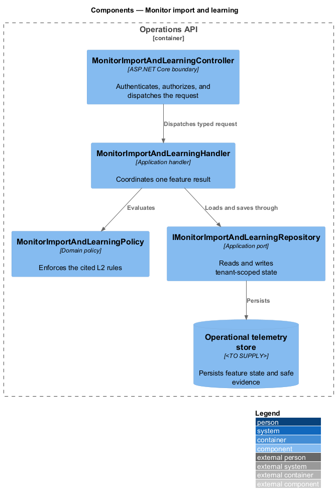
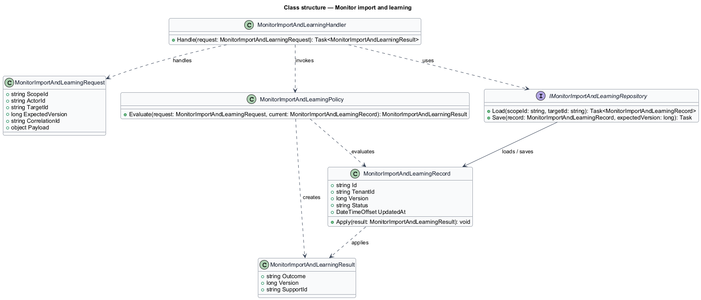
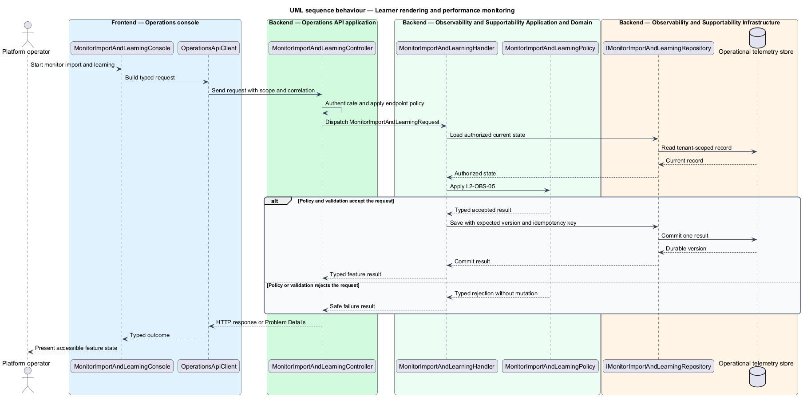
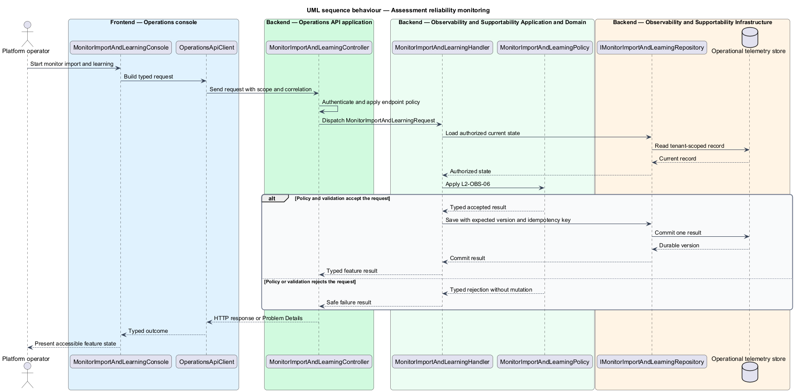

# Monitor import and learning

## Overview

RepoFluent's Observability and Supportability subsystem provides telemetry, diagnosis, reliability controls, recovery evidence, and operational release gates. This feature
brings *import and lifecycle monitoring*, *learner rendering and performance monitoring*, *assessment reliability monitoring* into one vertical slice. The slice preserves tenant,
actor, version, authorization, and correlation context wherever the cited
requirements apply.

The platform operator starts the outcome through Operations console.
Operations API applies server-side policy before state is read or changed.
The external dependency and persistent technology remain `<TO SUPPLY>` where
the requirements baseline does not select them.

## Description

The greenfield slice introduces the following building blocks. The endpoint
route, deployment topology, and unresolved provider choices remain `<TO SUPPLY>`.

- **`MonitorImportAndLearningConsole`** — Angular 21 entry component that presents
  the feature state and submits a typed intent.
- **`OperationsApiClient`** — typed client that carries tenant, actor, version,
  idempotency, and correlation context required by the operation.
- **`MonitorImportAndLearningController`** — ASP.NET Core boundary that authenticates
  the caller, applies endpoint policy, and dispatches `MonitorImportAndLearningRequest`.
- **`MonitorImportAndLearningRequest`** — application request containing scope, actor, target,
  expected version, correlation identifier, and feature payload.
- **`MonitorImportAndLearningHandler`** — application handler that loads authorized state,
  invokes `MonitorImportAndLearningPolicy`, and commits one result.
- **`MonitorImportAndLearningPolicy`** — domain policy that evaluates the cited L2 rules without
  relying on client presentation state.
- **`IMonitorImportAndLearningRepository`** — application abstraction for tenant-scoped reads,
  writes, optimistic concurrency, and idempotency lookup.
- **`MonitorImportAndLearningRecord`** — persisted feature record containing identity, tenant,
  version, status, timestamps, and safe evidence references.

## Requirements

The feature realizes the following level-2 (L2) requirements. Each row cites
the first L1 identifier named by the source requirement as its primary parent.

| L2 ID | Refines (L1) | Requirement |
|-------|--------------|-------------|
| `L2-OBS-04` | `L1-OBS-03` | Dashboards/alerts shall track package intake volume, rejection by category, validation failure/warning rate, processing latency, queue age, job success/retry/failure, preview/publication failures, and stale jobs, segmented safely by version/environment and tenant only where authorized. |
| `L2-OBS-05` | `L1-OBS-03` | Real-user and synthetic monitoring shall measure learner-shell usability, interaction latency, renderer errors, fallback/GPU capability, long tasks, and critical route availability under the defined browser/profile. Metrics shall support p75 budget evaluation and release/version comparison. |
| `L2-OBS-06` | `L1-OBS-03` | Monitoring shall track attempt start/save/submit/grade success, latency, retries, idempotency replays, conflicts, timeouts, feedback-release failures, and stuck grading work. Alerts shall prioritize risk of learner response/evidence loss or duplicate grading. |

## Diagrams

### System context

The platform operator uses RepoFluent to complete the feature outcome.
RepoFluent interacts with Monitoring and alerting platform only through the boundary
described by the requirements and approved configuration.

### Containers

Operations console sends typed requests to Operations API. The API applies
server-owned rules and records the accepted outcome in Operational telemetry store.

### Components

`MonitorImportAndLearningController` dispatches `MonitorImportAndLearningRequest` to `MonitorImportAndLearningHandler`. The handler
uses `MonitorImportAndLearningPolicy` and `IMonitorImportAndLearningRepository` before it commits a state change.

### Class structure

`MonitorImportAndLearningHandler` depends on the request, policy, and repository abstractions.
`IMonitorImportAndLearningRepository` stores `MonitorImportAndLearningRecord` under tenant and version context.

### Behaviour — import and lifecycle monitoring

The sequence applies `L2-OBS-04` before the handler persists an accepted result. A rejected policy or validation result returns without a state change.

### Behaviour — learner rendering and performance monitoring

The sequence applies `L2-OBS-05` before the handler persists an accepted result. A rejected policy or validation result returns without a state change.

### Behaviour — assessment reliability monitoring

The sequence applies `L2-OBS-06` before the handler persists an accepted result. A rejected policy or validation result returns without a state change.

