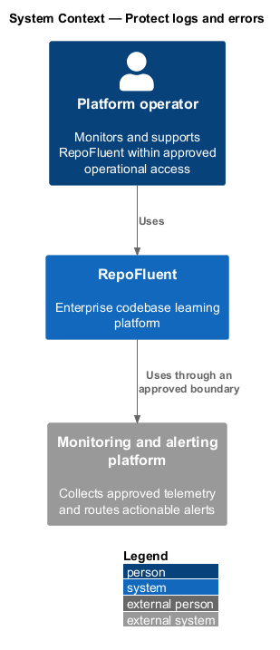
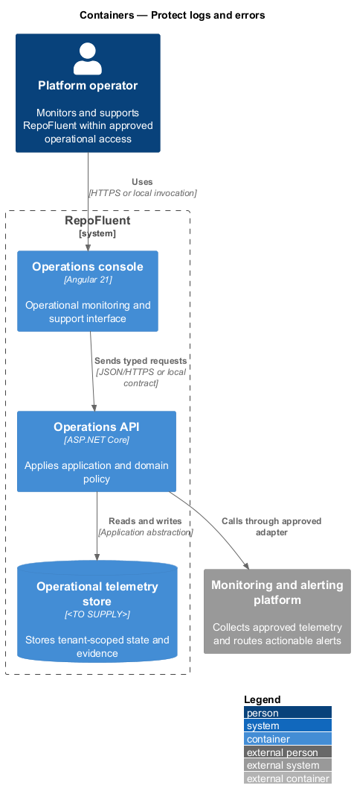
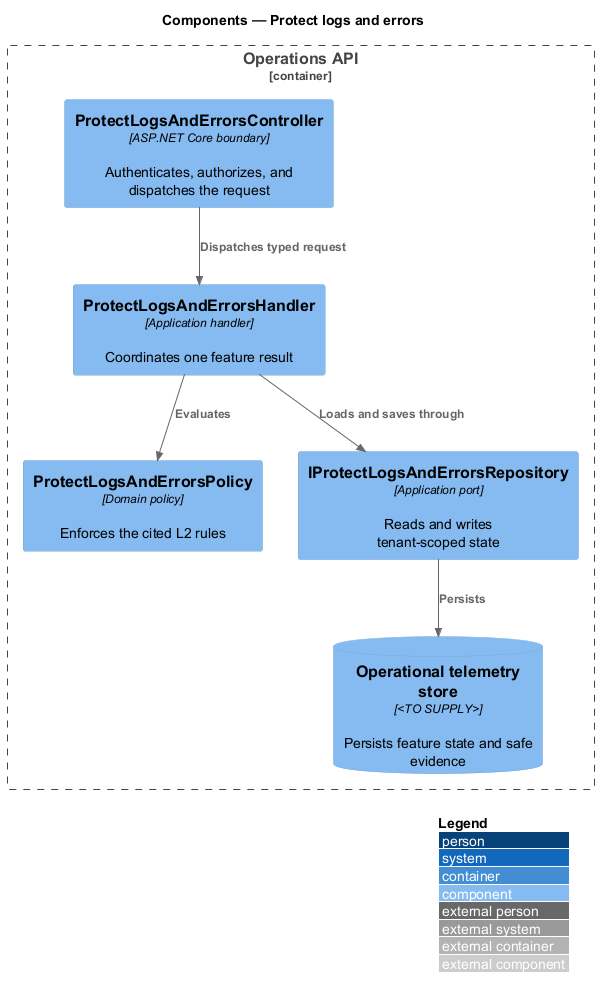
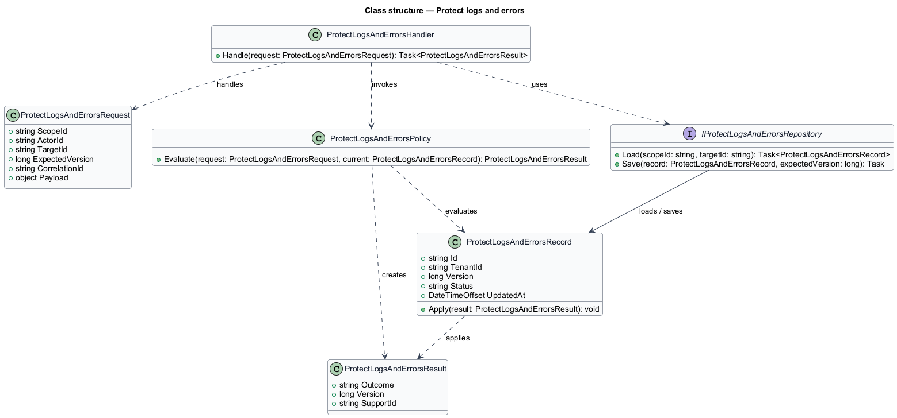
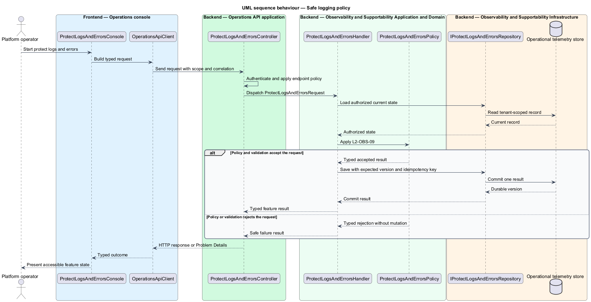
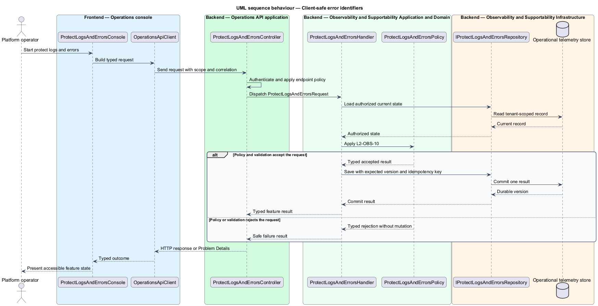

# Protect logs and errors

## Overview

RepoFluent's Observability and Supportability subsystem provides telemetry, diagnosis, reliability controls, recovery evidence, and operational release gates. This feature
brings *safe logging policy*, *client-safe error identifiers* into one vertical slice. The slice preserves tenant,
actor, version, authorization, and correlation context wherever the cited
requirements apply.

The platform operator starts the outcome through Operations console.
Operations API applies server-side policy before state is read or changed.
The external dependency and persistent technology remain `<TO SUPPLY>` where
the requirements baseline does not select them.

## Description

The greenfield slice introduces the following building blocks. The endpoint
route, deployment topology, and unresolved provider choices remain `<TO SUPPLY>`.

- **`ProtectLogsAndErrorsConsole`** — Angular 21 entry component that presents
  the feature state and submits a typed intent.
- **`OperationsApiClient`** — typed client that carries tenant, actor, version,
  idempotency, and correlation context required by the operation.
- **`ProtectLogsAndErrorsController`** — ASP.NET Core boundary that authenticates
  the caller, applies endpoint policy, and dispatches `ProtectLogsAndErrorsRequest`.
- **`ProtectLogsAndErrorsRequest`** — application request containing scope, actor, target,
  expected version, correlation identifier, and feature payload.
- **`ProtectLogsAndErrorsHandler`** — application handler that loads authorized state,
  invokes `ProtectLogsAndErrorsPolicy`, and commits one result.
- **`ProtectLogsAndErrorsPolicy`** — domain policy that evaluates the cited L2 rules without
  relying on client presentation state.
- **`IProtectLogsAndErrorsRepository`** — application abstraction for tenant-scoped reads,
  writes, optimistic concurrency, and idempotency lookup.
- **`ProtectLogsAndErrorsRecord`** — persisted feature record containing identity, tenant,
  version, status, timestamps, and safe evidence references.

## Requirements

The feature realizes the following level-2 (L2) requirements. Each row cites
the first L1 identifier named by the source requirement as its primary parent.

| L2 ID | Refines (L1) | Requirement |
|-------|--------------|-------------|
| `L2-OBS-09` | `L1-OBS-04` | Logging libraries/configuration shall use allow-listed structured fields, centralized redaction, bounded untrusted values, protected log access, retention, and automated secret/payload conformance tests. Source, answers, responses/free text, tokens, assertions, and credentials shall be prohibited by default. |
| `L2-OBS-10` | `L1-OBS-05` | Unexpected or supportable failures shall return a non-secret, non-sequential support identifier or safe correlation reference with user-appropriate recovery guidance. Internal diagnostics shall map it to component/time/category/trace. Stack traces and internal topology shall not be returned to clients. |

## Diagrams

### System context

The platform operator uses RepoFluent to complete the feature outcome.
RepoFluent interacts with Monitoring and alerting platform only through the boundary
described by the requirements and approved configuration.

### Containers

Operations console sends typed requests to Operations API. The API applies
server-owned rules and records the accepted outcome in Operational telemetry store.

### Components

`ProtectLogsAndErrorsController` dispatches `ProtectLogsAndErrorsRequest` to `ProtectLogsAndErrorsHandler`. The handler
uses `ProtectLogsAndErrorsPolicy` and `IProtectLogsAndErrorsRepository` before it commits a state change.

### Class structure

`ProtectLogsAndErrorsHandler` depends on the request, policy, and repository abstractions.
`IProtectLogsAndErrorsRepository` stores `ProtectLogsAndErrorsRecord` under tenant and version context.

### Behaviour — safe logging policy

The sequence applies `L2-OBS-09` before the handler persists an accepted result. A rejected policy or validation result returns without a state change.

### Behaviour — client-safe error identifiers

The sequence applies `L2-OBS-10` before the handler persists an accepted result. A rejected policy or validation result returns without a state change.

