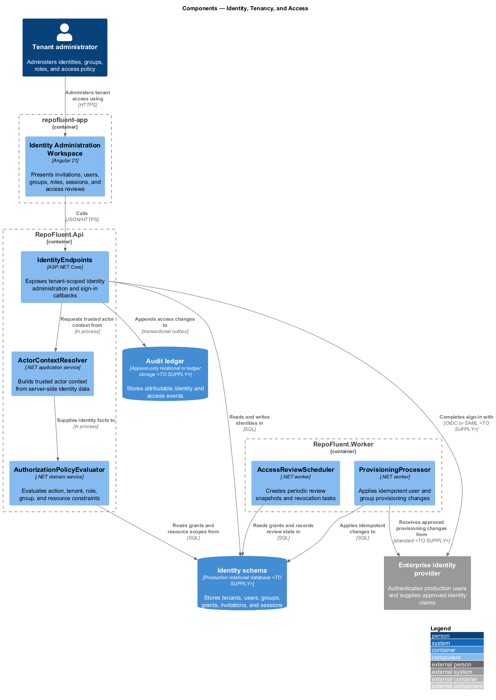
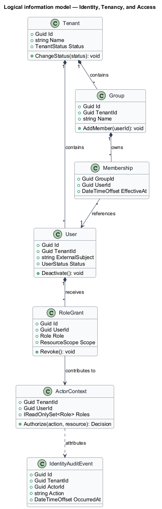
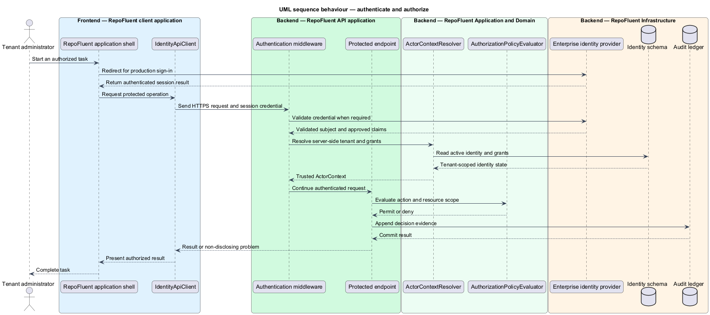

# Identity, Tenancy, and Access

## Overview

The Identity, Tenancy, and Access subsystem establishes the authenticated actor and tenant-scoped authorization context used by every RepoFluent operation. It occupies the
`01-identity-tenancy-access` bounded context defined by the subsystem requirements.

The subsystem owns tenants, users, groups, memberships, role grants, invitations, sessions, policy evaluation, provisioning adapters, and identity audit evidence. Domain permissions remain defined by the subsystem that owns each protected resource.

The subsystem uses these local terms:

- **tenant** — security and data-isolation boundary for one customer organization
- **actor context** — server-derived tenant, user, role, group, and resource-scope facts attached to one operation
- **resource scope** — constraint that limits a role grant to named teams, curricula, systems, or repository classifications

## Description

### Architectural boundary

The subsystem is a logical module in the RepoFluent modular platform. Frontend
components live in the single `repofluent-app` Angular application. Synchronous
commands and queries enter through `RepoFluent.Api`. Long-running or retryable
work runs in `RepoFluent.Worker`. The platform [context, container, subsystem,
and deployment views](../) define the shared runtime around this module.

### Deployable mapping

| Deployment unit | Component | Responsibility | Delivery state |
| --- | --- | --- | --- |
| `repofluent-app` | `Identity Administration Workspace` | Presents invitations, users, groups, roles, sessions, and access reviews | Target platform |
| `RepoFluent.Api` | `IdentityEndpoints` | Exposes tenant-scoped identity administration and sign-in callbacks | Target platform |
| `RepoFluent.Api` | `ActorContextResolver` | Builds trusted actor context from server-side identity data | Foundation implemented |
| `RepoFluent.Api` | `AuthorizationPolicyEvaluator` | Evaluates action, tenant, role, group, and resource constraints | Target platform |
| `RepoFluent.Worker` | `ProvisioningProcessor` | Applies idempotent user and group provisioning changes | Target platform |
| `RepoFluent.Worker` | `AccessReviewScheduler` | Creates periodic review snapshots and revocation tasks | Target platform |

### Information ownership

| Record group | Authoritative or derived store | Purpose |
| --- | --- | --- |
| Identity state | `Identity schema` | Stores tenants, users, groups, grants, invitations, and sessions |
| Identity audit evidence | `Audit ledger` | Stores attributable identity and access events |

- The identity schema is authoritative for RepoFluent tenant membership and authorization grants.
- The enterprise identity provider remains authoritative for external authentication and selected directory attributes.
- Every persisted identity record carries a platform-generated tenant identifier; client-supplied tenant identifiers never establish access.

### Collaborations

- Every API module consumes `ActorContext` and the central policy evaluator before protected state is read.
- Administration coordinates user and group workflows through this subsystem rather than writing identity tables directly.
- Security owns cross-platform control policy; Observability owns redacted authentication and authorization telemetry.

### Decisions and delivery status

- Production identity provider, federation protocol, and provisioning protocol — `<TO SUPPLY>`.
- Session transport, token lifetime, revocation propagation, and step-up authentication policy — `<TO SUPPLY>`.
- The current development persona scheme remains confined to Development, Testing, and E2E environments.

`DevelopmentAuthenticationHandler`, `DevelopmentUserDirectory`, and `ActorContext` provide bounded evidence for the current vertical slice. Production federation, session storage, provisioning, and access-review components remain target architecture.

## Diagrams

### Component view

The platform context and container views apply to every subsystem and are not
repeated here. This component view shows the subsystem parts, their deployment
homes, owned stores, and external collaborators.

### Information model

The information model names the durable records and value relationships owned or
consumed by the subsystem. Storage-provider details remain outside this logical
view.

### Primary behaviour — authenticate and authorize

The sequence shows the principal subsystem behaviour across the frontend,
API, application/domain, and infrastructure boundaries. Alternate paths appear
where they change security, persistence, or user-visible outcomes.

