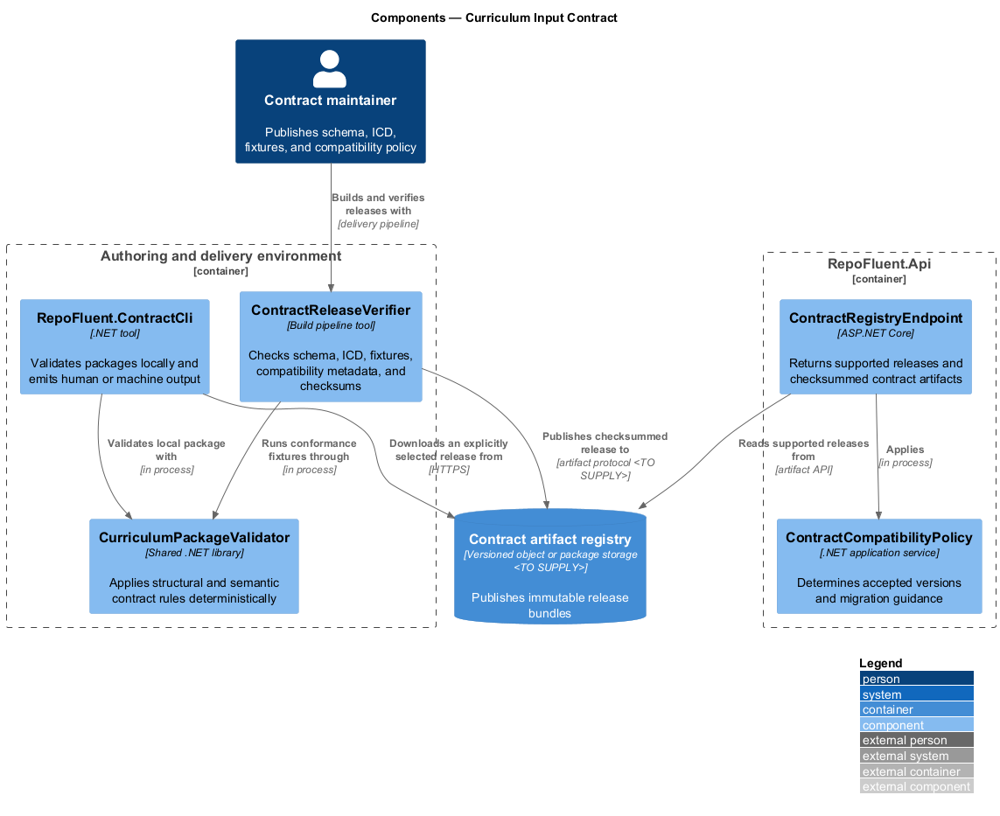
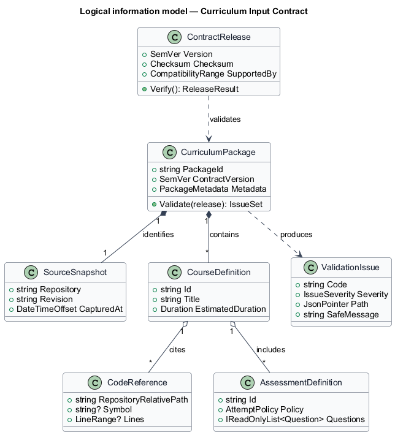
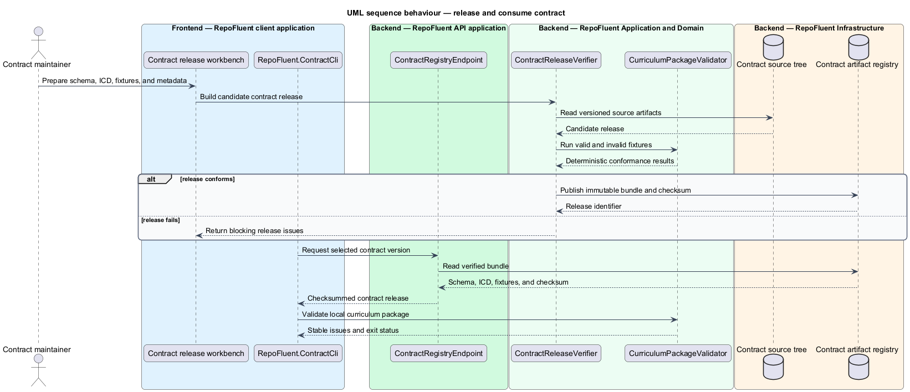

# Curriculum Input Contract

## Overview

The Curriculum Input Contract subsystem defines the portable and versioned exchange boundary between content-producing agents and RepoFluent. It occupies the
`02-curriculum-input-contract` bounded context defined by the subsystem requirements.

The subsystem owns the JSON Schema, Interface Control Document, canonical formats, stable validation vocabulary, compatibility rules, extension mechanism, and conformance fixtures. It does not run agents, import tenant drafts, or render learner content.

The subsystem uses these local terms:

- **contract release** — immutable set of schema, ICD, fixtures, compatibility metadata, and checksums for one version
- **curriculum package** — portable JSON document that describes source provenance, architecture, learning content, code references, and assessments
- **validation issue** — stable code, severity, JSON Pointer, and safe explanation produced by contract validation

## Description

### Architectural boundary

The subsystem is a logical module in the RepoFluent modular platform. Frontend
components live in the single `repofluent-app` Angular application. Synchronous
commands and queries enter through `RepoFluent.Api`. Long-running or retryable
work runs in `RepoFluent.Worker`. The platform [context, container, subsystem,
and deployment views](../) define the shared runtime around this module.

### Deployable mapping

| Deployment unit | Component | Responsibility | Delivery state |
| --- | --- | --- | --- |
| `RepoFluent.Api` | `ContractRegistryEndpoint` | Returns supported releases and checksummed contract artifacts | Target platform |
| `RepoFluent.Api` | `ContractCompatibilityPolicy` | Determines accepted versions and migration guidance | Target platform |
| Authoring or delivery tool | `RepoFluent.ContractCli` | Validates packages locally and emits human or machine output | Target executable |
| Authoring or delivery tool | `CurriculumPackageValidator` | Applies structural and semantic contract rules deterministically | Foundation implemented |
| Authoring or delivery tool | `ContractReleaseVerifier` | Checks schema, ICD, fixtures, compatibility metadata, and checksums | Target delivery tool |

### Information ownership

| Record group | Authoritative or derived store | Purpose |
| --- | --- | --- |
| Contract releases | `Contract artifact registry` | Publishes immutable release bundles |

- The repository path `contracts/curriculum/{version}` is the source representation for contract releases.
- The artifact registry distributes immutable copies identified by semantic version and checksum.
- Validation output excludes secret-like values and unnecessary source excerpts.

### Collaborations

- The Agent Authoring Kit embeds or pins one compatible contract release.
- Curriculum Lifecycle calls the same validator library used by the local CLI.
- Code Navigation and Assessment contribute contract semantics for source and protected-answer structures.

### Decisions and delivery status

- Artifact registry and public or tenant-authenticated distribution mechanism — `<TO SUPPLY>`.
- Supported-version window, package limits, locales, and allowed media types — `<TO SUPPLY>`.
- Contract evolution remains additive within a major version unless an approved migration accompanies a breaking release.

Contract `0.1.0`, its JSON Schema, release notes, and an order-processing fixture exist. `PackageValidator` implements the current vertical-slice subset. The distributable CLI and release registry remain target components.

## Diagrams

### Component view

The platform context and container views apply to every subsystem and are not
repeated here. This component view shows the subsystem parts, their deployment
homes, owned stores, and external collaborators.

### Information model

The information model names the durable records and value relationships owned or
consumed by the subsystem. Storage-provider details remain outside this logical
view.

### Primary behaviour — release and consume contract

The sequence shows the principal subsystem behaviour across the frontend,
API, application/domain, and infrastructure boundaries. Alternate paths appear
where they change security, persistence, or user-visible outcomes.

