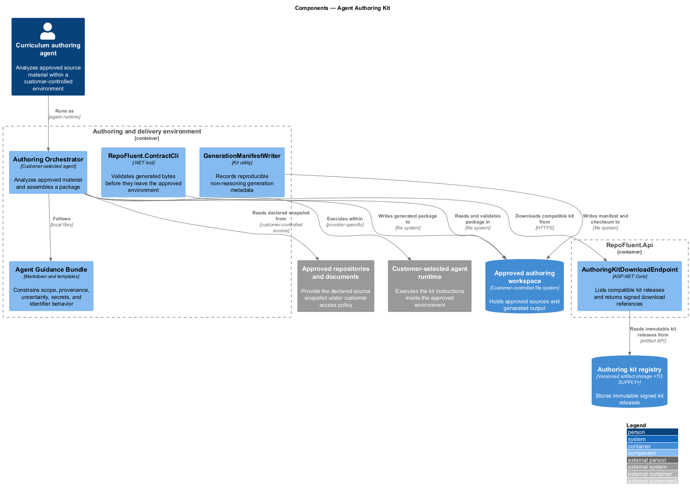
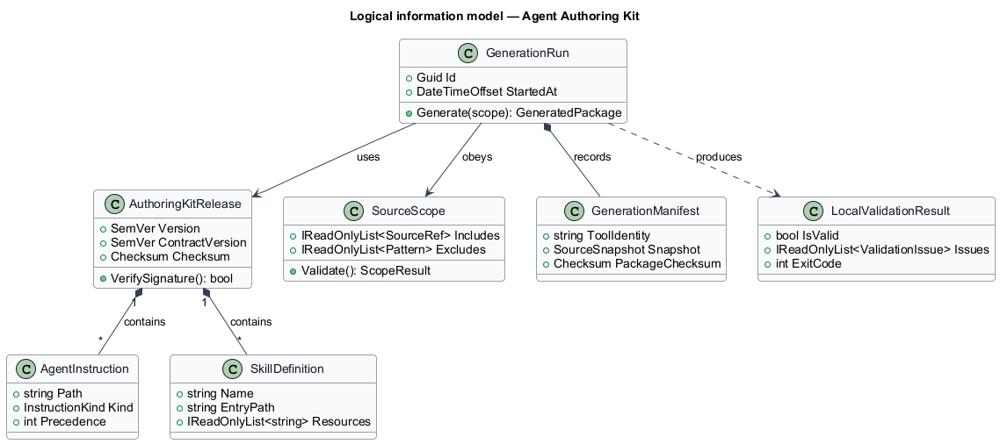
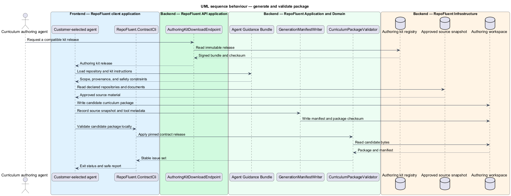

# Agent Authoring Kit

## Overview

The Agent Authoring Kit subsystem packages the guidance and tools that produce a locally validated curriculum package from approved repositories and documents. It occupies the
`03-agent-authoring-kit` bounded context defined by the subsystem requirements.

The subsystem owns `AGENTS.md`, reusable prompts, `SKILL.md` files, ecosystem guidance, examples, local validation integration, and the generation manifest. Customer repository access, model selection, and agent execution remain outside RepoFluent MVP hosting.

The subsystem uses these local terms:

- **authoring kit** — immutable release bundle containing agent guidance, prompts, skills, contract artifacts, examples, and validator tooling
- **source scope** — declared repositories, documents, revisions, inclusions, and exclusions available to one generation run
- **generation manifest** — non-reasoning record of tool identity, source snapshot, timestamps, compatibility versions, and package checksum

## Description

### Architectural boundary

The subsystem is a logical module in the RepoFluent modular platform. Frontend
components live in the single `repofluent-app` Angular application. Synchronous
commands and queries enter through `RepoFluent.Api`. Long-running or retryable
work runs in `RepoFluent.Worker`. The platform [context, container, subsystem,
and deployment views](../) define the shared runtime around this module.

### Deployable mapping

| Deployment unit | Component | Responsibility | Delivery state |
| --- | --- | --- | --- |
| `RepoFluent.Api` | `AuthoringKitEndpoints` | Returns a verified release manifest and allow-listed artifacts | Implemented prerelease |
| Authoring or delivery tool | `Agent Guidance Bundle` | Constrains scope, provenance, uncertainty, secrets, and identifier behavior | Implemented in release `0.1.0` |
| Authoring or delivery tool | `Source-scope preflight` | Resolves repository guidance, effective files, exclusions, and redacted secret findings before analysis | Implemented in release `0.1.0` |
| Authoring or delivery tool | `Authoring Orchestrator` | Analyzes approved material and assembles a package | Customer environment |
| Authoring or delivery tool | `validate.mjs` | Validates generated bytes with the bundled contract before they leave the approved environment | Implemented in release `0.1.0` |
| Authoring or delivery tool | `GenerationManifestWriter` | Records reproducible non-reasoning generation metadata | Target tool |

### Information ownership

| Record group | Authoritative or derived store | Purpose |
| --- | --- | --- |
| Kit releases | `Authoring kit registry` | Stores immutable signed kit releases |
| Customer source and generated package | `Approved authoring workspace` | Holds approved sources and generated output |

- The kit registry is authoritative for immutable kit releases and their compatible contract versions.
- The approved authoring workspace remains authoritative for customer source access and generated bytes before upload.
- RepoFluent receives no source, prompt, or package content during local generation unless an authorized author later uploads the result.

### Collaborations

- Curriculum Input Contract supplies the schema, ICD, fixtures, and validator behavior embedded by the kit.
- Curriculum Lifecycle receives the validated package only after an author initiates upload.
- Security supplies scope, secret-handling, data-use, and source-minimization guidance.

### Decisions and delivery status

- Release `0.1.0` is a checksummed directory for Node.js 22. The signing
  mechanism, installation channel, and first supported agent hosts remain
  `<TO SUPPLY>`.
- Managed agent execution remains outside the target runtime until a separate security and deployment decision is approved.
- C# and Angular guidance forms the first ecosystem profile; additional profiles remain additive kit modules.

The repository contains prerelease authoring kit `0.1.0`, public verified
artifact retrieval, dependency-free package validation, and local source-scope
preflight. Managed generation and a signed distribution channel remain outside
the implemented boundary.

## Diagrams

### Component view

The platform context and container views apply to every subsystem and are not
repeated here. This component view shows the subsystem parts, their deployment
homes, owned stores, and external collaborators.

### Information model

The information model names the durable records and value relationships owned or
consumed by the subsystem. Storage-provider details remain outside this logical
view.

### Primary behaviour — generate and validate package

The sequence shows the principal subsystem behaviour across the frontend,
API, application/domain, and infrastructure boundaries. Alternate paths appear
where they change security, persistence, or user-visible outcomes.

