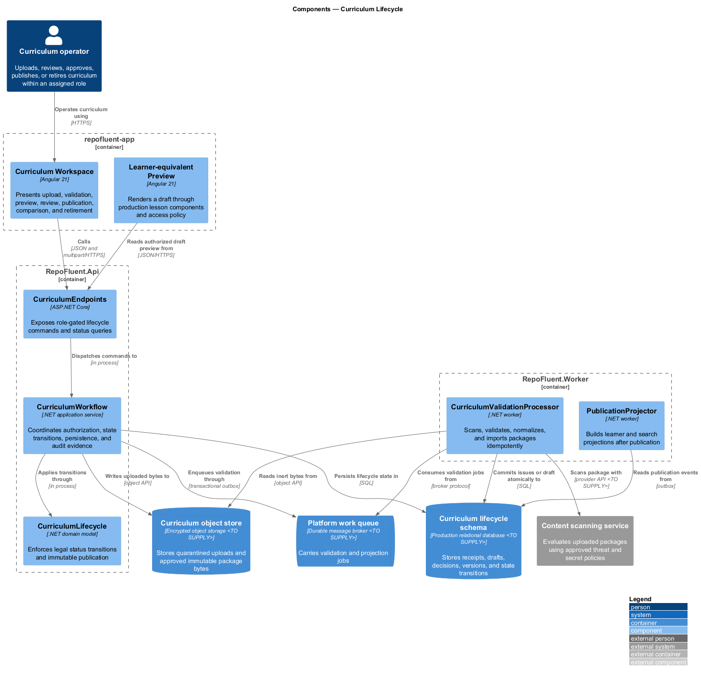
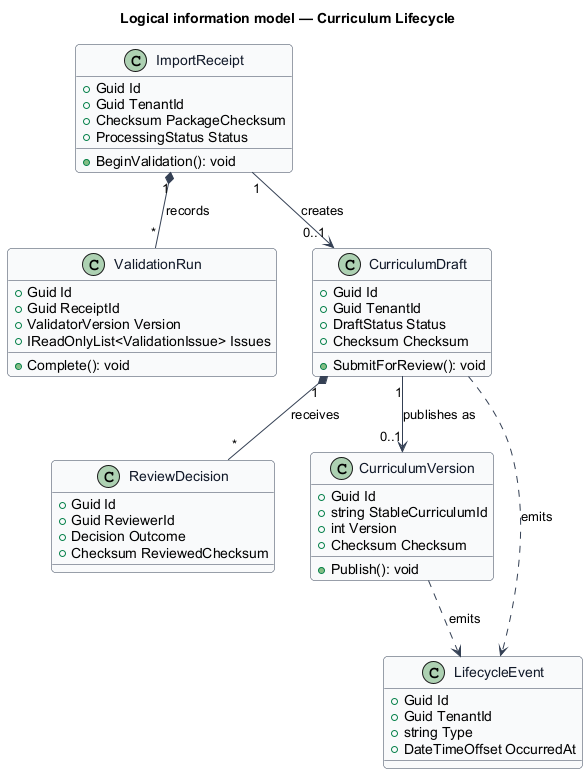
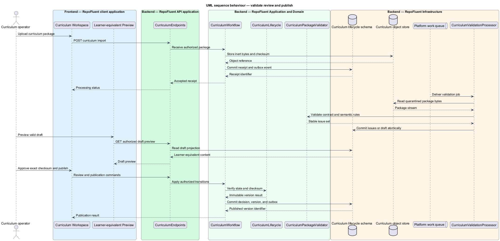

# Curriculum Lifecycle

## Overview

The Curriculum Lifecycle subsystem moves uploaded packages through controlled validation, draft, review, immutable publication, comparison, and retirement. It occupies the
`04-curriculum-lifecycle` bounded context defined by the subsystem requirements.

The subsystem owns import receipts, processing state, validation orchestration, draft identity, review decisions, approval checksums, publication state, version comparison, and retirement. The Curriculum Input Contract defines package semantics, and Learning Experience renders published content.

The subsystem uses these local terms:

- **import receipt** — tenant-scoped acknowledgement that binds uploaded bytes, checksum, actor, and processing state
- **curriculum draft** — mutable review workspace created atomically from a valid package
- **curriculum version** — immutable published snapshot addressed independently from later drafts and releases

## Description

### Architectural boundary

The subsystem is a logical module in the RepoFluent modular platform. Frontend
components live in the single `repofluent-app` Angular application. Synchronous
commands and queries enter through `RepoFluent.Api`. Long-running or retryable
work runs in `RepoFluent.Worker`. The platform [context, container, subsystem,
and deployment views](../) define the shared runtime around this module.

### Deployable mapping

| Deployment unit | Component | Responsibility | Delivery state |
| --- | --- | --- | --- |
| `repofluent-app` | `Curriculum Workspace` | Presents upload, validation, preview, review, publication, comparison, and retirement | Intake, draft identity, replay, preview, warning gate, and review evidence implemented |
| `repofluent-app` | `Learner-equivalent Preview` | Renders a draft through production lesson components and access policy | Production renderer, protected answers, draft context, and write suppression implemented |
| `RepoFluent.Api` | `CurriculumEndpoints` | Exposes role-gated lifecycle commands and status queries | Intake, status, preview, acknowledgement, review decision, and golden path implemented |
| `RepoFluent.Api` | `CurriculumWorkflow` | Coordinates authorization, state transitions, persistence, and audit evidence | Intake, idempotent import, validation, preview, warning gates, and immutable review implemented |
| `RepoFluent.Api` | `CurriculumLifecycle` | Enforces legal status transitions and immutable publication | Review grant and publication foundation implemented |
| `RepoFluent.Worker` | `CurriculumValidationProcessor` | Scans, validates, normalizes, and imports packages idempotently | API-hosted retryable import and versioned validation implemented |
| `RepoFluent.Worker` | `PublicationProjector` | Builds learner and search projections after publication | Target platform |

### Information ownership

| Record group | Authoritative or derived store | Purpose |
| --- | --- | --- |
| Lifecycle state and immutable versions | `Curriculum lifecycle schema` | Stores receipts, drafts, decisions, versions, and state transitions |
| Package blobs | `Curriculum object store` | Stores quarantined uploads and approved immutable package bytes |
| Asynchronous work | `Platform work queue` | Carries validation and projection jobs |

- The lifecycle schema is authoritative for status, review, approval, publication, and retirement.
- The object store retains uploaded and published bytes under classification and retention policy.
- Published versions remain immutable; a content change creates a new draft and version identity.

### Collaborations

- Identity supplies actor and role context for each state transition.
- Curriculum Input Contract supplies deterministic validation semantics.
- Learning, Code Navigation, Assessment, and Analytics consume publication events and immutable version identifiers.
- Administration coordinates assignment after publication; Security governs scan, quarantine, and retention controls.

### Decisions and delivery status

- Production relational provider, object store, broker, and content scanner — `<TO SUPPLY>`.
- The current API-hosted validation loop moves to `RepoFluent.Worker` for production isolation and independent scaling.
- Semantic comparison and visual editing remain post-foundation capabilities within the same lifecycle boundary.

`CurriculumEndpoints`, `CurriculumWorkflow`, `PackageIntakeScanner`, `PackageValidator`, `PackagePresenter`, `CurriculumStore`, EF Core migrations, and `CurriculumValidationWorker` implement the lifecycle foundation with SQLite. Tenant package-version uniqueness converges identical uploads and rejects changed bytes. Retry attempts remain attached to one lifecycle record. Reports bind contract, validator, package, and issue checksums. Preview removes protected answers and performs no learner-state write. `ReviewDecision` binds reviewer, tenant, version, decision, checksums, warning acknowledgement, time, and rationale once. Production infrastructure and the separate worker executable remain target architecture.

## Diagrams

### Component view

The platform context and container views apply to every subsystem and are not
repeated here. This component view shows the subsystem parts, their deployment
homes, owned stores, and external collaborators.

### Information model

The information model names the durable records and value relationships owned or
consumed by the subsystem. Storage-provider details remain outside this logical
view.

### Primary behaviour — validate review and publish

The sequence shows the principal subsystem behaviour across the frontend,
API, application/domain, and infrastructure boundaries. Alternate paths appear
where they change security, persistence, or user-visible outcomes.

