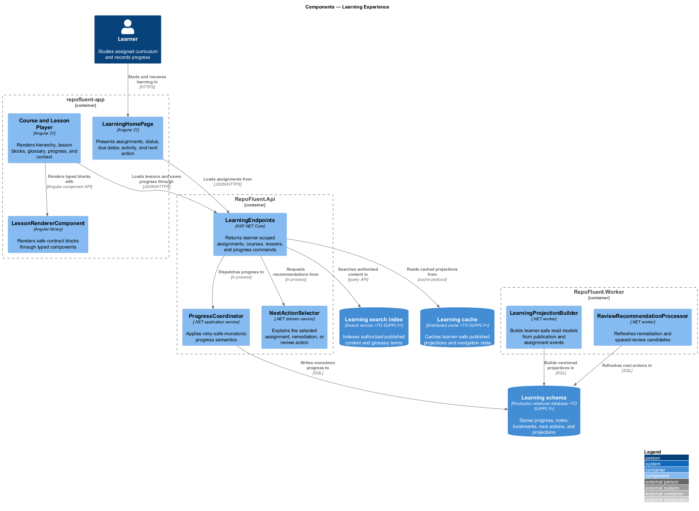
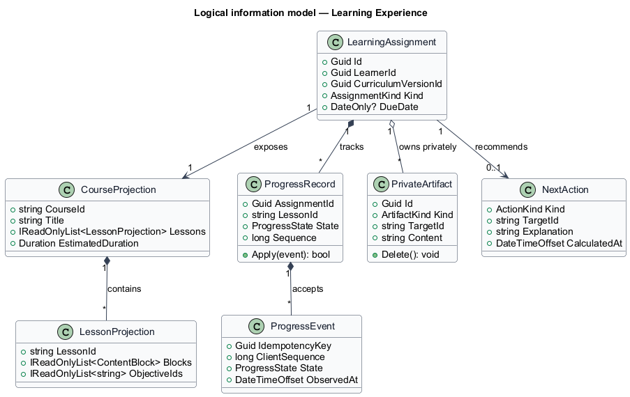
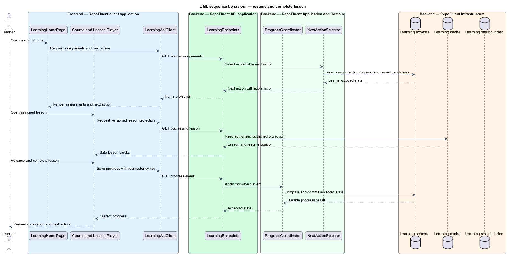

# Learning Experience

## Overview

The Learning Experience subsystem delivers published curriculum as a coherent journey with durable progress, search, context, recommendations, and private learning artifacts. It occupies the
`05-learning-experience` bounded context defined by the subsystem requirements.

The subsystem owns learner home, course and lesson composition, progress semantics, resume behavior, learning search, glossary context, next-action selection, notes, bookmarks, and review recommendations. Code, assessments, source graphs, and analytics calculations remain in their owning subsystems.

The subsystem uses these local terms:

- **learning projection** — learner-safe read model built from an immutable curriculum version and current assignment state
- **progress record** — monotonic durable state that identifies position, completion, version, and last accepted event
- **next action** — explainable recommendation chosen from assigned, remediation, and review work

## Description

### Architectural boundary

The subsystem is a logical module in the RepoFluent modular platform. Frontend
components live in the single `repofluent-app` Angular application. Synchronous
commands and queries enter through `RepoFluent.Api`. Long-running or retryable
work runs in `RepoFluent.Worker`. The platform [context, container, subsystem,
and deployment views](../) define the shared runtime around this module.

### Deployable mapping

| Deployment unit | Component | Responsibility | Delivery state |
| --- | --- | --- | --- |
| `repofluent-app` | `LearningHomePage` | Presents assignments, status, due dates, activity, and next action | Foundation implemented |
| `repofluent-app` | `Course and Lesson Player` | Renders hierarchy, lesson blocks, glossary, progress, and context | Foundation implemented |
| `repofluent-app` | `LessonRendererComponent` | Renders safe contract blocks through typed components | Foundation implemented |
| `RepoFluent.Api` | `LearningEndpoints` | Returns learner-scoped assignments, courses, lessons, and progress commands | Foundation implemented |
| `RepoFluent.Api` | `ProgressCoordinator` | Applies retry-safe monotonic progress semantics | Target platform |
| `RepoFluent.Api` | `NextActionSelector` | Explains the selected assignment, remediation, or review action | Target platform |
| `RepoFluent.Worker` | `LearningProjectionBuilder` | Builds learner-safe read models from publication and assignment events | Target platform |
| `RepoFluent.Worker` | `ReviewRecommendationProcessor` | Refreshes remediation and spaced-review candidates | Target platform |

### Information ownership

| Record group | Authoritative or derived store | Purpose |
| --- | --- | --- |
| Learner records | `Learning schema` | Stores progress, notes, bookmarks, next actions, and projections |
| Search projections | `Learning search index` | Indexes authorized published content and glossary terms |
| Derived cache | `Learning cache` | Caches learner-safe published projections and navigation state |

- The learning schema is authoritative for accepted progress events, private artifacts, and derived next actions.
- Curriculum Lifecycle remains authoritative for published content and version status.
- Search and cache entries are disposable derived projections and preserve tenant, access, and version keys.

### Collaborations

- Administration supplies assignments; Curriculum Lifecycle supplies immutable published versions.
- Code Navigation and Assessment render within the lesson context through typed frontend contracts.
- Assessment supplies remediation and mastery signals; Analytics consumes versioned progress events.
- Experience Platform supplies shell, accessibility, motion, and capability behavior.

### Decisions and delivery status

- Production search and cache providers — `<TO SUPPLY>`.
- Offline behavior, locale model, discussion policy, and spaced-review defaults — `<TO SUPPLY>`.
- Progress uses idempotency keys and server-side monotonic comparison; late older clients do not regress accepted state.

The Angular learning home, course page, lesson page, typed API library, lesson renderer, and API read paths implement the published-course foundation. Durable progress, search, private artifacts, and recommendations remain target components.

## Diagrams

### Component view

The platform context and container views apply to every subsystem and are not
repeated here. This component view shows the subsystem parts, their deployment
homes, owned stores, and external collaborators.

### Information model

The information model names the durable records and value relationships owned or
consumed by the subsystem. Storage-provider details remain outside this logical
view.

### Primary behaviour — resume and complete lesson

The sequence shows the principal subsystem behaviour across the frontend,
API, application/domain, and infrastructure boundaries. Alternate paths appear
where they change security, persistence, or user-visible outcomes.

