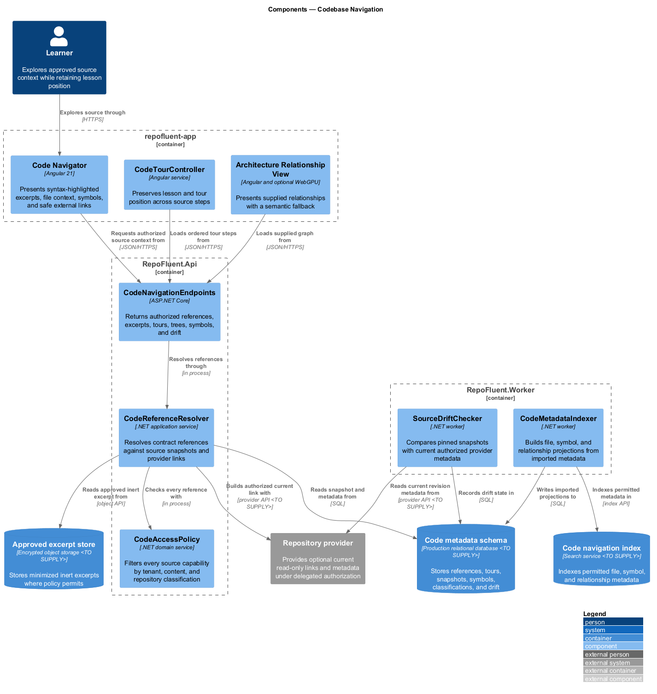
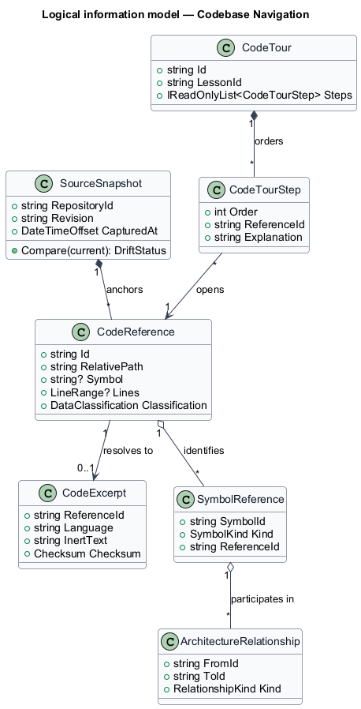
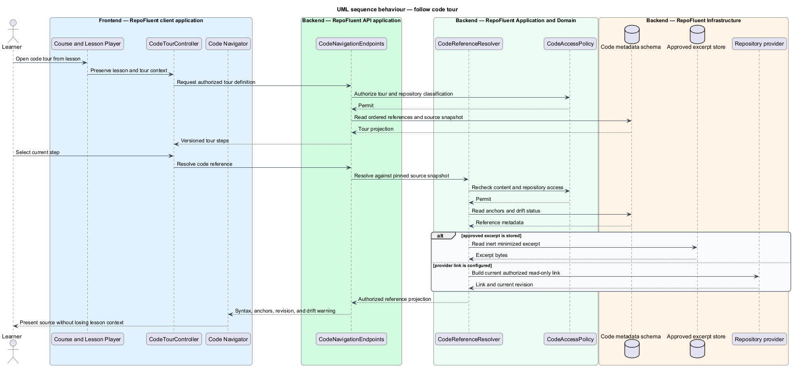

# Codebase Navigation

## Overview

The Codebase Navigation subsystem connects learning content to authorized, revision-aware source excerpts, tours, symbols, and architecture relationships. It occupies the
`06-codebase-navigation` bounded context defined by the subsystem requirements.

The subsystem owns inert excerpt presentation, deep-link resolution, code-tour state, source-snapshot drift, file and symbol projections, and supplied architecture relationships. It does not edit source, execute package code, or perform unbounded static analysis.

The subsystem uses these local terms:

- **code reference** — repository-relative path with optional revision, symbol, and line anchors
- **code tour** — ordered set of source references presented without discarding course and lesson context
- **drift status** — comparison result between the curriculum source snapshot and an available current repository revision

## Description

### Architectural boundary

The subsystem is a logical module in the RepoFluent modular platform. Frontend
components live in the single `repofluent-app` Angular application. Synchronous
commands and queries enter through `RepoFluent.Api`. Long-running or retryable
work runs in `RepoFluent.Worker`. The platform [context, container, subsystem,
and deployment views](../) define the shared runtime around this module.

### Deployable mapping

| Deployment unit | Component | Responsibility | Delivery state |
| --- | --- | --- | --- |
| `repofluent-app` | `Code Navigator` | Presents syntax-highlighted excerpts, file context, symbols, and safe external links | Foundation implemented |
| `repofluent-app` | `CodeTourController` | Preserves lesson and tour position across source steps | Target platform |
| `repofluent-app` | `Architecture Relationship View` | Presents supplied relationships with a semantic fallback | Target platform |
| `RepoFluent.Api` | `CodeNavigationEndpoints` | Returns authorized references, excerpts, tours, trees, symbols, and drift | Target platform |
| `RepoFluent.Api` | `CodeReferenceResolver` | Resolves contract references against source snapshots and provider links | Target platform |
| `RepoFluent.Api` | `CodeAccessPolicy` | Filters every source capability by tenant, content, and repository classification | Target platform |
| `RepoFluent.Worker` | `CodeMetadataIndexer` | Builds file, symbol, and relationship projections from imported metadata | Target platform |
| `RepoFluent.Worker` | `SourceDriftChecker` | Compares pinned snapshots with current authorized provider metadata | Target platform |

### Information ownership

| Record group | Authoritative or derived store | Purpose |
| --- | --- | --- |
| Source metadata | `Code metadata schema` | Stores references, tours, snapshots, symbols, classifications, and drift |
| Source excerpts | `Approved excerpt store` | Stores minimized inert excerpts where policy permits |
| Code projections | `Code navigation index` | Indexes permitted file, symbol, and relationship metadata |

- Curriculum package source snapshots and references form the authoritative learning context.
- The code metadata schema stores platform identifiers separately from package identifiers and provider identifiers.
- Stored excerpts remain minimized, inert, classified, and optional; repository links remain subject to access checks at use time.

### Collaborations

- Curriculum Input Contract defines reference and relationship shapes; Curriculum Lifecycle publishes them immutably.
- Learning Experience owns lesson context while Code Navigation owns source context and tour position.
- Identity and Security enforce repository classification; Experience Platform supplies progressive graph rendering.

### Decisions and delivery status

- Stored excerpt versus provider-link policy and first repository providers — `<TO SUPPLY>`.
- Syntax-highlighting engine, symbol metadata format, and material-drift threshold — `<TO SUPPLY>`.
- WebGPU relationship rendering remains optional and exposes the same information through semantic HTML.

The current contract and lesson renderer carry one repository-relative C# code reference. Full excerpt resolution, tours, symbols, drift checks, search, and provider integrations remain target architecture.

## Diagrams

### Component view

The platform context and container views apply to every subsystem and are not
repeated here. This component view shows the subsystem parts, their deployment
homes, owned stores, and external collaborators.

### Information model

The information model names the durable records and value relationships owned or
consumed by the subsystem. Storage-provider details remain outside this logical
view.

### Primary behaviour — follow code tour

The sequence shows the principal subsystem behaviour across the frontend,
API, application/domain, and infrastructure boundaries. Alternate paths appear
where they change security, persistence, or user-visible outcomes.

