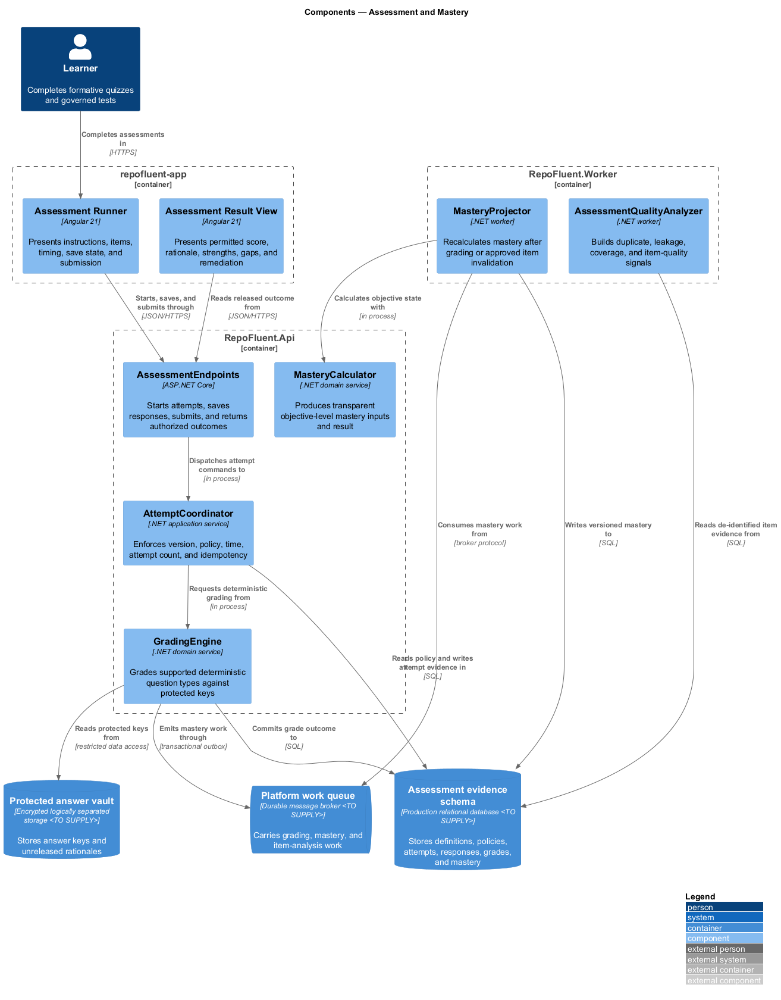
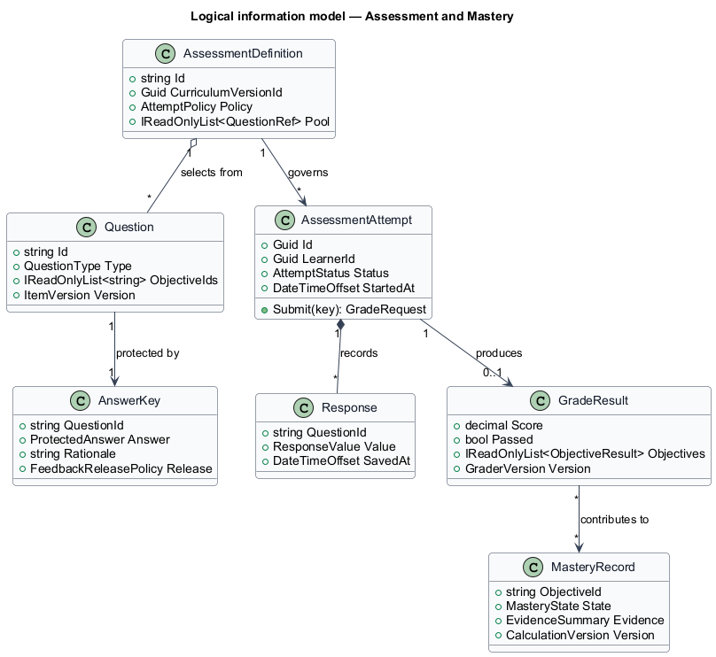
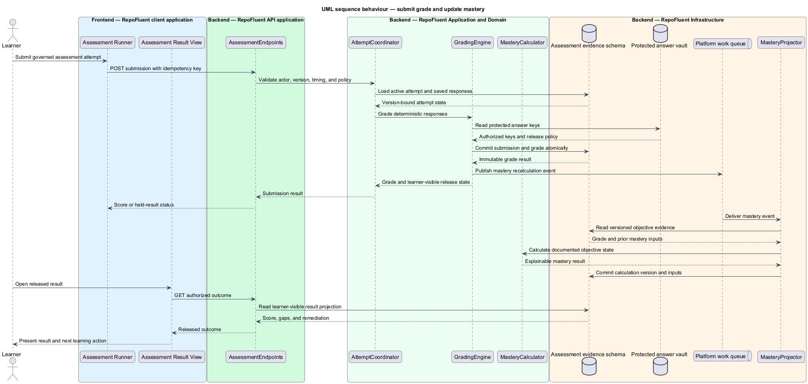

# Assessment and Mastery

## Overview

The Assessment and Mastery subsystem runs assessments, protects answer material, preserves attempt evidence, and derives explainable objective-level mastery. It occupies the
`07-assessment-mastery` bounded context defined by the subsystem requirements.

The subsystem owns assessment delivery, question selection, attempt policy, response persistence, grading, feedback release, item invalidation, objective coverage, and mastery calculation. It does not own course navigation, manager reporting, or external certification.

The subsystem uses these local terms:

- **assessment attempt** — immutable version-bound record of governed timing, selected items, submitted responses, and grading outcome
- **answer vault** — logically separated store that withholds protected answers and rationales until release policy permits access
- **mastery record** — explainable objective-level result derived from documented evidence inputs and calculation version

## Description

### Architectural boundary

The subsystem is a logical module in the RepoFluent modular platform. Frontend
components live in the single `repofluent-app` Angular application. Synchronous
commands and queries enter through `RepoFluent.Api`. Long-running or retryable
work runs in `RepoFluent.Worker`. The platform [context, container, subsystem,
and deployment views](../) define the shared runtime around this module.

### Deployable mapping

| Deployment unit | Component | Responsibility | Delivery state |
| --- | --- | --- | --- |
| `repofluent-app` | `Assessment Runner` | Presents instructions, items, timing, save state, and submission | Target platform |
| `repofluent-app` | `Assessment Result View` | Presents permitted score, rationale, strengths, gaps, and remediation | Target platform |
| `RepoFluent.Api` | `AssessmentEndpoints` | Starts attempts, saves responses, submits, and returns authorized outcomes | Target platform |
| `RepoFluent.Api` | `AttemptCoordinator` | Enforces version, policy, time, attempt count, and idempotency | Target platform |
| `RepoFluent.Api` | `GradingEngine` | Grades supported deterministic question types against protected keys | Target platform |
| `RepoFluent.Api` | `MasteryCalculator` | Produces transparent objective-level mastery inputs and result | Target platform |
| `RepoFluent.Worker` | `MasteryProjector` | Recalculates mastery after grading or approved item invalidation | Target platform |
| `RepoFluent.Worker` | `AssessmentQualityAnalyzer` | Builds duplicate, leakage, coverage, and item-quality signals | Target platform |

### Information ownership

| Record group | Authoritative or derived store | Purpose |
| --- | --- | --- |
| Assessment evidence | `Assessment evidence schema` | Stores definitions, policies, attempts, responses, grades, and mastery |
| Protected assessment material | `Protected answer vault` | Stores answer keys and unreleased rationales |
| Assessment work | `Platform work queue` | Carries grading, mastery, and item-analysis work |

- Assessment definitions remain bound to immutable curriculum and item versions.
- Attempt evidence is append-oriented; approved invalidation adds corrective evidence rather than rewriting history.
- Answer keys remain in a logically separated access path and never enter learner-visible projections before release.

### Collaborations

- Curriculum Input Contract defines supported question and policy representations.
- Learning Experience hosts formative checks and consumes remediation links.
- Analytics consumes versioned outcomes and mastery inputs after privacy policy is applied.
- Security controls answer separation, key access, and protected telemetry.

### Decisions and delivery status

- Trusted timing mechanism, assessment autosave cadence, and test interruption policy — `<TO SUPPLY>`.
- Certification status and tenant-configurable mastery formula governance — `<TO SUPPLY>`.
- The launch engine grades only question types with deterministic grading semantics.

The curriculum contract foundation can carry a simple knowledge-check shape. Governed attempts, answer separation, grading, invalidation, objective coverage, and mastery are not present in the current executable slice.

## Diagrams

### Component view

The platform context and container views apply to every subsystem and are not
repeated here. This component view shows the subsystem parts, their deployment
homes, owned stores, and external collaborators.

### Information model

The information model names the durable records and value relationships owned or
consumed by the subsystem. Storage-provider details remain outside this logical
view.

### Primary behaviour — submit grade and update mastery

The sequence shows the principal subsystem behaviour across the frontend,
API, application/domain, and infrastructure boundaries. Alternate paths appear
where they change security, persistence, or user-visible outcomes.

