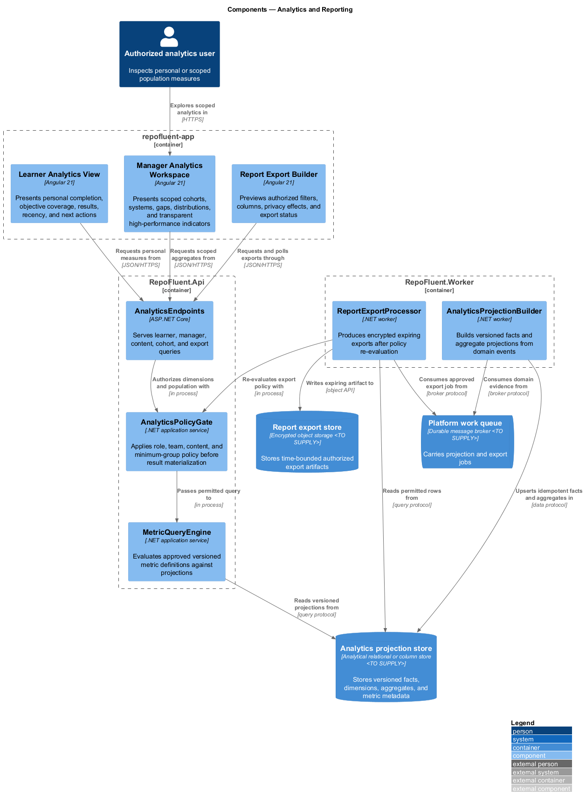
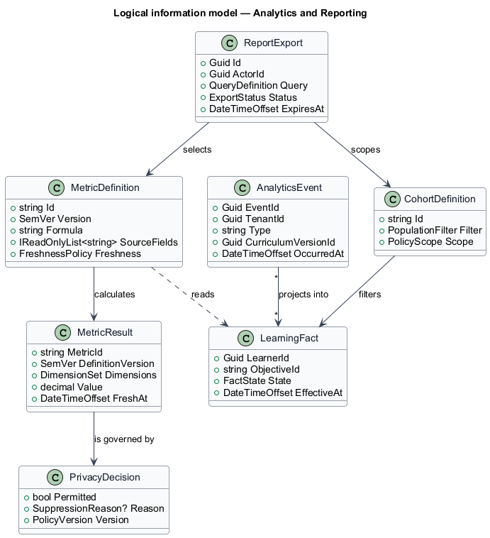
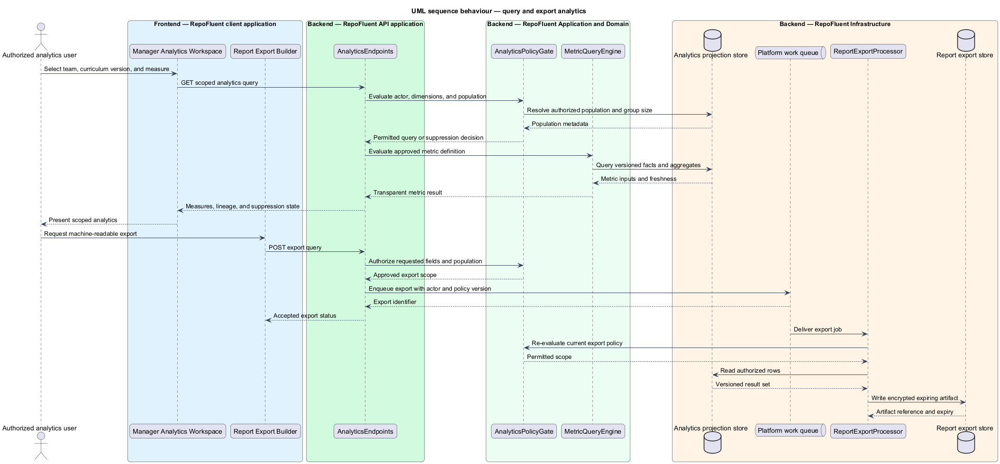

# Analytics and Reporting

## Overview

The Analytics and Reporting subsystem turns versioned learning evidence into authorized, privacy-safe learner and manager measures, comparisons, and exports. It occupies the
`08-analytics-reporting` bounded context defined by the subsystem requirements.

The subsystem owns metric definitions, event-to-fact projection, learner analytics, manager aggregation, privacy-safe drill-down, gap identification, content-quality measures, cohort comparison, and report export. It does not own source learning evidence or employee performance decisions.

The subsystem uses these local terms:

- **metric definition** — versioned formula, source lineage, filters, freshness rule, and display semantics for one measure
- **analytics projection** — derived query model built from tenant-scoped assignment, progress, assessment, mastery, and curriculum-version evidence
- **minimum-group policy** — privacy rule that suppresses an aggregate or drill-down when the visible population is too small

## Description

### Architectural boundary

The subsystem is a logical module in the RepoFluent modular platform. Frontend
components live in the single `repofluent-app` Angular application. Synchronous
commands and queries enter through `RepoFluent.Api`. Long-running or retryable
work runs in `RepoFluent.Worker`. The platform [context, container, subsystem,
and deployment views](../) define the shared runtime around this module.

### Deployable mapping

| Deployment unit | Component | Responsibility | Delivery state |
| --- | --- | --- | --- |
| `repofluent-app` | `Learner Analytics View` | Presents personal completion, objective coverage, results, recency, and next actions | Target platform |
| `repofluent-app` | `Manager Analytics Workspace` | Presents scoped cohorts, systems, gaps, distributions, and transparent high-performance indicators | Target platform |
| `repofluent-app` | `Report Export Builder` | Previews authorized filters, columns, privacy effects, and export status | Target platform |
| `RepoFluent.Api` | `AnalyticsEndpoints` | Serves learner, manager, content, cohort, and export queries | Target platform |
| `RepoFluent.Api` | `AnalyticsPolicyGate` | Applies role, team, content, and minimum-group policy before result materialization | Target platform |
| `RepoFluent.Api` | `MetricQueryEngine` | Evaluates approved versioned metric definitions against projections | Target platform |
| `RepoFluent.Worker` | `AnalyticsProjectionBuilder` | Builds versioned facts and aggregate projections from domain events | Target platform |
| `RepoFluent.Worker` | `ReportExportProcessor` | Produces encrypted expiring exports after policy re-evaluation | Target platform |

### Information ownership

| Record group | Authoritative or derived store | Purpose |
| --- | --- | --- |
| Derived analytics | `Analytics projection store` | Stores versioned facts, dimensions, aggregates, and metric metadata |
| Report exports | `Report export store` | Stores time-bounded authorized export artifacts |
| Analytics work | `Platform work queue` | Carries projection and export jobs |

- Domain stores remain authoritative for assignment, progress, attempt, mastery, and curriculum-version evidence.
- The analytics store contains disposable but reproducible projections keyed by tenant, source event, metric version, and curriculum version.
- Exports retain the applied filters, policy version, actor, creation time, expiry, and audit reference.

### Collaborations

- Learning, Assessment, Administration, and Curriculum Lifecycle publish versioned evidence through the platform event stream.
- Identity supplies manager scope and group membership; Security supplies minimum-group and export policy.
- Administration exposes export status and acceptable-use controls without rewriting analytics data.

### Decisions and delivery status

- Production analytical store, privacy threshold defaults, and export expiry — `<TO SUPPLY>`.
- Tenant opt-in and evidence definition for high-performing learner indicators — `<TO SUPPLY>`.
- Metrics remain component measures; time-on-learning never substitutes for demonstrated understanding.

The current vertical slice records data needed for basic future projections but contains no analytics API, projection worker, manager dashboard, or export flow.

## Diagrams

### Component view

The platform context and container views apply to every subsystem and are not
repeated here. This component view shows the subsystem parts, their deployment
homes, owned stores, and external collaborators.

### Information model

The information model names the durable records and value relationships owned or
consumed by the subsystem. Storage-provider details remain outside this logical
view.

### Primary behaviour — query and export analytics

The sequence shows the principal subsystem behaviour across the frontend,
API, application/domain, and infrastructure boundaries. Alternate paths appear
where they change security, persistence, or user-visible outcomes.

