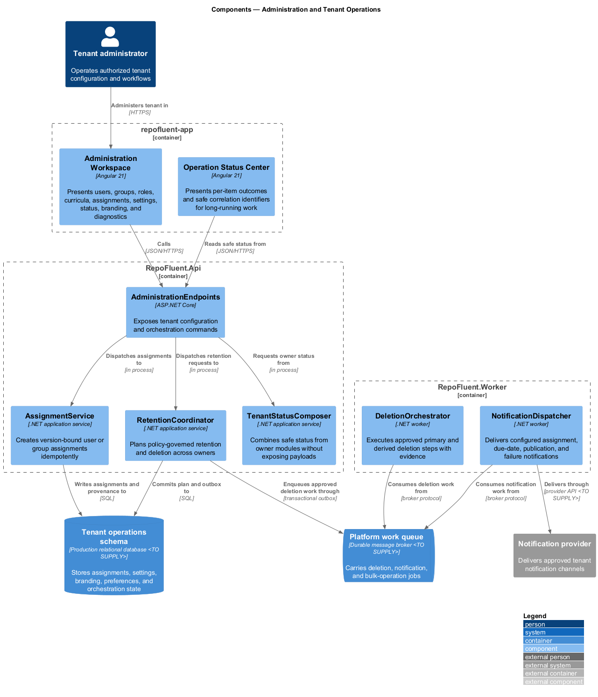
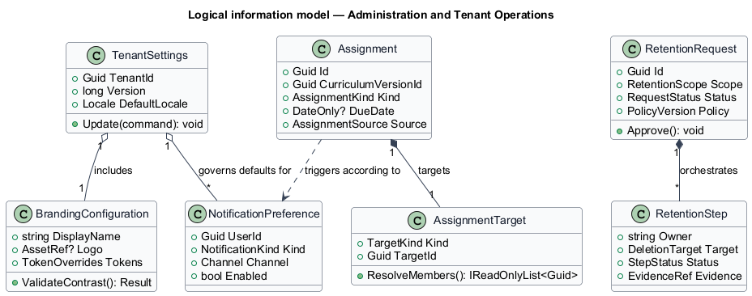
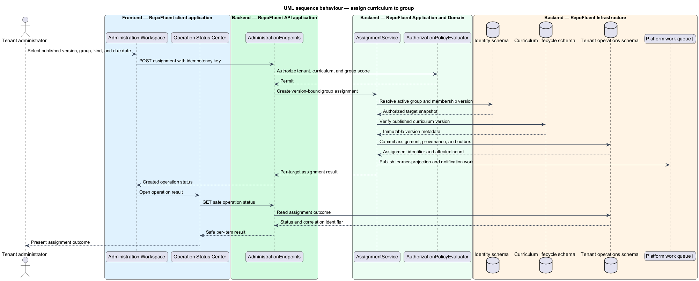

# Administration and Tenant Operations

## Overview

The Administration and Tenant Operations subsystem provides one tenant-scoped control plane for users, curricula, assignments, settings, status, retention, branding, diagnostics, and notifications. It occupies the
`09-administration-operations` bounded context defined by the subsystem requirements.

The subsystem owns the administration workspace, assignment policy and provenance, tenant settings, branding, notification preferences, retention request orchestration, and cross-subsystem status composition. It coordinates owner modules through APIs and events rather than writing their stores directly.

The subsystem uses these local terms:

- **tenant control plane** — authorized administration interface that coordinates domain-owned operations for one tenant
- **assignment** — version-bound allocation of required or optional curriculum to a user or group with provenance and optional due date
- **retention request** — audited orchestration record that applies approved retention or deletion policy across primary and derived stores

## Description

### Architectural boundary

The subsystem is a logical module in the RepoFluent modular platform. Frontend
components live in the single `repofluent-app` Angular application. Synchronous
commands and queries enter through `RepoFluent.Api`. Long-running or retryable
work runs in `RepoFluent.Worker`. The platform [context, container, subsystem,
and deployment views](../) define the shared runtime around this module.

### Deployable mapping

| Deployment unit | Component | Responsibility | Delivery state |
| --- | --- | --- | --- |
| `repofluent-app` | `Administration Workspace` | Presents users, groups, roles, curricula, assignments, settings, status, branding, and diagnostics | Foundation partial |
| `repofluent-app` | `Operation Status Center` | Presents per-item outcomes and safe correlation identifiers for long-running work | Target platform |
| `RepoFluent.Api` | `AdministrationEndpoints` | Exposes tenant configuration and orchestration commands | Target platform |
| `RepoFluent.Api` | `AssignmentService` | Creates version-bound user or group assignments idempotently | Foundation partial |
| `RepoFluent.Api` | `RetentionCoordinator` | Plans policy-governed retention and deletion across owners | Target platform |
| `RepoFluent.Api` | `TenantStatusComposer` | Combines safe status from owner modules without exposing payloads | Target platform |
| `RepoFluent.Worker` | `DeletionOrchestrator` | Executes approved primary and derived deletion steps with evidence | Target platform |
| `RepoFluent.Worker` | `NotificationDispatcher` | Delivers configured assignment, due-date, publication, and failure notifications | Target platform |

### Information ownership

| Record group | Authoritative or derived store | Purpose |
| --- | --- | --- |
| Tenant operations | `Tenant operations schema` | Stores assignments, settings, branding, preferences, and orchestration state |
| Administrative work | `Platform work queue` | Carries deletion, notification, and bulk-operation jobs |

- The tenant operations schema is authoritative for assignments, tenant settings, branding, notification preferences, and orchestration status.
- Identity, Curriculum, Learning, Assessment, Analytics, Security, and Observability remain authoritative for their domain state.
- Bulk operations retain requested scope, per-item outcome, idempotency key, actor, and audit correlation.

### Collaborations

- Identity owns users, groups, and role grants; Curriculum Lifecycle owns content status and versions.
- Learning consumes assignments; Security owns retention constraints and audit policy.
- Observability supplies safe tenant diagnostics; external providers deliver notifications.

### Decisions and delivery status

- Notification channels, provider, retry schedule, and expiry policy — `<TO SUPPLY>`.
- Retention defaults, legal-hold integration, and deletion approval roles — `<TO SUPPLY>`.
- Administrative bulk operations use preview, explicit confirmation, idempotency, and per-item results.

The current API implements direct learner assignment during publication, and the Angular shell exposes role-oriented curriculum controls. Full administration, group assignment, settings, retention, branding, diagnostics, and notifications remain target architecture.

## Diagrams

### Component view

The platform context and container views apply to every subsystem and are not
repeated here. This component view shows the subsystem parts, their deployment
homes, owned stores, and external collaborators.

### Information model

The information model names the durable records and value relationships owned or
consumed by the subsystem. Storage-provider details remain outside this logical
view.

### Primary behaviour — assign curriculum to group

The sequence shows the principal subsystem behaviour across the frontend,
API, application/domain, and infrastructure boundaries. Alternate paths appear
where they change security, persistence, or user-visible outcomes.

