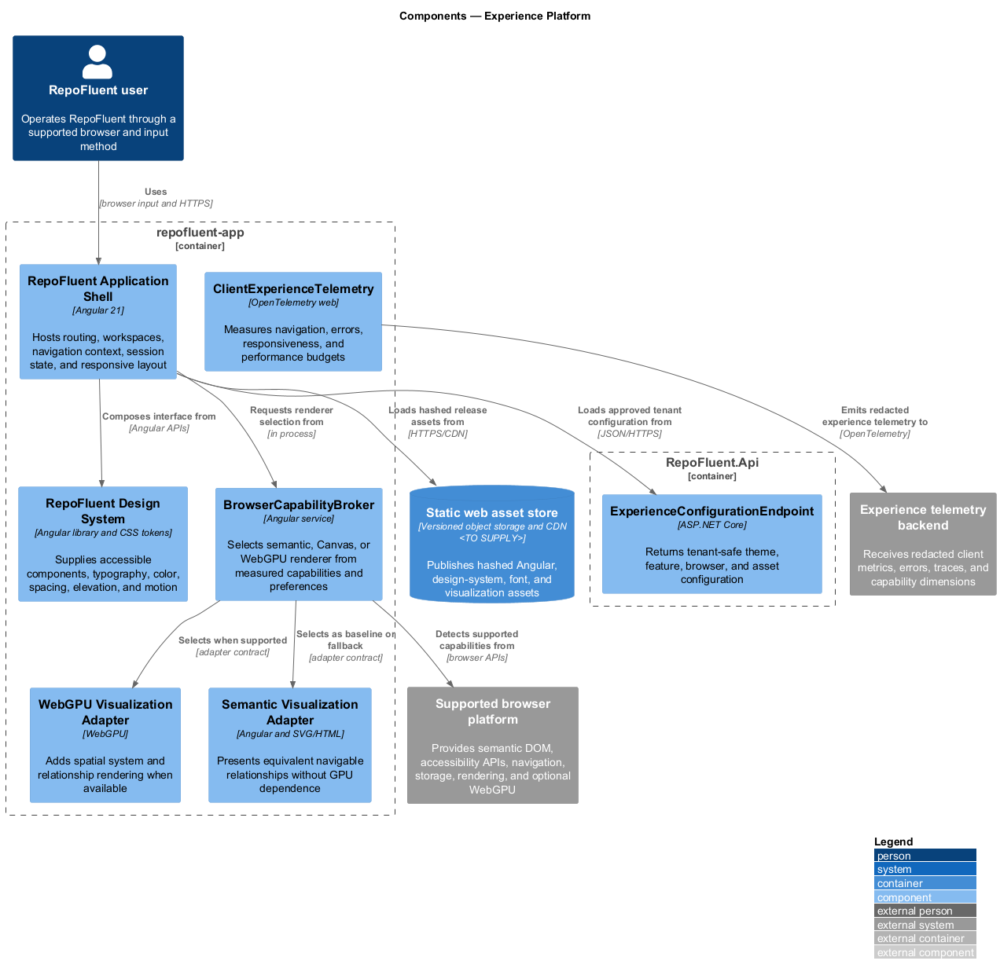
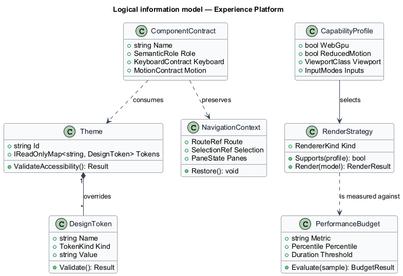
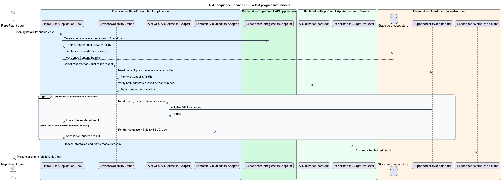

# Experience Platform

## Overview

The Experience Platform subsystem supplies the shared shell, design system, accessibility behavior, responsive patterns, progressive rendering, and frontend performance controls. It occupies the
`10-experience-platform` bounded context defined by the subsystem requirements.

The subsystem owns design tokens, shared Angular components, navigation context, responsive shell behavior, browser capability detection, WebGPU strategy, accessible visualization alternatives, client performance budgets, and frontend telemetry contracts. Domain modules retain content semantics and authorization.

The subsystem uses these local terms:

- **capability profile** — runtime record of browser, input, motion, viewport, and optional GPU capabilities used to select an equivalent renderer
- **progressive renderer** — presentation strategy that adds visual capability without removing semantic content or controls
- **navigation context** — serializable location, selection, split-view, and return state preserved across related learning tasks

## Description

### Architectural boundary

The subsystem is a logical module in the RepoFluent modular platform. Frontend
components live in the single `repofluent-app` Angular application. Synchronous
commands and queries enter through `RepoFluent.Api`. Long-running or retryable
work runs in `RepoFluent.Worker`. The platform [context, container, subsystem,
and deployment views](../) define the shared runtime around this module.

### Deployable mapping

| Deployment unit | Component | Responsibility | Delivery state |
| --- | --- | --- | --- |
| `repofluent-app` | `RepoFluent Application Shell` | Hosts routing, workspaces, navigation context, session state, and responsive layout | Foundation implemented |
| `repofluent-app` | `RepoFluent Design System` | Supplies accessible components, typography, color, spacing, elevation, and motion | Foundation partial |
| `repofluent-app` | `BrowserCapabilityBroker` | Selects semantic, Canvas, or WebGPU renderer from measured capabilities and preferences | Target platform |
| `repofluent-app` | `WebGPU Visualization Adapter` | Adds spatial system and relationship rendering when available | Target platform |
| `repofluent-app` | `Semantic Visualization Adapter` | Presents equivalent navigable relationships without GPU dependence | Target platform |
| `repofluent-app` | `ClientExperienceTelemetry` | Measures navigation, errors, responsiveness, and performance budgets | Target platform |
| `RepoFluent.Api` | `ExperienceConfigurationEndpoint` | Returns tenant-safe theme, feature, browser, and asset configuration | Target platform |

### Information ownership

| Record group | Authoritative or derived store | Purpose |
| --- | --- | --- |
| Frontend releases | `Static web asset store` | Publishes hashed Angular, design-system, font, and visualization assets |

- The source-controlled token and component packages define the baseline design system.
- Tenant branding stores only validated token overrides and approved assets; it cannot replace semantics or focus behavior.
- Client telemetry contains capability, timing, route template, release, and result dimensions without curriculum payloads.

### Collaborations

- Every frontend workspace consumes the shell, design system, navigation context, and telemetry contracts.
- Code Navigation and Analytics use the progressive visualization adapters.
- Security constrains active content and telemetry; Observability owns production measurement and alerting.

### Decisions and delivery status

- Production browser matrix, device profiles, CDN, font strategy, and WebGPU feature set — `<TO SUPPLY>`.
- The non-GPU semantic renderer forms the baseline; WebGPU initialization or runtime failure changes presentation only.
- The existing `desigh-system` path remains unchanged until a separate repository migration is approved.

Angular 21 provides `repofluent-app`, source-level `api` and `components` libraries, production bundle budgets, route workspaces, and the initial lesson renderer. The complete token library, capability broker, WebGPU adapter, semantic graph fallback, and real-user monitoring remain target components.

## Diagrams

### Component view

The platform context and container views apply to every subsystem and are not
repeated here. This component view shows the subsystem parts, their deployment
homes, owned stores, and external collaborators.

### Information model

The information model names the durable records and value relationships owned or
consumed by the subsystem. Storage-provider details remain outside this logical
view.

### Primary behaviour — select progressive renderer

The sequence shows the principal subsystem behaviour across the frontend,
API, application/domain, and infrastructure boundaries. Alternate paths appear
where they change security, persistence, or user-visible outcomes.

