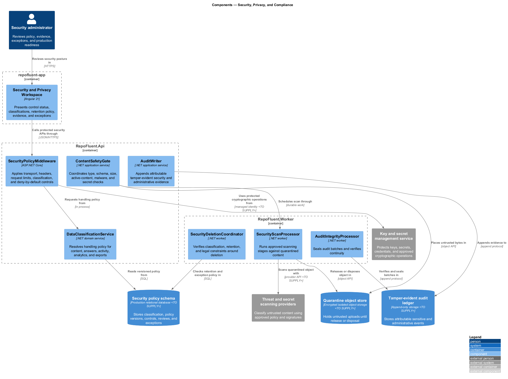
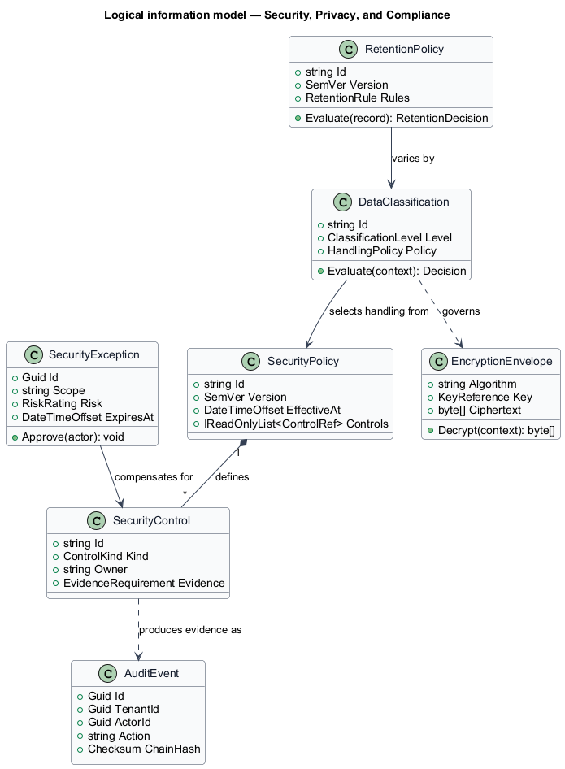
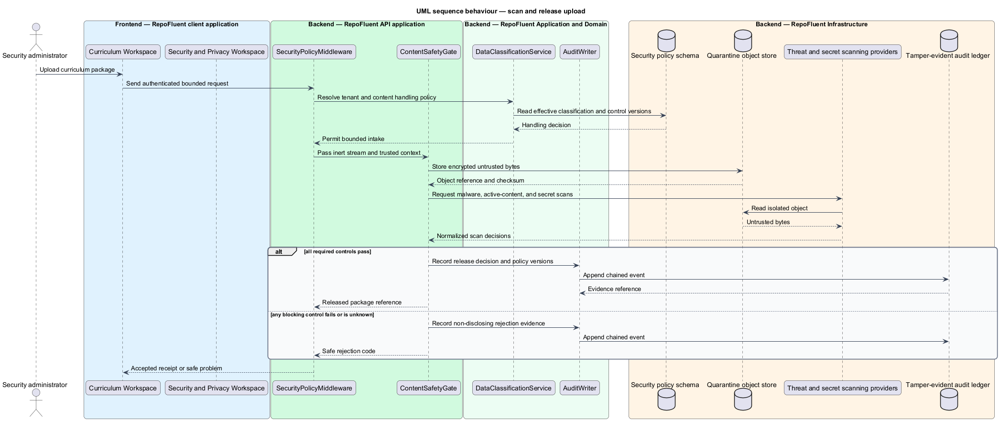

# Security, Privacy, and Compliance

## Overview

The Security, Privacy, and Compliance subsystem establishes cross-cutting controls that protect tenant content and learning evidence throughout intake, processing, delivery, retention, and deletion. It occupies the
`11-security-privacy-compliance` bounded context defined by the subsystem requirements.

The subsystem owns security and privacy policy, classification, content-safety gates, encryption expectations, key access patterns, model-data restrictions, audit integrity, retention control, exceptions, threat and privacy reviews, and release evidence. Domain modules implement controls at their own boundaries.

The subsystem uses these local terms:

- **data classification** — policy label that determines permitted storage, rendering, access, telemetry, retention, and export behavior
- **security control** — testable preventive, detective, or corrective mechanism with an owner and evidence source
- **security exception** — time-bounded approved departure with scope, risk, compensating control, owner, and expiry

## Description

### Architectural boundary

The subsystem is a logical module in the RepoFluent modular platform. Frontend
components live in the single `repofluent-app` Angular application. Synchronous
commands and queries enter through `RepoFluent.Api`. Long-running or retryable
work runs in `RepoFluent.Worker`. The platform [context, container, subsystem,
and deployment views](../) define the shared runtime around this module.

### Deployable mapping

| Deployment unit | Component | Responsibility | Delivery state |
| --- | --- | --- | --- |
| `repofluent-app` | `Security and Privacy Workspace` | Presents control status, classifications, retention policy, evidence, and exceptions | Target platform |
| `RepoFluent.Api` | `SecurityPolicyMiddleware` | Applies transport, headers, request limits, classification, and deny-by-default controls | Target platform |
| `RepoFluent.Api` | `ContentSafetyGate` | Coordinates type, schema, size, active-content, malware, and secret checks | Foundation partial |
| `RepoFluent.Api` | `AuditWriter` | Appends attributable tamper-evident security and administrative evidence | Target platform |
| `RepoFluent.Api` | `DataClassificationService` | Resolves handling policy for content, answers, activity, analytics, and exports | Target platform |
| `RepoFluent.Worker` | `SecurityScanProcessor` | Runs approved scanning stages against quarantined content | Target platform |
| `RepoFluent.Worker` | `AuditIntegrityProcessor` | Seals audit batches and verifies continuity | Target platform |
| `RepoFluent.Worker` | `SecurityDeletionCoordinator` | Verifies classification, retention, and legal constraints around deletion | Target platform |

### Information ownership

| Record group | Authoritative or derived store | Purpose |
| --- | --- | --- |
| Security governance | `Security policy schema` | Stores classification, policy versions, controls, reviews, and exceptions |
| Audit evidence | `Tamper-evident audit ledger` | Stores attributable sensitive and administrative events |
| Untrusted content | `Quarantine object store` | Holds untrusted uploads until release or disposal |

- Domain stores remain authoritative for customer content and learning evidence; this subsystem owns handling policy and control evidence.
- The audit ledger separates event metadata from sensitive payloads and uses platform-generated tenant and record identifiers.
- Key material remains in the selected key service and never enters application configuration or telemetry.

### Collaborations

- Every subsystem applies identity, classification, minimization, encryption, audit, retention, and redaction controls at its boundary.
- Curriculum Lifecycle and Assessment use restricted paths for untrusted packages and answer material.
- Administration initiates retention workflows; Observability protects and monitors operational evidence.

### Decisions and delivery status

- Hosting model, jurisdictions, key provider, audit ledger, scanners, retention defaults, and certification targets — `<TO SUPPLY>`.
- Production launch depends on approved threat model, privacy review, vulnerability process, incident plan, and restore evidence.
- Unknown identity, classification, policy, or key state produces deny or safe inert behavior.

The current API enforces development actor roles, package size, safe path validation, non-production authentication boundaries, and correlation identifiers. Production identity, encryption, scanning, audit integrity, data classification, retention, and readiness controls remain target architecture.

## Diagrams

### Component view

The platform context and container views apply to every subsystem and are not
repeated here. This component view shows the subsystem parts, their deployment
homes, owned stores, and external collaborators.

### Information model

The information model names the durable records and value relationships owned or
consumed by the subsystem. Storage-provider details remain outside this logical
view.

### Primary behaviour — scan and release upload

The sequence shows the principal subsystem behaviour across the frontend,
API, application/domain, and infrastructure boundaries. Alternate paths appear
where they change security, persistence, or user-visible outcomes.

